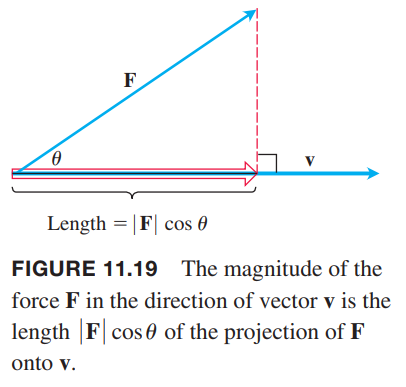

如果力 $\boldsymbol{F}$ 作用于一个运动中的粒子，我们需要知道力在运动方向上的大小。如果速度 $\boldsymbol{v}$ 平行于力 $\boldsymbol{F}$ 作用点的切线，那么我们想知道的就是在 $\boldsymbol{v}$ 方向上力 $\boldsymbol{F}$ 的大小。如下图所示，大小就是 $\boldsymbol{F}\cos\theta$，其中 $\theta$ 是两个矢量 $\boldsymbol{F},\boldsymbol{v}$ 的夹角。

这一节主要讲解如何通过矢量分量直接计算夹角。关键部分就是矢量的点积（`dot product`），也称为内积或标量积（` inner product`, `scalar product`）。

### 矢量夹角
将两个矢量 $\boldsymbol{u},\boldsymbol{v}$ 的起点重合，形成了一个夹角 $\theta$，其中 $0\leq\theta\leq\pi$。

如果两个矢量不在同一条直线上，那么 $\theta$ 位于两个矢量确定的平面上。如果在同一条直线上的话，方向一致则夹角为零，方向相反则夹角为 $\pi$。角 $\theta$ 是矢量 $\boldsymbol{u},\boldsymbol{v}$ 的夹角。

**定理 1 —— 两个矢量的夹角**
> 两个矢量 $\boldsymbol{u}=\langle u_1,u_2,u_3\rangle,\boldsymbol{v}=\langle v_1,v_2,v_3\rangle$ 的夹角 $\theta$ 是
> $$\theta=\cos^{-1}\bigg(\frac{u_1v_1+u_2v_2+u_3v_3}{|\boldsymbol{u}||\boldsymbol{v}|}\bigg)$$

在证明之前，我们先看下分子上的式子 $u_1v_1+u_2v_2+u_3v_3$，它是矢量 $\boldsymbol{u},\boldsymbol{v}$ 相应分量的积的和。

**定义**
> 矢量 $\boldsymbol{u},\boldsymbol{v}$ 的点积（`dot product`）$\boldsymbol{u}\cdot\boldsymbol{v}$ 是标量
> $$\boldsymbol{u}\cdot\boldsymbol{v}=u_1v_1+u_2v_2+u_3v_3$$

例1

（a）
$$\langle 1,-2,-1\rangle\cdot\langle -6,2,-3\rangle=-6+(-4)+3=-7$$
（b）
$$\bigg(\frac{1}{2}\boldsymbol{i}+3\boldsymbol{j}+\boldsymbol{k}\bigg)\cdot(4\boldsymbol{i}-\boldsymbol{j}+2\boldsymbol{k})=2-3+2=-1$$

两个二维矢量的点积类似。
$$\boldsymbol{u}\cdot\boldsymbol{v}=\langle u_1,u_2\rangle\cdot\langle v_1,v_2\rangle=u_1v_1+u_2v_2$$

证明：如上图所示，根据 1.3 节余弦定理有
$$\begin{aligned}
|\boldsymbol{w}|^2&=|\boldsymbol{u}|^2+|\boldsymbol{v}|^2-2|\boldsymbol{u}||\boldsymbol{v}|\cos\theta\\
2|\boldsymbol{u}||\boldsymbol{v}|\cos\theta&=|\boldsymbol{u}|^2+|\boldsymbol{v}|^2-|\boldsymbol{w}|^2
\end{aligned}$$
由于 $\boldsymbol{w}=\boldsymbol{u}-\boldsymbol{v}$，其分量是 $\langle u_1-v_1,u_2-v_2,u_3-v_3\rangle$，那么
$$\begin{aligned}
|\boldsymbol{u}|^2&=(\sqrt{u_1^2+u_2^2+u_3^2})^2=u_1^2+u_2^2+u_3^2\\
|\boldsymbol{v}|^2&=(\sqrt{v_1^2+v_2^2+v_3^2})^2=v_1^2+v_2^2+v_3^2\\
|\boldsymbol{w}|^2&=(u_1-v_1)^2+(u_2-v_2)^2+(u_3-v_3)^2\\
&=u_1^2-2u_1v_1+v_1^2+u_2^2-2u_2v_2+v_2^2+u_3^2-2u_3v_3+v_3^2
\end{aligned}$$
因此
$$|\boldsymbol{u}|^2+|\boldsymbol{v}|^2-|\boldsymbol{w}|^2=2(u_1v_1+u_2v_2+u_3v_3)$$
因此
$$\begin{aligned}
2|\boldsymbol{u}||\boldsymbol{v}|\cos\theta&=|\boldsymbol{u}|^2+|\boldsymbol{v}|^2-|\boldsymbol{w}|^2=2(u_1v_1+u_2v_2+u_3v_3)\\
|\boldsymbol{u}||\boldsymbol{v}|\cos\theta&=u_1v_1+u_2v_2+u_3v_3\\
\cos\theta&=\frac{u_1v_1+u_2v_2+u_3v_3}{|\boldsymbol{u}||\boldsymbol{v}|}
\end{aligned}$$
由于 $0\leq\theta\leq\pi$，有
$$\theta=\cos^{-1}\bigg(\frac{u_1v_1+u_2v_2+u_3v_3}{|\boldsymbol{u}||\boldsymbol{v}|}\bigg)$$

**点积和夹角**
> 非零矢量 $\boldsymbol{u},\boldsymbol{v}$ 的夹角
> $$\theta=\cos^{-1}\bigg(\frac{\boldsymbol{u}\cdot\boldsymbol{v}}{|\boldsymbol{u}||\boldsymbol{v}|}\bigg)$$
> 两个矢量 $\boldsymbol{u},\boldsymbol{v}$ 的点积
> $$\boldsymbol{u}\cdot\boldsymbol{v}=|\boldsymbol{u}||\boldsymbol{v}|\cos\theta$$

例2 求矢量 $\boldsymbol{u}=\boldsymbol{i}-2\boldsymbol{j}-2\boldsymbol{k},\boldsymbol{v}=6\boldsymbol{i}+3\boldsymbol{j}+2\boldsymbol{k}$ 的夹角。

解：
$$\boldsymbol{u}\cdot\boldsymbol{v}=6-6-4=-4$$
$$|\boldsymbol{u}|=\sqrt{1^2+2^2+2^2}=3$$
$$|\boldsymbol{v}|=\sqrt{36+9+4}=7$$
$$\theta=\cos^{-1}\bigg(\frac{\boldsymbol{u}\cdot\boldsymbol{v}}{|\boldsymbol{u}||\boldsymbol{v}|}\bigg)=\cos^{-1}\frac{-4}{21}\approx 1.76 \text{rad}$$

如果 $\boldsymbol{u}\cdot\boldsymbol{v}>0$，$\theta$ 是锐角，如果 $\boldsymbol{u}\cdot\boldsymbol{v}<0$，$\theta$ 是钝角。

例3 三角形顶点分别是 $A(0,0),B(3,5),C(5,2)$，求下图中的角 $\theta$。

解：角 $\theta$ 是矢量 $\overrightarrow{CA},\overrightarrow{CB}$ 的夹角。这两个矢量的分量形式是
$$\overrightarrow{CA}=\langle-5,-2\rangle,\overrightarrow{CB}=\langle-2,3\rangle$$
求点积和它们的长度
$$\overrightarrow{CA}\cdot\overrightarrow{CB}=10-6=4$$
$$|\overrightarrow{CA}|=\sqrt{25+4}=\sqrt{29}$$
$$|\overrightarrow{CB}|=\sqrt{4+9}=\sqrt{13}$$
代入公式
$$\theta=\cos^{-1}\bigg(\frac{\overrightarrow{CA}\cdot\overrightarrow{CB}}{|\overrightarrow{CA}||\overrightarrow{CB}|}\bigg)=\cos^{-1}\frac{4}{\sqrt{29}\sqrt{13}}\approx 1.36\text{rad}$$

### 正交矢量
如果两个非零矢量 $\boldsymbol{u},\boldsymbol{v}$ 的夹角是 $\pi/2$，那么它们是垂直的。因为 $\cos(\pi/2)=0$ 所以 $\boldsymbol{u}\cdot\boldsymbol{v}=0$。反过来也是成立的，两个非零矢量 $\boldsymbol{u}\cdot\boldsymbol{v}=|\boldsymbol{u}||\boldsymbol{v}|\cos\theta=0$，那么 $\cos\theta=0,\theta=\cos^{-1}0=\pi/2$。下面的定义也适用于其中一个或者两个矢量都是零矢量的情况。

**定义**
> 如果 $\boldsymbol{u}\cdot\boldsymbol{v}=0$，那么矢量 $\boldsymbol{u}，\boldsymbol{v}$ 是正交的。

例4 使用点积可以确定两个矢量是否正交。

（a）矢量 $\boldsymbol{u}=\langle 3,-2\rangle,\boldsymbol{v}=\langle 4,6\rangle$ 的点积 $\boldsymbol{u}\cdot\boldsymbol{v}=12-12=0$，所以两个矢量正交。

（b）矢量 $\boldsymbol{u}=3\boldsymbol{i}-2\boldsymbol{j}+\boldsymbol{k}$ 和矢量 $\boldsymbol{v}=2\boldsymbol{j}+4\boldsymbol{k}$ 的点积是 $\boldsymbol{u}\cdot\boldsymbol{v}=0-4+4=0$，所以两个矢量正交。

（c）$\boldsymbol{0}$ 和任意矢量 $\boldsymbol{u}$ 正交，因为
$$\boldsymbol{0}\cdot\boldsymbol{u}=\langle 0,0,0\rangle\cdot\langle u_1,u_2,u_3\rangle=0$$

### 点积属性和矢量投影
**点积的属性**
> $\boldsymbol{u},\boldsymbol{v},\boldsymbol{w}$ 是矢量，$c$ 是标量，那么
> $$\begin{aligned}
&\boldsymbol{u}\cdot\boldsymbol{v}=\boldsymbol{v}\cdot\boldsymbol{u}\\
&(c\boldsymbol{u})\cdot\boldsymbol{v}=\boldsymbol{u}\cdot(c\boldsymbol{v})=c(\boldsymbol{u}\cdot\boldsymbol{v})\\
&\boldsymbol{u}\cdot(\boldsymbol{v}+\boldsymbol{w})=\boldsymbol{u}\cdot\boldsymbol{v}+\boldsymbol{u}\cdot\boldsymbol{w}\\
&\boldsymbol{u}\cdot\boldsymbol{u}=|\boldsymbol{u}|^2\\
&\boldsymbol{0}\cdot\boldsymbol{u}=\boldsymbol{0}
> \end{aligned}$$

证明（部分）：使用定义可以很容易证明这些属性。比如下面证明第一个和第三个。
$$\begin{aligned}
\boldsymbol{u}\cdot\boldsymbol{v}&=u_1v_1+u_2v_2+u_3v_3\\
&=v_1u_1+v_2u_2+v_3u_3\\
&=\boldsymbol{v}\cdot\boldsymbol{u}
\end{aligned}$$
$$\begin{aligned}
\boldsymbol{u}\cdot(\boldsymbol{v}+\boldsymbol{w})&=u_1(v_1+w_1)+u_2(v_2+w_2)+u_3(v_3+w_3)\\
&=u_1v_1+u_1w_1+u_2v_2+u_2w_2+u_3v_3+u_3w_3\\
&=u_1v_1+u_2v_2+u_3v_3+u_1w_1+u_2w_2+u_3w_3\\
&=\boldsymbol{u}\cdot\boldsymbol{v}+\boldsymbol{u}\cdot\boldsymbol{w}
\end{aligned}$$

回到矢量投影的问题。矢量 $\boldsymbol{u}=\overrightarrow{PQ}$ 在矢量 $\boldsymbol{v}=\overrightarrow{PS}$ 方向上的矢量投影（`vector projection`）是矢量 $\overrightarrow{PR}$，点 $R$ 是 $Q$ 在 $PS$ 的垂足。

矢量的投影记作
$$\text{proj}_{\boldsymbol{v}}\boldsymbol{u}$$

如果 $\boldsymbol{u}$ 表示力，那么投影 $\text{proj}_{\boldsymbol{v}}\boldsymbol{u}$ 表示在速度 $\boldsymbol{v}$ 方向上的有效力。

如果 $\boldsymbol{u},\boldsymbol{v}$ 的夹角 $\theta$ 是锐角，那么 $\text{proj}_{\boldsymbol{v}}\boldsymbol{u}$ 的长度是 $|\boldsymbol{u}|\cos\theta$，方向是 $\boldsymbol{v}/|\boldsymbol{v}|$。如下图所示。如果夹角是钝角，$\cos\theta<0$，那么长度是 $-|\boldsymbol{u}|\cos\theta$，方向是 $-\boldsymbol{v}/|\boldsymbol{v}|$。

$$\begin{aligned}
\text{proj}_{\boldsymbol{v}}\boldsymbol{u}&=|\boldsymbol{u}|\cos\theta\frac{\boldsymbol{v}}{|\boldsymbol{v}|}\\
&=\bigg(\frac{\boldsymbol{u}\cdot\boldsymbol{v}}{|\boldsymbol{v}|}\bigg)\frac{\boldsymbol{v}}{|\boldsymbol{v}|}\\
&=\bigg(\frac{\boldsymbol{u}\cdot\boldsymbol{v}}{|\boldsymbol{v}|^2}\bigg)\boldsymbol{v}
\end{aligned}$$

$|\boldsymbol{u}|\cos\theta$ 称为 $\boldsymbol{u}$ 在矢量 $\boldsymbol{v}$ 方向上的标量分量。

$$|\boldsymbol{u}|\cos\theta=\frac{\boldsymbol{u}\cdot\boldsymbol{v}}{|\boldsymbol{v}|}=\boldsymbol{u}\cdot\frac{\boldsymbol{v}}{|\boldsymbol{v}|}$$

不管是投影，还是 $\boldsymbol{v}$ 方向上的标量分量，都只和 $\boldsymbol{v}$ 的方向相关和其长度无关。

例5 求矢量 $\boldsymbol{u}=6\boldsymbol{i}+3\boldsymbol{j}+2\boldsymbol{k}$ 在矢量 $\boldsymbol{v}=\boldsymbol{i}-2\boldsymbol{k}-2\boldsymbol{k}$ 上的投影和标量分量。

解：
$$\begin{aligned}
\text{proj}_{\boldsymbol{v}}\boldsymbol{u}&=\bigg(\frac{\boldsymbol{u}\cdot\boldsymbol{v}}{|\boldsymbol{v}|^2}\bigg)\boldsymbol{v}\\
&=\bigg(\frac{\boldsymbol{u}\cdot\boldsymbol{v}}{\boldsymbol{v}\cdot\boldsymbol{v}}\bigg)\boldsymbol{v}\\
&=\frac{6-6-4}{1+4+4}(\boldsymbol{i}-2\boldsymbol{k}-2\boldsymbol{k})\\
&=-\frac{4}{9}(\boldsymbol{i}-2\boldsymbol{k}-2\boldsymbol{k})\\
&=-\frac{4}{9}\boldsymbol{i}+\frac{8}{9}\boldsymbol{j}+\frac{8}{9}\boldsymbol{k}
\end{aligned}$$
$$\begin{aligned}
|\boldsymbol{u}|\cos\theta&=\boldsymbol{u}\cdot\frac{\boldsymbol{v}}{|\boldsymbol{v}|}\\
&=(6\boldsymbol{i}+3\boldsymbol{j}+2\boldsymbol{k})(\frac{1}{3}\boldsymbol{i}-\frac{2}{3}\boldsymbol{j}-\frac{2}{3}\boldsymbol{k})\\
&=2-2-\frac{4}{3}\\
&=-\frac{4}{3}
\end{aligned}$$

例6 求 $\boldsymbol{F}=5\boldsymbol{i}+2\boldsymbol{j}$ 在 $\boldsymbol{v}=\boldsymbol{i}-3\boldsymbol{j}$ 上的投影和标量分量。

解：
$$\begin{aligned}
\text{proj}_{\boldsymbol{v}}\boldsymbol{F}&=\bigg(\frac{\boldsymbol{F}\cdot\boldsymbol{v}}{|\boldsymbol{v}|^2}\bigg)\boldsymbol{v}\\
&=\bigg(\frac{\boldsymbol{F}\cdot\boldsymbol{v}}{\boldsymbol{v}\cdot\boldsymbol{v}}\bigg)\boldsymbol{v}\\
&=\frac{5-6}{1+9}(\boldsymbol{i}-3\boldsymbol{j})\\
&=-\frac{1}{10}\boldsymbol{i}-\frac{3}{10}\boldsymbol{j}
\end{aligned}$$
$$\begin{aligned}
|\boldsymbol{F}|\cos\theta&=\frac{\boldsymbol{F}\cdot\boldsymbol{v}}{|\boldsymbol{v}|}\\
&=\frac{5-6}{\sqrt{10}}\\
&=-\frac{1}{\sqrt{10}}
\end{aligned}$$

例7 验证矢量 $\boldsymbol{u}-\text{proj}_{\boldsymbol{v}}\boldsymbol{u}$ 与投影矢量 $\text{proj}_{\boldsymbol{v}}\boldsymbol{u}$ 正交。

证明：矢量 $\text{proj}_{\boldsymbol{v}}\boldsymbol{u}$ 与矢量 $\boldsymbol{v}$ 平行，那么证明 $\boldsymbol{u}-\text{proj}_{\boldsymbol{v}}\boldsymbol{u}$ 与矢量 $\boldsymbol{v}$ 正交即可。
$$\begin{aligned}
(\boldsymbol{u}-\text{proj}_{\boldsymbol{v}}\boldsymbol{u})\cdot\boldsymbol{v}&=\boldsymbol{u}\cdot\boldsymbol{v}-\bigg(\frac{\boldsymbol{u}\cdot\boldsymbol{v}}{|\boldsymbol{v}|^2}\boldsymbol{v}\bigg)\cdot\boldsymbol{v}\\
&=\boldsymbol{u}\cdot\boldsymbol{v}-\frac{\boldsymbol{u}\cdot\boldsymbol{v}}{|\boldsymbol{v}|^2}\boldsymbol{v}\cdot\boldsymbol{v}\\
&=\boldsymbol{u}\cdot\boldsymbol{v}-\frac{\boldsymbol{u}\cdot\boldsymbol{v}}{|\boldsymbol{v}|^2}|\boldsymbol{v}|^2\\
&=\boldsymbol{u}\cdot\boldsymbol{v}-\boldsymbol{u}\cdot\boldsymbol{v}\\
&=\boldsymbol{0}
\end{aligned}$$

上个例子说明 $\boldsymbol{u}-\text{proj}_{\boldsymbol{v}}\boldsymbol{u}$ 与投影矢量 $\text{proj}_{\boldsymbol{v}}\boldsymbol{u}$（即 $\boldsymbol{v}$ 的方向），那么 $\boldsymbol{u}$ 可以写成平行于 $\boldsymbol{v}$ 和垂直于 $\boldsymbol{v}$ 的两个部分。
$$\boldsymbol{u}=\text{proj}_{\boldsymbol{v}}\boldsymbol{u}+(\boldsymbol{u}-\text{proj}_{\boldsymbol{v}}\boldsymbol{u})=\frac{\boldsymbol{u}\cdot\boldsymbol{v}}{|\boldsymbol{v}|^2}\boldsymbol{v}+\bigg(\boldsymbol{u}-\frac{\boldsymbol{u}\cdot\boldsymbol{v}}{|\boldsymbol{v}|^2}\boldsymbol{v}\bigg)$$

### 功
第六章我们给出了恒定力 $F$ 移动一个物体距离为 $d$，所做的功是 $W=Fd$。这么公式仅在力与物体移动方向一直的情况下成立。如果力 $\boldsymbol{F}$ 移动物体，位移是 $\boldsymbol{D}=\overrightarrow{PQ}$，那么做的功是 $\boldsymbol{F}$ 在 $\boldsymbol{D}$ 方向上的分量乘以距离。如果 $\boldsymbol{F}$ 与 $\boldsymbol{D}$ 的夹角是 $\theta$，那么
$$\begin{aligned}
W&=|\boldsymbol{F}|\cos\theta|\boldsymbol{D}|\\
&=\boldsymbol{F}\cdot\boldsymbol{D}
\end{aligned}$$

**定义**
> 恒定力 $\boldsymbol{F}$ 通过位移 $\boldsymbol{D}=\overrightarrow{}$ 所做的功是
> $$W=\boldsymbol{F}\cdot\boldsymbol{D}$$

例8 如果 $|\boldsymbol{F}|=40N,\boldsymbol{D}=3m,\theta=60^\circ$，力 $\boldsymbol{F}$ 从 $P$ 到 $Q$ 做的功是
$$\begin{aligned}
W&=\boldsymbol{F}\cdot\boldsymbol{D}\\
&=|\boldsymbol{F}||\boldsymbol{D}|\cos\theta\\
&=(40)(3)(\cos 60^\circ)\\
&=60J
\end{aligned}$$

第十五章会讨论更一般的做功的场景——变力沿着任意路径做功。
