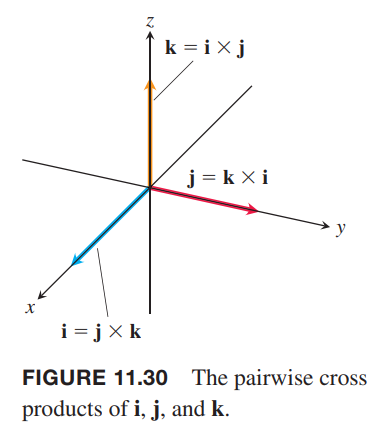

类似于使用斜率表示直线的倾斜程度，我们使用空间中两个矢量的乘积得到的第三个矢量来表示又这两个矢量确定的平面的“倾斜”度。这种乘法称为矢量积或者叉积（`vector
or cross product`）。

### 空间中两个矢量的叉积
我们从研究空间中的两个非零矢量 $\boldsymbol{u},\boldsymbol{v}$ 开始。如果其中一个乘以非零数得到另一个矢量，那么这两个矢量平行。如果矢量不平行，那么它们确定了一个平面。在这个平面的矢量都是矢量 $\boldsymbol{u},\boldsymbol{v}$ 的线性组合，写作 $a\boldsymbol{u}+b\boldsymbol{v}$。根据右手螺旋规则（`right-hand rule`）确定垂直于平面的单位矢量 $\boldsymbol{n}$。右手四指从 $\boldsymbol{u}$ 弯曲到 $\boldsymbol{v}$，大拇指方向就是 $\boldsymbol{n}$ 的方向，转过的角度记为 $\theta$。如下图所示。那么就可以定义一个新的矢量了。

**定义**
> 矢量 $\boldsymbol{u}$ 和 $\boldsymbol{v}$ 的叉积是矢量
> $$\boldsymbol{u}\times\boldsymbol{v}=(|\boldsymbol{u}||\boldsymbol{v}|\sin\theta)\boldsymbol{n}$$

和点积不同，叉积的结果也是一个矢量，所以称为矢量积，并且不适用于二维矢量。矢量 $\boldsymbol{u}\times\boldsymbol{v}$ 是 $\boldsymbol{n}$ 与标量的乘积，与之平行，所以与 $\boldsymbol{u},\boldsymbol{v}$ 都垂直。

后续将讲解不涉及夹角的计算叉积的方法，先关注叉积的属性。

由于 0 和 $\pi$ 的正弦值是 0，所以两个平行的矢量的叉积是零矢量，$\boldsymbol{0}$。如果 $\boldsymbol{u},\boldsymbol{v}$ 其中一个或两个是零矢量，那么 $\boldsymbol{u}\times\boldsymbol{v}$ 也是零矢量。

**平行矢量**
> 非零矢量 $\boldsymbol{u},\boldsymbol{v}$ 平行等价于 $\boldsymbol{u}\times\boldsymbol{v}=\boldsymbol{0}$。

**叉积属性**
> 如果 $\boldsymbol{u},\boldsymbol{v},\boldsymbol{w}$ 是矢量，$r,s$ 是标量，那么
> $$(r\boldsymbol{u})\times(s\boldsymbol{v})=(rs)(\boldsymbol{u}\times\boldsymbol{v})$$
> $$\boldsymbol{u}\times(\boldsymbol{v}+\boldsymbol{w})=\boldsymbol{u}\times\boldsymbol{v}+\boldsymbol{u}\times\boldsymbol{w}$$
> $$\boldsymbol{v}\times\boldsymbol{u}=-(\boldsymbol{u}\times\boldsymbol{v})$$
> $$(\boldsymbol{v}+\boldsymbol{w})\times\boldsymbol{u}=\boldsymbol{v}\times\boldsymbol{u}+\boldsymbol{w}\times\boldsymbol{u}$$
> $$\boldsymbol{0}\times\boldsymbol{u}=\boldsymbol{u}$$
> $$\boldsymbol{u}\times(\boldsymbol{v}\times\boldsymbol{w})=(\boldsymbol{u}\cdot\boldsymbol{w})\boldsymbol{v}-(\boldsymbol{u}\cdot\boldsymbol{v})\boldsymbol{w}$$

属性 3 的可视化如下图所示。四指从 $\boldsymbol{u}$ 到 $\boldsymbol{v}$ 和从 $\boldsymbol{v}$ 到 $\boldsymbol{u}$ 弯曲，大拇指方向恰好相反。

第一个属性可以通过叉积的定义证明。

第二个属性证明如下。

使用一种新的方式构造 $\boldsymbol{u}\times\boldsymbol{v}$ 来证明分配律。我们将两个矢量起始位置重合于点 $O$，平面 $M$ 过点 $O$ 且垂直于 $\boldsymbol{u}$。如下图所示。

矢量 $\boldsymbol{v}$ 在 $M$ 上的投影是 $\boldsymbol{v}'$，其长度是 $|\boldsymbol{v}|\sin\theta$。绕 $\boldsymbol{u}$ 以右手规则正向旋转 $\boldsymbol{v}'$ $90^\circ$，得到矢量 $\boldsymbol{v}''$。$\boldsymbol{v}''$ 乘以 $\boldsymbol{u}$，等于 $\boldsymbol{u}\times\boldsymbol{v}$。原因是两个方向相同且
$$|\boldsymbol{u}\times\boldsymbol{v}|=|\boldsymbol{u}||\boldsymbol{v}|\sin\theta=|\boldsymbol{u}||\boldsymbol{v}'|=|\boldsymbol{u}||\boldsymbol{v}''|$$

将上述步骤应用于一个不平行于 $\boldsymbol{u}$ 的三角形，会产生额外一个的三角形。如下图所示，第一个三角形的三边选择是 $\boldsymbol{v},\boldsymbol{w},\boldsymbol{v}+\boldsymbol{w}$。

首先投影到 $M$ 平面上得到三个矢量 $\boldsymbol{v}',\boldsymbol{w}',\boldsymbol{v}'+\boldsymbol{w}'$，这三个矢量仍旧满足
$$\boldsymbol{v}'+\boldsymbol{w}'=\boldsymbol{v}'+\boldsymbol{w}'$$
接着绕 $\boldsymbol{u}$ 正向旋转 $90^\circ$，得到三个矢量 $\boldsymbol{v}'',\boldsymbol{w}'',\boldsymbol{v}''+\boldsymbol{w}''$，满足
$$\boldsymbol{v}''+\boldsymbol{w}''=\boldsymbol{v}''+\boldsymbol{w}''$$
每一项乘以 $|\boldsymbol{u}|$ 得到
$$|\boldsymbol{u}|\boldsymbol{v}''+|\boldsymbol{u}|\boldsymbol{w}''=|\boldsymbol{u}|(\boldsymbol{v}''+\boldsymbol{w}'')$$
根据最开始的证明，上面的式子就等价于
$$\boldsymbol{u}\times\boldsymbol{v}+\boldsymbol{u}\times\boldsymbol{w}=\boldsymbol{u}\times(\boldsymbol{v}+\boldsymbol{w})$$

第二个属性两边同时乘以 -1，然后应用第三个属性翻转叉积顺序得到第四个属性。

第五个属性就是定义。

第六个属性说明一般情况下，叉积不遵循结合律。与 $\boldsymbol{u}\times(\boldsymbol{v}\times\boldsymbol{w})=(\boldsymbol{u}\cdot\boldsymbol{w})\boldsymbol{v}-(\boldsymbol{u}\cdot\boldsymbol{v})\boldsymbol{w}$ 类似，$(\boldsymbol{u}\times\boldsymbol{v})\times\boldsymbol{w}=(\boldsymbol{u}\cdot\boldsymbol{w})\boldsymbol{v}-(\boldsymbol{w}\cdot\boldsymbol{w})\boldsymbol{u}$，但二者往往不相等。

使用第三个属性，可以得到 $\boldsymbol{i},\boldsymbol{j},\boldsymbol{k}$ 两两叉积。
$$\boldsymbol{i}\times\boldsymbol{j}=-(\boldsymbol{j}\times\boldsymbol{i})=\boldsymbol{k}$$
$$\boldsymbol{j}\times\boldsymbol{k}=-(\boldsymbol{k}\times\boldsymbol{j})=\boldsymbol{i}$$
$$\boldsymbol{k}\times\boldsymbol{i}=-(\boldsymbol{i}\times\boldsymbol{k})=\boldsymbol{j}$$
并且
$$\boldsymbol{i}\times\boldsymbol{i}=\boldsymbol{j}\times\boldsymbol{j}=\boldsymbol{k}\times\boldsymbol{k}=\boldsymbol{0}$$

### 叉积是平行四边形面积
由于 $\boldsymbol{n}$ 是单位矢量，所以 $\boldsymbol{u}\times\boldsymbol{v}$ 的大小是
$$|\boldsymbol{u}\times\boldsymbol{v}|=|\boldsymbol{u}||\boldsymbol{v}||\sin\theta||\boldsymbol{n}|=|\boldsymbol{u}||\boldsymbol{v}|\sin\theta$$
这是由 $\boldsymbol{u},\boldsymbol{v}$ 确定的平行四边形的面积。$|\boldsymbol{u}$ 是底，$|\boldsymbol{v}||\sin\theta|$ 是高。

### 叉积的行列式公式
假设
$$\boldsymbol{u}=u_1\boldsymbol{i}+u_2\boldsymbol{j}+u_3\boldsymbol{k},\boldsymbol{v}=v_1\boldsymbol{i}+v_2\boldsymbol{j}+v_3\boldsymbol{k}$$
根据叉积的分配律和 $\boldsymbol{i},\boldsymbol{j},\boldsymbol{k}$ 的叉积结果可以得到
$$\begin{aligned}
\boldsymbol{u}\times\boldsymbol{v}&=&&(u_1\boldsymbol{i}+u_2\boldsymbol{j}+u_3\boldsymbol{k})\times(v_1\boldsymbol{i}+v_2\boldsymbol{j}+v_3\boldsymbol{k})\\
&=&&u_1v_1\boldsymbol{i}\times\boldsymbol{i}+u_1v_2\boldsymbol{i}\times\boldsymbol{j}+u_1v_3\boldsymbol{i}\times\boldsymbol{k}\\
&&+&u_2v_1\boldsymbol{j}\times\boldsymbol{i}+u_2v_2\boldsymbol{j}\times\boldsymbol{j}+u_2v_3\boldsymbol{j}\times\boldsymbol{k}\\
&&+&u_3v_1\boldsymbol{k}\times\boldsymbol{i}+u_3v_2\boldsymbol{k}\times\boldsymbol{j}+u_3v_3\boldsymbol{k}\times\boldsymbol{k}\\
&=&&(u_2v_3-u_3v_2)\boldsymbol{i}-(u_1v_3-u_3v_1)\boldsymbol{j}+(u_1v_2-u_2v_1)\boldsymbol{k}
\end{aligned}$$
最后一行比较难记，下面的行列式是同样的结果，但是很容易记忆
$$\begin{vmatrix}
\boldsymbol{i}&\boldsymbol{j}&\boldsymbol{k}\\
u_1&u_2&u_3\\
v_1&v_2&v_3
\end{vmatrix}$$

**行列式计算叉积**
> 如果 $\boldsymbol{u}=u_1\boldsymbol{i}+u_2\boldsymbol{j}+u_3\boldsymbol{k},\boldsymbol{v}=v_1\boldsymbol{i}+v_2\boldsymbol{j}+v_3\boldsymbol{k}$，那么
> $$\boldsymbol{u}\times\boldsymbol{v}=\begin{vmatrix}
\boldsymbol{i}&\boldsymbol{j}&\boldsymbol{k}\\
u_1&u_2&u_3\\
v_1&v_2&v_3
\end{vmatrix}$$

例1 如果 $\boldsymbol{u}=2\boldsymbol{i}+2\boldsymbol{j}+2\boldsymbol{k},\boldsymbol{v}=-4\boldsymbol{i}+3\boldsymbol{j}+1\boldsymbol{k}$，求 $\boldsymbol{u}\times\boldsymbol{v},\boldsymbol{v}\times\boldsymbol{u}$。

解：使用行列式求解。
$$\begin{aligned}
\boldsymbol{u}\times\boldsymbol{v}&=\begin{vmatrix}
\boldsymbol{i}&\boldsymbol{j}&\boldsymbol{k}\\
2&1&1\\
-4&3&1
\end{vmatrix}\\
&=\begin{vmatrix}
1&1\\3&1
\end{vmatrix}\boldsymbol{i}-\begin{vmatrix}
2&1\\-4&1
\end{vmatrix}\boldsymbol{j}+\begin{vmatrix}
2&1\\-4&3
\end{vmatrix}\boldsymbol{k}\\
&=-2\boldsymbol{i}-6\boldsymbol{j}+10\boldsymbol{k}
\end{aligned}$$
那么
$$\boldsymbol{v}\times\boldsymbol{u}=-(\boldsymbol{u}\times\boldsymbol{v})=2\boldsymbol{i}+6\boldsymbol{j}-10\boldsymbol{k}$$

例2 找到一个垂直于由点 $P(1,-1,0),Q(2,1,-1),R(-1,1,2)$ 确定的平面的矢量。

解：矢量 $\overrightarrow{PQ}\times\overrightarrow{PR}$ 垂直于这两个矢量，即垂直于由这两个矢量确定的平面。
$$\overrightarrow{PQ}=\boldsymbol{i}+2\boldsymbol{j}-\boldsymbol{k}$$
$$\overrightarrow{PR}=-2\boldsymbol{i}+2\boldsymbol{j}+2\boldsymbol{k}$$
所以
$$\begin{aligned}
\overrightarrow{PQ}\times\overrightarrow{PR}&=\begin{vmatrix}
\boldsymbol{i}&\boldsymbol{j}&\boldsymbol{k}\\
1&2&-1\\
-2&2&2
\end{vmatrix}\\
&=\begin{vmatrix}
2&-1\\2&2
\end{vmatrix}\boldsymbol{i}-\begin{vmatrix}
1&-1\\-2&2
\end{vmatrix}\boldsymbol{j}+\begin{vmatrix}
1&2\\-2&2
\end{vmatrix}\boldsymbol{k}\\
&=6\boldsymbol{i}+6\boldsymbol{k}
\end{aligned}$$

例3 求点 $P(1,-1,0),Q(2,1,-1),R(-1,1,2)$ 确定的三角形的面积。

解：由这三点确认的平行四边形的面积是
$$|\overrightarrow{PQ}\times\overrightarrow{PR}|=|6\boldsymbol{i}+6\boldsymbol{k}|=6\sqrt{2}$$
那么三角形面积是 $3\sqrt{2}$。

例4 求垂直于由点 $P(1,-1,0),Q(2,1,-1),R(-1,1,2)$ 确定的平面的单位矢量。

解：矢量 $\overrightarrow{PQ}\times\overrightarrow{PR}$ 方向上的单位矢量 $\boldsymbol{n}$ 即为所求矢量。
$$\boldsymbol{n}=\frac{\overrightarrow{PQ}\times\overrightarrow{PR}}{|\overrightarrow{PQ}\times\overrightarrow{PR}|}=\frac{6\boldsymbol{i}+6\boldsymbol{k}}{6\sqrt{2}}=\frac{1}{\sqrt{2}}\boldsymbol{i}+\frac{1}{\sqrt{2}}\boldsymbol{k}$$

### 力矩
如下图所示，当力 $\boldsymbol{F}$ 作用于扳手时，产生了一个力矩，这是螺丝能够拧紧的原因。力矩也遵循右手螺旋规则。

力矩的大小取决于力距离中心的长度和垂直于扳手方向的力的大小。杠杆用 $\boldsymbol{r}$ 表示，力用 $\boldsymbol{F}$ 表示，那么力矩的大小是 $\boldsymbol{F}$ 在 $\boldsymbol{r}$ 方向的分量与 $\boldsymbol{r}$ 的长度的乘积。即
$$|\boldsymbol{r}||\boldsymbol{F}|\sin\theta$$
或者是
$$|\boldsymbol{r}\times\boldsymbol{F}|$$
令 $\boldsymbol{n}$ 是螺丝前进的方向上的单位矢量，那么力矩就是 $\boldsymbol{r}\times\boldsymbol{F}$。
$$\boldsymbol{r}\times\boldsymbol{F}=(|\boldsymbol{r}||\boldsymbol{F}|\sin\theta)\boldsymbol{n}$$
当 $\boldsymbol{u},\boldsymbol{v}$ 平时行时，$\boldsymbol{u}\times\boldsymbol{v}=\boldsymbol{0}$。如果力 $\boldsymbol{F}$ 与扳手平行，也就是在推或者拉螺丝，力矩为零。

例5 如下图所示。力 $\boldsymbol{F}$ 作用于点 $P$ 的力矩大小是
$$\begin{aligned}
|\overrightarrow{PQ}\times\boldsymbol{F}|&=|\overrightarrow{PQ}||\boldsymbol{F}|\sin 70^\circ\\
\approx (3)(20)(0.94)\\
=56.4 N\cdot m
\end{aligned}$$
这个例子中，力矩的方向垂直于纸面向外。

### 三重标积
$(\boldsymbol{u}\times\boldsymbol{v})\cdot\boldsymbol{w}$ 称为矢量 $\boldsymbol{u},\boldsymbol{v},\boldsymbol{w}$ 的三重标积（`triple scalar product`）。由下面公式
$$|(\boldsymbol{u}\times\boldsymbol{v})\cdot\boldsymbol{w}|=|\boldsymbol{u}\times\boldsymbol{v}||\boldsymbol{w}|\cos\theta$$
可知三重标积的绝对值是由 $\boldsymbol{u},\boldsymbol{v},\boldsymbol{w}$ 确定的平行六面体的体积。

$|\boldsymbol{u}\times\boldsymbol{v}|$ 是底面平行四边形的面积，$|\boldsymbol{w}||\cos\theta|$ 是平行六面体的高。

我们也可以把 $\boldsymbol{v},\boldsymbol{w}$ 或 $\boldsymbol{w},\boldsymbol{u}$ 当作底面，所以
$$(\boldsymbol{u}\times\boldsymbol{v})\cdot\boldsymbol{w}=(\boldsymbol{v}\times\boldsymbol{w})\cdot\boldsymbol{u}=(\boldsymbol{w}\times\boldsymbol{u})\cdot\boldsymbol{v}$$
由于点积满足交换律，所以
$$(\boldsymbol{u}\times\boldsymbol{v})\cdot\boldsymbol{w}=\boldsymbol{w}\cdot(\boldsymbol{u}\times\boldsymbol{v})$$
三重标积可以用如下行列式求值。
$$\begin{aligned}
(\boldsymbol{u}\times\boldsymbol{v})\cdot\boldsymbol{w}&=(\begin{vmatrix}
u_2&u_3\\v_2&v_3
\end{vmatrix}\boldsymbol{i}-\begin{vmatrix}
u_1&u_3\\v_1&v_3
\end{vmatrix}\boldsymbol{j}+\begin{vmatrix}
u_1&u_2\\v_1&v_2
\end{vmatrix}\boldsymbol{k})\cdot\boldsymbol{w}\\
&=w_1\begin{vmatrix}
u_2&u_3\\v_2&v_3
\end{vmatrix}-w_2\begin{vmatrix}
u_1&u_3\\v_1&v_3
\end{vmatrix}+w_3\begin{vmatrix}
u_1&u_2\\v_1&v_2
\end{vmatrix}\\
&=\begin{vmatrix}
u_1&u_2&u_3\\
v_1&v_2&v_3\\
w_1&w_2&w_3\\
\end{vmatrix}
\end{aligned}$$

**三重标积的行列式公式**
> $$(\boldsymbol{u}\times\boldsymbol{v})\cdot\boldsymbol{w}=\begin{vmatrix}
u_1&u_2&u_3\\
v_1&v_2&v_3\\
w_1&w_2&w_3\\
\end{vmatrix}$$

例6 求 $\boldsymbol{u}=\boldsymbol{i}+2\boldsymbol{j}-\boldsymbol{k},\boldsymbol{v}=-2\boldsymbol{i}+3\boldsymbol{k},\boldsymbol{w}=7\boldsymbol{j}-4\boldsymbol{k}$ 的三重标积。

解：
$$\begin{aligned}
(\boldsymbol{u}\times\boldsymbol{v})\cdot\boldsymbol{w}&=\begin{vmatrix}
1&2&-1\\
-2&0&3\\
0&7&-4\\
\end{vmatrix}\\
&=(1)\begin{vmatrix}
0&3\\7&-4
\end{vmatrix}-(2)\begin{vmatrix}
-2&3\\0&-4
\end{vmatrix}+(-1)\begin{vmatrix}
-2&0\\0&7
\end{vmatrix}\\
&=-21-(2)(8)-(1)(-14)\\
&=-21-16+14\\
&=-23
\end{aligned}$$
