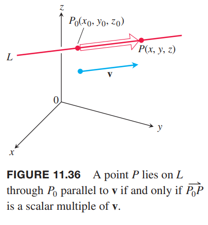
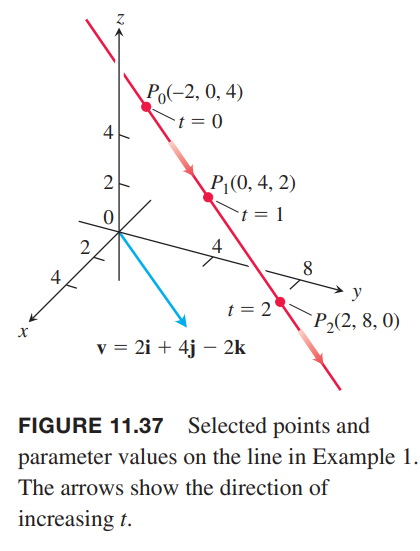
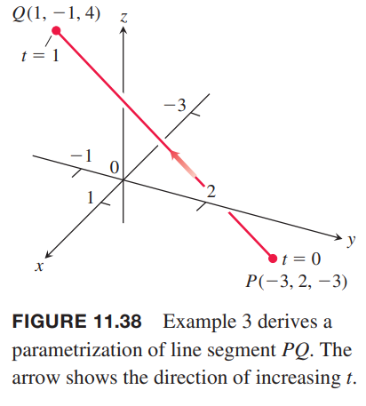
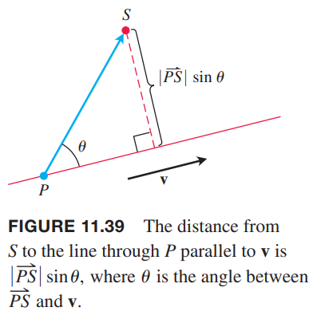
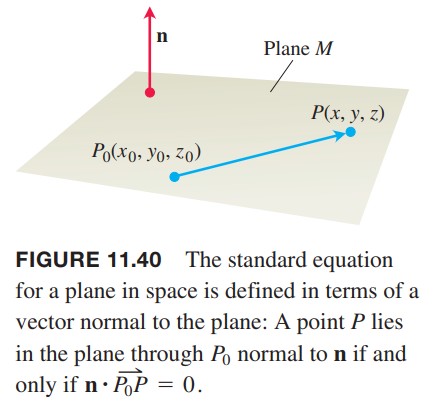
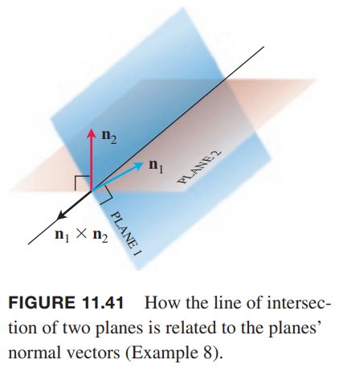
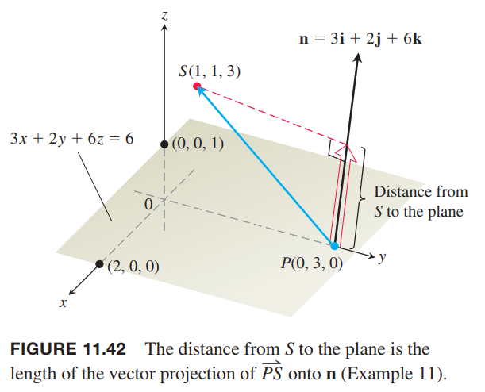
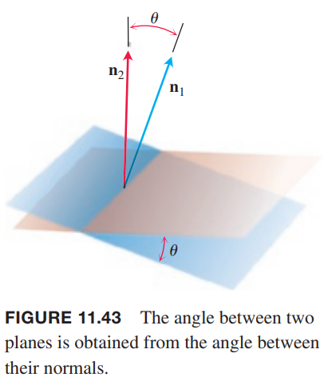

### 空间中的直线与线段
平面中，直线由一个点和斜率确定。空间中，直线由一个点和一个方向矢量确定。

假定直线 $L$ 过点 $P_0(x_0,y_0,z_0)$，平行于矢量 $\boldsymbol{v}=v_1\boldsymbol{i}+v_2\boldsymbol{j}+v_3\boldsymbol{k}$。直线是使得 $\overrightarrow{P_0P}$ 平行于 $\boldsymbol{v}$ 的点 $P(x,y,z)$ 的集合。如下图所示。

因此 $\overrightarrow{P_0P}=t\boldsymbol{v}$，其中 $t$ 是任意标量参数，依赖于 $P$ 的位置，定义域是 $(-\infty,\infty)$。将方程 $\overrightarrow{P_0P}=t\boldsymbol{v}$ 展开
$$(x-x_0)\boldsymbol{i}+(y-y_0)\boldsymbol{j}+(z-z_0)\boldsymbol{k}=t(v_1\boldsymbol{i}+v_2\boldsymbol{j}+v_3\boldsymbol{k})$$
所以
$$x\boldsymbol{i}+y\boldsymbol{j}+z\boldsymbol{k}=x_0\boldsymbol{i}+y_0\boldsymbol{j}+z_0\boldsymbol{k}+t(v_1\boldsymbol{i}+v_2\boldsymbol{j}+v_3\boldsymbol{k})\tag{1}$$
如果 $\boldsymbol{r}_0$ 是点 $P_0(x_0,y_0,z_0)$ 的位置矢量，$\boldsymbol{r}$ 是点 $P(x,y,z)$ 的位置矢量，那么方程 $(1)$ 是空间中直线的方程的矢量形式。

**直线的矢量方程**
> 过点 $P_0(x_0,y_0,z_0)$ 且平行于 $\boldsymbol{v}$ 的直线的矢量方程是
> $$\boldsymbol{r}(t)=\boldsymbol{r}_0+t\boldsymbol{v},-\infty<t<\infty\tag{2}$$
> 其中 $\boldsymbol{r}_0$ 是点 $P_0(x_0,y_0,z_0)$ 的位置矢量，$\boldsymbol{r}$ 是直线 $L$ 上的点 $P(x,y,x)$ 的位置矢量。

方程 $(1)$ 两边对应分量相等，可以得到一组关于参数 $t$ 的参数方程
$$x=x_0+tv_1,y=y_0+tv_2,z=z_0+tv_3$$
参数方程告诉我们参数区间是 $-\infty<t<\infty$。

**直线的参数方程**
> 过点 $P_0(x_0,y_0,z_0)$ 且平行于 $\boldsymbol{v}=v_1\boldsymbol{i}+v_2\boldsymbol{j}+v_3\boldsymbol{k}$ 的直线的标准参数方程是
> $$x=x_0+tv_1,y=y_0+tv_2,z=z_0+tv_3,-\infty<t<\infty\tag{3}$$

例1 求过点 $(-2,0,4)$ 平行于 $\boldsymbol{v}=2\boldsymbol{i}+4\boldsymbol{j}-2\boldsymbol{k}$ 的直线的参数方程。

解：点 $P_0(x_0,y_0,z_0)$ 是 $(-2,0,4)$，矢量 $\boldsymbol{v}=v_1\boldsymbol{i}+v_2\boldsymbol{j}+v_3\boldsymbol{k}$ 是 $\boldsymbol{v}=2\boldsymbol{i}+4\boldsymbol{j}-2\boldsymbol{k}$，代入方程 $(3)$
$$x=-2+2t,y=4t,z=4-2t$$

例2 求过点 $P(-3,2,-3),Q(1,-1,4)$ 的直线的参数方程。

解：矢量
$$\overrightarrow{PQ}=4\boldsymbol{i}-3\boldsymbol{j}+7\boldsymbol{k}$$
平行于直线，和点 $(-3,2,-3)$ 一并代入方程 $(3)$ 得到
$$x=-3+4t,y=2-3t,z=-3+7t$$
也可以使用点 $Q(1,-1,4)$ 得到参数方程
$$x=1+4t,y=-1-3t,z=4+7t$$

注意，参数方程的“基点”并不是唯一的，参数也是一样的。方程 $x=-3+4t^2,y=2-3t^2,z=-3+7t^2$ 也是例 2 中的直线的参数方程。

为了得到线段的参数化方程，首先得到过某点的直线的参数方程。然后根据端点计算 $t$ 的值将其定义域限制在闭区间上。直线的参数方程加上限制区间就是线段的参数方程。

例3 求连接点 $P(-3,2,-3),Q(1,-1,4)$ 的线段的参数方程。

解：由例 2 得到直线的参数方程是
$$x=-3+4t,y=2-3t,z=-3+7t$$
点 $P(-3,2,-3)$ 对应的 $t=0$，点 $Q(1,-1,4)$ 对应着 $t=1$。因此，添加上区间 $0\leq t\leq 1$ 就得到了线段的参数方程
$$x=-3+4t,y=2-3t,z=-3+7t,0\leq t\leq 1$$

对于方程 $(2)$，我们可以这么理解：一个粒子开始时位于 $P_0(x_0,y_0,z_0)$，沿着矢量 $\boldsymbol{v}$ 的方向运动。重写方程 $(2)$
$$\boldsymbol{r}(t)=\boldsymbol{r}_0+t\boldsymbol{v}=\boldsymbol{r}(t)=\boldsymbol{r}_0+t|\boldsymbol{v}|\frac{\boldsymbol{v}}{|\boldsymbol{v}|}\tag{4}$$
最后的式子的第一项可以看作初始位置，第二项可以看作是时间乘以速度乘以方向。

例4 一个直升机位于原点的停机坪，以 60m/s 的速度向点 $(1,1,1)$ 的方向飞行。求 10s 后直升机的位置。

解：飞行方向的单位矢量是
$$\boldsymbol{u}=\frac{1}{\sqrt{3}}\boldsymbol{i}+\frac{1}{\sqrt{3}}\boldsymbol{j}+\frac{1}{\sqrt{3}}\boldsymbol{k}$$
代入方程 $(4)$ 得到
$$\begin{aligned}
\boldsymbol{r}(t)&=\boldsymbol{r}_0+tv|\boldsymbol{u}|\\
&=\boldsymbol{0}+(t)(60)(\frac{1}{\sqrt{3}}\boldsymbol{i}+\frac{1}{\sqrt{3}}\boldsymbol{j}+\frac{1}{\sqrt{3}}\boldsymbol{k})\\
&=20\sqrt{3}t(\boldsymbol{i}+\boldsymbol{j}+\boldsymbol{k})
\end{aligned}$$
当 $t=10$ 时
$$\boldsymbol{r}(10)=200\sqrt{3}(\boldsymbol{i}+\boldsymbol{j}+\boldsymbol{k})$$
直升机向着点 $(1,1,1)$ 的方向飞行 10s 之后，空间坐标是 $(200\sqrt{3},200\sqrt{3},200\sqrt{3})$。飞行的距离是 600m，是矢量 $\boldsymbol{r}(10)$ 的长度。

### 空间中点到直线的距离
计算空间中一点 $S$ 到过点 $P$ 且平行于 $\boldsymbol{v}$ 的直线的距离，就是求矢量 $\overrightarrow{PS}$ 在垂直于直线的矢量方向的标量投影的绝对值。如下图所示。

使用上图记号，标量分量的绝对值是 $|\overrightarrow{PS}|\sin\theta$，即
$$\frac{|\overrightarrow{PS}||\boldsymbol{v}|\sin\theta}{|\boldsymbol{v}|}=\frac{|\overrightarrow{PS}\times\boldsymbol{v}|}{|\boldsymbol{v}|}$$

**点 $S$ 到过点 $P$ 且平行于 $\boldsymbol{v}$ 的直线的距离**
> $$d=\frac{|\overrightarrow{PS}\times\boldsymbol{v}|}{|\boldsymbol{v}|}\tag{5}$$

例5 求点 $S(1,1,5)$ 到直线
$$L:x=1+t,y=3-t,z=2t$$
的距离。

解：从 $L$ 方程可以看出，这条直线过点 $(1,3,0)$，平行于矢量 $\boldsymbol{v}=\boldsymbol{i}-\boldsymbol{j}+2\boldsymbol{k}$。那么
$$\overrightarrow{PS}=-2\boldsymbol{j}+5\boldsymbol{k}$$
所以
$$\overrightarrow{PS}\times\boldsymbol{v}=\begin{vmatrix}
\boldsymbol{i}&\boldsymbol{j}&\boldsymbol{k}\\
0&-2&5\\
1&-1&2
\end{vmatrix}=\boldsymbol{i}+5\boldsymbol{j}+2\boldsymbol{k}$$
根据公式 $(5)$ 得到距离
$$d=\frac{|\overrightarrow{PS}\times\boldsymbol{v}|}{|\boldsymbol{v}|}=\frac{\sqrt{1+25+4}}{\sqrt{1+1+4}}=\frac{\sqrt{30}}{\sqrt{6}}=\sqrt{5}$$

### 空间中的平面方程
一个平面由一个点和“倾斜”程度确定。这个“倾斜”程度由一个垂直于平面的矢量定义。

如下图所示。假定平面 $M$ 过点 $P_0(x_0,y_0,z_0)$，且法线矢量 $\boldsymbol{n}=A\boldsymbol{i}+B\boldsymbol{j}+C\boldsymbol{k}$。从 $P_0$ 到任一点 $P$ 的矢量都与 $\boldsymbol{n}$ 垂直。所以平面 $M$ 是所有满足 $\overrightarrow{P_0P}$ 垂直于 $\boldsymbol{n}$ 的点 $P(x,y,z)$ 的点的集合。因此点积 $\boldsymbol{n}\cdot\overrightarrow{P_0P}=0$。

点积式子等价于
$$(A\boldsymbol{i}+B\boldsymbol{j}+C\boldsymbol{k})\cdot[(x-x_0)\boldsymbol{i}+(y-y_0)\boldsymbol{j}+(z-z_0)\boldsymbol{k}]=0$$
所以平面 $M$ 的点 $(x,y,z)$ 满足
$$A(x-x_0)+B(y-y_0)+C(z-z_0)=0$$

**平面方程**
> 过点 $P_0(x_0,y_0,z_0)$ 且法线是 $\boldsymbol{n}=A\boldsymbol{i}+B\boldsymbol{j}+C\boldsymbol{k}$ 的平面方程是
> $$\boldsymbol{n}\cdot\overrightarrow{P_0P}=0$$
> $$A(x-x_0)+B(y-y_0)+C(z-z_0)=0$$
> $$Ax+By+Cz=D,D=Ax_0+By_0+Cz_0$$

例6 求过点 $P_0(-3,0,7)$ 且垂直于矢量 $\boldsymbol{n}=5\boldsymbol{i}+2\boldsymbol{j}-\boldsymbol{k}$ 的平面方程。

解：分量方程是
$$5(x-(-3))+2(y-0)+(-1)(z-7)=0$$
$$5x+15+2y-z+7=0$$
$$5x+2y-z=-22$$

例7 求过点 $A(0,0,1),B(2,0,0),C(0,3,0)$ 的平面方程。

解：首先要找到一个垂直于平面的矢量。
$$\overrightarrow{AB}\times\overrightarrow{AC}=\begin{vmatrix}
\boldsymbol{i}&\boldsymbol{j}&\boldsymbol{k}\\
2&0&-1\\
0&3&-1
\end{vmatrix}=3\boldsymbol{i}+2\boldsymbol{j}+6\boldsymbol{k}$$
使用点 $A(0,0,1)$ 配合法线矢量得到方程
$$3(x-0)+2(y-0)+6(z-1)=0$$
$$3x+2y+6z=6$$

### 平面相交的直线
两个直线平行等价于斜率相同，两个平面平行（`parallel`）等价于法线平行，即 $\boldsymbol{n}_1=k\boldsymbol{n}_2$。两个不平行的平面会有一条相交直线。

例8 求平行于平面 $3x-6y-2z=15$ 和 $2x+y-2z=5$ 的交线的矢量。

解：两个平面相交的直线于两个平面的法线 $\boldsymbol{n}_1,\boldsymbol{n}_2$ 都垂直，所以平行于 $\boldsymbol{n}_1\times\boldsymbol{n}_2$。因此 $\boldsymbol{n}_1\times\boldsymbol{n}_2$ 即为所求矢量。如下图所示。

$$\boldsymbol{n}_1\times\boldsymbol{n}_2=\begin{vmatrix}
\boldsymbol{i}&\boldsymbol{j}&\boldsymbol{k}\\
3&-6&-2\\
2&1&-2
\end{vmatrix}=14\boldsymbol{i}+2\boldsymbol{j}+15\boldsymbol{k}$$
非零标量乘以 $\boldsymbol{n}_1\times\boldsymbol{n}_2$ 也是符合题意的。

例9 求平面 $3x-6y-2z=15$ 和 $2x+y-2z=5$ 的交线的参数方程。

解：根据例 8，矢量 $14\boldsymbol{i}+2\boldsymbol{j}+15\boldsymbol{k}$ 平行于直线。那么还需要一个两个平面的公共点。令 $z=0$，代入两个平面方程，解 $x,y$ 可以得到一个公共点 $(3,-1,0)$。因此参数方程是
$$x=3+14t,y=-1+2t,z=15t$$
$z=0$ 是一个很随意的选择。也可以令 $z=1,z=-1$ 求解 $x,y$。也可以令 $x=0$ 求解 $y,z$。不同的选择得出同一条直线的不同参数方程。

例10 求直线
$$x=\frac{8}{3}+2t,y=-2t,z=1+t$$
与平面
$$3x+2y+6z=6$$
的交点。

解：交点坐标满足平面方程。因此
$$3(\frac{8}{3}+2t)+2(-2t)+6(1+t)=6$$
$$8+6t-4t+6+6t=6$$
$$8+8t=0$$
$$t=-1$$
因此交点是
$$(x,y,z)|_{t=-1}=(\frac{8}{3}-2,2,1-1)=(\frac{2}{3},2,0)$$

### 点到平面的距离
如果点 $P$ 在法线 $\boldsymbol{n}$ 的平面上，任一点 $S$ 到平面的距离是矢量 $\overrightarrow{PS}$ 在 $\boldsymbol{n}$ 方向上的投影矢量的长度。

**点 $S$ 到过点 $P$ 且法线是 $\boldsymbol{n}$ 的平面的距离**
> $$d=\bigg|\overrightarrow{PS}\cdot\frac{\boldsymbol{n}}{|\boldsymbol{n}|}\bigg|$$

例11 求点 $S(1,1,3)$ 到平面 $3x+2y+6z=6$ 的距离。

解：找到平面上一点 $P$，然后计算 $\overrightarrow{PS}$ 在法线方向上的投影矢量的长度。如下图所示。

从平面方程 $3x+2y+6z=6$ 的系数可以得到法线
$$\boldsymbol{n}=3\boldsymbol{i}+2\boldsymbol{j}+6\boldsymbol{k}$$
求平面上的点最简单的方式就是平面与坐标轴的交点，即截距。我们取 $P$ 为 $y$ 轴上的截距 $(0,3,0)$，那么
$$\overrightarrow{PS}=\boldsymbol{i}-2\boldsymbol{j}+3\boldsymbol{k}$$
$$|\boldsymbol{n}|=\sqrt{9+4+36}=7$$
代入方程 $(6)$
$$\begin{aligned}
d&=\bigg|\overrightarrow{PS}\cdot\frac{\boldsymbol{n}}{|\boldsymbol{n}|}\bigg|\\
&=\bigg|(\boldsymbol{i}-2\boldsymbol{j}+3\boldsymbol{k})\cdot\frac{3\boldsymbol{i}+2\boldsymbol{j}+6\boldsymbol{k}}{7}\bigg|\\
&=\frac{1}{7}(3-4+18)\\
&=\frac{17}{7}
\end{aligned}$$

### 两个平面的夹角
两个相交平面的夹角是它们法线矢量所夹的锐角。

例12 求平面 $3x-6y-2z=15$ 和 $2x+y-2z=5$ 的夹角。

解：法线矢量分别是
$$\boldsymbol{n}_1=3\boldsymbol{i}-6\boldsymbol{j}-2\boldsymbol{k},\boldsymbol{n}_2=2\boldsymbol{i}+\boldsymbol{j}-2\boldsymbol{k}$$
所以夹角是
$$\begin{aligned}
\theta&=\cos^{-1}\bigg(\frac{\boldsymbol{n}_1\cdot\boldsymbol{n}_2}{|\boldsymbol{n}_1||\boldsymbol{n}_2|}\bigg)\\
&=\cos^{-1}\frac{4}{7\cdot3}\\
&\approx 1.38 \text{rad}
\end{aligned}$$
