### 柱面
沿着平面上给定的曲线移动平行于给定直线的直线，生成的曲线称为柱面（`cylinder`）。平面上的曲线称为柱面的生成曲线（`generating curve`）。如下图所示。

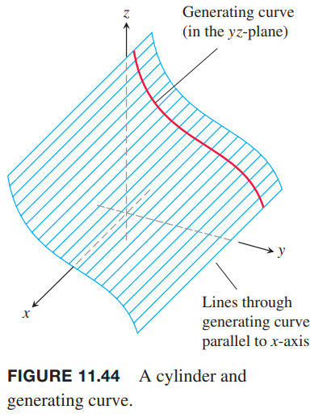

立体几何中，柱面（`cylinder`）指的是圆柱面或圆柱体（`circular cylinder`），生成曲线是圆，但这里的生成曲线可以是任意曲线。比如下面的例子中，生成曲线是抛物线。

例1 求平行于 $z$ 轴且经过抛物线 $y=x^2,z=0$ 的柱面方程。

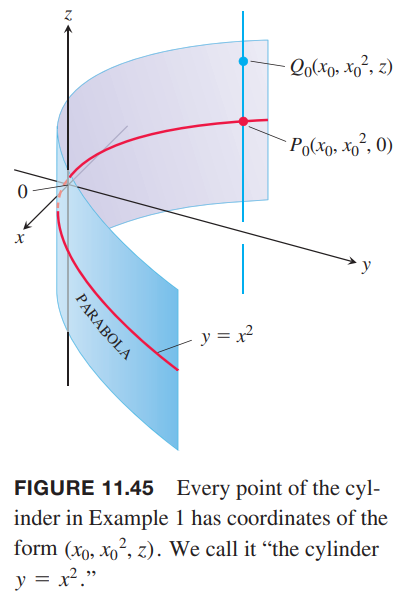

点 $P_0(x_0,x_0^2,0)$ 位于 $xy$ 平面的抛物线 $y=x^2$ 上。对于任意 $z$，点 $Q_0(x_0,x_0^2,z)$ 在柱面上，因为它在平行于 $z$ 轴且过点 $P_0$ 的直线 $x=x_0,y=x_0^2$ 上。反过来，$y$ 坐标是其 $x$ 坐标的平方的任意点 $Q_0(x_0,x_0^2,z)$ 在柱面上。

因此忽略 $z$ 的值，平面上的点满足方程 $y=x^2$。因此这就是所求柱面的方程。我们也称这个柱面是“柱面 $y=x^2$”。

任意曲线 $f(x,y)=c$ 定义了一个平行于 $z$ 轴的柱面，其方程也是 $f(x,y)=c$。比如方程 $x^2+y^2=1$ 定义了一个平行于 $z$ 轴的圆柱面。

类似的，$g(x,z)=c$ 定义了一个平行于 $y$ 轴的柱面，其方程也是 $f(x,z)=c$。任意曲线 $h(x,y)=c$ 定义了一个平行于 $z$ 轴的柱面，其方程也是 $h(x,y)=c$。柱面的轴不必平行于坐标轴。

### 二次曲面
$x,y,z$ 的二阶方程在空间中的曲面称为二次曲面（`quadric surface`）。首先，我们聚焦于方程如下的二次曲面。
$$Ax^2+By^2+Cz^2+Dz=E$$
其中 $A,B,C,D,E$ 是常数。基本的二次曲线有椭圆体（`ellipsoids`）、抛物面（`paraboloids`）、托圆锥面（`elliptical cones`）和双曲面（`hyperboloids`）。球是椭圆体的特殊形式。

例2 椭圆体
$$\frac{x^2}{a^2}+\frac{y^2}{b^2}+\frac{z^2}{c^2}=1$$
在坐标轴上的交点是 $(\pm a,0,0),(0,\pm b,0),(0,0,\pm c)$。位于立方体 $|x|\leq a,|y|\leq b,|z|\leq c$ 之内。关于任意坐标平面对称，因为方程中的变量都是平方。

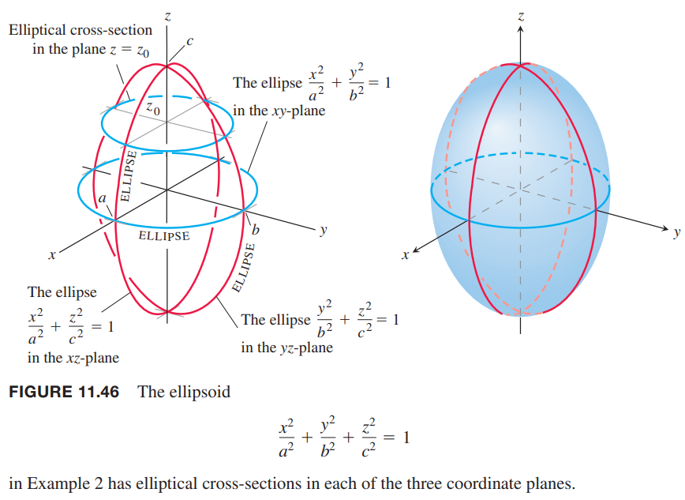

坐标平面与椭圆体相交的曲线是椭圆。比如
$$\frac{x^2}{a^2}+\frac{y^2}{b^2}=1,z=0$$
与平面 $z=z_0,|z_0|<c$ 的交线也是椭圆
$$\frac{x^2}{a^2(1-(z_0/c)^2)}+\frac{y^2}{b^2(1-(z_0/c)^2)}=1$$
如果半轴 $a,b,c$ 中的任意两个相等，那么曲面是旋转椭圆体（`ellipsoid of revolution`）。如果三个都相等，是球面。

例3 双曲抛物面（`hyperbolic paraboloid`）
$$\frac{y^2}{b^2}-\frac{x^2}{a^2}=\frac{z}{c},c>0$$
关于平面 $x=0$ 和 $y=0$ 对称。

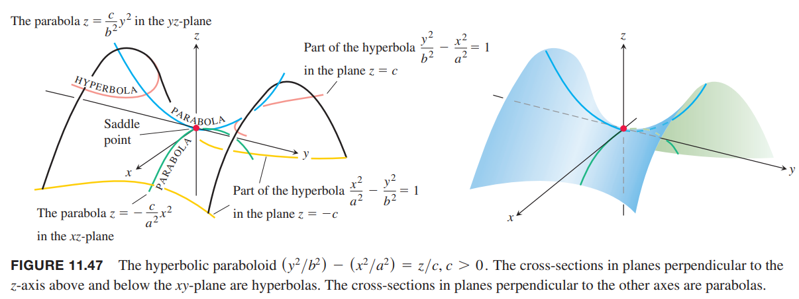

与 $x=0$ 的交线是抛物线
$$z=\frac{c}{b^2}y^2\tag{1}$$
与 $y=0$ 的交线是抛物线
$$z=-\frac{c}{a^2}x^2\tag{2}$$
在 $x=0$ 平面内，抛物线开口向上，在 $y=0$ 平面内，抛物线开口向下。

如果用 $z=z_0>0$ 截双曲抛物面，相交部分是双曲线
$$\frac{y^2}{b^2}-\frac{x^2}{a^2}=\frac{z_0}{c}$$
焦轴平行于 $y$ 轴，顶点在抛物线 $(1)$ 上。如果 $z_0$ 是负数，那么焦轴平行于 $x$ 轴，顶点在抛物线 $(2)$ 上。

在原点附近，曲面性质类似于马鞍或者山口。如果沿着 $yz$ 平面看，原点是最小值，但是沿着 $xz$ 平面看，原点是最大值。这样的点称为鞍点（`saddle point`）。

下面六个图二次曲面的六种基本类型。每个曲面都关于 $z$ 轴对称，适当修改方程，也可以关于 $x$ 轴或 $y$ 轴对称。

**椭圆体**

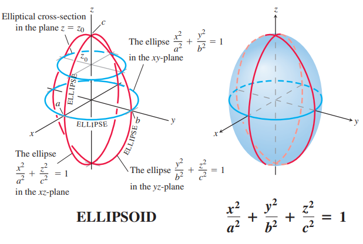

**抛物面**

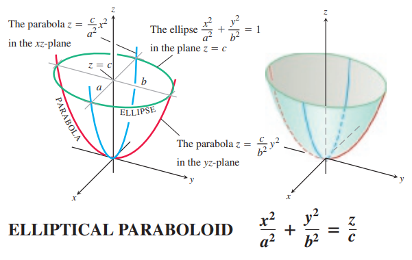

**椭圆锥面**

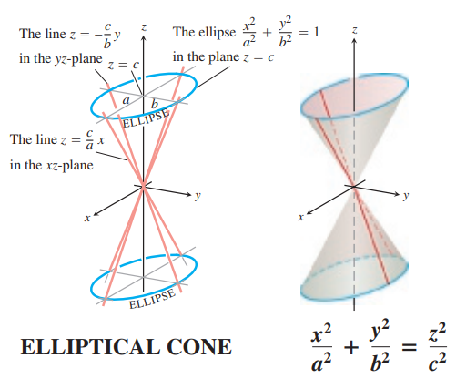

**单叶双曲面**

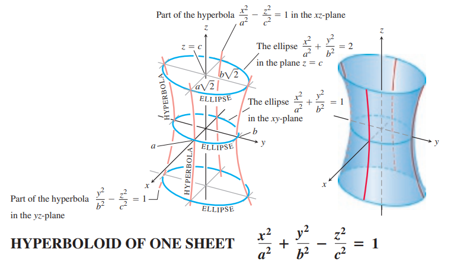

**双叶双曲面**

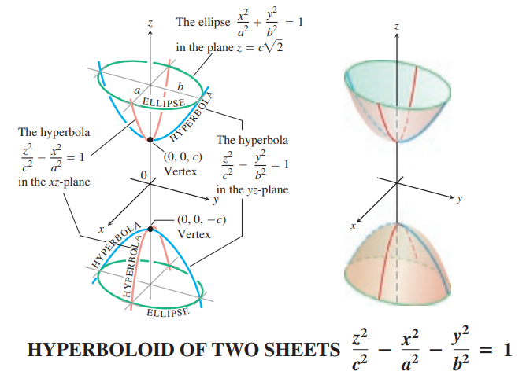

**双曲抛物面**

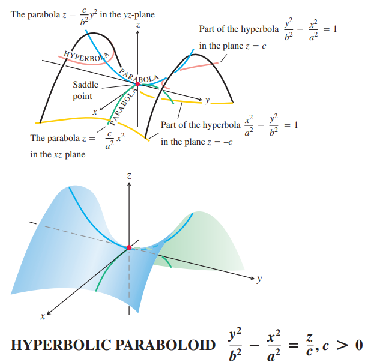

### 一般二次曲面
上面的二次曲面关于 $x$ 轴、$y$ 轴或 $z$ 轴对称。一般的二次曲线方程如下
$$Ax^2+By^2+Cz^2+Dxy+Exz+Fyz+Gx+Hy+Iz+J=0$$
其中 $A,B,C,D,E,F,G,H,I,J$ 都是常量。这些方程的图像类似于上面六个曲面，但是会沿着 $x,y,z$ 轴平移或者绕着坐标轴旋转。$Gx,Hy,Iz$ 使得图像平移。

例4 下面的方程
$$x^2+y^2+4z^2-2x+4y+1=0$$
是什么曲面。

解：改写成平方项
$$\begin{aligned}
x^2+y^2+4z^2-2x+4y+1&=(x-1)^2-1+(y-2)^2-4+4z^2+1\\
&=(x-1)^2+(y-2)^2+4z^2-4
\end{aligned}$$
因此，原始方程可以写作
$$\frac{(x-1)^2}{4}+\frac{(y+2)^2}{4}+\frac{z^2}{1}=1$$
这是一个椭圆体，半长轴长度分别是 2，2 和 1，中心点位于 $(1,-2,0)$。

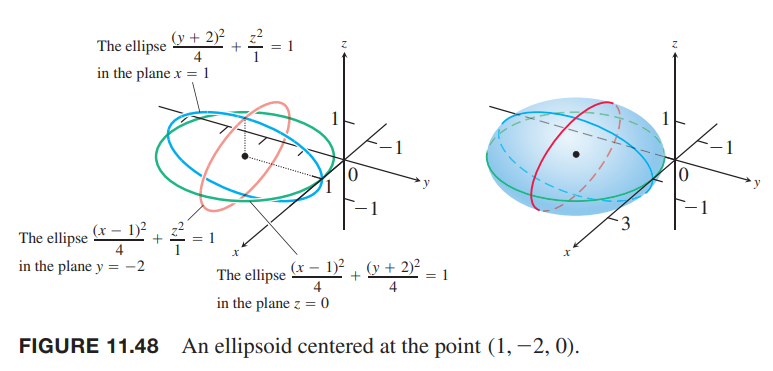
