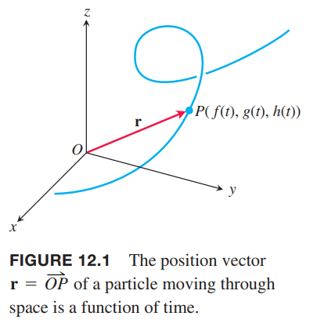
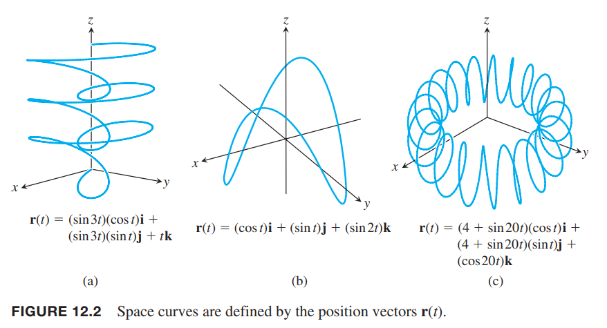
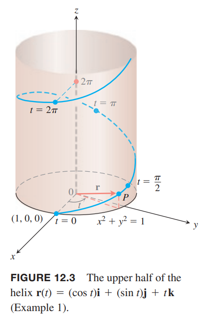
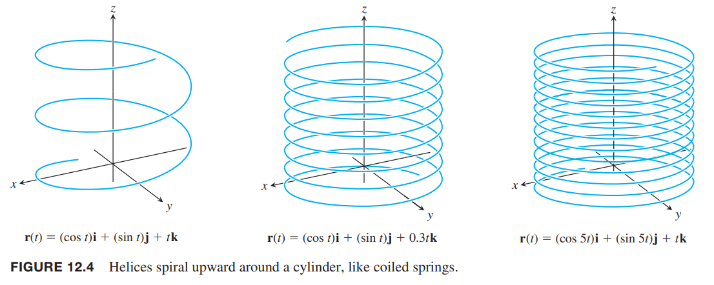
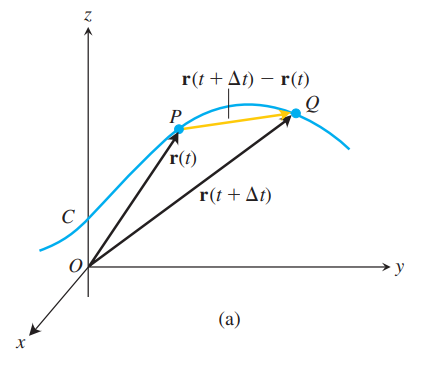
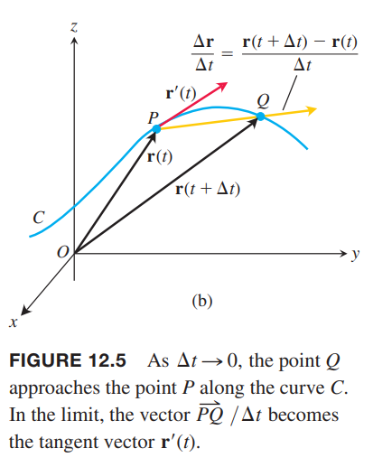
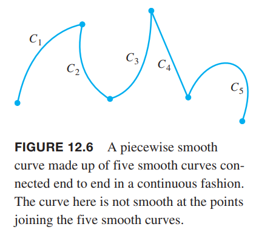
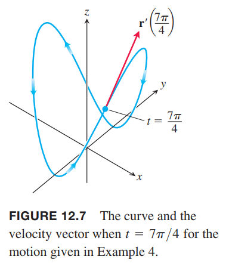
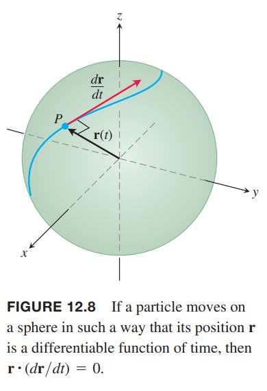

粒子在时间区间 $I$ 内在空间中运动，我们可以将其坐标看作是定义在 $I$ 上的函数
$$x=f(t),y=g(t),z=h(t),t\in I\tag{1}$$
点 $(x,y,z)=(f(t),g(t),h(t)),t\in I$ 组成了空间中的曲线（`curve`），是粒子运动的轨迹或路径（`path`）。方程 $(1)$ 是曲线的参数方程。

空间中的曲线也可以用矢量形式表示。矢量
$$\boldsymbol{r}(t)=\overrightarrow{OP}=f(t)\boldsymbol{i}+g(t)\boldsymbol{j}+h(t)\boldsymbol{k}\tag{2}$$
表示 $t$ 时刻原点到粒子位置 $P(f(t),g(t),h(t))$ 的位置矢量。如下图所示。

函数 $f,g,h$ 是位置矢量的分量函数（`component function`）。$\boldsymbol{r}$ 表示在时间区间 $I$ 内粒子运动的轨迹。下图展示了几种由计算机程序生成的空间曲线。

方程 $(2)$ 定义的 $\boldsymbol{r}$ 是区间 $I$ 内的实数 $t$ 的矢量函数。定义域 $D$ 上的矢量值函数（`vector-valued function`）或矢量函数（`vector function`）表示 $D$ 上的值与空间中矢量的映射关系。现在，定义域是实数区间，函数图像是曲线。第十五章中，定义域是平面的一个区域，图像是空间中的曲面。平面或空间上的矢量函数，也能表示矢量场，是研究流体、重力场和电磁现象的重要工具。

与矢量函数相对的是实数函数，也成为标量函数（`scalar function`）。方程 $(2)$ 中 $\boldsymbol{r}$ 的每个分量是 $t$ 的标量函数。矢量值函数的定义域是这些标量函数的公共定义域。

例1 给出矢量函数
$$\boldsymbol{r}(t)=(\cos t)\boldsymbol{i}+(\sin t)\boldsymbol{j}+t\boldsymbol{k}$$
的图像。

解：矢量函数 $\boldsymbol{r}$ 的定义域是全体实数。$\boldsymbol{r}$ 表示的曲线沿着圆柱 $x^2+y^2=1$ 环绕。如下图所示。

这是因为 $\boldsymbol{r}$ 的 $\boldsymbol{i},\boldsymbol{j}$ 的分量，也就是 $\boldsymbol{r}$ 的 $x,y$ 坐标满足圆柱方程
$$x^2+y^2=(\cos t)^2+(\sin t)^2=1$$
曲线 $\boldsymbol{k}$ 分量是 $z=t$，一直增加。$t$ 每增加 $2\pi$，曲线就沿着圆柱绕了一圈。这种曲线成为螺旋线（`helix`）。参数方程是
$$x=\cos t,y=\sin t,z=t$$
定义域是满足三个方程的 $t$ 的最大集合，这里是 $-\infty<t<\infty$。下图展示了更多的螺旋线。

### 极限和连续性
矢量函数的极限定义与实数函数（标量函数）极限的定义类似。

**定义**
> 令 $\boldsymbol{r}(t)=f(t)\boldsymbol{i}+g(t)\boldsymbol{j}+h(t)\boldsymbol{k}$ 是定义域为 $D$ 的矢量函数，$\boldsymbol{L}$ 是一矢量。如果对于任意 $\varepsilon>0$，存在相应的 $\delta>0$ 使得对所有 $t\in D$ 都有
> $$|\boldsymbol{r}(t)-\boldsymbol{L}|<\varepsilon,0<|t-t_0|<\delta$$
> 那么当 $t$ 趋于 $t_0$ 时，$\boldsymbol{r}$ 的极限是 $\boldsymbol{L}$，记作
> $$\lim_{t\to t_0}\boldsymbol{r}(t)=\boldsymbol{L}$$

如果 $\boldsymbol{L}=L_1\boldsymbol{i}+L_2\boldsymbol{j}+L_3\boldsymbol{k}$，能够证明当
$$\lim_{t\to t_0}f(t)=L_1,\lim_{t\to t_0}g(t)=L_2,\lim_{t\to t_0}h(t)=L_3$$
时，有
$$\lim_{t\to t_0}\boldsymbol{r}(t)=\boldsymbol{L}$$
方程
$$\lim_{t\to t_0}\boldsymbol{r}(t)=(\lim_{t\to t_0}f(t))\boldsymbol{i}+(\lim_{t\to t_0}g(t))\boldsymbol{j}+(\lim_{t\to t_0}h(t))\boldsymbol{k}\tag{3}$$
给出了一种计算矢量函数极限的方法。

例2 如果
$$\boldsymbol{r}(t)=(\cos t)\boldsymbol{i}+(\sin t)\boldsymbol{j}+t\boldsymbol{k}$$
那么
$$\begin{aligned}
\lim_{t\to\pi/4}\boldsymbol{r}(t)&=(\lim_{t\to\pi/4}\cos t)\boldsymbol{i}+(\lim_{t\to\pi/4}\sin t)\boldsymbol{j}+(\lim_{t\to\pi/4}t)\boldsymbol{k}\\
&=\frac{\sqrt{2}}{2}\boldsymbol{i}+\frac{\sqrt{2}}{2}\boldsymbol{j}+\frac{\pi}{4}\boldsymbol{k}
\end{aligned}$$

矢量函数的连续性与标量函数的连续性类似。

**定义**
> 矢量函数 $\boldsymbol{r}(t)$ 在 $t=t_0$ 处连续的条件是 $\lim_{t\to t_0}\boldsymbol{r}(t)=\boldsymbol{r}(t_0)$。如果矢量函数在定义域上的每一点都连续，那么是连续函数。

从公式 $(3)$ 可以知道，矢量函数 $\boldsymbol{r}(t)$ 在 $t=t_0$ 处连续，等价于各个分量在该点处都连续。

根据连续定义，当矢量函数 $\boldsymbol{r}(t)$ 在 $t=t_0$ 处连续，则有
$$\lim_{t\to t_0}\boldsymbol{r}(t)=\boldsymbol{r}(t_0)=f(t_0)\boldsymbol{i}+g(t_0)\boldsymbol{j}+h(t_0)\boldsymbol{k}=(\lim_{t\to t_0}f(t))\boldsymbol{i}+(\lim_{t\to t_0}g(t))\boldsymbol{j}+(\lim_{t\to t_0}h(t))\boldsymbol{k}$$
所以
$$\lim_{t\to t_0}f(t)=f(t_0)$$
$$\lim_{t\to t_0}g(t)=g(t_0)$$
$$\lim_{t\to t_0}h(t)=h(t_0)$$
因此 $f,g,h$ 也在 $t=t_0$ 处连续。

上述证明过程可逆，所以当三个分量在 $t=t_0$ 处连续，可以推导出 $\boldsymbol{r}(t)$ 在该点也连续。

例3

（1）图 12.2 和 12.4 上的曲线是连续的，因为各个分量函数在 $t\in(-\infty,\infty)$ 上是连续的。

（2）函数
$$\boldsymbol{g}(t)=(\cos t)\boldsymbol{i}+(\sin t)\boldsymbol{j}+\lfloor t\rfloor\boldsymbol{k}$$
在每个整数处是不连续的，因为函数 $\lfloor t\rfloor$ 在每个整数处不连续。

### 微分和运动
假定 $\boldsymbol{r}(t)=f(t)\boldsymbol{i}+g(t)\boldsymbol{j}+h(t)\boldsymbol{k}$ 是沿着曲线运动的粒子的位置矢量，$f,g,h$ 是 $t$ 的可微函数。那么时间 $t$ 和 $t+\Delta t$ 的位置差是
$$\Delta\boldsymbol{r}=\boldsymbol{r}(t+\Delta t)-\boldsymbol{r}(t)$$
如下图所示。

对各个分量而言
$$\begin{aligned}
\Delta\boldsymbol{r}&=\boldsymbol{r}(t+\Delta t)-\boldsymbol{r}(t)\\
&=[f(t+\Delta t)\boldsymbol{i}+g(t+\Delta t)\boldsymbol{j}+h(t+\Delta t)\boldsymbol{k}]-[f(t)\boldsymbol{i}+g(t)\boldsymbol{j}+h(t)\boldsymbol{k}]\\
&=[f(t+\Delta t)-f(t)]\boldsymbol{i}+[g(t+\Delta t)-g(t)]\boldsymbol{j}+[h(t+\Delta t)-h(t)]\boldsymbol{i}
\end{aligned}$$
当 $\Delta t$ 趋于零时，$Q$ 趋于 $P$，$PQ$ 趋于点 $P$ 的切线，商 $\Delta\boldsymbol{r}/\Delta t$ 趋于极限
$$\begin{aligned}
\lim_{\Delta t\to 0}\frac{\Delta\boldsymbol{r}}{\Delta t}&=[\lim_{\Delta t\to 0}\frac{f(t+\Delta t)-f(t)}{\Delta t}]\boldsymbol{i}+[\lim_{\Delta t\to 0}\frac{g(t+\Delta t)-g(t)}{\Delta t}]\boldsymbol{j}+[\lim_{\Delta t\to 0}\frac{h(t+\Delta t)-h(t)}{\Delta t}]\boldsymbol{k}\\
&=\frac{df}{dt}\boldsymbol{i}+\frac{dg}{dt}\boldsymbol{j}+\frac{dh}{dt}\boldsymbol{k}
\end{aligned}$$

**定义**
> 如果函数 $f,g,h$ 在 $t$ 处可导，那么矢量函数 $\boldsymbol{r}(t)=f(t)\boldsymbol{i}+g(t)\boldsymbol{j}+h(t)\boldsymbol{k}$ 在 $t$ 处也可导。矢量函数的导数是
> $$\begin{aligned}
\boldsymbol{r}'(t)&=\frac{d\boldsymbol{r}}{dt}\\
&=\lim_{\Delta t\to 0}\frac{\boldsymbol{r}(t+\Delta t)-\boldsymbol{r}(t)}{\Delta t}\\
&=\frac{df}{dt}\boldsymbol{i}+\frac{dg}{dt}\boldsymbol{j}+\frac{dh}{dt}\boldsymbol{k}
\end{aligned}$$

如果矢量函数 $\boldsymbol{r}$ 在定义域上的每一点都可导，那么它是可导函数。如果 $d\boldsymbol{r}/dt$ 连续且始终不为 $\boldsymbol{0}$，那么 $\boldsymbol{r}$ 表示的曲线是光滑的。这意味 $f,g,h$ 的一阶导连续且不同时为零。

导数定义的几何含义如上图所示。点 $P,Q$ 对应的位置矢量是 $\boldsymbol{r}(t),\boldsymbol{r}(t+\Delta t)$，矢量 $\overrightarrow{PQ}$ 可以用 $\boldsymbol{r}(t+\Delta t)-\boldsymbol{r}(t)$ 表示。对于 $\Delta t>0$，标量积 $(1/\Delta t)(\boldsymbol{r}(t+\Delta t)-\boldsymbol{r}(t))$ 与 $\overrightarrow{PQ}$ 的方向一致。当 $\Delta t\to 0$ 时，这个矢量趋于点 $P$ 处切线矢量。非零矢量 $\boldsymbol{r}'(t)$ 可以定义了点 $P$ 处的切线矢量。点 $(f(t_0),g(t_0),h(t_0))$ 处的切线通过该点且平行于矢量 $\boldsymbol{r}'(t_0)$。对于光滑曲线，我们要求 $\frac{d\boldsymbol{r}}{dt}\neq\boldsymbol{0}$，这确保每一点处切线连续变化，没有拐角或尖点。

由有限个光滑曲线去程的曲线称为分段光滑（`piecewise smooth`）曲线。如下图所示。

当 $\Delta t>0$ 时，$\Delta\boldsymbol{r}$ 指向运动方向。$\Delta \boldsymbol{r}/\Delta t$ 与 $\Delta\boldsymbol{r}$ 方向一致。当 $\Delta t<0$ 时，$\Delta\boldsymbol{r}$ 与运动方向相反，但 $\Delta\boldsymbol{r}/\Delta t$ 方向与 $\Delta\boldsymbol{r}$ 方向相反，所以与运动方向一致。所以不管 $\Delta t$ 的取值是正还是负，$\Delta\boldsymbol{r}/\Delta t$ 始终与运动方向一致，那么非零矢量 $d\boldsymbol{r}/dt=\lim_{t\to t_0}\Delta\boldsymbol{r}/\Delta t$ 也与运动方向一致。对于光滑曲线，$d\boldsymbol{r}/dt$ 始终不为零，粒子不会停下来或反向运动。

**定义**
> 如果 $\boldsymbol{r}$ 是粒子沿着光滑曲面运动时的位置矢量，那么
> $$\boldsymbol{v}(t)=\frac{d\boldsymbol{r}}{dt}$$
> 是速度矢量，与曲线相切。任意时刻 $t$，$\boldsymbol{v}$ 的方向都与运动方向一致，$\boldsymbol{v}$ 的大小是速度，如果其导数 $\boldsymbol{a}=d\boldsymbol{v}/dt$ 存在，表示粒子的加速度矢量。
> 1. 速度是位置的导数
> $$\boldsymbol{v}=\frac{d\boldsymbol{r}}{dt}$$
> 2. 速度的大小是速率
> $$\text{Speed}=|\boldsymbol{v}|$$
> 3. 速度的导数是加速度
> $$\boldsymbol{a}=\frac{d\boldsymbol{v}}{dt}=\frac{d^2\boldsymbol{r}}{dt^2}$$
> 4. 单位矢量 $\boldsymbol{v}/|\boldsymbol{v}|$ 是 $t$ 时刻时运动的方向

例4 粒子运动的位置矢量 $\boldsymbol{r}(t)=2\cos t\boldsymbol{i}+2\sin t\boldsymbol{j}+5\cos^2 t\boldsymbol{k}$，求速度、速率、加速度。给出速度矢量 $\boldsymbol{v}(7\pi/4)$ 时的草图。

解：速度和加速度矢量分别是
$$\begin{aligned}
\boldsymbol{v}(t)&=\boldsymbol{r}'(t)\\
&=-2\sin t\boldsymbol{i}+2\cos t\boldsymbol{j}-10\cos t\sin t\boldsymbol{k}\\
&=-2\sin t\boldsymbol{i}+2\cos t\boldsymbol{j}-5\sin 2t\boldsymbol{k}\\
\boldsymbol{a}(t)&=\boldsymbol{r}''(t)\\
&=-2\cos t\boldsymbol{i}-2\sin t\boldsymbol{j}-10\cos 2t\boldsymbol{k}
\end{aligned}$$
速率是
$$|\boldsymbol{v}(t)|=\sqrt{(-2\sin t)^2+(2\cos t)^2+(-5\sin 2t)^2}=\sqrt{5+25\sin^2 2t}$$
当 $t=\frac{7\pi}{4}$ 时，
$$\begin{aligned}
\boldsymbol{v}(\frac{7\pi}{4})&=\sqrt{2}\boldsymbol{i}+\sqrt{2}\boldsymbol{j}+5\boldsymbol{k}
\end{aligned}$$

### 微分法则
因为矢量的导数可以由各个分量计算得到，因此矢量导数的法则与标量函数的导数运算法则一致。

**矢量函数的微分法则**
> 令 $\boldsymbol{u},\boldsymbol{v}$ 是 $t$ 的可微矢量函数，$\boldsymbol{C}$ 是常矢量，$c$ 是任意标量，$f$ 是任意标量函数。
> 1. 常量函数法则
> $$\frac{d}{dt}\boldsymbol{C}=\boldsymbol{0}$$
> 2. 标量乘法法则
> $$\frac{d}{dt}[c\boldsymbol{u}(t)]=c\boldsymbol{u}'(t)$$
> $$\frac{d}{dt}[f(t)\boldsymbol{u}(t)]=f'(t)\boldsymbol{u}(t)+f(t)\boldsymbol{u}'(t)$$
> 3. 加法法则
> $$\frac{d}{dt}[\boldsymbol{u}(t)+\boldsymbol{v}(t)]=\boldsymbol{u}'(t)+\boldsymbol{v}'(t)$$
> 4. 减法法则
> $$\frac{d}{dt}[\boldsymbol{u}(t)-\boldsymbol{v}(t)]=\boldsymbol{u}'(t)-\boldsymbol{v}'(t)$$
> 4. 点积法则
> $$\frac{d}{dt}[\boldsymbol{u}(t)\cdot\boldsymbol{v}(t)]=\boldsymbol{u}'(t)\cdot\boldsymbol{v}(t)+\boldsymbol{u}(t)\cdot\boldsymbol{v}'(t)$$
> 5. 叉积法则
> $$\frac{d}{dt}[\boldsymbol{u}(t)\times\boldsymbol{v}(t)]=\boldsymbol{u}'(t)\times\boldsymbol{v}(t)+\boldsymbol{u}(t)\times\boldsymbol{v}'(t)$$
> 6. 链式法则
> $$\frac{d}{dt}[\boldsymbol{u}(f(t))]=f'(t)\boldsymbol{u}'(f(t))$$

假定
$$\boldsymbol{C}=c_1\boldsymbol{i}+c_2\boldsymbol{j}+c_3\boldsymbol{k}$$
$$\boldsymbol{u}(t)=u_1(t)\boldsymbol{i}+u_2(t)\boldsymbol{j}+u_3(t)\boldsymbol{k}$$
$$\boldsymbol{v}(t)=v_1(t)\boldsymbol{i}+v_2(t)\boldsymbol{j}+v_3(t)\boldsymbol{k}$$
下面证明上述各个法则，在语义明确的情况下，会省略函数变量 $(t)$。

根据矢量函数导数定义有
$$\frac{d}{dt}\boldsymbol{C}=\frac{d}{dt}c_1\boldsymbol{i}+\frac{d}{dt}c_2\boldsymbol{j}+\frac{d}{dt}c_3\boldsymbol{k}=0\boldsymbol{i}+0\boldsymbol{j}+0\boldsymbol{k}=\boldsymbol{0}$$
标量乘法法则
$$\begin{aligned}
\frac{d}{dt}[c\boldsymbol{u}]&=\frac{d}{dt}(cu_1)\boldsymbol{i}+\frac{d}{dt}(cu_2)\boldsymbol{j}+\frac{d}{dt}(cu_3)\boldsymbol{k}\\
&=c(\frac{d}{dt}u_1\boldsymbol{i}+\frac{d}{dt}u_2\boldsymbol{j}+\frac{d}{dt}u_3\boldsymbol{k})\\
&=c\boldsymbol{u}'
\end{aligned}$$
$$\begin{aligned}
\frac{d}{dt}[f\boldsymbol{u}]&=\frac{d}{dt}(fu_1)\boldsymbol{i}+\frac{d}{dt}(fu_2)\boldsymbol{j}+\frac{d}{dt}(fu_3)\boldsymbol{k}\\
&=(f'u_1+fu_1')\boldsymbol{i}+(f'u_2+fu_2')\boldsymbol{j}+(f'u_3+fu_3')\boldsymbol{k}\\
&=f'(u_1\boldsymbol{i}+u_2\boldsymbol{j}+u_3\boldsymbol{k})+f(u_1'\boldsymbol{i}+u_2'\boldsymbol{j}+u_3'\boldsymbol{k})\\
&=f\boldsymbol{u}+f\boldsymbol{u}'
\end{aligned}$$
加法法则
$$\begin{aligned}
\frac{d}{dt}[\boldsymbol{u}+\boldsymbol{v}]&=\frac{d}{dt}(u_1+v_1)\boldsymbol{i}+\frac{d}{dt}(u_2+v_2)\boldsymbol{j}+\frac{d}{dt}(u_3+v_3)\boldsymbol{k}\\
&=\frac{d}{dt}u_1\boldsymbol{i}+\frac{d}{dt}u_2\boldsymbol{j}+\frac{d}{dt}u_3\boldsymbol{k}+\frac{d}{dt}v_1\boldsymbol{i}+\frac{d}{dt}v_2\boldsymbol{j}+\frac{d}{dt}v_3\boldsymbol{k}\\
&=\boldsymbol{u}'+\boldsymbol{v}'
\end{aligned}$$
减法法则证明与加法法则证明类似，仅需要将上述过程 $\boldsymbol{v},v_1,v_2,v_3$ 前面的加号替换成减号即可。

点积法则
$$\begin{aligned}
\frac{d}{dt}[\boldsymbol{u}\cdot\boldsymbol{v}]&=\frac{d}{dt}(u_1v_1)\boldsymbol{i}+\frac{d}{dt}(u_2v_2)\boldsymbol{j}+\frac{d}{dt}(u_3v_3)\boldsymbol{k}\\
&=(u_1'v_1+u_1v_1')\boldsymbol{i}+(u_2'v_2+u_2v_2')\boldsymbol{j}+(u_3'v_3+u_3v_3')\boldsymbol{k}\\
&=(u_1'v_1\boldsymbol{i}+u_2'v_2\boldsymbol{j}+u_3'v_3\boldsymbol{k})+(u_1v_1'\boldsymbol{i}+u_2v_2'\boldsymbol{j}+u_3v_3'\boldsymbol{k})\\
&=\boldsymbol{u}'\boldsymbol{v}+\boldsymbol{u}\boldsymbol{v}'
\end{aligned}$$
叉积法则

根据导数的定义
$$\frac{d}{dt}(\boldsymbol{u}\times\boldsymbol{v})=\lim_{h\to 0}\frac{\boldsymbol{u}(t+h)\times\boldsymbol{v}(t+h)-\boldsymbol{u}(t)\times\boldsymbol{v}(t)}{h}$$
分子减去再加上 $\boldsymbol{u}(t)\times\boldsymbol{v}(t+h)$
$$\begin{aligned}
\frac{d}{dt}(\boldsymbol{u}\times\boldsymbol{v})&=\lim_{h\to 0}\frac{\boldsymbol{u}(t+h)\times\boldsymbol{v}(t+h)-\boldsymbol{u}(t)\times\boldsymbol{v}(t+h)+\boldsymbol{u}(t)\times\boldsymbol{v}(t+h)-\boldsymbol{u}(t)\times\boldsymbol{v}(t)}{h}\\
&=\lim_{h\to 0}\bigg[\frac{\boldsymbol{u}(t+h)-\boldsymbol{u}(t)}{h}\times\boldsymbol{v}(t+h)+\boldsymbol{u}(t)\times\frac{\boldsymbol{v}(t+h)-\boldsymbol{v}(t)}{h}\bigg]\\
&=\lim_{h\to 0}\frac{\boldsymbol{u}(t+h)-\boldsymbol{u}(t)}{h}\times\lim_{h\to 0}\boldsymbol{v}(t+h)+\lim_{h\to 0}\boldsymbol{u}(t)\times\lim_{h\to 0}\frac{\boldsymbol{v}(t+h)-\boldsymbol{v}(t)}{h}
\end{aligned}$$
最后一步成立的条件是如果两个矢量极限存在，那么极限的叉积等于这两个矢量叉积的极限。

这里插入对上述命题的证明。令
$$\lim_{t\to t_0}\boldsymbol{u}=\boldsymbol{U}=u_1(t_0)\boldsymbol{i}+u_2(t_0)\boldsymbol{j}+u_3(t_0)\boldsymbol{k}$$
$$\lim_{t\to t_0}\boldsymbol{v}=\boldsymbol{V}=v_1(t_0)\boldsymbol{i}+v_2(t_0)\boldsymbol{j}+v_3(t_0)\boldsymbol{k}$$
那么
$$\lim_{t\to t_0}(\boldsymbol{u}\times\boldsymbol{v})=\lim_{t\to t_0}\begin{vmatrix}
\boldsymbol{i}&\boldsymbol{j}&\boldsymbol{k}\\
u_1&u_2&u_3\\
v_1&v_2&v_3
\end{vmatrix}$$
计算行列式仅涉及标量函数，而根据标量函数极限的乘法规则，乘积的极限等于极限的乘积。所以
$$\lim_{t\to t_0}\begin{vmatrix}
\boldsymbol{i}&\boldsymbol{j}&\boldsymbol{k}\\
u_1&u_2&u_3\\
v_1&v_2&v_3
\end{vmatrix}=\begin{vmatrix}
\boldsymbol{i}&\boldsymbol{j}&\boldsymbol{k}\\
u_1(t_0)&u_2(t_0)&u_3(t_0)\\
v_1(t_0)&v_2(t_0)&v_3(t_0)
\end{vmatrix}=\boldsymbol{U}\times\boldsymbol{V}$$

随着 $h$ 趋于零，$\boldsymbol{v}$ 在 $t=t_0$ 处可导，那么
$$\begin{aligned}
\lim_{t\to t_0}\boldsymbol{v}(t)&=\lim_{h\to 0}\boldsymbol{v}(t_0+h)\\
&=\boldsymbol{v}(t_0)+\lim_{h\to 0}h\boldsymbol{v}'(t)\\
&=\boldsymbol{v}(t_0)
\end{aligned}$$
所以 $\boldsymbol{v}$ 在 $t=t_0$ 处连续，那么 $\boldsymbol{v}(t+h)$ 趋于 $\boldsymbol{v}(t)$。因此
$$\frac{d}{dt}(\boldsymbol{u}\times\boldsymbol{v})=\frac{d\boldsymbol{u}}{dt}\times\boldsymbol{v}+\boldsymbol{u}\times\frac{d\boldsymbol{v}}{dt}$$
链式法则

令 $\boldsymbol{u}(s)=a(s)\boldsymbol{i}+b(s)\boldsymbol{j}+c(s)\boldsymbol{k}$ 是 $s$ 可导矢量函数，$s=f(t)$ 是 $t$ 的可导标量函数。那么 $a,b,c$ 是 $t$ 的可导标量函数，那么根据标量函数的链式法则可以得到
$$\begin{aligned}
\frac{d}{dt}[\boldsymbol{u}(s)]&=\frac{da}{dt}\boldsymbol{i}+\frac{db}{dt}\boldsymbol{j}+\frac{dc}{dt}\boldsymbol{k}\\
&=\frac{da}{ds}\frac{ds}{dt}\boldsymbol{i}+\frac{db}{ds}\frac{ds}{dt}\boldsymbol{j}+\frac{dc}{ds}\frac{ds}{dt}\boldsymbol{k}\\
&=\frac{ds}{dt}(\frac{da}{ds}\boldsymbol{i}+\frac{db}{ds}\boldsymbol{j}+\frac{dc}{ds}\boldsymbol{k})\\
&=\frac{ds}{dt}\frac{d\boldsymbol{u}}{ds}\\
&=f'(t)\boldsymbol{u}'(f(t))
\end{aligned}$$

### 固定长度的矢量函数
一个粒子沿着球面运动，假定球心位于原点，那么位置矢量的长度是固定值，即球的半径。

速度矢量 $d\boldsymbol{r}/dt$ 与运动路径相切，即与球面相切，因此与 $\boldsymbol{r}$ 垂直。这个结论对可导的固定长度的矢量函数均成立：矢量与一阶导正交。因为
$$\begin{aligned}
\boldsymbol{r}\cdot\boldsymbol{r}=|\boldsymbol{r}|^2&=c^2\\
\frac{d}{dt}[\boldsymbol{r}\cdot\boldsymbol{r}]&=0\\
\boldsymbol{r}'\cdot\boldsymbol{r}+\boldsymbol{r}\cdot\boldsymbol{r}'&=0\\
2\boldsymbol{r}'\cdot\boldsymbol{r}&=0
\end{aligned}$$
点积为零，因此 $\boldsymbol{r}$ 与 $\boldsymbol{r}'$ 垂直。

> 如果 $\boldsymbol{r}$ 是 $t$ 的可导矢量函数，并且 $\boldsymbol{r}$ 的长度固定，那么
> $$\boldsymbol{r}\cdot\frac{d\boldsymbol{r}}{dt}=0$$

上述推导的每一步均可逆，因此与自己的一阶导正交的矢量函数，长度是固定值。
