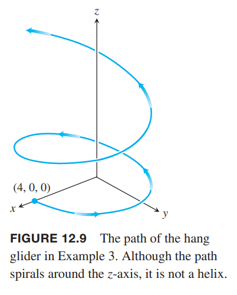
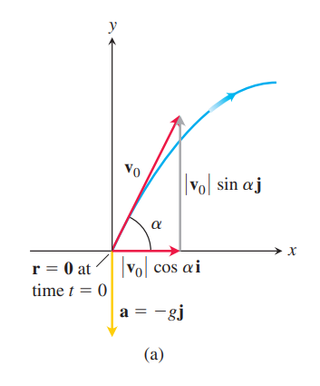

### 矢量函数的积分
如果矢量函数 $\boldsymbol{R}(t)$ 是 $t$ 的可导函数，且在区间 $I$ 上每一点都有 $d\boldsymbol{R}/dt=\boldsymbol{r}(t)$，那么 $\boldsymbol{R}$ 是 矢量函数 $\boldsymbol{r}$ 的反导数（`antiderivative`）。

如果 $\boldsymbol{R}_1(t)$ 和 $\boldsymbol{R}_2$ 的导数相同
$$\boldsymbol{R}_1'=\frac{dR_{1x}}{dt}\boldsymbol{i}+\frac{dR_{1y}}{dt}\boldsymbol{j}+\frac{dR_{1z}}{dt}\boldsymbol{k}=\boldsymbol{R}_2'=\frac{dR_{2x}}{dt}\boldsymbol{i}+\frac{dR_{2y}}{dt}\boldsymbol{j}+\frac{dR_{2z}}{dt}\boldsymbol{k}$$
根据 [4.2 小节](../040-Applications-of-Derivatives/020-The-Mean-Value-Theorem.md)推论 2 有
$$R_{1x}-R_{2x}=C_{1x}$$
$$R_{1y}-R_{2y}=C_{1y}$$
$$R_{1z}-R_{2z}=C_{1z}$$
所以 $\boldsymbol{R}_1$ 与 $\boldsymbol{R}_2$ 之差是常矢量
$$\boldsymbol{R}_1-\boldsymbol{R}_2=\boldsymbol{C}$$
如果 $\boldsymbol{R}(t)$ 的导数是 $\boldsymbol{r}(t)$，即 $\boldsymbol{R}$ 是 $\boldsymbol{r}$ 的反导函数，如果任意一个矢量函数 $\boldsymbol{H}(t)$ 是 $\boldsymbol{r}$ 的反导数，由于 $\boldsymbol{H}$ 和 $\boldsymbol{R}$ 导数相同，所以
$$\boldsymbol{H}-\boldsymbol{R}=\boldsymbol{C}$$
因此 $\boldsymbol{R}+\boldsymbol{C}$ 是 $\boldsymbol{r}$ 的反导数，$\boldsymbol{C}$ 可以是任意常矢量。

$\boldsymbol{r}$ 在区间 $I$ 上的反导数的集合是其在 $I$ 上的不定积分（`indefinite integral`）。

**定义**
> $\boldsymbol{r}$ 相对 $t$ 的不定积分是 $\boldsymbol{r}$ 的反导数的集合，记作 $\int\boldsymbol{r}(t)dt$。如果 $\boldsymbol{R}$ 是 $\boldsymbol{r}$ 的反导数，那么
> $$\int\boldsymbol{r}(t)dt=\boldsymbol{R}(t)+\boldsymbol{C}$$

例1 为了求解矢量函数的积分，需要对各个分量做积分。
$$\int((\cos t)\boldsymbol{i}+\boldsymbol{j}-2t\boldsymbol{k})dt=(\sin t)\boldsymbol{i}+t\boldsymbol{j}-t^2\boldsymbol{k}$$

**定义**
> 如果 $\boldsymbol{r}(t)=f(t)\boldsymbol{i}+g(t)\boldsymbol{j}+h(t)\boldsymbol{k}$ 的各个分量在 $[a,b]$ 上可积，那么 $\boldsymbol{r}$ 在这个区间上也是可积的，$\boldsymbol{r}$ 从 $a$ 到 $b$ 的定积分（`definite integral`）是
> $$\int_a^b\boldsymbol{r}(t)dt=+(\int_a^bf(t)dt)\boldsymbol{i}+(\int_a^bg(t)dt)\boldsymbol{j}+(\int_a^bh(t))\boldsymbol{k}$$

例2 在例 1 的积分上加上下限
$$\begin{aligned}
\int_0^\pi((\cos t)\boldsymbol{i}+\boldsymbol{j}-2t\boldsymbol{k})dt&=(\sin t)|_0^\pi\boldsymbol{i}+t|_0^\pi\boldsymbol{j}-t^2|_0^\pi\boldsymbol{k}\\
&=\pi\boldsymbol{j}-\pi^2\boldsymbol{k}
\end{aligned}$$

连续矢量函数的微积分基本定理是
$$\int_a^b\boldsymbol{r}(t)dt=\boldsymbol{R}(t)\bigg|_a^b=\boldsymbol{R}(b)-\boldsymbol{R}(a)$$
其中 $\boldsymbol{R}$ 是 $\boldsymbol{r}$ 的任意导数，即 $\boldsymbol{R}'(t)=\boldsymbol{r}(t)$。

由标量函数的微积分基本定理，又因为矢量函数的微分和积分可以看作是各个分量进行微分或积分，所以
$$\frac{d}{dt}\int_a^t\boldsymbol{r}(\tau)d\tau=\boldsymbol{r}(t)$$
如果 $\boldsymbol{r}$ 的反导数存在，那么
$$\int_a^x\boldsymbol{r}dt=\boldsymbol{G}(x)$$
如果 $\boldsymbol{R}$ 是 $\boldsymbol{r}$ 的任意一个反导数，那么根据之前的结论
$$\boldsymbol{R}=\boldsymbol{G}+\boldsymbol{C}$$
那么
$$\begin{aligned}
\boldsymbol{R}(b)-\boldsymbol{R}(a)&=(\boldsymbol{G}(b)+\boldsymbol{C})-(\boldsymbol{G}(a)+\boldsymbol{C})\\
&=\boldsymbol{G}(b)-\boldsymbol{G}(a)\\
&=\int_a^b\boldsymbol{r}(t)dt-\int_a^a\boldsymbol{r}(t)dt\\
&=\int_a^b\boldsymbol{r}(t)dt
\end{aligned}$$

注意，矢量函数的反导数是矢量函数，而定积分是一个矢量。

例3 我们只知道滑翔翼的加速度矢量是 $\boldsymbol{a}(t)=-(3\cos t)\boldsymbol{i}-(3\sin t)\boldsymbol{j}+2\boldsymbol{k}$ 而不知道其运动轨迹。在 $t=0$ 时刻，滑翔翼从 $(4,0,0)$ 以速度 $\boldsymbol{v}(0)=3\boldsymbol{j}$ 滑出。求 $t$ 时刻滑翔翼的位置。

解：已知微分方程
$$\boldsymbol{a}=\frac{d^2\boldsymbol{r}}{dt^2}=-(3\cos t)\boldsymbol{i}-(3\sin t)\boldsymbol{j}+2\boldsymbol{k}$$
初始条件为
$$\boldsymbol{v}(0)=3\boldsymbol{j},\boldsymbol{r}(0)=4\boldsymbol{i}$$
求解 $\boldsymbol{r}(t)$。

对微分方程两边积分得到
$$\boldsymbol{v}(t)=-(3\sin t)\boldsymbol{i}+(3\cos t)\boldsymbol{j}+2t\boldsymbol{k}+\boldsymbol{C}_1$$
将 $\boldsymbol{v}(0)=3\boldsymbol{j}$ 求解 $\boldsymbol{C}_1$
$$\begin{aligned}
3\boldsymbol{j}&=-(3\sin 0)\boldsymbol{i}+(3\cos 0)\boldsymbol{j}+(0)\boldsymbol{k}+\boldsymbol{C}_1\\
3\boldsymbol{j}&=3\boldsymbol{j}+\boldsymbol{C}_1\\
\boldsymbol{C}_1&=\boldsymbol{0}
\end{aligned}$$
因此速度矢量方程是
$$\frac{d\boldsymbol{r}}{dt}=\boldsymbol{v}(t)=-(3\sin t)\boldsymbol{i}+(3\cos t)\boldsymbol{j}+2t\boldsymbol{k}$$
两边积分
$$\boldsymbol{r}(t)=(3\cos t)\boldsymbol{i}+(3\sin t)\boldsymbol{j}+t^2\boldsymbol{k}+\boldsymbol{C}_2$$
代入 $\boldsymbol{r}(0)=4\boldsymbol{i}$
$$\begin{aligned}
4\boldsymbol{i}&=(3\cos 0)\boldsymbol{i}+(3\sin 0)\boldsymbol{j}+(0)\boldsymbol{k}+\boldsymbol{C}_2\\
4\boldsymbol{i}&=3\boldsymbol{i}+\boldsymbol{C}_2\\
\boldsymbol{C}_2&=\boldsymbol{i}
\end{aligned}$$
因此位置矢量方程是
$$\boldsymbol{r}(t)=(1+3\cos t)\boldsymbol{i}+(3\sin t)\boldsymbol{j}+t^2\boldsymbol{k}$$
滑翔机飞行轨迹如下图所示。

### 抛射体运动的矢量和参数方程
一个经典例子是抛射体运动。这里，我们仅考虑重力作用于抛射体而没有其他力的作用，同时也忽略诸如地球转动等其他因素。对于大部分场景，这是一个合理的近似。

假定抛射体仅受到垂直地面的力，在一个垂直平面内运动。初始时 $t=0$，位于原点，初始速度是 $\boldsymbol{v}_0$，其与水平面之间的夹角是 $\alpha$。

因此，可以得到速度矢量方程
$$\boldsymbol{v}_0=(|\boldsymbol{v}_0|\cos\alpha)\boldsymbol{i}+(|\boldsymbol{v}_0|\sin\alpha)\boldsymbol{j}$$
如果使用 $v_0$ 表示 $|\boldsymbol{v}_0|$，那么
$$\boldsymbol{v}_0=(v_0\cos\alpha)\boldsymbol{i}+(v_0\sin\alpha)\boldsymbol{j}$$
初始位置矢量
$$\boldsymbol{r}_0=0\boldsymbol{i}+0\boldsymbol{j}=\boldsymbol{0}$$
根据牛顿力学第二定律，力等于质量 $m$ 乘以加速度 $d^2\boldsymbol{r}/dt^2$，其中 $\boldsymbol{r}$ 表示 $t$ 时刻的位置矢量。重力等于 $-mg\boldsymbol{j}$，因此
$$m\frac{d^2\boldsymbol{r}}{dt^2}=-mg\boldsymbol{j}$$
$$\frac{d^2\boldsymbol{r}}{dt^2}=-g\boldsymbol{j}$$
积分一次可以得到
$$\frac{d\boldsymbol{r}}{dt}=-(gt)\boldsymbol{j}+\boldsymbol{v}_0$$
再次积分得到
$$\boldsymbol{r}=-\frac{1}{2}gt^2\boldsymbol{j}+\boldsymbol{v}_0 t+\boldsymbol{r}_0$$
将初始值 $\boldsymbol{v}_0,\boldsymbol{r}_0$ 代入方程得到
$$\boldsymbol{r}=-\frac{1}{2}gt^2\boldsymbol{j}+(v_0\cos\alpha)t\boldsymbol{i}+(v_0\sin\alpha)t\boldsymbol{j}+\boldsymbol{0}$$

**理想抛射体运动方程**
> $$\boldsymbol{r}=(v_0\cos\alpha)t\boldsymbol{i}+((v_0\sin\alpha)t-\frac{1}{2}gt^2)\boldsymbol{j}$$

角 $\alpha$ 称为抛射体的发射角（`launch angle`），也成为射击角度或仰角（`firing angle`, `angle of elevation`）。$v_0$ 是初始速率（`initial speed`）。$\boldsymbol{r}$ 分量给出了运动方程的参数方程
$$x=(v_0\cos\alpha)t,y=(v_0\sin\alpha)t-\frac{1}{2}gt^2$$
其中 $x$ 是发射方向的水平距离，$y$ 是抛射体的高度。

例4 一个抛射体从原点发射，初始速率是 500m/s，仰角是 $60^\circ$。求 10s 后抛射体的位置。

解：将 $v_0=500,\alpha=60^\circ,g=9.8,t=10$ 代入方程
$$\begin{aligned}
\boldsymbol{r}&=(v_0\cos\alpha)t\boldsymbol{i}+((v_0\sin\alpha)t-\frac{1}{2}gt^2)\boldsymbol{j}\\
&=(500)(\frac{1}{2})(10)\boldsymbol{i}+((500)(\frac{\sqrt{3}}{2})10-\frac{1}{2}(9.8)(100))\boldsymbol{j}\\
&\approx 2500\boldsymbol{i}+3840\boldsymbol{j}
\end{aligned}$$
10s 后，抛射体距离地面高度 3840m，距离原点水平距离是 2500m。

由参数方程我们可以得到 $t=x/(v_0\cos\alpha)$，代入第二个参数方程得到迪卡坐标系方程
$$y=-(\frac{g}{2v_0^2\cos^2\alpha})x^2+(\tan\alpha)x$$
这是一个形式为 $y=ax^2+bx$ 的抛物线方程。

当垂直速度为零时，物体得到最高点。此时 $y$ 分量一阶导为零
$$\frac{d}{dt}((v_0\sin\alpha)t-\frac{1}{2}gt^2)=v_0\sin\alpha-gt=0$$
因此
$$t=\frac{v_0\sin\alpha}{g}$$
代回到 $y$ 分量得到
$$y_{\max}=v_0\sin\alpha\frac{v_0\sin\alpha}{g}-\frac{1}{2}g\frac{v_0^2\sin^\alpha}{g^2}=\frac{(v_0\sin\alpha)^2}{2g}$$
当 $y$ 分量为零时抛射体停止运动，所以令 $y=0$ 可以得到飞行时间。
$$y=(v_0\sin\alpha)t-\frac{1}{2}gt^2=0$$
因此
$$t=\frac{2v_0\sin\alpha}{g}$$
水平最大距离称为射程（`rang`）。
$$R=v_0\cos\alpha t=v_0\cos\alpha\frac{2v_0\sin\alpha}{g}=\frac{v_0^2}{g}\sin 2\alpha$$

**理想抛射体的最大高度、飞行时间和射程**
> 理想抛射体从原点发射，初始速度是 $v_0$，仰角是 $\alpha$，那么最大高度、飞行时间和射程分别是
> $$y_{\max}=\frac{(v_0\sin\alpha)^2}{2g}$$
> $$t=\frac{2v_0\sin\alpha}{g}$$
> $$R=\frac{v_0^2}{g}\sin 2\alpha$$

如果抛射体从点 $(x_0,y_0)$ 发射，那么位置矢量方程是
$$\boldsymbol{r}=(x_0+(v_0\cos\alpha)t)\boldsymbol{i}+(y_0+(v_0\sin\alpha)t-\frac{1}{2}gt^2)\boldsymbol{j}$$

微分方程
$$\frac{d^2\boldsymbol{r}}{dt^2}=-g\boldsymbol{j}$$
初始条件
$$\boldsymbol{v}_0=(v_0\cos\alpha)\boldsymbol{i}+(v_0\sin\alpha)\boldsymbol{j}$$
$$\boldsymbol{r}_0=x_0\boldsymbol{i}+y_0\boldsymbol{j}$$
所以本小节开始的推导仍旧成立，所以
$$\boldsymbol{r}=-\frac{1}{2}gt^2\boldsymbol{j}+\boldsymbol{v}_0 t+\boldsymbol{r}_0$$
代入初始条件
$$\begin{aligned}
\boldsymbol{r}&=-\frac{1}{2}gt^2\boldsymbol{j}+(v_0\cos\alpha)t\boldsymbol{i}+(v_0\sin\alpha)t\boldsymbol{j}+x_0\boldsymbol{i}+y_0\boldsymbol{j}\\
&=(x_0+(v_0\cos\alpha)t)\boldsymbol{i}+(y_0+(v_0\sin\alpha)t-\frac{1}{2}gt^2)\boldsymbol{j}
\end{aligned}$$

### 有阵风情况下的抛射体运动
下面的例子研究在抛射体发射的瞬间，有一水平阵风，对初始速度有水平干扰的情况。

例5 棒球在距离地面 1m 高的地方被击中。初始速度 50m/s，仰角是 $20^\circ$。在击球瞬间，有一阵逆风，在水平方向减缓了速度，该分量是 $-2.5\boldsymbol{i}$ m/s。求

（1）棒球的位置矢量。

（2）什么时候达到最高点，最高点是多少。

（3）假定棒球没有被接住，那么飞行时间和射程是多少。

解：

（1）根据题意，初始速度是
$$\begin{aligned}
v_0&=(v_0\cos\alpha)\boldsymbol{i}+(v_0\sin\alpha)\boldsymbol{j}-2.5\boldsymbol{i}\\
&=(50\cos 20^\circ-2.5)\boldsymbol{i}+(50\sin 20^\circ)\boldsymbol{j}
\end{aligned}$$
初始位置是
$$\boldsymbol{r}_0=\boldsymbol{j}$$
因此
$$\begin{aligned}
\boldsymbol{r}&=-\frac{1}{2}gt^2\boldsymbol{j}+\boldsymbol{v}_0 t+\boldsymbol{r}_0\\
&=-4.9t^2\boldsymbol{j}+(50\cos 20^\circ-2.5)t\boldsymbol{i}+(50\sin 20^\circ)t\boldsymbol{j}+\boldsymbol{j}\\
&=(50\cos 20^\circ-2.5)t\boldsymbol{i}+(1+(50\sin 20^\circ)t-4.9t^2)\boldsymbol{j}
\end{aligned}$$
（2）达到最高点时，$y$ 方向速度为零。
$$\frac{dy}{dt}=50\sin 20^\circ-9.8t=0$$
因此
$$t=\frac{50\sin 20^\circ}{9.8}\approx 1.75s$$
代入 $y$ 分量求最大高度
$$y_{\max}=1+(50\sin 20^\circ)(1.75)-4.9(1.75)^2\approx 15.9m$$
（c）棒球落地，$y$ 分量为零。
$$\begin{aligned}
1+(50\sin 20^\circ)t-4.9t^2&=0
1+17.1t-4.9t^2&=0
\end{aligned}$$
这个二次方程有两个解
$$t_1=3.55s,t_2=-0.06s$$
抛弃负值，所以棒球飞行时间是 3.55s。那么射程是
$$R=(50\cos 20^\circ-2.5)(3.55)\approx 157.8m$$

下面验证有持续风阻的情况。
习题 41 给出的方程是
$$\begin{aligned}
x&=\frac{v_0}{k}(1-e^{-kt})\cos\alpha\\
y&=\frac{v_0}{k}(1-e^{-kt})\sin\alpha+\frac{g}{k^2}(1-kt-e^{-kt})
\end{aligned}$$
初始条件是
$$\frac{d\boldsymbol{r}}{dt}\bigg|_{t=0}=\boldsymbol{v}_0=(v_0\cos\alpha)\boldsymbol{i}+(v_0\sin\alpha)\boldsymbol{j}$$
$$\boldsymbol{r}(0)=\boldsymbol{0}$$
微分方程是
$$\frac{d^2\boldsymbol{r}}{dt^2}=-g\boldsymbol{j}-k\boldsymbol{v}=-g\boldsymbol{j}-k\frac{d\boldsymbol{r}}{dt}$$
其中 $k$ 是阻力系数（`drag coefficient`）。

两边同时积分
$$\frac{d\boldsymbol{r}}{dt}=-gt\boldsymbol{j}-k\boldsymbol{r}+\boldsymbol{C}_1$$
代入初始速度
$$-g(0)\boldsymbol{j}-k\boldsymbol{r}(0)+\boldsymbol{C_1}=(v_0\cos\alpha)\boldsymbol{i}+(v_0\sin\alpha)\boldsymbol{j}$$
所以
$$\boldsymbol{C_1}=(v_0\cos\alpha)\boldsymbol{i}+(v_0\sin\alpha)\boldsymbol{j}=\boldsymbol{v}_0$$
因此
$$\frac{d\boldsymbol{r}}{dt}=-gt\boldsymbol{j}-k\boldsymbol{r}+\boldsymbol{v}_0$$
首先我们看 $x$ 轴，微分方程是
$$\frac{dx}{dt}=-kx+v_0\cos\alpha$$
将
$$x=\frac{v_0}{k}(1-e^{-kt})\cos\alpha$$
代入得到
$$\begin{aligned}
\frac{v_0}{k}(ke^{-kt})\cos\alpha&=-k(\frac{v_0}{k}(1-e^{-kt})\cos\alpha)+v_0\cos\alpha\\
v_0e^{-kt}\cos\alpha&=(v_0e^{-kt}\cos\alpha-v_0\cos\alpha)+v_0\cos\alpha=v_0e^{-kt}\cos\alpha
\end{aligned}$$
说明 $x$ 是满足这个微分方程的。

接下来分析 $y$ 轴，微分方程是
$$\frac{dy}{dt}=-gt-ky+v_0\sin\alpha$$
将
$$y=\frac{v_0}{k}(1-e^{-kt})\sin\alpha+\frac{g}{k^2}(1-kt-e^{-kt})$$
求导
$$\begin{aligned}
\frac{dy}{dt}&=\frac{v_0}{k}(ke^{-kt})\sin\alpha+\frac{g}{k^2}(-k+ke^{-kt})\\
&=v_0e^{-kt}\sin\alpha+\frac{g}{k}(e^{-kt}-1)
\end{aligned}$$
将 $y$ 代入微分方程右边
$$\begin{aligned}
-gt-ky+v_0\sin\alpha&=-gt-v_0(1-e^{-kt})\sin\alpha-\frac{g}{k}(1-kt-e^{-kt})+v_0\sin\alpha\\
&=-gt-v_0\sin\alpha+v_0e^{-kt}\sin\alpha+\frac{g}{k}(e^{-kt}-1)+gt+v_0\sin\alpha\\
&=v_0e^{-kt}\sin\alpha+\frac{g}{k}(e^{-kt}-1)
\end{aligned}$$
因此 $y$ 也满足这个微分方程。

最终上述方程
$$\begin{aligned}
x&=\frac{v_0}{k}(1-e^{-kt})\cos\alpha\\
y&=\frac{v_0}{k}(1-e^{-kt})\sin\alpha+\frac{g}{k^2}(1-kt-e^{-kt})
\end{aligned}$$
是有持续水平风阻时抛射体运动的参数方程。
