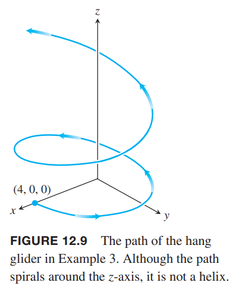
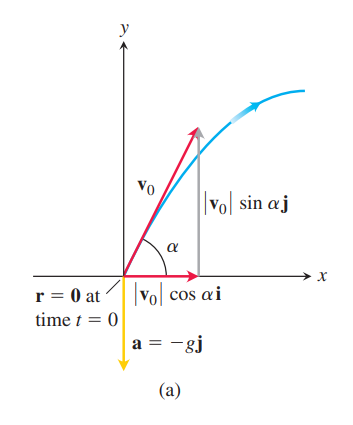

### 矢量函数的积分
如果矢量函数 $\boldsymbol{R}(t)$ 是 $t$ 的可导函数，且在区间 $I$ 上每一点都有 $d\boldsymbol{R}/dt=\boldsymbol{r}(t)$，那么 $\boldsymbol{R}$ 是 矢量函数 $\boldsymbol{r}$ 的反导数（`antiderivative`）。

如果 $\boldsymbol{R}_1(t)$ 和 $\boldsymbol{R}_2$ 的导数相同
$$\boldsymbol{R}_1'=\frac{dR_{1x}}{dt}\boldsymbol{i}+\frac{dR_{1y}}{dt}\boldsymbol{j}+\frac{dR_{1z}}{dt}\boldsymbol{k}=\boldsymbol{R}_2'=\frac{dR_{2x}}{dt}\boldsymbol{i}+\frac{dR_{2y}}{dt}\boldsymbol{j}+\frac{dR_{2z}}{dt}\boldsymbol{k}$$
根据 [4.2 小节](/010-Calculus/040-Applications-of-Derivatives/020-The-Mean-Value-Theorem.md)推论 2 有
$$R_{1x}-R_{2x}=C_{1x}$$
$$R_{1y}-R_{2y}=C_{1y}$$
$$R_{1z}-R_{2z}=C_{1z}$$
所以 $\boldsymbol{R}_1$ 与 $\boldsymbol{R}_2$ 之差是常矢量
$$\boldsymbol{R}_1-\boldsymbol{R}_2=\boldsymbol{C}$$
如果 $\boldsymbol{R}(t)$ 的导数是 $\boldsymbol{r}(t)$，即 $\boldsymbol{R}$ 是 $\boldsymbol{r}$ 的反导函数，如果任意一个矢量函数 $\boldsymbol{H}(t)$ 是 $\boldsymbol{r}$ 的反导数，由于 $\boldsymbol{H}$ 和 $\boldsymbol{R}$ 导数相同，所以
$$\boldsymbol{H}-\boldsymbol{R}=\boldsymbol{C}$$
因此 $\boldsymbol{R}+\boldsymbol{C}$ 是 $\boldsymbol{r}$ 的反导数，$\boldsymbol{C}$ 可以是任意常矢量。

$\boldsymbol{r}$ 在区间 $I$ 上的反导数的集合是其在 $I$ 上的不定积分（`indefinite integral`）。

**定义**
> $\boldsymbol{r}$ 相对 $t$ 的不定积分是 $\boldsymbol{r}$ 的反导数的集合，记作 $\int\boldsymbol{r}(t)dt$。如果 $\boldsymbol{R}$ 是 $\boldsymbol{r}$ 的反导数，那么
> $$\int\boldsymbol{r}(t)dt=\boldsymbol{R}(t)+\boldsymbol{C}$$

例1 为了求解矢量函数的积分，需要对各个分量做积分。
$$\int((\cos t)\boldsymbol{i}+\boldsymbol{j}-2t\boldsymbol{k})dt=(\sin t)\boldsymbol{i}+t\boldsymbol{j}-t^2\boldsymbol{k}$$

**定义**
> 如果 $\boldsymbol{r}(t)=f(t)\boldsymbol{i}+g(t)\boldsymbol{j}+h(t)\boldsymbol{k}$ 的各个分量在 $[a,b]$ 上可积，那么 $\boldsymbol{r}$ 在这个区间上也是可积的，$\boldsymbol{r}$ 从 $a$ 到 $b$ 的定积分（`definite integral`）是
> $$\int_a^b\boldsymbol{r}(t)dt=+(\int_a^bf(t)dt)\boldsymbol{i}+(\int_a^bg(t)dt)\boldsymbol{j}+(\int_a^bh(t))\boldsymbol{k}$$

例2 在例 1 的积分上加上下限
$$\begin{aligned}
\int_0^\pi((\cos t)\boldsymbol{i}+\boldsymbol{j}-2t\boldsymbol{k})dt&=(\sin t)|_0^\pi\boldsymbol{i}+t|_0^\pi\boldsymbol{j}-t^2|_0^\pi\boldsymbol{k}\\
&=\pi\boldsymbol{j}-\pi^2\boldsymbol{k}
\end{aligned}$$

连续矢量函数的微积分基本定理是
$$\int_a^b\boldsymbol{r}(t)dt=\boldsymbol{R}(t)\bigg|_a^b=\boldsymbol{R}(b)-\boldsymbol{R}(a)$$
其中 $\boldsymbol{R}$ 是 $\boldsymbol{r}$ 的任意导数，即 $\boldsymbol{R}'(t)=\boldsymbol{r}(t)$。

由标量函数的微积分基本定理，又因为矢量函数的微分和积分可以看作是各个分量进行微分或积分，所以
$$\frac{d}{dt}\int_a^t\boldsymbol{r}(\tau)d\tau=\boldsymbol{r}(t)$$
如果 $\boldsymbol{r}$ 的反导数存在，那么
$$\int_a^x\boldsymbol{r}dt=\boldsymbol{G}(x)$$
如果 $\boldsymbol{R}$ 是 $\boldsymbol{r}$ 的任意一个反导数，那么根据之前的结论
$$\boldsymbol{R}=\boldsymbol{G}+\boldsymbol{C}$$
那么
$$\begin{aligned}
\boldsymbol{R}(b)-\boldsymbol{R}(a)&=(\boldsymbol{G}(b)+\boldsymbol{C})-(\boldsymbol{G}(a)+\boldsymbol{C})\\
&=\boldsymbol{G}(b)-\boldsymbol{G}(a)\\
&=\int_a^b\boldsymbol{r}(t)dt-\int_a^a\boldsymbol{r}(t)dt\\
&=\int_a^b\boldsymbol{r}(t)dt
\end{aligned}$$

注意，矢量函数的反导数是矢量函数，而定积分是一个矢量。

例3 我们只知道滑翔翼的加速度矢量是 $\boldsymbol{a}(t)=-(3\cos t)\boldsymbol{i}-(3\sin t)\boldsymbol{j}+2\boldsymbol{k}$ 而不知道其运动轨迹。在 $t=0$ 时刻，滑翔翼从 $(4,0,0)$ 以速度 $\boldsymbol{v}(0)=3\boldsymbol{j}$ 滑出。求 $t$ 时刻滑翔翼的位置。

解：已知微分方程
$$\boldsymbol{a}=\frac{d^2\boldsymbol{r}}{dt^2}=-(3\cos t)\boldsymbol{i}-(3\sin t)\boldsymbol{j}+2\boldsymbol{k}$$
初始条件为
$$\boldsymbol{v}(0)=3\boldsymbol{j},\boldsymbol{r}(0)=4\boldsymbol{i}$$
求解 $\boldsymbol{r}(t)$。

对微分方程两边积分得到
$$\boldsymbol{v}(t)=-(3\sin t)\boldsymbol{i}+(3\cos t)\boldsymbol{j}+2t\boldsymbol{k}+\boldsymbol{C}_1$$
将 $\boldsymbol{v}(0)=3\boldsymbol{j}$ 求解 $\boldsymbol{C}_1$
$$\begin{aligned}
3\boldsymbol{j}&=-(3\sin 0)\boldsymbol{i}+(3\cos 0)\boldsymbol{j}+(0)\boldsymbol{k}+\boldsymbol{C}_1\\
3\boldsymbol{j}&=3\boldsymbol{j}+\boldsymbol{C}_1\\
\boldsymbol{C}_1&=\boldsymbol{0}
\end{aligned}$$
因此速度矢量方程是
$$\frac{d\boldsymbol{r}}{dt}=\boldsymbol{v}(t)=-(3\sin t)\boldsymbol{i}+(3\cos t)\boldsymbol{j}+2t\boldsymbol{k}$$
两边积分
$$\boldsymbol{r}(t)=(3\cos t)\boldsymbol{i}+(3\sin t)\boldsymbol{j}+t^2\boldsymbol{k}+\boldsymbol{C}_2$$
代入 $\boldsymbol{r}(0)=4\boldsymbol{i}$
$$\begin{aligned}
4\boldsymbol{i}&=(3\cos 0)\boldsymbol{i}+(3\sin 0)\boldsymbol{j}+(0)\boldsymbol{k}+\boldsymbol{C}_2\\
4\boldsymbol{i}&=3\boldsymbol{i}+\boldsymbol{C}_2\\
\boldsymbol{C}_2&=\boldsymbol{i}
\end{aligned}$$
因此位置矢量方程是
$$\boldsymbol{r}(t)=(1+3\cos t)\boldsymbol{i}+(3\sin t)\boldsymbol{j}+t^2\boldsymbol{k}$$
滑翔机飞行轨迹如下图所示。

### 抛射体运动的矢量和参数方程
一个经典例子是抛射体运动。这里，我们仅考虑重力作用于抛射体而没有其他力的作用，同时也忽略诸如地球转动等其他因素。对于大部分场景，这是一个合理的近似。

假定抛射体仅受到垂直地面的力，在一个垂直平面内运动。初始时 $t=0$，位于原点，初始速度是 $\boldsymbol{v}_0$，其与水平面之间的夹角是 $\alpha$。

因此，可以得到速度矢量方程
$$\boldsymbol{v}_0=(|\boldsymbol{v}_0|\cos\alpha)\boldsymbol{i}+(|\boldsymbol{v}_0|\sin\alpha)\boldsymbol{j}$$
如果使用 $v_0$ 表示 $|\boldsymbol{v}_0|$，那么
$$\boldsymbol{v}_0=(v_0\cos\alpha)\boldsymbol{i}+(v_0\sin\alpha)\boldsymbol{j}$$
初始位置矢量
$$\boldsymbol{r}_0=0\boldsymbol{i}+0\boldsymbol{j}=\boldsymbol{0}$$
根据牛顿力学第二定律，力等于质量 $m$ 乘以加速度 $d^2\boldsymbol{r}/dt^2$，其中 $\boldsymbol{r}$ 表示 $t$ 时刻的位置矢量。重力等于 $-mg\boldsymbol{j}$，因此
$$m\frac{d^2\boldsymbol{r}}{dt^2}=-mg\boldsymbol{j}$$
$$\frac{d^2\boldsymbol{r}}{dt^2}=-g\boldsymbol{j}$$
积分一次可以得到
$$\frac{d\boldsymbol{r}}{dt}=-(gt)\boldsymbol{j}+\boldsymbol{v}_0$$
再次积分得到
$$\boldsymbol{r}=-\frac{1}{2}gt^2\boldsymbol{j}+\boldsymbol{v}_0+\boldsymbol{r}_0$$
将初始值 $\boldsymbol{v}_0,\boldsymbol{r}_0$ 代入方程得到
$$\boldsymbol{r}=-\frac{1}{2}gt^2\boldsymbol{j}+(v_0\cos\alpha)t\boldsymbol{i}+(v_0\sin\alpha)t\boldsymbol{j}+\boldsymbol{0}$$

**理想抛射体运动方程**
> $$\boldsymbol{r}=(v_0\cos\alpha)t\boldsymbol{i}+((v_0\sin\alpha)t-\frac{1}{2}gt^2)\boldsymbol{j}$$
