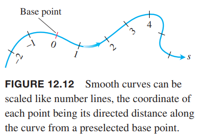
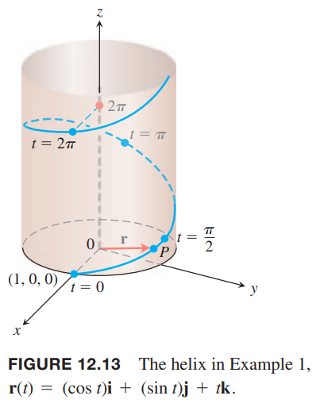
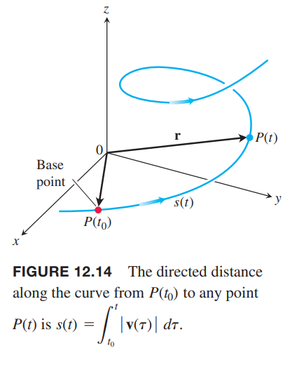
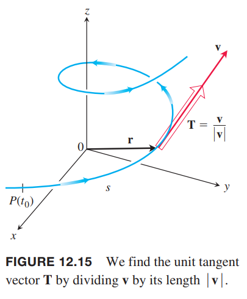
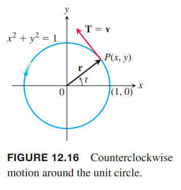

### 空间曲线的弧长
空间中光滑曲线与平面上的光滑曲线一样，可以测量其长度。那么曲线上任意一点，对于某个固定点（一般是原点）而言，我们可以给定一个有向长度 $s$，如下图所示。

为了计算光滑曲线的长度，我们只需要对平面上的曲线长度方程增加上 $z$ 项即可。

**定义**
> 光滑曲线 $\boldsymbol{r}(t)=x(t)\boldsymbol{i}+y(t)\boldsymbol{j}+z(t)\boldsymbol{k},a\leq t\leq b$ 的长度（`length`）是
> $$L=\int_a^b\sqrt{\bigg(\frac{dx}{dt}\bigg)^2+\bigg(\frac{dy}{dt}\bigg)^2+\bigg(\frac{dz}{dt}\bigg)^2}dt$$
> 随着 $t$ 的增加，在 $t=a$ 到 $t=b$ 上，曲线不往复。

上面式子根号的部分恰好是 $|\boldsymbol{v}|$，是速度矢量 $d\boldsymbol{r}/dt$ 的长度。因此长度公式简写为如下公式。

**弧长公式**
> $$L=\int_a^b|\boldsymbol{v}|dt$$

例1 一个滑翔翼盘旋上升，运动方程是 $\boldsymbol{r}(t)=(\cos t)\boldsymbol{i}+(\sin t)\boldsymbol{j}+t\boldsymbol{k}$。求其从 $t=0$ 到 $t=2\pi$ 运动了多远？

解：如下图所示。滑翔翼盘旋上升了一周。

$$\begin{aligned}
L&=\int_a^b|\boldsymbol{v}|dt\\
&=\int_0^{2\pi}\sqrt{(-\sin t)^2+(\cos t)^2+(1)^2}dt\\
&=\int_0^{2\pi}\sqrt{2}dt\\
&=2\pi\sqrt{2}
\end{aligned}$$

参数 $t$ 的曲线 $C$ 上选择一基准点 $P(t_0)$，每一个 $t$ 对应了一个点 $P(t)=(x(t),y(t))$，有向距离
$$s(t)=\int_{t_0}^t|\boldsymbol{v}(\tau)|d\tau$$
$P(t)$ 到基准点的距离。如下图所示。

这是弧长公式。如果 $t>t_0$，$s(t)$ 表示曲线从 $P(t_0)$ 到 $P(t)$ 的距离。如果 $t<t_0$，$s$ 是距离的负值。$s$ 的每个值决定了 $C$ 上的一点，这个参数化的 $C$ 对应了 $s$。称 $s$ 为弧长参数（`arc length parameter`）。随着 $t$ 的增加，这个参数值也在增加。

**基于点 $P(t_0)$ 的弧长参数**
> $$s(t)=\int_{t_0}^t\sqrt{[x'(\tau)]^2+[y'(\tau)]^2+z'(\tau)^2}d\tau=\int_{t_0}^t|\boldsymbol{v}(\tau)|d\tau\tag{3}$$

由于 $t$ 在公式 $(3)$ 中表示积分上限，所以使用希腊字母 $\tau$ 表示积分变量。

如果曲线 $\boldsymbol{r}(t)$ 是 $t$ 的函数，$s(t)$ 是公式 $(3)$ 的弧长参数，那么我们可以解出 $t$，即 $t=t(s)$，代入 $\boldsymbol{r}(t)$ 可以使用 $s$ 表示曲线 $\boldsymbol{r}(t(s))$。新的参数化方程使用表示曲线上一点距离基准点的长度作出参数。

例2 如果 $t_0=0$，沿着螺旋线
$$\boldsymbol{r}(t)=(\cos t)\boldsymbol{i}+(\sin t)\boldsymbol{j}+t\boldsymbol{k}$$
的弧长参数是
$$\begin{aligned}
s(t)&=\int_{t_0}^t|\boldsymbol{v}(\tau)|d\tau\\
&=\int_0^t\sqrt{2}d\tau\\
&=\sqrt{2}t
\end{aligned}$$
那么 $t=s/\sqrt{2}$，代入位置矢量 $\boldsymbol{r}$ 使用弧长参数表示的话是
$$\boldsymbol{r}(t(s))=(\cos\frac{s}{\sqrt{2}})\boldsymbol{i}+(\sin\frac{s}{\sqrt{2}})\boldsymbol{j}+\frac{s}{\sqrt{2}}\boldsymbol{k}$$

### 光滑曲线的速率
公式 $(3)$ 隐含着连续，曲线是光滑的。那么根据微积分基本定理 $s$ 是 $t$ 的可微函数
$$\frac{ds}{dt}=|\boldsymbol{v}(t)|\tag{4}$$
这个公式表明沿着曲线移动的粒子的速率是速度 $\boldsymbol{v}$ 的大小，这与之前的讨论一致。

尽管点 $P(t_0)$ 在公式 $(3)$ 中出现了，但是却在 $(4)$ 中消失了。这是因为速率与距离基准点的距离无关。

根据定义光滑曲线中 $|\boldsymbol{v}|$ 始终不为零，因此 $ds/dt>0$，这也印证了之前说的 $s$ 是 $t$ 的增函数。

### 单位切向量
我们已经知道速度 $\boldsymbol{v}=d\boldsymbol{r}/dt$ 与曲线 $\boldsymbol{r}$ 相切，那么矢量
$$\boldsymbol{T}=\frac{\boldsymbol{v}}{|\boldsymbol{v}|}$$
是与曲线相切的单位矢量，称为单位切向量（`unit tangent vector`），如下图所示。

当 $\boldsymbol{v}$ 是 $t$ 的可导函数，$\boldsymbol{T}$ 也是 $t$ 的可导函数。后面 12.5 小节会看到，$\boldsymbol{T}$ 是描述空间中运动的粒子的三个单位矢量之一。

例3 求曲线
$$\boldsymbol{r}(t)=(1+3\cos t)\boldsymbol{i}+(3\sin t)\boldsymbol{j}+t^2\boldsymbol{k}$$
的单位切向量。

解：由 $\boldsymbol{r}$ 可以得到
$$\boldsymbol{v}=\frac{d\boldsymbol{r}}{dt}=-(\cos t)\boldsymbol{i}+(3\cos t)\boldsymbol{j}+2t\boldsymbol{k}$$
那么
$$|\boldsymbol{v}|=\sqrt{9+4t^2}$$
因此
$$\boldsymbol{T}=\frac{\boldsymbol{v}}{|\boldsymbol{v}|}=-\frac{3\sin t}{\sqrt{9+4t^2}}\boldsymbol{i}+\frac{3\cos t}{\sqrt{9+4t^2}}\boldsymbol{j}+\frac{2t}{\sqrt{9+4t^2}}\boldsymbol{k}$$
对于单位圆的逆时针运动
$$\boldsymbol{r}(t)=(\cos t)\boldsymbol{i}+(\sin t)\boldsymbol{j}$$
其速度是
$$\boldsymbol{v}=(-\sin t)\boldsymbol{i}+(\cos t)\boldsymbol{j}$$
也是单位矢量，因此 $\boldsymbol{T}=\boldsymbol{v}$，其垂直于 $\boldsymbol{r}$。

$\boldsymbol{r}$ 随着 $t$ 在变化，那么速度也在变化，但是位置矢量相应于弧长是如何变化的呢？即 $d\boldsymbol{r}/ds$？由于 $ds/dt>0$，$s$ 还是一对一函数，且是 $t$ 的可导函数，所以可逆。反函数的导数
$$\frac{dt}{ds}=\frac{1}{ds/dt}=\frac{1}{|\boldsymbol{v}|}$$
$\boldsymbol{r}$ 是 $s$ 的可导函数，根据链式法则
$$\frac{d\boldsymbol{r}}{ds}=\frac{d\boldsymbol{r}}{dt}\frac{dt}{ds}=|\boldsymbol{v}|\frac{1}{|\boldsymbol{v}|}=\boldsymbol{T}$$
所以 $d\boldsymbol{r}/ds$ 是速度矢量 $\boldsymbol{v}$ 方向上的单位切向量。
