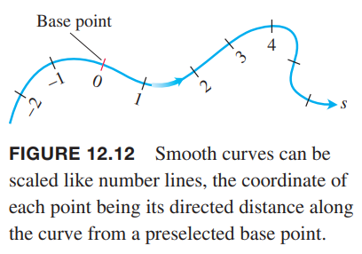
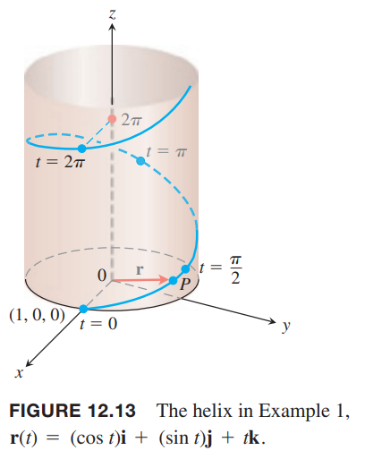

### 空间曲线的弧长
空间中光滑曲线与平面上的光滑曲线一样，可以测量其长度。那么曲线上任意一点，对于某个固定点（一般是原点）而言，我们可以给定一个有向长度 $s$，如下图所示。

为了计算光滑曲线的长度，我们只需要对平面上的曲线长度方程增加上 $z$ 项即可。

**定义**
> 光滑曲线 $\boldsymbol{r}(t)=x(t)\boldsymbol{i}+y(t)\boldsymbol{j}+z(t)\boldsymbol{k},a\leq t\leq b$ 的长度（`length`）是
> $$L=\int_a^b\sqrt{\bigg(\frac{dx}{dt}\bigg)^2+\bigg(\frac{dy}{dt}\bigg)^2+\bigg(\frac{dz}{dt}\bigg)^2}dt$$
> 随着 $t$ 的增加，在 $t=a$ 到 $t=b$ 上，曲线不往复。

上面式子根号的部分恰好是 $|\boldsymbol{v}|$，是速度矢量 $d\boldsymbol{r}/dt$ 的长度。因此长度公式简写为如下公式。

**弧长公式**
> $$L=\int_a^b|\boldsymbol{v}|dt$$

例1 一个滑翔翼盘旋上升，运动方程是 $\boldsymbol{r}(t)=(\cos t)\boldsymbol{i}+(\sin t)\boldsymbol{j}+t\boldsymbol{k}$。求其从 $t=0$ 到 $t=2\pi$ 运动了多远？

解：如下图所示。滑翔翼盘旋上升了一周。

$$\begin{aligned}
L&=\int_a^b|\boldsymbol{v}|dt\\
&=\int_0^{2\pi}\sqrt{(-\sin t)^2+(\cos t)^2+(1)^2}dt\\
&=\int_0^{2\pi}\sqrt{2}dt\\
&=2\pi\sqrt{2}
\end{aligned}$$
