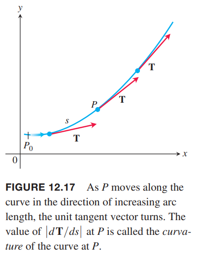
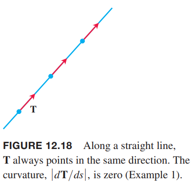

### 曲线的曲率
一个粒子沿着平面的光滑曲线运动。随着曲线的弯曲，$\boldsymbol{T}=d\boldsymbol{r}/ds$ 随之变化。因为 $\boldsymbol{T}$ 是单位矢量，长度不变，随着曲线的变化只有方向在变化。每运动单位长度，$\boldsymbol{T}$ 的变化率称为曲率（`curvature`），使用希腊字母 $\kappa$ 表示。

**定义**
> 如果 $\boldsymbol{T}$ 是光滑曲线的单位速度矢量，那么曲率方程是
> $$\kappa=\bigg|\frac{d\boldsymbol{T}}{ds}\bigg|$$

如果 $|d\boldsymbol{T}/ds|$ 很大，在点 $P$ 时 $\boldsymbol{T}$ 转弯比较急，曲率大，如果 $|d\boldsymbol{T}/ds|$ 接近于零，$\boldsymbol{T}$ 在 $P$ 点转弯比较慢，曲率小。

如果 $\boldsymbol{r}(t)$ 是曲线方程，$s$ 是弧长参数，那么可以如下计算曲率
$$\begin{aligned}
\kappa&=\bigg|\frac{d\boldsymbol{T}}{ds}\bigg|\\
&=\bigg|\frac{d\boldsymbol{T}}{dt}\frac{dt}{ds}\bigg|\\
&=\frac{1}{|ds/dt|}\bigg|\frac{d\boldsymbol{T}}{dt}\bigg|\\
&=\frac{1}{|\boldsymbol{v}|}\bigg|\frac{d\boldsymbol{T}}{dt}\bigg|
\end{aligned}$$

**曲率计算公式**
> 如果 $\boldsymbol{r}(t)$ 是光滑曲线，那么曲率是标量函数
> $$\kappa=\frac{1}{|\boldsymbol{v}|}\bigg|\frac{d\boldsymbol{T}}{dt}\bigg|\tag{1}$$
> 其中 $\boldsymbol{T}=\boldsymbol{v}/|\boldsymbol{v}|$ 是单位切矢量。

例1 直线的参数方程是 $\boldsymbol{r}(t)=\boldsymbol{C}+t\boldsymbol{v}$，其中 $\boldsymbol{C},\boldsymbol{v}$ 是常矢量。因此 $\boldsymbol{r}'(t)=\boldsymbol{v}$，单位切矢量 $\boldsymbol{T}=\boldsymbol{v}/|\boldsymbol{v}|$ 是常矢量，总是指向相同的方向，如下图所示。对于任意时刻 $t$，直线的曲率是零
$$\kappa=\frac{1}{|\boldsymbol{v}|}\bigg|\frac{d\boldsymbol{T}}{dt}\bigg|=\frac{1}{|\boldsymbol{v}|}|\boldsymbol{0}|=0$$

