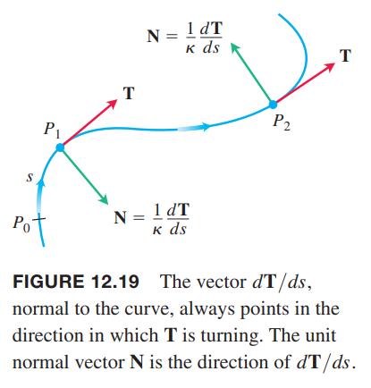

### 曲线的曲率
一个粒子沿着平面的光滑曲线运动。随着曲线的弯曲，$\boldsymbol{T}=d\boldsymbol{r}/ds$ 随之变化。因为 $\boldsymbol{T}$ 是单位矢量，长度不变，随着曲线的变化只有方向在变化。每运动单位长度，$\boldsymbol{T}$ 的变化率称为曲率（`curvature`），使用希腊字母 $\kappa$ 表示。

**定义**
> 如果 $\boldsymbol{T}$ 是光滑曲线的单位速度矢量，那么曲率方程是
> $$\kappa=\bigg|\frac{d\boldsymbol{T}}{ds}\bigg|$$

如果 $|d\boldsymbol{T}/ds|$ 很大，在点 $P$ 时 $\boldsymbol{T}$ 转弯比较急，曲率大，如果 $|d\boldsymbol{T}/ds|$ 接近于零，$\boldsymbol{T}$ 在 $P$ 点转弯比较慢，曲率小。

如果 $\boldsymbol{r}(t)$ 是曲线方程，$s$ 是弧长参数，那么可以如下计算曲率
$$\begin{aligned}
\kappa&=\bigg|\frac{d\boldsymbol{T}}{ds}\bigg|\\
&=\bigg|\frac{d\boldsymbol{T}}{dt}\frac{dt}{ds}\bigg|\\
&=\frac{1}{|ds/dt|}\bigg|\frac{d\boldsymbol{T}}{dt}\bigg|\\
&=\frac{1}{|\boldsymbol{v}|}\bigg|\frac{d\boldsymbol{T}}{dt}\bigg|
\end{aligned}$$

**曲率计算公式**
> 如果 $\boldsymbol{r}(t)$ 是光滑曲线，那么曲率是标量函数
> $$\kappa=\frac{1}{|\boldsymbol{v}|}\bigg|\frac{d\boldsymbol{T}}{dt}\bigg|\tag{1}$$
> 其中 $\boldsymbol{T}=\boldsymbol{v}/|\boldsymbol{v}|$ 是单位切矢量。

例1 直线的参数方程是 $\boldsymbol{r}(t)=\boldsymbol{C}+t\boldsymbol{v}$，其中 $\boldsymbol{C},\boldsymbol{v}$ 是常矢量。因此 $\boldsymbol{r}'(t)=\boldsymbol{v}$，单位切矢量 $\boldsymbol{T}=\boldsymbol{v}/|\boldsymbol{v}|$ 是常矢量，总是指向相同的方向，如下图所示。对于任意时刻 $t$，直线的曲率是零
$$\kappa=\frac{1}{|\boldsymbol{v}|}\bigg|\frac{d\boldsymbol{T}}{dt}\bigg|=\frac{1}{|\boldsymbol{v}|}|\boldsymbol{0}|=0$$

例2 求圆的曲率。半径为 $a$ 的参数方程是
$$\boldsymbol{r}(t)=(a\cos t)\boldsymbol{i}+(a\sin t)\boldsymbol{j}$$
那么
$$\boldsymbol{v}=\frac{d\boldsymbol{r}}{ds}=-(a\sin t)\boldsymbol{i}+(a\cos t)\boldsymbol{j}$$
$$|\boldsymbol{v}|=\sqrt{(-a\sin t)^2+(a\cos t)^2}=a$$
那么
$$\begin{aligned}
\boldsymbol{T}&=\frac{\boldsymbol{v}}{|\boldsymbol{v}|}=-(\sin t)\boldsymbol{i}+(\cos t)\boldsymbol{j}\\
\frac{d\boldsymbol{T}}{dt}&=-(\cos t)\boldsymbol{i}-(\sin t)\boldsymbol{j}\\
\bigg|\frac{d\boldsymbol{T}}{dt}\bigg|&=\sqrt{(\cos t)^2+(\sin t)^2}=1
\end{aligned}$$
因此，对于任意 $t$ 时刻，圆的曲率是
$$\kappa=\frac{1}{|\boldsymbol{v}|}\bigg|\frac{d\boldsymbol{T}}{dt}\bigg|=\frac{1}{a}$$

在所有与单位切矢量 $\boldsymbol{T}$ 垂直的矢量中，有一个比较特殊，它指向曲线弯曲的方向。由于 $\boldsymbol{T}$ 长度不变，那么 $d\boldsymbol{T}/ds$ 与 $\boldsymbol{T}$ 垂直（参见 [12.1](./010-Curves-in-Space-and-Their-Tangents.md) 中关于固定长度的矢量函数）。因此，用 $d\boldsymbol{T}/ds$ 除以长度 $\kappa$，得到与 $\boldsymbol{T}$ 垂直的单位矢量 $\boldsymbol{N}$。

**定义**
> 在 $\kappa\neq 0$ 点处，平面上的曲线的主单位法矢量（`principal unit normal vector`）
> $$\boldsymbol{N}=\frac{1}{\kappa}\frac{d\boldsymbol{T}}{ds}$$

矢量 $d\boldsymbol{T}/ds$ 指向 $\boldsymbol{T}$ 变化的方向。如果 $\boldsymbol{T}$ 顺时针变化，$d\boldsymbol{T}/ds$ 指向右侧，反之 $\boldsymbol{T}$ 逆时针转向，$d\boldsymbol{T}/ds$ 指向左侧。综上，主单位法矢量 $\boldsymbol{N}$ 指向曲线凹处。

如果光滑曲线参数方程是 $\boldsymbol{r}(t)$，弧长参数 $s$，使用链式法则计算 $\boldsymbol{N}$：
$$\begin{aligned}
\boldsymbol{N}&=\frac{d\boldsymbol{T}/ds}{|d\boldsymbol{T}/ds|}\\
&=\frac{(d\boldsymbol{T}/dt)(dt/ds)}{|d\boldsymbol{T}/dt||dt/ds|}\\
&=\frac{d\boldsymbol{T}/dt}{|d\boldsymbol{T}/dt|}
\end{aligned}$$
最后一步的原因是 $dt/ds=1/(ds/dt)>0$。

这个公式使得我们无需先计算 $\kappa$ 和 $s$ 就能找到 $\boldsymbol{N}$。

**计算 $N$ 的公式**
> 如果 $\boldsymbol{r}(t)$ 是光滑曲线，那么主单位法矢量是
> $$\boldsymbol{N}=\frac{d\boldsymbol{T}/dt}{|d\boldsymbol{T}/dt|}\tag{2}$$
> 其中 $\boldsymbol{T}=\boldsymbol{v}/|\boldsymbol{v}|$ 是单位切矢量。

例3 求圆周运动
$$\boldsymbol{r}(t)=(\cos 2t)\boldsymbol{i}+(\sin 2t)\boldsymbol{j}$$
的 $\boldsymbol{T},\boldsymbol{N}$。

解：首先求 $\boldsymbol{T}$
$$\begin{aligned}
\boldsymbol{v}&=-(2\sin 2t)\boldsymbol{i}+(2\cos 2t)\boldsymbol{j}\\
|\boldsymbol{v}|&=\sqrt{(2\sin 2t)^2+(2\cos 2t)^2}=2\\
\boldsymbol{T}&=\frac{\boldsymbol{v}}{|\boldsymbol{v}|}=-(\sin 2t)\boldsymbol{i}+(\cos 2t)\boldsymbol{j}
\end{aligned}$$
接着计算 $\boldsymbol{N}$
$$\begin{aligned}
\frac{d\boldsymbol{T}}{dt}&=-(2\cos 2t)\boldsymbol{i}-(2\sin 2t)\boldsymbol{j}\\
\bigg|\frac{d\boldsymbol{T}}{dt}\bigg|&=\sqrt{(2\cos 2t)^2+(2\sin 2t)^2}=2\\
\boldsymbol{N}&=\frac{d\boldsymbol{T}/dt}{|d\boldsymbol{T}/dt}|=-(\cos 2t)\boldsymbol{i}-(\sin 2t)\boldsymbol{j}
\end{aligned}$$
显然，$\boldsymbol{T}\cdot\boldsymbol{N}=0$，验证了两者是正交的。另外还可以注意到，$\boldsymbol{N}$ 始终指向圆周运动 $\boldsymbol{r}(t)$ 的圆心。

### 平面曲线的曲率圆
曲线的一点 $P$，此处 $\kappa\neq 0$，那么曲率圆（`circle of curvature`）或密切圆（`osculating circle`）满足

1. 在点 $P$ 处与曲线相切
2. 在点 $P$ 处的曲率与曲线一致
3. 圆心位于曲线凹的方向

点 $P$ 处的曲率半径（`radius of curvature`）是密切圆的半径，根据之前的推导半径是
$$\rho=\frac{1}{\kappa}$$
曲线在点 $P$ 处的曲率中心（`center of curvature`）是曲率圆的圆心。

例4 求抛物线 $y=x^2$ 在原点处的密切圆。

解：令 $t=x$ 得到参数方程
$$\boldsymbol{r}(t)=t\boldsymbol{i}+t^2\boldsymbol{j}$$
使用公式 $(1)$，需要先计算单位切矢量 $\boldsymbol{T}$。
$$\boldsymbol{v}=\frac{d\boldsymbol{r}}{dt}=\boldsymbol{i}+2t\boldsymbol{j}$$
$$|\boldsymbol{v}|=\sqrt{1+4t^2}$$
那么
$$\boldsymbol{T}=\frac{\boldsymbol{v}}{|\boldsymbol{v}|}=\frac{1}{\sqrt{1+4t^2}}\boldsymbol{i}+\frac{2t}{\sqrt{1+4t^2}}\boldsymbol{j}$$
求导
$$\frac{d\boldsymbol{T}}{dt}=-\frac{4t}{(\sqrt{1+4t^2})^3}\boldsymbol{i}+[\frac{2}{\sqrt{1+4t^2}}-\frac{8t^2}{(\sqrt{1+4t^2})^3}]\boldsymbol{j}$$
因此
$$\kappa=\frac{1}{|\boldsymbol{v}(0)|}\bigg|\frac{d\boldsymbol{T}(0)}{dt}\bigg|=|2\boldsymbol{j}|=2$$
因此曲率半径是 $1/\kappa=1/2$。在原点处 $t=0$，$\boldsymbol{T}=\boldsymbol{i}$，所以 $\boldsymbol{N}=\boldsymbol{j}$，与 $y$ 轴同方向。因此圆心是 $(0,1/2)$。密切圆方程是
$$x^2+(y-\frac{1}{2})^2=(\frac{1}{2})^2$$

密切圆如上图所示。在原点附近，密切圆是比原点处的切线 $y=0$ 更好的近似。

### 空间中的曲率和法矢量
上述所有的推导带上第三项 $z$，或者说是 $\boldsymbol{k}$ 分量依旧成立。因此，空间中曲率的定义是
$$\kappa=\bigg|\frac{d\boldsymbol{T}}{ds}\bigg|=\frac{1}{|\boldsymbol{v}|}\bigg|\frac{d\boldsymbol{T}}{dt}\bigg|\tag{3}$$
矢量 $d\boldsymbol{T}/ds$ 与 $\boldsymbol{T}$ 正交。主单位法矢量定义是
$$\boldsymbol{N}=\frac{1}{\kappa}\frac{d\boldsymbol{T}}{ds}=\frac{d\boldsymbol{T}/dt}{|d\boldsymbol{T}/dt|}\tag{4}$$

例5 求螺旋线
$$\boldsymbol{r}(t)=(a\cos t)\boldsymbol{i}+(a\sin t)\boldsymbol{j}+bt\boldsymbol{k},a,b\geq 0,a^2+b^2\neq 0$$
的曲率。

解：从速度矢量 $\boldsymbol{v}$ 求得 $\boldsymbol{T}$。
$$\begin{aligned}
\boldsymbol{v}&=-(a\sin t)\boldsymbol{i}+(a\cos t)\boldsymbol{j}+b\boldsymbol{k}\\
|\boldsymbol{v}|&=\sqrt{a^2\sin^2 t+a^2\cos^2 t+b^2}=\sqrt{a^2+b^2}\\
\boldsymbol{T}&=\frac{\boldsymbol{v}}{|\boldsymbol{v}|}=\frac{1}{\sqrt{a^2+b^2}}[-(a\sin t)\boldsymbol{i}+(a\cos t)\boldsymbol{j}+b\boldsymbol{k}]
\end{aligned}$$
使用公式 $(3)$
$$\begin{aligned}
\kappa&=\frac{1}{|\boldsymbol{v}|}\bigg|\frac{d\boldsymbol{T}}{dt}\bigg|\\
&=\frac{1}{\sqrt{a^2+b^2}}\bigg|\frac{1}{\sqrt{a^2+b^2}}[-(a\cos t)\boldsymbol{i}-(a\sin t)\boldsymbol{j}]\bigg|\\
&=\frac{a}{a^2+b^2}|-(\cos t)\boldsymbol{i}-(\sin t)\boldsymbol{j}|\\
&=\frac{a}{a^2+b^2}
\end{aligned}$$
如果 $a$ 固定，随着 $b$ 的增长曲率在减小；固定 $b$，随着 $a$ 的减小，曲率也减小。

如果 $b=0$，螺旋线退化成圆，曲率是 $1/a$，圆的半径是 $a$，符合预期。如果 $a=0$，螺旋线退化成了 $z$ 轴，曲率为零，也符合预期。

例6 求上个例子中螺旋线的 $N$。

解：根据上个例子有
$$\frac{d\boldsymbol{T}}{dt}=-\frac{1}{\sqrt{a^2+b^2}}[(a\cos t)\boldsymbol{i}+(a\sin t)\boldsymbol{j}]$$
那么
$$\bigg|\frac{d\boldsymbol{T}}{dt}\bigg|=\frac{1}{\sqrt{a^2+b^2}}\sqrt{a^2}=\frac{a}{\sqrt{a^2+b^2}}$$
所以
$$\begin{aligned}
\boldsymbol{N}&=\frac{d\boldsymbol{T}/dt}{|d\boldsymbol{T}/dt|}\\
&=-\frac{\sqrt{a^2+b^2}}{a}\frac{1}{\sqrt{a^2+b^2}}[(a\cos t)\boldsymbol{i}+(a\sin t)\boldsymbol{j}]\\
&=-(\cos t)\boldsymbol{i}-(\sin t)\boldsymbol{j}
\end{aligned}$$
因此，$\boldsymbol{N}$ 平行于 $xy$ 平面，且始终指向 $z$ 轴。
