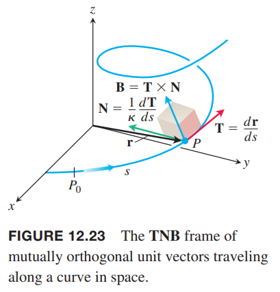
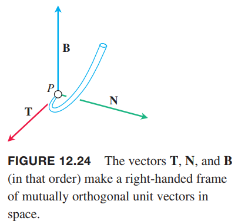
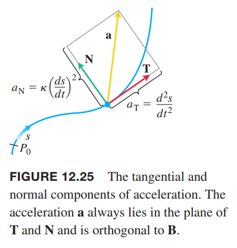
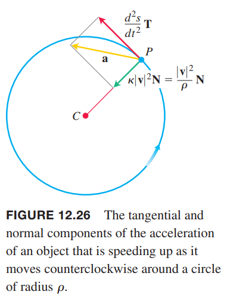
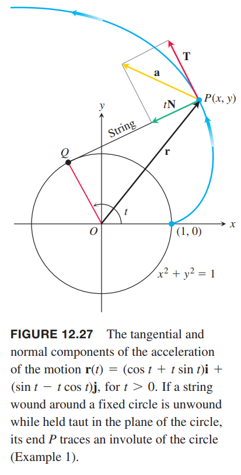
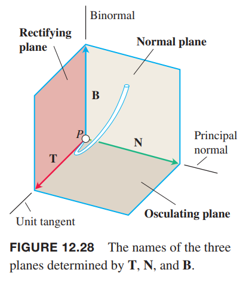
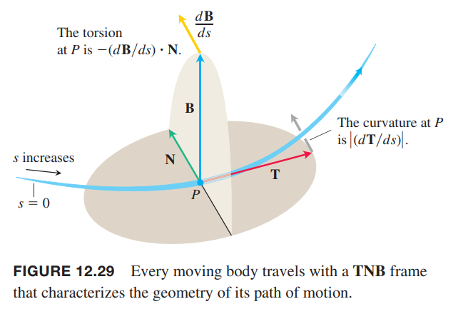

描述一个粒子的运动，笛卡尔坐标系的三个轴不重要，重要的是运动的方向（单位切矢量 $\boldsymbol{T}$），转弯的方向（单位法矢量 $\boldsymbol{N}$）和弯曲出这个平面的趋势，最后一个由垂直于平面的矢量 $\boldsymbol{B}$ 表示，是单位次法线矢量（`unit binormal vector`），定义是 $\boldsymbol{B}=\boldsymbol{T}\times\boldsymbol{N}$。如下图所示。这三个矢量是一种更自然的方式来表达运动。

### TNB 标架
空间中一个曲线的次法线矢量（`binormal vector`）是 $\boldsymbol{B}=\boldsymbol{T}\times\boldsymbol{N}$，是正交于 $\boldsymbol{T},\boldsymbol{N}$ 的单位矢量。这三个矢量定义了一个右手矢量框架，这个框架在描述运动路径问题中扮演者重要角色。称为弗勒内标架（`Frenet frame`）或 TNB 标架。

### 加速度的切向分量和法向分量
我们经常需要知道运动方向上的加速度是多少，即在 $\boldsymbol{T}$ 方向上的大小。由链式法则可以重写 $\boldsymbol{v}$ 为
$$\boldsymbol{v}=\frac{d\boldsymbol{r}}{dt}=\frac{d\boldsymbol{r}}{ds}\frac{ds}{dt}=\boldsymbol{T}\frac{ds}{dt}$$
两边微分得到加速度方程
$$\begin{aligned}
\boldsymbol{a}&=\frac{d\boldsymbol{v}}{dt}\\
&=\frac{d}{dt}(\boldsymbol{T}\frac{ds}{dt})\\
&=\frac{d^2s}{dt^2}\boldsymbol{T}+\frac{ds}{dt}\frac{d\boldsymbol{T}}{dt}\\
&=\frac{d^2s}{dt^2}\boldsymbol{T}+\frac{ds}{dt}(\frac{d\boldsymbol{T}}{ds}\frac{ds}{dt})\\
&=\frac{d^2s}{dt^2}\boldsymbol{T}+\frac{ds}{dt}(\kappa\boldsymbol{N}\frac{ds}{dt})\\
&=\frac{d^2s}{dt^2}\boldsymbol{T}+\kappa(\frac{ds}{dt})^2\boldsymbol{N}
\end{aligned}$$

**定义**
> 如果加速度矢量写作
> $$\boldsymbol{a}=a_T\boldsymbol{T}+a_N\boldsymbol{N}\tag{1}$$
> 那么
> $$a_T=\frac{d^2s}{dt^2}=\frac{d}{dt}|\boldsymbol{v}|,a_N=\kappa(\frac{ds}{dt})^2=\kappa|\boldsymbol{v}|^2\tag{2}$$
> 是加速度的切向分量和法向分量

注意，次法线矢量 $\boldsymbol{B}$ 并不在公式 $(1)$ 中，这是因为加速度 $\boldsymbol{a}$ 始终在 $\boldsymbol{T},\boldsymbol{N}$ 平面内，与 $\boldsymbol{B}$ 正交。公式还告诉我们切向方向的加速度大小是 $\frac{d^2s}{dt^2}$ 法线方向的加速度大小是 $\kappa(\frac{ds}{dt})^2$，如下图所示。

一般来说，速度 $\boldsymbol{v}$ 的变化率是加速度 $\boldsymbol{a}$，改变速度的大小和方向。切向分量 $a_T$ 表示速度的大小的变化率，法向分量 $a_N$ 表示速度方向的变化率。

注意，法向分量是曲率乘以速度的大小的平方。这就是为什么当车高速（速率 $\boldsymbol{v}$ 比较大 ）急转弯（曲率 $\kappa$ 比较大）的时候需要抓紧了。如果速率增加一倍，那么体验到的曲率方向的加速度大四倍。

如果物体沿着圆匀速运动，$d^2s/dt^2$ 是零，加速度沿着 $\boldsymbol{N}$ 指向圆心。如果物体的加速或者减速，$\boldsymbol{a}$ 会有非零的切向分量。

我们通常使用 $a_N=\sqrt{|\boldsymbol{a}|^2-a_T^2}$，这个式子是解方程 $|\boldsymbol{a}|^2=\boldsymbol{a}\cdot\boldsymbol{a}=a_T^2+a_N^2$。有了这个公式，我们可以不需要先求解 $\kappa$ 就得到 $a_N$。

**加速度法线方向计算公式**
> $$a_N=\sqrt{|\boldsymbol{a}|^2-a_T^2}\tag{3}$$

例1 不求解 $\boldsymbol{T},\boldsymbol{N}$，将运动
$$\boldsymbol{r}(t)=(\cos t+t\sin t)\boldsymbol{i}+(\sin t-t\cos t)\boldsymbol{j},t>0$$
的加速度写为 $\boldsymbol{a}=a_T\boldsymbol{T}+a_N\boldsymbol{N}$ 的形式。

解：使用公式 $(2)$ 计算 $a_T$
$$\begin{aligned}
\boldsymbol{v}&=\frac{d\boldsymbol{r}}{dt}\\
&=-(\sin t+\sin t+t\cos t)\boldsymbol{i}+(\cos t-\cos t+t\sin t)\boldsymbol{j}\\
&=(t\cos t)\boldsymbol{i}+(t\sin t)\boldsymbol{j}\\
|\boldsymbol{v}|&=t\\
a_T&=\frac{d}{dt}|\boldsymbol{v}|=\frac{d}{dt}t=1
\end{aligned}$$
知道了 $a_T$，使用公式 $(3)$ 可以得到 $a_N$
$$\begin{aligned}
\boldsymbol{a}&=(\cos t-t\sin t)\boldsymbol{i}+(\sin t+t\cos t)\boldsymbol{j}\\
|\boldsymbol{a}|^2&=t^2+1\\
a_N&=\sqrt{|\boldsymbol{a}|^2-a_T^2}\\
&=\sqrt{(t^2+1)-1}\\
&=t
\end{aligned}$$
因此
$$\boldsymbol{a}=a_T\boldsymbol{T}+a_N\boldsymbol{N}=\boldsymbol{T}+t\boldsymbol{N}$$

### 扭转
利用叉积的微分公式可以得到
$$\frac{d\boldsymbol{B}}{ds}=\frac{d(\boldsymbol{T}\times\boldsymbol{N})}{ds}=\frac{d\boldsymbol{T}}{ds}\times\boldsymbol{T}+\boldsymbol{T}\times\frac{d\boldsymbol{N}}{ds}$$
由于 $\boldsymbol{N}$ 的方向与 $d\boldsymbol{T}/ds$ 一致，因此 $(d\boldsymbol{T}/ds)\times\boldsymbol{N}=\boldsymbol{0}$，那么
$$\frac{d\boldsymbol{B}}{ds}=\boldsymbol{T}\times\frac{d\boldsymbol{N}}{ds}$$
从这里可以看出，$d\boldsymbol{B}/ds$ 与 $\boldsymbol{T}$ 正交，原因是叉积与任意一个因数正交。

因为 $\boldsymbol{B}$ 长度为常量，那么 $d\boldsymbol{B}/ds$ 与 $\boldsymbol{B}$ 正交，因此 $d\boldsymbol{B}/ds$ 正交与 $\boldsymbol{B},\boldsymbol{T}$ 决定的平面。也就是说 $d\boldsymbol{B}/ds$ 与 $\boldsymbol{N}$ 平行，那么 $d\boldsymbol{B}/ds$ 是 $\boldsymbol{N}$ 的标量倍。
$$\frac{d\boldsymbol{B}}{ds}=-\tau\boldsymbol{N}$$
公式的负号是惯例。标量 $\tau$ 是扭矩。注意
$$\frac{d\boldsymbol{B}}{ds}\cdot\boldsymbol{N}=-\tau\boldsymbol{N}\cdot\boldsymbol{N}=-\tau$$

**定义**
> 令 $\boldsymbol{B}=\boldsymbol{T}\times\boldsymbol{N}$。光滑曲线的扭矩函数是
> $$\tau=-\frac{d\boldsymbol{B}}{ds}\cdot\boldsymbol{N}\tag{4}$$

与曲率 $\kappa$ 永远不会为负不同，扭矩 $\tau$ 可能是正值、负值与零。

由 $\boldsymbol{T},\boldsymbol{N},\boldsymbol{B}$ 确定的三个平面如下图所示。

曲率 $\kappa=|d\boldsymbol{T}/ds|$ 可以认为是 $P$ 点沿着曲线运动时发平面转动的变化率。扭矩 $\tau=-(d\boldsymbol{B}/ds)\cdot\boldsymbol{N}$ 可以看作是 $P$ 沿着曲线运动时密切平面绕 $\boldsymbol{T}$ 转动的速率。扭矩测量的是曲线扭曲的程度。

如下图所示。如果 $P$ 是沿着曲线向上的或者轨道，每前进单位长度，前灯从一侧到另一侧的速率就是曲率。发动机扭转出 $\boldsymbol{T},\boldsymbol{N}$ 确定的平面的变化率就是扭矩。能够证明，一个曲线具有非零的曲率和非零扭矩，等价于这个曲线是螺旋线。

### 计算曲率和扭矩的公式
下面给出更简便的公式计算曲率和扭矩。从公式 $(1),(2)$ 可以得到
$$\begin{aligned}
\boldsymbol{v}\times\boldsymbol{a}&=(\frac{ds}{dt}\boldsymbol{T})\times[\frac{d^2s}{dt^2}\boldsymbol{T}+\kappa(\frac{ds}{dt})^2\boldsymbol{N}]&&\boldsymbol{v}=d\boldsymbol{r}/dt=(d\boldsymbol{r}/ds)(ds/dt)=(ds/dt)\boldsymbol{T}\\
&=(\frac{ds}{dt}\frac{d^2s}{dt^2})(\boldsymbol{T}\times\boldsymbol{T})+\kappa(\frac{ds}{dt})^3(\boldsymbol{T}\times\boldsymbol{N})\\
&=\kappa(\frac{ds}{dt})\boldsymbol{B}&&\boldsymbol{T}\times\boldsymbol{T}=\boldsymbol{0},\boldsymbol{B}=\boldsymbol{T}\times\boldsymbol{N}
\end{aligned}$$
因此
$$|\boldsymbol{v}\times\boldsymbol{a}|=\kappa|\frac{ds}{dt}|^3|\boldsymbol{B}|=\kappa|\boldsymbol{v}|^3$$
由此可以得到 $\kappa$ 的公式。

**曲率的矢量公式**
> $$\kappa=\frac{|\boldsymbol{v}\times\boldsymbol{a}|}{|\boldsymbol{v}|^3}\tag{5}$$

公式 $(5)$ 利用速度和加速度计算曲线的几何意义——曲率，前提是 $|\boldsymbol{v}|$ 不为零。整个计算好像与参数曲线无关。

下面是扭矩计算公式，推导需要更高阶的知识，这里给出行列式形式。

**扭矩公式**
> $$\tau=\frac{\begin{pmatrix}
> \dot{x}&\dot{y}&\dot{z}\\
> \ddot{x}&\ddot{y}&\ddot{z}\\
> \dddot{x}&\dddot{y}&\dddot{z}
> \end{pmatrix}}{|\boldsymbol{v}\times\boldsymbol{a}|^2},\boldsymbol{v}\times\boldsymbol{a}\neq\boldsymbol{0}\tag{6}$$

这个公式使用 $\boldsymbol{r}$ 的三个分量 $x=f(t),y=g(t),z=h(t)$ 的导数计算扭矩。行列式的第一行来自速度 $\boldsymbol{v}$，第二行来自加速度 $\boldsymbol{a}$，第三行来自 $\dot{\boldsymbol{a}}=d\boldsymbol{a}/dt$。这个公式通常使用牛顿记号。

例2 使用公式 $(5),(6)$ 计算螺旋线
$$\boldsymbol{r}(t)=(a\cos t)\boldsymbol{i}+(a\sin t)\boldsymbol{j}+bt\boldsymbol{k},a,b\geq 0,a^2+b^2\neq 0$$
的曲率 $\kappa$ 和扭矩 $\tau$。

解：使用公式 $(5)$ 计算曲率。
$$\begin{aligned}
\boldsymbol{v}&=-(a\sin t)\boldsymbol{i}+(a\cos t)\boldsymbol{j}+b\boldsymbol{k}\\
\boldsymbol{a}&=-(a\cos t)\boldsymbol{i}-(a\sin t)\boldsymbol{j}\\
\boldsymbol{v}\times\boldsymbol{a}&=\begin{pmatrix}
\boldsymbol{i}&\boldsymbol{j}&\boldsymbol{k}\\
-a\sin t&a\cos t&b\\
-a\cos t&-a\sin t&0
\end{pmatrix}\\
&=(ab\sin t)\boldsymbol{i}-(ab\cos t)\boldsymbol{j}+a^2\boldsymbol{k}\\
\kappa&=\frac{|\boldsymbol{v}\times\boldsymbol{a}|}{|\boldsymbol{v}|^3}\\
&=\frac{\sqrt{a^2b^2+a^4}}{(a^2+b^2)^{3/2}}\\
&=\frac{a\sqrt{a^2+b^2}}{\sqrt{a^2+b^2}^3}\\
&=\frac{a}{a^2+b^2}
\end{aligned}$$
上面 $\kappa$ 的计算结果与 [12.4](./040-Curvature-and-Normal-Vectors-of-a-Curve.md) 的例 5 中直接计算曲率的结果一致。

使用 $(6)$ 计算扭矩。我们还差 $\boldsymbol{a}$ 的导数。
$$\dot{\boldsymbol{a}}=(a\sin t)\boldsymbol{i}-(a\cos t)\boldsymbol{j}$$
因此
$$\begin{aligned}
\tau&=\frac{\begin{pmatrix}
\dot{x}&\dot{y}&\dot{z}\\
\ddot{x}&\ddot{y}&\ddot{z}\\
\dddot{x}&\dddot{y}&\dddot{z}
\end{pmatrix}}{|\boldsymbol{v}\times\boldsymbol{a}|^2}\\
&=\frac{\begin{pmatrix}
-a\sin t&a\cos t&b\\
-a\sin t&-a\sin t&0\\
a\sin t&-a\cos t&0
\end{pmatrix}}{(a\sqrt{a^2+b^2})^2}\\
&=\frac{b(a^2\cos^2 t+a^2\sin^2 t)}{a^2(a^2+b^2)}\\
&=\frac{b}{a^2+b^2}
\end{aligned}$$
从上面结果可以看出，螺旋线的扭矩是常量。事实上，螺旋线的一个特征就是其曲率和扭矩是常量。
