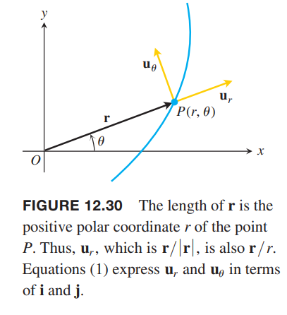
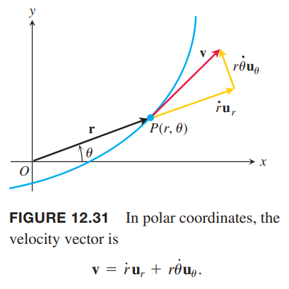
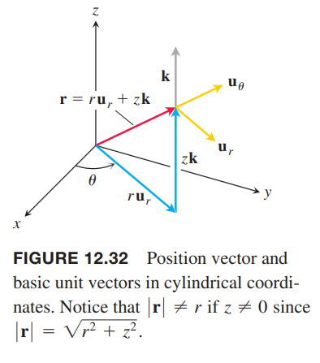
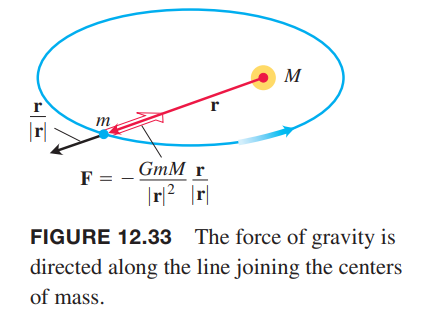
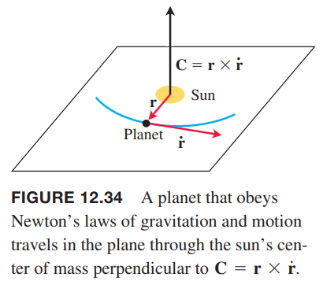
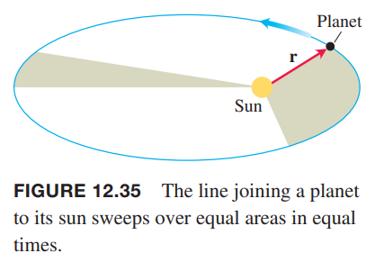
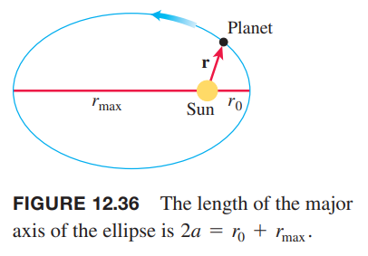

本小节推导极坐标系下的速度和加速度公式。这些公式在描述行星运动时非常有用，我们使用这些公式验证开普勒三定律。

### 极坐标系和柱坐标系下的运动
一个粒子沿着极坐标系曲线运动，位置是 $P(r,\theta)$，我们用移动单位矢量
$$\boldsymbol{u}_r=(\cos\theta)\boldsymbol{i}+(\sin\theta)\boldsymbol{j},\boldsymbol{u}_\theta=-(\sin\theta)\boldsymbol{i}+(\cos\theta)\boldsymbol{j}\tag{1}$$
来表示位置、速度和加速度。单位矢量如下图所示。

矢量 $\boldsymbol{u}_r$ 沿着位置矢量 $\overrightarrow{OP}$ 方向，所以 $\boldsymbol{r}=r\boldsymbol{u}_r$。矢量 $\boldsymbol{u}_\theta$ 与 $\boldsymbol{u}_r$ 正交，指向 $\theta$ 增加的方向。

从公式 $(1)$ 可以得到
$$\begin{aligned}
\frac{d\boldsymbol{u}_r}{d\theta}&=-(\sin\theta)\boldsymbol{i}+(\cos\theta)\boldsymbol{j}=\boldsymbol{u}_\theta\\
\frac{d\boldsymbol{u}_\theta}{d\theta}&=-(\cos\theta)\boldsymbol{i}-(\sin\theta)\boldsymbol{j}=-\boldsymbol{u}_r
\end{aligned}$$
使用链式法则可以得到 $\boldsymbol{u}_r,\boldsymbol{u}_\theta$ 对 $t$ 的微分结果
$$\begin{aligned}
\dot{\boldsymbol{u}}_r&=\frac{d\boldsymbol{u}_r}{d\theta}\dot{\theta}=\dot{\theta}\boldsymbol{u}_\theta\\
\dot{\boldsymbol{u}}_\theta&=\frac{d\boldsymbol{u}_\theta}{d\theta}\dot{\theta}=-\dot{\theta}\boldsymbol{u}_r
\end{aligned}\tag{2}$$
因此，就可以用 $\boldsymbol{u}_r,\boldsymbol{u}_\theta$ 表示速度。
$$\boldsymbol{v}=\dot{\boldsymbol{r}}=\frac{d}{dt}(r\boldsymbol{u}_r)=\dot{r}\boldsymbol{u}_r+r\dot{\boldsymbol{u}}_r=\dot{r}\boldsymbol{u}_r+r\dot{\theta}\boldsymbol{u}_\theta$$

如上一小节所述，这里使用牛顿记号使得公式更简洁，$\dot{\boldsymbol{u}}_r$ 意思是 $d\boldsymbol{u}_r/dt$，$\dot{\theta}$ 意思是 $d\theta/dt$。

加速度
$$\boldsymbol{a}=\dot{\boldsymbol{v}}=(\ddot{r}\boldsymbol{u}_r+\dot{r}\dot{\boldsymbol{u}}_r)+(\dot{r}\dot{\theta}\boldsymbol{u}_\theta+r\ddot{\theta}\boldsymbol{u}_\theta+r\dot{\theta}\dot{\boldsymbol{u}}_\theta)$$

将公式 $(2)$ 代入并合并同类项，可以得到用 $\boldsymbol{u}_r,\boldsymbol{u}_\theta$ 表示的公式
$$\boldsymbol{a}=(\ddot{r}-r\dot{\theta}^2)\boldsymbol{u}_r+(r\ddot{\theta}+2\dot{r}\dot{\theta})\boldsymbol{u}_\theta$$

在 $\boldsymbol{r}=r\boldsymbol{u}_r$ 右边添加上 $z\boldsymbol{k}$ 得到柱坐标系（`cylindrical coordinate`）下的公式：
$$\begin{aligned}
\boldsymbol{r}&=r\boldsymbol{u}_r+z\boldsymbol{k}\\
\boldsymbol{v}&=\dot{r}\boldsymbol{u}_r+r\dot{\theta}\boldsymbol{u}_\theta+\dot{z}\boldsymbol{k}\\
\boldsymbol{a}&=(\ddot{r}-r\dot{\theta}^2)\boldsymbol{u}_r+(r\ddot{\theta}+2\dot{r}\dot{\theta})\boldsymbol{u}_\theta+\ddot{z}\boldsymbol{k}
\end{aligned}\tag{3}$$

矢量 $\boldsymbol{u}_r,\boldsymbol{u}_\theta,\boldsymbol{k}$ 组成了右手坐标系（如下图所示），那么
$$\boldsymbol{u}_r\times\boldsymbol{u}_\theta=\boldsymbol{k},\boldsymbol{u}_\theta\times\boldsymbol{k}=\boldsymbol{u}_r,\boldsymbol{k}\times\boldsymbol{u}_r=\boldsymbol{u}_\theta$$

###  平面中的行星运动
牛顿万有引力定律是说如果中心处的太阳质量是 $M$，以此为起点的矢量 $\boldsymbol{r}$ 处有一质量是 $m$ 的行星，那么万有引力 $\boldsymbol{F}$ 是
$$\boldsymbol{F}=-\frac{GMm}{|\boldsymbol{r}|^2}\frac{\boldsymbol{r}}{|\boldsymbol{r}|}$$

其中 $G$ 是万有引力常数（`universal gravitational constant`），大小约为 $6.6738\times 10^{-11}Nm^2kg^{-2}$。

结合牛顿第二定律，$\boldsymbol{F}=m\ddot{\boldsymbol{r}}$ 得到
$$\begin{aligned}
m\ddot{\boldsymbol{r}}&=-\frac{GMm}{|\boldsymbol{r}|^2}\frac{\boldsymbol{r}}{|\boldsymbol{r}|}\\
\ddot{\boldsymbol{r}}&=-\frac{GM}{|\boldsymbol{r}|^2}\frac{\boldsymbol{r}}{|\boldsymbol{r}|}
\end{aligned}$$

行星的加速度始终指向太阳中心。

由于 $\ddot{\boldsymbol{r}}$ 是 $\boldsymbol{r}$ 乘以标量，所以
$$\boldsymbol{r}\times\ddot{\boldsymbol{r}}=\boldsymbol{0}$$
从这个公式可以推导出
$$\frac{d}{dt}(\boldsymbol{r}\times\dot{\boldsymbol{r}})=\dot{\boldsymbol{r}}\times\dot{\boldsymbol{r}}+\boldsymbol{r}\times\ddot{\boldsymbol{r}}=\boldsymbol{r}\times\ddot{\boldsymbol{r}}=\boldsymbol{0}$$
那么
$$\boldsymbol{r}\times\dot{\boldsymbol{r}}=\boldsymbol{C}\tag{4}$$
其中 $\boldsymbol{C}$ 常矢量。

公式 $(4)$ 告诉我们 $\boldsymbol{r}$ 与 $\dot{\boldsymbol{r}}$ 位于垂直于 $\boldsymbol{C}$ 的平面内。因此行星在一个穿过太阳的固定平面内运动。

### 开普勒第一定律
开普勒第一定律（`Kepler's first law`）是说行星运动轨迹是椭圆，太阳位于其中一个焦点处。椭圆的离心率是
$$e=\frac{r_0v_0^2}{GM}-1\tag{5}$$
且极坐标公式（参考 [10.7](../100-Parametric-Equations-and-Polar-Coordinates/070-Conics-in-Polar-Coordinates.md) 公式 $(5)$）是
$$r=\frac{(1+e)r_0}{1+e\cos\theta}\tag{6}$$

当行星处于离太阳的最小距离 $r_0$ 时，速度是 $v_0$。这里忽略证明。太阳的质量是 $1.99\times 10^{30}kg$。

### 开普勒第二定律
开普勒第二定律（`Kepler's second law`）是说太阳到行星的矢量 $\boldsymbol{r}$ 单位时间扫过的面积相同，如下图所示。

我们假定行星运动平面是 $xy$ 平面，那么 $\boldsymbol{C}$ 方向的单位矢量是 $\boldsymbol{k}$。这里引入极坐标，初始时 $\theta=0$，此时 $|\boldsymbol{r}|=r$ 有最小值。当 $t=0$ 时，$r(0)=r_0$ 是最小时，所以
$$\begin{aligned}
\dot{r}|_{t=0}&=\frac{dr}{dt}\bigg|_{t=0}=0\\
v_0&=|\boldsymbol{v}|_{t=0}=[r\dot\theta]_{t=0}&&\text{From} (3) \dot{z}=0
\end{aligned}$$
为了推导开普勒第二定律，使用公式 $(3)$ 来计算公式 $(4)$ 的叉积。
$$\begin{aligned}
\boldsymbol{C}&=\boldsymbol{r}\times\dot{\boldsymbol{r}}\\
&=\boldsymbol{r}\times\boldsymbol{v}\\
&=r\boldsymbol{u}_r\times(\dot{r}\boldsymbol{u}_r+r\dot{\theta}\boldsymbol{u}_\theta)\\
&=r\dot{r}(\boldsymbol{u}_r\times\boldsymbol{u}_r)+r(r\dot{\theta})(\boldsymbol{u}_r\times\boldsymbol{u}_\theta)\\
&=r(r\dot{\theta})\boldsymbol{k}
\end{aligned}\tag{7}$$
令 $t=0$，得到
$$\boldsymbol{C}=[r(r\dot{\theta})]_{t=0}\boldsymbol{k}=r_0v_0\boldsymbol{k}$$
与公式 $(7)$ 联立得到
$$\begin{aligned}
r_0v_0\boldsymbol{k}&=r^2\dot{\theta}\boldsymbol{k}\\
r^2\dot{\theta}&=r_0v_0
\end{aligned}$$
极坐标系面积微分公式是
$$dA=\frac{1}{2}r^2d\theta$$
那么
$$\frac{dA}{dt}=\frac{1}{2}r^2\dot{\theta}=\frac{1}{2}r_0v_0\tag{8}$$
因此 $dA/dt$ 是常量，这就是开普勒第二定律。

### 开普勒第三定律
如果行星围绕太阳的轨道周期（`orbital period`）是 $T$，那么开普勒第三定律（`Kepler's third law`）是说 $T$ 和半长轴 $a$ 满足如下方程
$$\frac{T^2}{a^3}=\frac{4\pi^2}{GM}$$
右边是常量，所以在一个恒星系统内，所有的行星 $T^2$ 与 $a^3$ 的比值都是一样的。

下面推导开普勒第三定律。
$$\begin{aligned}
A&=\int_0^TdA\\
&=\int_0^T\frac{1}{2}r_0v_0dt\\
&=\frac{1}{2}Tr_0v_0
\end{aligned}$$
如果 $b$ 是半长轴，那么椭圆的面积是 $\pi ab$，所以
$$T=\frac{2\pi ab}{r_0v_0}=\frac{2\pi a^2}{r_0v_0}\sqrt{1-e^2}\tag{9}$$
现在需要用 $r_0,v_0,G,M$ 来表示 $a,e$。公式 $(5)$ 表示了 $e$，对于 $a$，我们将 $\theta=\pi$ 代入公式 $(6)$ 得到
$$r_{max}=r_0\frac{1+e}{1-e}$$
所以从下图可以得到
$$2a=r_0+r_{max}=\frac{2r_0}{1-e}=\frac{2r_0GM}{2GM-r_0v_0^2}\tag{10}$$

将 $(5),(10)$ 代入 公式 $(6)$ 且两边平方
$$\begin{aligned}
T^2&=\frac{4\pi^2 a^4}{r_0^2v_0^2}(1-e^2)\\
\frac{T^2}{a^3}&=\frac{4\pi^2}{r_0^2v_0^2}(\frac{r_0GM}{2GM-r_0v_0^2})(-\frac{r_0^2v_0^4}{G^2M^2}+\frac{2r_0v_0^2}{GM})\\
&=\frac{4\pi^2}{r_0v_0^2}(\frac{GM}{2GM-r_0v_0^2})(\frac{r_0v_0^2}{GM})(2-\frac{r_0v_0^2}{GM})\\
&=\frac{4\pi^2}{1}(\frac{GM}{2GM-r_0v_0^2})\frac{1}{GM}(\frac{2GM-r_0v_0^2}{GM})\\
&=\frac{4\pi^2}{GM}
\end{aligned}$$
