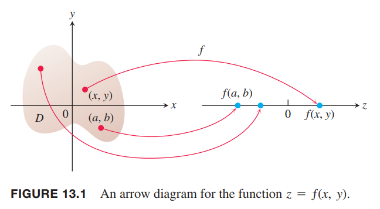
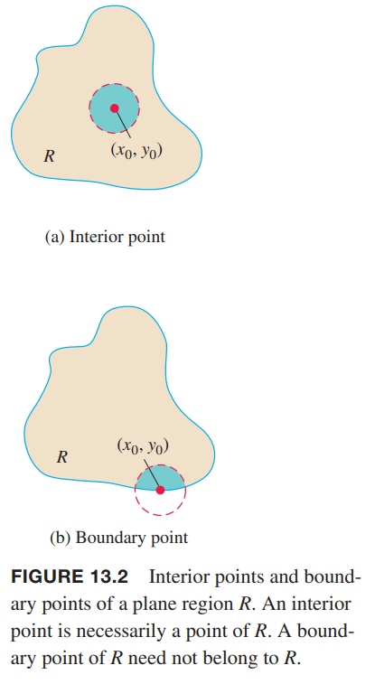
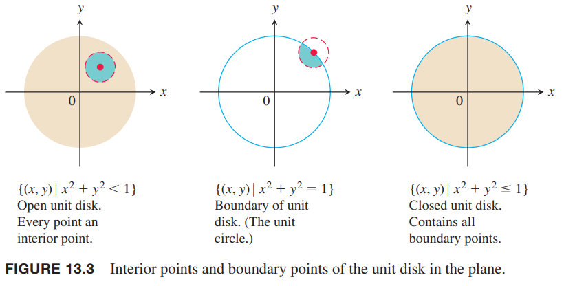
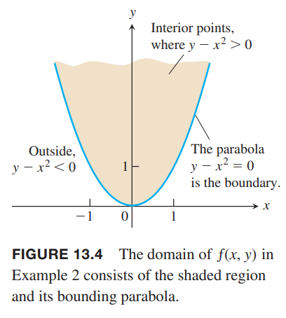
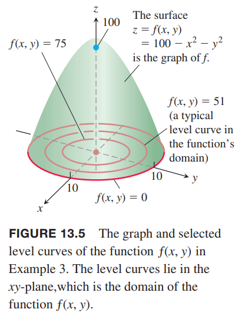
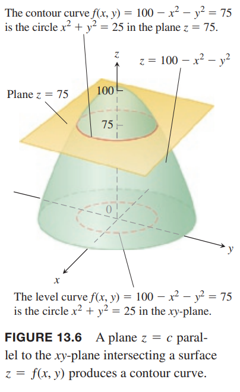
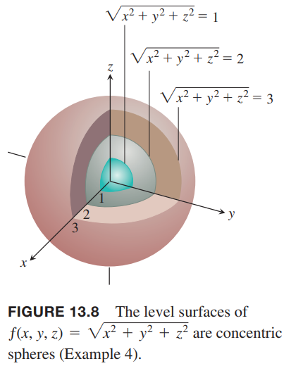
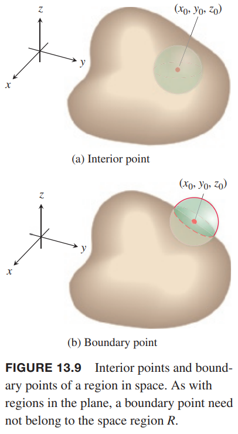
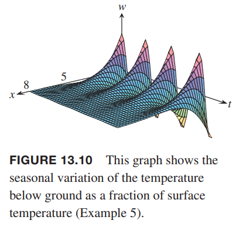
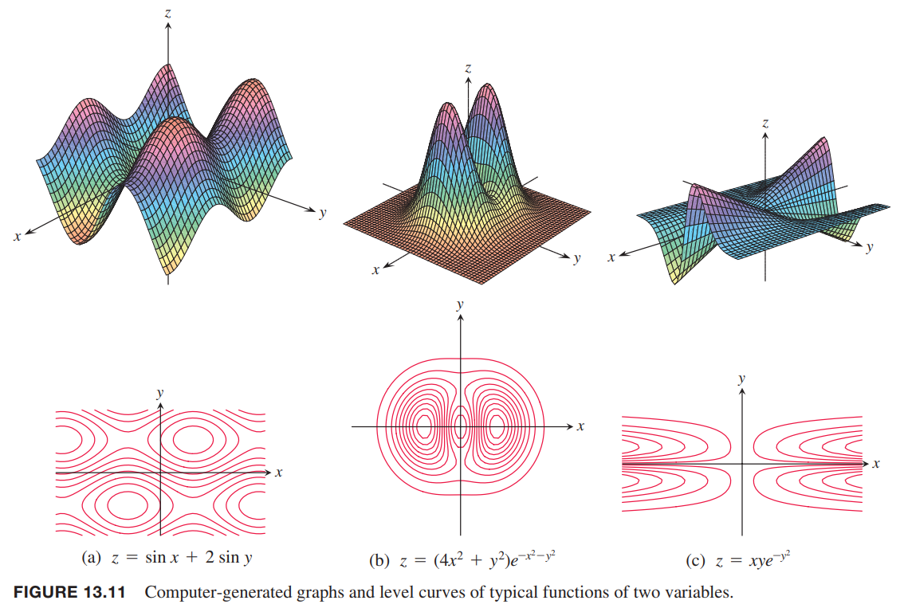

多个变量的实数函数与单变量实数函数类似。定义域上的点是实数对（或者三元组、$n$ 元组等），值域上的数是实数。

**定义**
> 假设 $D$ 是 $n$ 元组 $(x_1,x_2,\cdots,x_n)$。$D$ 上的实数函数（`real-valued function`）$f$ 是一个规则，对于每个元组分配唯一的实数
> $$w=f(x_1,x_2,\cdots,x_n)$$
> 集合 $D$ 是函数的定义域（`domain`）。$w$ 集合是函数的值域（`range`）。$w$ 是函数的因变量（`dependent variable`），$f$ 是 $n$ 个自变量（`independent variable`）$x_1,x_2,\cdots,x_n$ 的函数。也可以称 $x_j$ 是输入变量（`input variable`），$w$ 是输出变量（`output variable`）。

如果 $f$ 有两个自变量，一般情况自变量用 $x,y$ 表示，$z$ 表示因变量，定义域是 $xy$ 平面上的某个区域，如下图所示。

如果 $f$ 有三个自变量，自变量用 $x,y,z$ 表示，$w$ 表示因变量，定义域是空间的某个区域。

在实际应用中，我们期望使用有意义的字母表示自变量和自变量。比如圆柱体的体积是底的半径和高的函数，写作 $V=f(r,h)$，或者 $V=\pi r^2h$，不管怎么表示，$r,h$ 是自变量，$V$ 是因变量。

### 定义域与值域
对于多元函数，我们也要遵循自变量不能使得最后结果为复数或者除零。如果 $f(x,y)=\sqrt{y-x^2}$，那么 $y$ 不能小于 $x^2$。如果 $f(x,y)=1/(xy)$，那么 $xy$ 不能为零。除非特别指明，否则一个函数的定义域是使得函数值是实数的最大集合。因变量的值的集合称为值域。

例1 下面是几个二元函数的定义域和值域。

| 函数 | 定义域 | 值域 |
|--|--|--|
| $z=\sqrt{y-x^2}$ | $y\geq x^2$ | $[0, \infty)$ |
| $z=\frac{1}{xy}$ | $xy\neq 0$ | $(-\infty, 0) \cup (0, \infty)$ |
| $z=\sin xy$ | 整个平面 | $[-1, 1]$ |

下面是一些三元函数的定义域和值域。

| 函数 | 定义域 | 值域 |
|--|--|--|
| $w=\sqrt{x^2+y^2+z^2}$ | 整个空间 | $[0, \infty)$ |
| $w=\frac{1}{xy}$ | $(x,y,z)\neq (0,0,0)$ | $(0, \infty)$ |
| $w=xy\ln z$ | $z>0$ | $(-\infty, \infty)$ |

### 二元函数
平面上的一个区域有内部点和边界点，这和实数轴上的区间类似。闭区间 $[a, b]$ 包含边界点，开区间 $(a,b)$ 不包含边界点，而区间 $[a, b)$ 既不是开区间也不是闭区间。

**定义**
> 区域集合 $R$ 上的一点 $(x_0,y_0)$，如果以它为圆心的圆盘（`disk`）都位于 $R$ 的内部，那么是 $R$ 的内部点（`interior point`）。如下图（a）所示。如果每一个圆盘都一部分在 $R$ 的内部，一部分位于 $R$ 的外部，那么该点是边界点（`boundary point`）。如下图（b）所示。
>
> 
>
> 内部点的集合组成了区域的内部（`interior`），边界点的集合组成了区域的边界（`boundary`）。如果一个区域由内部点组成，那么是开区间（`open`）。如果一个区域包含是所有的边界点，那么是闭区间（`close`）。
>
> 

与实数半开半闭区间 $[a,b)$ 类似，一些区域既不是开区间也不是闭区间。有两个集合比较特殊：空集和整个平面。空集没有内部点也没有边界点。这意味着空集是开放的，因为不包含不是内部点的点，同时也是封闭的，因为没有边界点需要包含。整个 $xy$ 平面也是既开放又封闭的：开放的原因是每个点都是内部点，都被包含了，封闭的原因是没有边界点。除了这两个特殊的集合之外，其他集合要么开放、要么封闭、要么两者都不是。

**定义**
> 一个区域能够被一个直径有限的圆盘包含，那么它是有界的（`bounded`）。如果它不是有界的，那么是无界的（`unbounded`）。

有界集合的例子包括线段、三角形、三角形的内部、正方形、圆等。无界的例子包括坐标轴、无限区间函数的图像、象限、半个平面、整个平面。

例2 描述函数 $f(x,y)=\sqrt{y-x^2}$ 的定义域。

解：由于 $f$ 仅在满足 $y-x^2\geq 0$ 时有定义，那么定义域是闭区间、无界的。如下图所示。

抛物线 $y=x^2$ 是定义域的边界，边界上面的点是内部点。

### 二元函数的图像、等高线、轮廓
有两种标准方式给出 $f(x,y)$ 的图像。一种是画出 $f$ 为某个常量值是定义域上的等高线。另一个中是在空间中作出 $z=f(x,y)$ 的曲面。

**定义**
> 使得 $f(x,y)$ 有常量值，即 $f(x,y)=c$，的点的集合称为等高线（`level curve`）。对于 $f$ 的定义域 $(x,y)$，所有空间中 $(x,y,f(x,y))$ 的点的集合称为 $f$ 的图像（`graph`）。函数图像也称为曲面（`surface`）$z=f(x,y)$。

例3 做函数 $f(x,y)=100-x^2-y^2$ 的图像，在平面中画出等高线 $f(x,y)=0,f(x,y)=51,f(x,y)=75$。

解：$f$ 的定义域是整个平面，值域是小于等于 100 的实数集合。图像是抛物面 $z=100-x^2-y^2$，下图显示了正的部分。

等高线 $f(x,y)=0$ 是平面上曲线
$$f(x,y)=100-x^2-y^2=0,x^2+y^2=100$$
这是一个圆心在原点半径为 10 的圆。等高线 $f(x,y)=51,f(x,y)=75$ 类似。

等高线 $f(x,y)=100$ 只包含原点，但仍然是等高线。

当 $x^2+y^2>100$ 时，$f(x,y)$ 的值是负数。比如 $x^2+y^2=144$，是圆心位于原点半径为 12 的圆，是 $f(x,y)=-44$ 对应的等高线。

用平面 $z=c$ 截取曲面 $z=f(x,y)$ 得到点集，这些点是曲线 $f(x,y)=c$，这称为轮廓线（`contour curve`），与等高线不同。轮廓线位于曲面上，而等高线在 $xy$ 平面。如下图所示，轮廓线在等高线正上方。

区别这两者意义不大，很多时候，上下文清晰的情况下，会使用相同的名字来表示。地图中，曲线是轮廓线而不是等高线。如下图所示。

### 三元函数
**定义**
> 函数 $f$ 有三个自变量，使得 $f(x,y,z)=c$ 的点的集合称为函数 $f$ 的水平曲面（`level surface`）。

三个自变量再加上点得到 $(x,y,z,f(x,y,z))$，是四维曲面，而在三维空间空无法画出来。不过，我们可以通过三维水平曲面来观察其行为。

例4 描述函数
$$f(x,y,z)=\sqrt{x^2+y^2+z^2}$$
的水平曲面。

解：函数 $f$ 的值是点 $(x,y,z)$ 到原点的距离。每一个水平曲面 $\sqrt{x^2+y^2+z^2}=c,c>0$ 是半径为 $c$ 的球面。如下图所示。水平曲面 $\sqrt{x^2+y^2+z^2}=0$ 仅包含原点。

这里我们无法作出函数的图像。水平曲面告诉我们当自变量在定义域内变化时函数值是如何变化的。当我们在半径等于 $c$ 的水平曲面上移动，那么函数值是常量，即 $c$。如果从一个球面移动到另一个球面，函数值会发生变化。向外移动，函数值增加，向圆心移动，函数值减小。也就是说，值得变化依赖于移动的方向，13.5 节会继续讨论这个问题。

空间中内部点、边界点、开区间、闭区间、有界、无界的定义和平面上的定义类似。我们仅需要添加一个维度，使用实心球（`solid ball`）替换之前的圆盘（`disk`）即可。

**定义**
> 如果以点 $(x_0,y_0,z_0)$ 为球心的实心球位于 $R$ 内部，那么该点是内部点（`interior point`）。如果实心球一部分在 $R$ 内部一部分在 $R$ 外部，那么该点是边界点（`boundary point`）。
>
> 
>
> $R$ 的内部点的集合组成了 $R$ 的内部（`interior`），边界点的集合组成了 $R$ 的边界（`boundary`）。
>
> 如果完全由内部点组成，这个区域是开区间（`open`）。如果包含整个边界，那么这个区域是闭区间（`closed`）。

开区间的例子有球的内部、$z>0$ 这半个开放空间、第一象限（$x,y,z$ 大于零）和空间本身。闭区间的例子有线、平面、$z\geq 0$ 这半个封闭空间。一个实心球的部分边界被移除，或者是一个实心立方体缺少面、边或者顶点，既不是开区间也不是闭区间。

自变量超过三个的函数也非常有用。比如，空间曲面上某点的温度不仅仅依赖于空间的位置 $P(x,y,z)$，还依赖于时间 $t$，因此我们记作 $T=f(x,y,z,t)$。

### 计算机作图
三维作图软件很容易作出二元函数的图像。通过图像能更快地得到函数信息，比如在哪里上升、下降，最大值最小值。

例5 地球表面的温度 $w$ 依赖于深度 $x$ 和时间 $t$。如果深度用米作为单位，时间表示是地表温度最高开始流逝的天数，那么温度的变化可以用函数
$$w=\cos(1.7\times 10^{-2}t-0.6x)e^{-0.6x}$$
表示。0m 处的温度缩放到 -1 和 1 之间，那么 $x$ 米处的变化可以解释为表面温度变化的部分（小数部分）。

下图是函数图像。在深度 5m 处，温度的变化仅有地表温度变化的 5% 左右，而深度 8m 处的温度就几乎不变了。

从图中还可以看出，5m 处的温度变化与表面温度变化有半年的相位差。当地表温度最低时，5m 处的温度最高。也就是说 5m 处的四季与地表相反。

下图是一些二元函数的图像和等高线。

