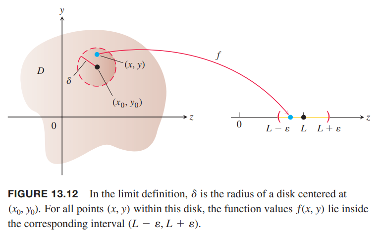
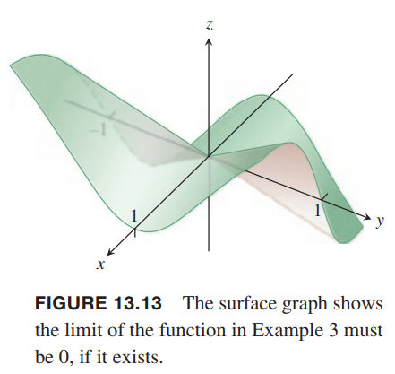
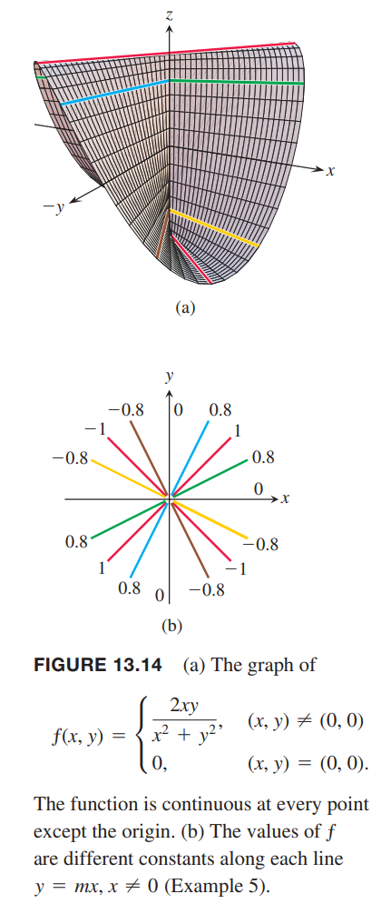
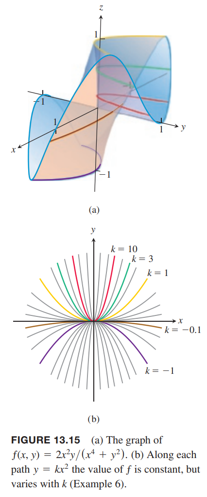

### 二元函数的极限
当所有点 $(x,y)$ 充分接近 $(x_0,y_0)$ 时，$f(x,y)$ 的值任意接近一个固定的实数 $L$，那么我们说当 $(x,y)$ 接近 $(x_0,y_0)$ 时 $f$ 接近极限 $L$。这是一元函数定义类似。但是当 $(x_0,y_0)$ 位于定义域内部时，$(x,y)$ 能从任意方向靠近这个点，而不仅仅时从左右两个方向。极限存在时，任意方向的极限值都相同。

**定义**
> 对每一个数 $\varepsilon>0$，存在对应的 $\delta>0$ 使得对于 $f$ 的所有定义域上的点 $(x,y)$ 都有
> $$|f(x,y)-L|<\varepsilon,0<\sqrt{(x-x_0)^2+(y-y_0)^2}<\delta$$
> 那么当 $(x,y)$ 趋于 $(x_0,y_0)$ 时，$f(x,y)$ 趋于极限（`limit`）$L$，记作
> $$\lim_{(x,y)\to(x_0,y_0)}f(x,y)=L$$

极限的定义是说当 $(x,y)$ 与 $(x_0,y_0)$ 的距离足够小（但不是零）的时候 $f(x,y)$ 与 $L$ 的距离可以任意小。定义适用于内部点 $(x_0,y_0)$，也适用于边界点，甚至不需要边界点在其定义域上。点 $(x,y)$ 趋于 $(x_0,y_0)$ 必须在定义域内。如下图所示。

对于单变量函数而言，以下式子成立。
$$\begin{aligned}
\lim_{(x,y)\to(x_0,y_0)}x&=x_0\\
\lim_{(x,y)\to(x_0,y_0)}y&=y_0\\
\lim_{(x,y)\to(x_0,y_0)}k&=k
\end{aligned}$$
这里证明第一个式子。令任意 $\varepsilon>0$，根据定义，我们需要寻找对应的 $\delta$。如果我们令 $\delta=\varepsilon$，即
$$0<\sqrt{(x-x_0)^2+(y-y_0)^2}<\delta=\varepsilon$$
那么
$$\begin{aligned}
\sqrt{(x-x_0)^2}&<\varepsilon\\
|x-x_0|&<\varepsilon\\
|f(x,y)-x_0|&<\varepsilon
\end{aligned}$$
即
$$|f(x,y)-x_0|<\varepsilon,0<\sqrt{(x-x_0)^2+(y-y_0)^2}<\delta$$
我们找到了这样的 $\delta$ 满足定义，因此
$$\lim_{(x,y)\to(x_0,y_0)}f(x,y)=\lim_{(x,y)\to(x_0,y_0)}x=x_0$$

与单变量极限类似，二元函数也有这些性质。

**定理 1 二元函数的极限的性质**
> 如果 $L,M,k$ 是实数，并且
> $$\lim_{(x,y)\to(x_0,y_0)}f(x,y)=L,\lim_{(x,y)\to(x_0,y_0)}g(x,y)=M$$
> 那么
> 加法法则
> $$\lim_{(x,y)\to(x_0,y_0)}(f(x,y)+g(x,y))=L+M$$
> 减法法则
> $$\lim_{(x,y)\to(x_0,y_0)}(f(x,y)-g(x,y))=L-M$$
> 常数倍
> $$\lim_{(x,y)\to(x_0,y_0)}kf(x,y)=kL$$
> 乘法法则
> $$\lim_{(x,y)\to(x_0,y_0)}(f(x,y)g(x,y))=LM$$
> 除法法则
> $$\lim_{(x,y)\to(x_0,y_0)}\frac{f(x,y)}{g(x,y)}=\frac{L}{M},M\neq 0$$
> 幂次法则
> $$\lim_{(x,y)\to(x_0,y_0)}[f(x,y)]^n=L^n,n \text{ a positive integer}$$
> 根法则
> $$\lim_{(x,y)\to(x_0,y_0)}\sqrt[n]{f(x,y)}=\sqrt[n]{L}=L^{1/n}$$
> 最后一个法则，除了要求 $n$ 是正整数外，如果 $n$ 是偶数，$L$ 要大于零。

这里我们忽略证明。当我们对多项式函数和有理函数应用这些法则时，一个非常有用的结果是当 $(x,y)\to(x_0,y_0)$ 时函数的极限可以用 $(x_0,y_0)$ 代入 $f(x,y)$ 计算极限值，前提是 $(x_0,y_0)$ 在定义域上。

例1 使用上述法则计算下面两个函数的极限。
$$\lim_{(x,y)\to(0,1)}\frac{x-xy+3}{x^2y+5xy-y^3}=\frac{0-0+3}{0+0-1}=-3$$
$$\lim_{(x,y)\to(3,-3)}\sqrt{x^2+y^2}=\sqrt{3^2+(-4)^2}=5$$

例2 求
$$\lim_{(x,y)\to(0,0)}\frac{x^2-xy}{\sqrt{x}-\sqrt{y}}$$
解：当 $(x,y)\to(0,0)$ 时，$\sqrt{x}-\sqrt{y}$ 趋于零，不能使用除法法则。如果分子分母同乘 $\sqrt{x}+\sqrt{y}$，得到一个能求得极限的等价分式。
$$\begin{aligned}
\lim_{(x,y)\to(0,0)}\frac{x^2-xy}{\sqrt{x}-\sqrt{y}}&=\lim_{(x,y)\to(0,0)}\frac{(x^2-xy)(\sqrt{x}+\sqrt{y})}{(\sqrt{x}-\sqrt{y})(\sqrt{x}+\sqrt{y})}\\
&=\lim_{(x,y)\to(0,0)}\frac{x(x-y)(\sqrt{x}+\sqrt{y})}{x-y}\\
&=\lim_{(x,y)\to(0,0)}x(\sqrt{x}+\sqrt{y})\\
&=0
\end{aligned}$$
上面分子分母能够同时消去 $x-y$ 的原因是路径 $y=x$ 不在函数
$$f(x,y)=\frac{x^2-xy}{\sqrt{x}-\sqrt{y}}$$
的定义域上。

例3 如果极限
$$\lim_{(x,y)\to(0,0)}\frac{4xy^2}{x^2+y^2}$$
存在，求极限。

解：沿着 $x=0$ 趋于 $(0,0)$ 当 $y\neq 0$ 时函数值始终是零。类似地，沿着 $y=0$ 趋近，当 $x\neq 0$ 时，函数值也始终是零。所以如果极限存在，那么这个值必须是零。下面应用定义证明。

令任意 $\varepsilon>0$，需要找到 $\delta$ 使得下面式子成立。
$$\bigg|\frac{4xy^2}{x^2+y^2}-0\bigg|<\varepsilon,0<\sqrt{x^2+y^2}<\delta$$
即
$$\frac{4|x|y^2}{x^2+y^2}<\varepsilon,0<\sqrt{x^2+y^2}<\delta$$
由于 $y^2\leq x^2+y^2$，那么
$$\frac{4|x|y^2}{x^2+y^2}\leq 4|x|=4\sqrt{x^2}\leq4\sqrt{x^2+y^2}$$
如果选择 $\delta=\varepsilon/4$，并且令 $0<\sqrt{x^2+y^2}<\delta$，那么
$$\bigg|\frac{4xy^2}{x^2+y^2}-0\bigg|\leq4\sqrt{x^2+y^2}<4\delta=4\frac{\varepsilon}{4}=\varepsilon$$
因此根据定义
$$\lim_{(x,y)\to(0,0)}\frac{4xy^2}{x^2+y^2}=0$$

例4 如果
$$f(x,y)=\frac{y}{x}$$
那么极限
$$\lim_{(x,y)\to(0,0)}f(x,y)$$
存在吗？

解：$f$ 的定义域不包含 $y$ 轴，因此无需考虑任意点 $(x,y),x\neq 0$ 趋于 $(0,0)$。沿着 $x$ 轴趋近，函数值是 $f(x,0)=0,x\neq 0$，如果极限存在，那么 $L=0$。另一方面，沿着 $y=x$ 趋于 $(0,0)$，函数值是 $f(x,x)=1,x\neq 0$，那么函数趋于 1。这意味以 $(0,0)$ 为圆心 $\delta$ 的任意圆盘，包含点 $(x,0)$，对应函数值是 0，也包含点 $(x,x)$，对应函数值是 1。无论圆盘多小，圆盘内的点对应的函数值差值最小是 1。我们令 $\varepsilon$ 为小于 1 的值就会否定 $L=0$ 或 $L=1$ 或任意值，因此极限不存在。极限不存在的原因也可以说是沿着不同路径趋于点 $(0,0)$ 的极限值不同。

### 连续性
**定义**
> 满足下面三个条件，则函数 $f(x,y)$ 在点 $(x_0,y_0)$ 处连续：
> 1. $f$ 在点 $(x_0,y_0)$ 处有定义；
> 2. $\lim_{(x,y)\to(x_0,y_0)}f(x,y)$ 存在；
> 3. $\lim_{(x,y)\to(x_0,y_0)}f(x,y)=f(x_0,y_0)$。
> 
> 如果函数在定义域的每一个点处都连续，那么函数是连续（`continuous`）的。

连续性的定义对于边界点也是适用的。唯一的要求是 $(x_0, y_0)$ 附近的每个点 $(x, y)$ 都在 $f$ 的定义域内。

定理 1 的一个推论是连续函数的复合函数在定义域交集上是连续的。在存在定义的点上，连续函数的和、差、倍、积等，包括多项式和有理函数，也都是连续的。

例5 证明
$$f(x,y)=\begin{cases}
\frac{2xy}{x^2+y^2},&&(x,y)\neq (0,0)\\
0,&&(x,y)=(0,0)
\end{cases}$$
在除了原点之外的每一个点都是连续的。

证明：排除原点之后，函数是连续函数 $x,y$ 的有理函数，所以是连续的，这些点处的极限就是将 $x,y$ 的值代入后得到的有理数。

在点 $(0,0)$ 处，$f$ 是有定义的，值是 0，但是当 $(x,y)\to (0,0)$ 时，$f$ 的极限不存在。原因是沿着不同的路径趋于原点，极限不同。

对于每一个 $m$，在直线 $y=mx,x\neq 0$ 上，$f$ 值不变。
$$f(x,y)\bigg|_{y=mx}=\frac{2xy}{x^2+y^2}\bigg|_{y=mx}=\frac{2mx^2}{x^2+m^2x^2}=\frac{2m}{1+m^2}$$
因此，$f$ 沿着直线趋于 $(0,0)$ 的极限是
$$\lim_{(x,y)\to(0,0)}f(x,y)=\lim_{(x,y)\to(0,0)}f(x,y)\bigg|_{y=mx}=\frac{2m}{1+m^2}$$
显然，极限值会随着斜率 $m$ 的变化而变化，那么极限不存在，因此在原点处函数不连续。

对于二元或多元函数而言，如果在某点处的极限存在，那么沿着任意路径趋于某点，极限值都一样。这个结论与一元函数左极限和有极限必须一样类似。对于二元或多元函数，如果能找到不同的极限值，那么极限就不存在。

**极限不存在的判定**
> 如果在函数 $f(x,y)$ 定义域内，$(x,y)$ 沿着两条不同路径趋于 $(x_0,y_0)$ 得到不同的极限值，那么 $\lim_{(x,y)\to(x_0,y_0)}f(x,y)$ 不存在。

例6 证明函数
$$f(x,y)=\frac{2x^2y}{x^4+y^2}$$
在 $(x,y)$ 趋于 $(0,0)$ 时极限不存在。

证明：如果直接使用代入法会得到 $0/0$ 型不定式。下面讨论沿着不同抛物线趋于原点时的极限值。沿着 $y=kx^2,x\neq 0$ 趋于原点，函数值是常量
$$f(x,y)\bigg|_{y=kx^2}=\frac{2x^y}{x^4+y^2}\bigg|_{y=kx^2}=\frac{2kx^4}{x^4+k^2x^4}=\frac{2k}{1+k^2}$$
因此
$$\lim_{(x,y)\to(0,0)}f(x,y)=\lim_{(x,y)\to(0,0)}f(x,y)\bigg|_{y=kx^2}=\frac{2k}{1+k^2}$$
极限值会随着路径的不同而不同。所以 $(x,y)$ 趋于 $(0,0)$ 时极限不存在。

如果是沿着直线 $y=mx,x\neq 0$ 趋于原点，那么
$$f(x,y)=\bigg|_{y=mx}=\frac{2x^2\cdot mx}{x^4+m^2x^2}=\frac{2mx}{x^2+m^2}$$
所以极限
$$\lim_{(x,y)\to(0,0)}f(x,y)=\lim_{(x,y)\to(0,0)}f(x,y)\bigg|_{y=mx}=\lim_{(x,y)\to(0,0)}\frac{2mx}{x^2+m^2}=0$$
所以可以得到下面这个推论：

> 沿着所有直线趋于 $(x_0,y_0)$ 的极限值都相同，也不意味着在点 $(x_0,y_0)$ 存在极限。

**复合函数的连续性**
> 如果函数 $f(x,y)$ 在 $(x_0,y_0)$ 是连续的，$g$ 是在点 $f(x_0,y_0)$ 处连续的一元函数，那么复合函数 $h=g\circ f=g(f(x,y))$ 在 $(x_0,y_0)$ 处是连续的。

这里忽略证明（类似于 2.6 节定理 9）。

根据上述定理，复合函数
$$e^{x-y},\cos\frac{xy}{x^2+1},\ln(1+x^2y^2)$$
在任意点 $(x,y)$ 处都连续。

### 多元函数
二元函数的极限定义和连续性定义，以及极限的性质，都可以推及多元函数。比如函数
$$\ln(x+y+z),\frac{y\sin z}{x-1}$$
在其定义域上都是连续的，再比如可以使用替换法求极限
$$\lim_{(x,y,z)\to(1,0,-1)}\frac{e^{x+z}}{z^2+\cos(\sqrt{xy})}=\frac{e^{1-1}}{(-1)^2+\cos 0}=\frac{1}{2}$$

### 连续函数在有界封闭集合上的极值
4.1 节定理 1，极值定理是说一元函数在有界闭区间 $[a,b]$ 上连续，那么至少会出现一次绝对最大值和绝对最小值。这对于二元函数也成立。函数 $z=f(x,y)$ 在有界封闭集合 $R$ 上连续，那么函数至少会在某点处取得一次绝对最大值，在某点处取得一次绝对最小值。

多元函数也是类似的。13.7 节会阐述如何求这些极值。
