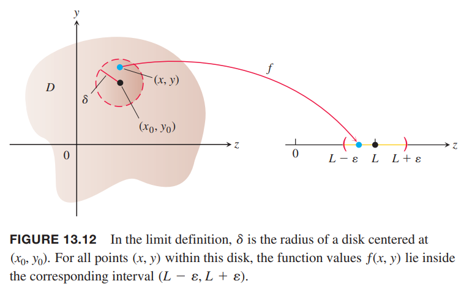

### 二元函数的极限
当所有点 $(x,y)$ 充分接近 $(x_0,y_0)$ 时，$f(x,y)$ 的值任意接近一个固定的实数 $L$，那么我们说当 $(x,y)$ 接近 $(x_0,y_0)$ 时 $f$ 接近极限 $L$。这是一元函数定义类似。但是当 $(x_0,y_0)$ 位于定义域内部时，$(x,y)$ 能从任意方向靠近这个点，而不仅仅时从左右两个方向。极限存在时，任意方向的极限值都相同。

**定义**
> 对每一个数 $\varepsilon>0$，存在对应的 $\delta>0$ 使得对于 $f$ 的所有定义域上的点 $(x,y)$ 都有
> $$|f(x,y)-L|<\varepsilon,0<\sqrt{(x-x_0)^2+(y-y_0)^2}<\delta$$
> 那么当 $(x,y)$ 趋于 $(x_0,y_0)$ 时，$f(x,y)$ 趋于极限（`limit`）$L$，记作
> $$\lim_{(x,y)\to(x_0,y_0)}f(x,y)=L$$

极限的定义是说当 $(x,y)$ 与 $(x_0,y_0)$ 的距离足够小（但不是零）的时候 $f(x,y)$ 与 $L$ 的距离可以任意小。定义适用于内部点 $(x_0,y_0)$，也适用于边界点，甚至不需要边界点在其定义域上。点 $(x,y)$ 趋于 $(x_0,y_0)$ 必须在定义域内。如下图所示。

对于单变量函数而言，以下式子成立。
$$\begin{aligned}
\lim_{(x,y)\to(x_0,y_0)}x&=x_0\\
\lim_{(x,y)\to(x_0,y_0)}y&=y_0\\
\lim_{(x,y)\to(x_0,y_0)}k&=k
\end{aligned}$$
这里证明第一个式子。令任意 $\varepsilon>0$，根据定义，我们需要寻找对应的 $\delta$。如果我们令 $\delta=\varepsilon$，即
$$0<\sqrt{(x-x_0)^2+(y-y_0)^2}<\delta=\varepsilon$$
那么
$$\begin{aligned}
\sqrt{(x-x_0)^2}&<\varepsilon\\
|x-x_0|&<\varepsilon\\
|f(x,y)-x_0|&<\varepsilon
\end{aligned}$$
即
$$|f(x,y)-x_0|<\varepsilon,0<\sqrt{(x-x_0)^2+(y-y_0)^2}<\delta$$
我们找到了这样的 $\delta$ 满足定义，因此
$$\lim_{(x,y)\to(x_0,y_0)}f(x,y)=\lim_{(x,y)\to(x_0,y_0)}x=x_0$$

与单变量极限类似，二元函数也有这些性质。

**定理 1 二元函数的极限的性质**
> 如果 $L,M,k$ 是实数，并且
> $$\lim_{(x,y)\to(x_0,y_0)}f(x,y)=L,\lim_{(x,y)\to(x_0,y_0)}g(x,y)=M$$
> 那么
> 加法法则
> $$\lim_{(x,y)\to(x_0,y_0)}(f(x,y)+g(x,y))=L+M$$
> 减法法则
> $$\lim_{(x,y)\to(x_0,y_0)}(f(x,y)-g(x,y))=L-M$$
> 常数倍
> $$\lim_{(x,y)\to(x_0,y_0)}kf(x,y)=kL$$
> 乘法法则
> $$\lim_{(x,y)\to(x_0,y_0)}(f(x,y)g(x,y))=LM$$
> 除法法则
> $$\lim_{(x,y)\to(x_0,y_0)}\frac{f(x,y)}{g(x,y)}=\frac{L}{M},M\neq 0$$
> 幂次法则
> $$\lim_{(x,y)\to(x_0,y_0)}[f(x,y)]^n=L^n,n \text{ a positive integer}$$
> 根法则
> $$\lim_{(x,y)\to(x_0,y_0)}\sqrt[n]{f(x,y)}=\sqrt[n]{L}=L^{1/n}$$
> 最后一个法则，除了要求 $n$ 是正整数外，如果 $n$ 是偶数，$L$ 要大于零。

这里我们忽略证明。当我们对多项式函数和有理函数应用这些法则时，一个非常有用的结果是当 $(x,y)\to(x_0,y_0)$ 时函数的极限可以用 $(x_0,y_0)$ 代入 $f(x,y)$ 计算极限值，前提是 $(x_0,y_0)$ 在定义域上。

例1 使用上述法则计算下面两个函数的极限。
$$\begin{aligned}
\lim_{(x,y)\to(0,1)}\frac{}{}
\end{aligned}$$
