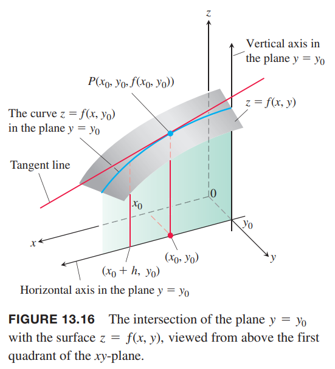
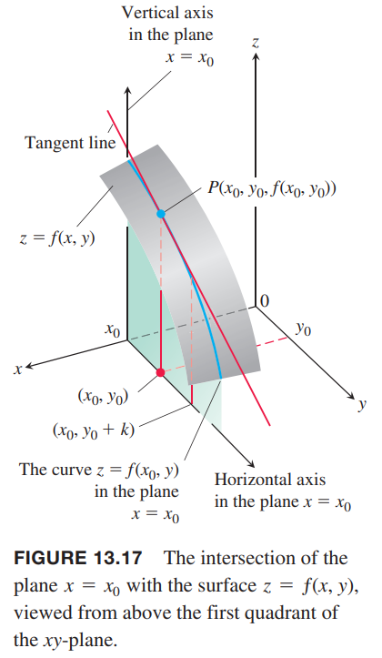
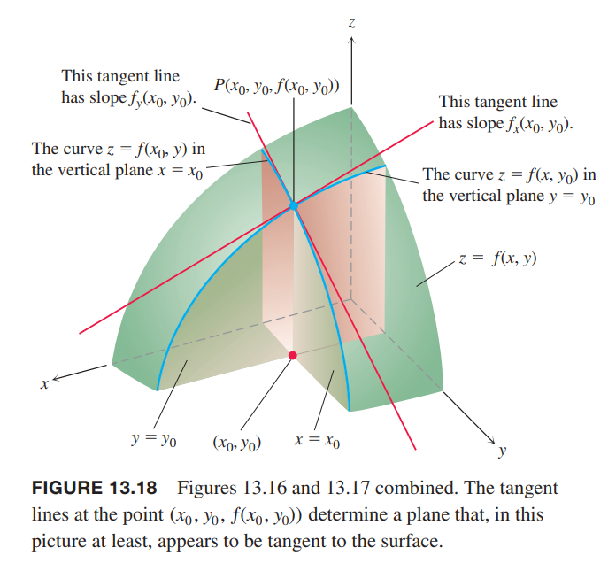

对于多变量微积分而言，如果一次只针对一个变量，那么和单变量微积分类似。将除了一个变量外的其他变量作为常量，对该变量微分，那么得到偏微分。这一节会定义什么是偏微分并解释几何意义，并阐述如何计算偏微分。多变量的可微性比单变量可微性的必要条件要多。

### 二元函数的偏微分
点 $(x_0,y_0)$ 是函数 $f(x,y)$ 定义域上的点，垂直平面 $y=y_0$ 截曲面 $z=f(x,y)$ 得到 $z=f(x,y_0)$，如下图所示。曲线是 $z=f(x,y_0)$ 在平面 $y=y_0$ 上的图像。平面的水平坐标系是 $x$，垂直坐标轴是 $z$。$y$ 是常量 $y_0$，不是变量。

函数 $f$ 在点 $(x_0,y_0)$ 处对 $x$ 的偏微分定义类似函数 $f(x,y_0)$ 在点 $x=x_0$ 处对 $x$ 的普通导数。为了区别偏微分和普通微分，这里使用符号 $\partial$ 而不是 $d$。在下面定义中，$h$ 是实数，可正可负。

**定义**
> 函数 $f(x,y)$ 在点 $(x_0,y_0)$ 处相对 $x$ 的偏微分是
> $$\frac{\partial f}{\partial x}\bigg|_{(x_0,y_0)}=\lim_{h\to 0}\frac{f(x_0+h,y_0)-f(x_0,y_0)}{h}$$
> 前提假设是偏微分存在。

$f(x,y)$ 在点 $(x_0,y_0)$ 处对 $x$ 的偏微分等于函数 $f(x,y_0)$ 在点 $x=x_0$ 处的微分
$$\frac{\partial f}{\partial x}\bigg|_{(x_0,y_0)}=\frac{d}{dx}f(x,y_0)\bigg|_{x=x_0}$$
下面记号也可以用于表示在点 $(x_0,y_0)$ 的偏微分
$$\frac{\partial f}{\partial x}f(x_0,y_0),f_x(x_0,y_0),\frac{\partial z}{\partial x}\bigg|_{(x_0,y_0)}$$

如果计算偏微分时不指定点 $(x_0,y_0)$ 的话，那么得到的是偏微分函数，定义域是偏微分存在的集合。函数的记号包括
$$\frac{\partial f}{\partial x},f_x,\frac{\partial z}{\partial x}$$

在平面 $y=y_0$ 内在点 $P(x_0,y_0,f(x_0,y_0))$ 处曲线 $z=f(x,y_0)$ 的斜率是 $f$ 在点 $(x_0,y_0)$ 相对 $x$ 的偏微分。该点处的切线是通过点 $P$ 且斜率为偏微分的直线。当 $y$ 是常量 $y_0$ 时，点 $(x_0,y_0)$ 处的偏微分 $\partial f/\partial x$ 表示 $f$ 相对 $x$ 的变化率。

函数 $f(x,y)$ 在 $(x_0,y_0)$ 处相对于 $y$ 的偏微分定义类似于 $f$ 相对 $x$ 的偏微分定义。此时，保持 $x$ 不变 $x_0$，其值是 $f(x_0,y)$ 在 $y_0$ 处相对 $y$ 的普通微分。

**定义**
> 函数 $f(x,y)$ 在点 $(x_0,y_0)$ 处相对 $y$ 的偏微分是
> $$\frac{\partial f}{\partial y}\bigg|_{(x_0,y_0)}=\lim_{h\to 0}\frac{f(x_0,y_0+h)-f(x_0,y_0)}{h}$$
> 前提假设是偏微分存在。

在平面 $x=x_0$ 内在点 $P(x_0,y_0,f(x_0,y_0))$ 处曲线 $z=f(x_0,y)$ 的斜率是 $f$ 在点 $(x_0,y)$ 相对 $y$ 的偏微分。该点处的切线是通过点 $P$ 且斜率为偏微分的直线。当 $x$ 是常量 $x_0$ 时，点 $(x_0,y_0)$ 处的偏微分 $\partial f/\partial y$ 表示 $f$ 相对 $y$ 的变化率。

下面记号也表示相对 $y$ 的偏微分
$$\frac{\partial f}{\partial y}(x_0,y_0),f_y(x_0,y_0),\frac{\partial f}{\partial y},f_y$$

如下图所示。我们发现在 $z=f(x,y)$ 同一点 $P(x_0,y_0,f(x_0,y_0))$ 处有两条切线。它们确定了点 $P$ 处的切面？这节最后会阐述可微函数的定义，在 13.6 节会讨论如何求切面。

### 计算
$\partial f/\partial x$ 和 $\partial f/\partial y$ 是在某点处两种微分 $f$ 的方式：视 $y$ 为常量对 $x$ 微分和视 $x$ 为常量对 $y$ 微分。下面的例子说明给定点 $(x_0,y_0)$ 处两种偏微分的值往往不同。

例1 求函数
$$f(x,y)=x^2+3xy+y-1$$
在点 $(4,-5)$ 处的偏微分 $\partial f/\partial x$ 和 $\partial f/\partial y$。

解：将 $y$ 视为常量，求 $\partial f/\partial x$：
$$\begin{aligned}
\frac{\partial f}{\partial x}&=\frac{\partial}{\partial x}(x^2+3xy+y-1)\\
&=2x+3y
\end{aligned}$$
那么在 $(4,-5)$ 处的偏微分是 -7。

将 $x$ 视为常量，求 $\partial f/\partial y$：
$$\begin{aligned}
\frac{\partial f}{\partial y}&=\frac{\partial}{\partial y}(x^2+3xy+y-1)\\
&=3x+1
\end{aligned}$$
那么在 $(4,-5)$ 处的偏微分是 13。

例2 求函数
$$f(x,y)=y\sin xy$$
的偏微分函数 $\partial f/\partial y$。

解：视 $x$ 为常量，$f$ 是 $y$ 与 $\sin xy$ 的积，那么
$$\begin{aligned}
\frac{\partial f}{\partial y}&=\frac{\partial}{\partial y}(y\sin xy)\\
&=y\frac{\partial}{\partial y}(\sin xy)+(\sin xy)\frac{\partial}{\partial}(y)\\
&=(y\cos xy)\frac{\partial}{\partial y}(xy)+\sin xy\\
&=xy\cos xy+\sin xy
\end{aligned}$$

例3 求函数
$$f(x,y)=\frac{2y}{y+\cos x}$$
的偏微分函数 $f_x,f_y$。

解：$f$ 是两个函数的商。
