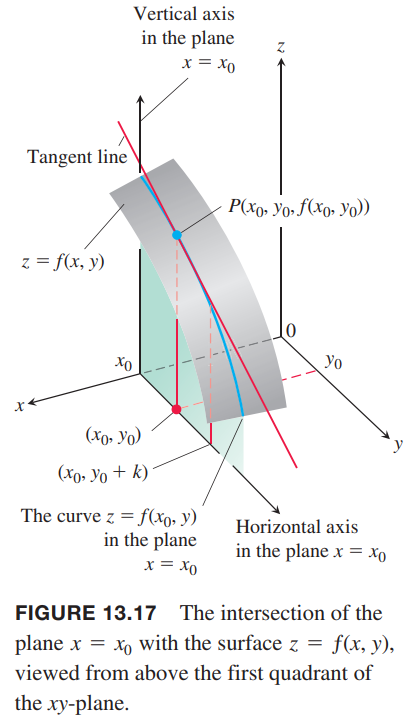

对于多变量微积分而言，如果一次只针对一个变量，那么和单变量微积分类似。将除了一个变量外的其他变量作为常量，对该变量微分，那么得到偏微分。这一节会定义什么是偏微分并解释几何意义，并阐述如何计算偏微分。多变量的可微性比单变量可微性的必要条件要多。

### 二元函数的偏微分
点 $(x_0,y_0)$ 是函数 $f(x,y)$ 定义域上的点，垂直平面 $y=y_0$ 截曲面 $z=f(x,y)$ 得到 $z=f(x,y_0)$，如下图所示。曲线是 $z=f(x,y_0)$ 在平面 $y=y_0$ 上的图像。平面的水平坐标系是 $x$，垂直坐标轴是 $z$。$y$ 是常量 $y_0$，不是变量。

函数 $f$ 在点 $(x_0,y_0)$ 处对 $x$ 的偏微分定义类似函数 $f(x,y_0)$ 在点 $x=x_0$ 处对 $x$ 的普通导数。为了区别偏微分和普通微分，这里使用符号 $\partial$ 而不是 $d$。在下面定义中，$h$ 是实数，可正可负。

**定义**
> 函数 $f(x,y)$ 在点 $(x_0,y_0)$ 处相对 $x$ 的偏微分是
> $$\frac{\partial f}{\partial x}\bigg|_{(x_0,y_0)}=\lim_{h\to 0}\frac{f(x_0+h,y_0)-f(x_0,y_0)}{h}$$
> 前提假设是偏微分存在。

$f(x,y)$ 在点 $(x_0,y_0)$ 处对 $x$ 的偏微分等于函数 $f(x,y_0)$ 在点 $x=x_0$ 处的微分
$$\frac{\partial f}{\partial x}\bigg|_{(x_0,y_0)}=\frac{d}{dx}f(x,y_0)\bigg|_{x=x_0}$$
下面记号也可以用于表示在点 $(x_0,y_0)$ 的偏微分
$$\frac{\partial f}{\partial x}f(x_0,y_0),f_x(x_0,y_0),\frac{\partial z}{\partial x}\bigg|_{(x_0,y_0)}$$

如果计算偏微分时不指定点 $(x_0,y_0)$ 的话，那么得到的是偏微分函数，定义域是偏微分存在的集合。函数的记号包括
$$\frac{\partial f}{\partial x},f_x,\frac{\partial z}{\partial x}$$

在平面 $y=y_0$ 内在点 $P(x_0,y_0,f(x_0,y_0))$ 处曲线 $z=f(x,y_0)$ 的斜率是 $f$ 在点 $(x_0,y_0)$ 相对 $x$ 的偏微分。该点处的切线是通过点 $P$ 且斜率为偏微分的直线。当 $y$ 是常量 $y_0$ 时，点 $(x_0,y_0)$ 处的偏微分 $\partial f/\partial x$ 表示 $f$ 相对 $x$ 的变化率。

函数 $f(x,y)$ 在 $(x_0,y_0)$ 处相对于 $y$ 的偏微分定义类似于 $f$ 相对 $x$ 的偏微分定义。此时，保持 $x$ 不变 $x_0$，其值是 $f(x_0,y)$ 在 $y_0$ 处相对 $y$ 的普通微分。

**定义**
> 函数 $f(x,y)$ 在点 $(x_0,y_0)$ 处相对 $y$ 的偏微分是
> $$\frac{\partial f}{\partial y}\bigg|_{(x_0,y_0)}=\lim_{h\to 0}\frac{f(x_0,y_0+h)-f(x_0,y_0)}{h}$$
> 前提假设是偏微分存在。

在平面 $x=x_0$ 内在点 $P(x_0,y_0,f(x_0,y_0))$ 处曲线 $z=f(x_0,y)$ 的斜率是 $f$ 在点 $(x_0,y)$ 相对 $y$ 的偏微分。该点处的切线是通过点 $P$ 且斜率为偏微分的直线。当 $x$ 是常量 $x_0$ 时，点 $(x_0,y_0)$ 处的偏微分 $\partial f/\partial y$ 表示 $f$ 相对 $y$ 的变化率。

下面记号也表示相对 $y$ 的偏微分
$$\frac{\partial f}{\partial y}(x_0,y_0),f_y(x_0,y_0),\frac{\partial f}{\partial y},f_y$$

如下图所示。我们发现在 $z=f(x,y)$ 同一点 $P(x_0,y_0,f(x_0,y_0))$ 处有两条切线。它们确定了点 $P$ 处的切面？这节最后会阐述可微函数的定义，在 13.6 节会讨论如何求切面。

### 计算
$\partial f/\partial x$ 和 $\partial f/\partial y$ 是在某点处两种微分 $f$ 的方式：视 $y$ 为常量对 $x$ 微分和视 $x$ 为常量对 $y$ 微分。下面的例子说明给定点 $(x_0,y_0)$ 处两种偏微分的值往往不同。

例1 求函数
$$f(x,y)=x^2+3xy+y-1$$
在点 $(4,-5)$ 处的偏微分 $\partial f/\partial x$ 和 $\partial f/\partial y$。

解：将 $y$ 视为常量，求 $\partial f/\partial x$：
$$\begin{aligned}
\frac{\partial f}{\partial x}&=\frac{\partial}{\partial x}(x^2+3xy+y-1)\\
&=2x+3y
\end{aligned}$$
那么在 $(4,-5)$ 处的偏微分是 -7。

将 $x$ 视为常量，求 $\partial f/\partial y$：
$$\begin{aligned}
\frac{\partial f}{\partial y}&=\frac{\partial}{\partial y}(x^2+3xy+y-1)\\
&=3x+1
\end{aligned}$$
那么在 $(4,-5)$ 处的偏微分是 13。

例2 求函数
$$f(x,y)=y\sin xy$$
的偏微分函数 $\partial f/\partial y$。

解：视 $x$ 为常量，$f$ 是 $y$ 与 $\sin xy$ 的积，那么
$$\begin{aligned}
\frac{\partial f}{\partial y}&=\frac{\partial}{\partial y}(y\sin xy)\\
&=y\frac{\partial}{\partial y}(\sin xy)+(\sin xy)\frac{\partial}{\partial}(y)\\
&=(y\cos xy)\frac{\partial}{\partial y}(xy)+\sin xy\\
&=xy\cos xy+\sin xy
\end{aligned}$$

例3 求函数
$$f(x,y)=\frac{2y}{y+\cos x}$$
的偏微分函数 $f_x,f_y$。

解：$f$ 是两个函数的商。视 $y$ 为常量，使用除法法则
$$\begin{aligned}
f_x&=\frac{\partial}{\partial x}(\frac{2y}{y+\cos x})\\
&=\frac{(y+\cos x)\frac{\partial}{\partial x}(2y)-2y\frac{\partial}{\partial x}(y+\cos x)}{(y+\cos x)^2}\\
&=\frac{(y+\cos x)(0)-2y(-\sin x)}{(y+\cos x)^2}\\
&=\frac{2y\sin x}{(y+\cos x)^2}
\end{aligned}$$
视 $x$ 为常量，使用除法法则
$$\begin{aligned}
f_y&=\frac{\partial}{\partial y}(\frac{2y}{y+\cos x})\\
&=\frac{(y+\cos x)\frac{\partial}{\partial y}(2y)-2y\frac{\partial}{\partial y}(y+\cos x)}{(y+\cos x)^2}\\
&=\frac{(y+\cos x)(2)-2y(1)}{(y+\cos x)^2}\\
&=\frac{2\cos x}{(y+\cos x)^2}
\end{aligned}$$

隐式微分对偏微分也成立，参考下面的例子。

例4 给定方程
$$yz-\ln z=x+y$$
求 $\partial z/\partial x$。假定 $z$ 是 $x,y$ 的函数且偏微分存在。

解：视 $y$ 为常量，两边同时对 $x$ 求导。
$$\begin{aligned}
\frac{\partial}{\partial x}(yz)-\frac{\partial}{\partial x}\ln z&=\frac{\partial x}{\partial x}+\frac{\partial y}{\partial x}\\
y\frac{\partial z}{\partial x}-\frac{1}{z}\frac{\partial z}{\partial x}&=1+0\\
(y-\frac{1}{z})\frac{\partial z}{\partial x}&=1\\
\frac{\partial z}{\partial x}&=\frac{z}{yz-1}
\end{aligned}$$

例5 平面 $x=1$ 与跑物体 $z=x^2+y^2$ 相交是抛物线。求抛物线在点 $(1,2,5)$ 处的切线的斜率。如下图所示。

解：抛物线位于平行于 $yz$ 平面的平面内，斜率是 $\partial z/\partial y$ 在点 $(1,2)$ 处的值。
$$\frac{\partial z}{\partial x}\bigg|_{(1,2)}=\frac{\partial}{\partial x}(x^2+y^2)\bigg|_{(1,2)}=2y\bigg|_{(1,2)}=4$$
另外一种计算的方式是将 $x=1$ 代入 $z=x^2+y^2$ 得到抛物线方程是 $z=1+y^2$，问题化简为求 $y=2$ 处曲线的斜率，即
$$\frac{dz}{dy}\bigg|_{y=2}=\frac{d}{dy}(1+y^2)\bigg|_{y=2}=2y\bigg|_{y=2}=4$$

### 多元函数
多于两个变量的函数的偏微分定义与二元函数的偏微分定义类似。将求微分的变量外的变量视为常数，化解成了求解普通微分。

例6 如果 $x,y,z$ 是自变量，且
$$f(x,y,z)=x\sin(y+3z)$$
那么
$$\begin{aligned}
\frac{\partial f}{\partial z}&=\frac{\partial}{\partial z}[x\sin(y+3z)]\\
&=x\frac{\partial}{\partial z}\sin(y+3z)\\
&=x\cos(y+3z)\frac{\partial}{\partial z}(y+3z)\\
&=3x\cos(y+3z)
\end{aligned}$$

例7 电阻为 $R_1,R_2,R_3$ 欧姆的三个电阻并行组成 $R$ 欧姆的电阻，$R$ 由公式
$$\frac{1}{R}=\frac{1}{R_1}+\frac{1}{R_2}+\frac{1}{R_3}$$
确定。如下图所示。当 $R_1=30,R_2=45,R_3=90$ 时，求 $\partial R/\partial R_2$ 的值。

解：视 $R_1,R_3$ 为常量，使用隐式求导法则，两边同时对 $R_2$ 求导。
$$\begin{aligned}
\frac{\partial}{\partial R_2}\frac{1}{R}&=\frac{\partial}{\partial R_2}\bigg(\frac{1}{R_1}+\frac{1}{R_2}+\frac{1}{R_3}\bigg)\\
-\frac{1}{R^2}\frac{\partial R}{\partial R_2}&=0-\frac{1}{R_2^2}+0\\
\frac{\partial R}{\partial R_2}&=\frac{R^2}{R_2^2}=\bigg(\frac{R}{R_2}\bigg)^2
\end{aligned}$$
当 $R_1=30,R_2=45,R_3=90$ 时，
$$\frac{1}{R}=\frac{1}{30}+\frac{1}{45}+\frac{1}{90}=\frac{3+2+1}{90}=\frac{1}{15}$$
所以
$$R=15$$
因此偏微分的值是
$$\frac{\partial R}{\partial R_2}=\frac{1}{9}$$
$R_2$ 很小的变化会导致 $R$ 只变化 $1/9$。

### 偏微分和连续性
函数 $f(x,y)$ 能够对连续的某点对 $x, y$ 求偏微分，这与一元函数不同，后者可导隐含着连续。本小节最后会讨论 $f$ 在点 $(x_0,y_0)$ 的连续性。

例8 令
$$f(x,y)=\begin{cases}
0,xy\neq 0\\
1,xy=0
\end{cases}$$

（a）求沿着直线 $y=x$ 趋于 $(0,0)$ 时 $f$ 的极限。

（b）证明 $f$ 在 $(0,0)$ 处不连续。

（c）证明偏微分 $\partial f/\partial x,\partial f/\partial y$ 在原点处都存在。

解：（a）沿着 $y=x$，函数 $f(x,y)$ 的值始终为零，因此
$$\lim_{(x,y)\to(0,0)}f(x,y)\bigg|_{y=x}=\lim_{(x,y)\to(0,0)}0=0$$

（b）由于 $f(0,0)=1$，与 （a）中求得的极限不同，因此 $f$ 在 $(0,0)$ 处不连续。

（c）令 $y=0$，求 $\partial f/\partial x$。此时 $f(x,y)=1$，即上图中的直线 $L_1$。$x$ 为任意值，斜率都是零，即 $\partial f/\partial x=0$，那么在 $(0,0)$ 处也有 $\partial f/\partial x=0$。类似的，$\partial f/\partial y$ 是 $y$ 为任意值时直线 $L_2$ 斜率，因此在 $(0,0)$ 处有 $\partial f/\partial y=0$。

例 8 说明多元函数的可微性需要比偏导数存在更强的条件。本小节最后会讨论。

### 二阶偏微分
对函数 $f(x,y)$ 求导两次，得到二阶导数。通常用下面这些符号表示
$$\frac{\partial^2 f}{\partial x^2},\frac{\partial^2 f}{\partial y^2},\frac{\partial^2 f}{\partial x\partial y},\frac{\partial^2 f}{\partial y\partial x}$$
或
$$f_{xx},f_{yy},f_{yx},f_{xy}$$
其定义是
$$\frac{\partial^2 f}{\partial x^2}=\frac{\partial}{\partial x}\bigg(\frac{\partial f}{\partial x}\bigg),\frac{\partial^2 f}{\partial y^2}=\frac{\partial}{\partial y}\bigg(\frac{\partial f}{\partial y}\bigg)$$
注意，混合偏微分是有顺序要求的。
$$\frac{\partial^2 f}{\partial x\partial y}=\frac{\partial}{\partial x}\bigg(\frac{\partial f}{\partial y}\bigg)$$
即先对 $y$ 求偏微分，再对 $x$ 求偏微分。
符号
$$f_{yx}=(f_y)_x$$
含义一样。

例9 令
$$f(x,y)=x\cos y+ye^x$$
求二阶导
$$\frac{\partial^2 f}{\partial x^2},\frac{\partial^2 f}{\partial y^2},\frac{\partial^2 f}{\partial x\partial y},\frac{\partial^2 f}{\partial y\partial x}$$
解：首先求一阶偏微分
$$\begin{aligned}
\frac{\partial f}{\partial x}&=\frac{\partial}{\partial x}(x\cos y+ye^x)\\
&=\cos y+ye^x\\
\frac{\partial f}{\partial y}&=\frac{\partial f}{\partial y}(x\cos y+ye^x)\\
&=-x\sin y+e^x
\end{aligned}$$
那么
$$\begin{aligned}
\frac{\partial^2 f}{\partial y\partial x}&=\frac{\partial f}{\partial y}\bigg(\frac{\partial f}{\partial x}\bigg)&&=-\sin y+e^x\\
\frac{\partial^2 f}{\partial x\partial y}&=\frac{\partial f}{\partial x}\bigg(\frac{\partial f}{\partial y}\bigg)&&=-\sin y+e^x\\
\frac{\partial^2 f}{\partial x^2}&=\frac{\partial}{\partial x}\bigg(\frac{\partial f}{\partial x}\bigg)&&=ye^x\\
\frac{\partial^2 f}{\partial y^2}&=\frac{\partial}{\partial y}\bigg(\frac{\partial f}{\partial y}\bigg)&&=-x\cos y
\end{aligned}$$

### 混合偏微分定理
在例 9 中，混合偏微分
$$\frac{\partial^2 f}{\partial y\partial x},\frac{\partial^2 f}{\partial x\partial y}$$
是一样的。这并不是巧合，如果一个函数 $f$ 及其偏微分 $f_x,f_y,f_{xy},f_{yx}$ 是连续的，那么就必然相等。不过如果不连续，混合偏微分就可能不同。

**定理2 混合偏微分定理**
> 如果 $f(x,y)$ 及其偏微分 $f_x,f_y,f_{xy},f_{yx}$ 在包含点 $(a,b)$ 的开区间上有定义且连续，那么
> $$f_{xy}(a,b)=f_{yx}(a,b)$$

这个定理也称为克莱罗定理，法国科学家  Alexis Clairaut 发现的。

证明这个定理需要使用四次中值定理。假设 $(a,b)$ 位于矩形 $R$ 内，$f_x,f_y,f_{xy},f_{yx}$ 均有定义。令 $h,k$ 满足 $(a+h,b+k)$ 也在矩形 $R$ 内。令
$$\Delta = F(a+h)-F(a)\tag{1}$$
其中
$$F(x)=f(x,b+k)-f(x,b)\tag{2}$$
函数 $F$ 是可微的，所以其连续，那么使用中值定理，得到
$$\Delta=hF'(c_1)\tag{3}$$
其中 $c_1$ 介于 $a$ 和 $a+h$ 之间。从 $(2)$ 可以得到
$$F'(x)=f_x(x,b+k)-f_x(x,b)$$
代入 $(3)$ 得到
$$\Delta=h[f_x(c_1,b+k)-f_x(c_1,b)]\tag{4}$$
对函数 $g(y)=f_x(c_1,y)$ 使用中值定理，那么
$$g(b+k)-g(b)=kg'(d_1)$$
其中 $d_1$ 介于 $b$ 和 $b+k$ 之间。写成 $f_x$ 的形式
$$f_x(c_1,b+k)-f_x(c_1,b)=kf_{xy}(c_1,d_1)$$
代入 $(4)$ 得到
$$\Delta=hkf_{xy}(c_1,d_2)\tag{5}$$
其中 $(c_1,d_1)$ 是 $R'$ 内的某一点。如下图所示。

将 $(2)$ 代入 $(1)$ 可以得到另一种形式
$$\begin{aligned}
\Delta&=f(a+h,b+k)-f(a+h,b)-f(a,b+k)+f(a,b)\\
&=[f(a+h,b+k)-f(a,b+k)]-[f(a+h,b)-f(a,b)]\\
&=\phi(b+k)-\phi(b)
\end{aligned}\tag{6}$$
其中
$$\phi(y)=f(a+h,y)-f(a,y)\tag{7}$$
对 $(6)$ 使用中值定理，得到
$$\Delta=k\phi'(d_2)\tag{8}$$
其中 $d_2$ 介于 $b$ 和 $b+k$ 之间。对 $(7)$ 微分得到
$$\phi'(y)=f_y(a+h,y)-f_y(a,y)\tag{9}$$
代入 $(8)$ 得到
$$\Delta=k[f_y(a+h,d_2)-f_y(a,d_2)]$$
再一次使用中值定理得到
$$\Delta=khf_{yx}(c_2,d_2)\tag{10}$$
其中 $c_2$ 介于 $a$ 和 $a+h$ 之间。

结合 $(5),(10)$ 得到
$$f_{xy}(c_1,d_1)=f_{yx}(c_2,d_2)\tag{11}$$
其中点 $(c_2,d_2)$ 也位于 $R'$ 内。$(11)$ 不完全是要证明的等式，因为这里是说 $(c_1,d_1)$ 处的 $f_{xy}$ 与 $(c_2,d_2)$ 处的 $f_{yx}$ 相等。不过 $h,k$ 可以任意小。题目假设 $f_{xy},f_{yx}$ 在 $(a,b)$ 处连续意味着 $f_{xy}(c_1,d_1)=f_{xy}(a,b)+\varepsilon_1$，$f_{yx}(c_2,d_2)=f_{yx}(a,b)+\varepsilon_2$，随着 $h,k\to 0$，$\varepsilon_1,\varepsilon_2\to 0$，那么就有
$$f_{xy}(a,b)=f_{yx}(a,b)$$

如果满足条件的话，我们可以交换求偏微分的顺序来计算二阶偏微分。这使得我们可以简化运算。

例10 求函数
$$w=xy+\frac{e^y}{y^2+1}$$
的偏导数
$$\frac{\partial^2 w}{\partial x\partial y}$$
解：$\frac{\partial^2 w}{\partial x\partial y}$ 的含义是先对 $y$ 求导再对 $x$ 求导。不过我们如果交换求导顺序，很容易就能得到结果。
$$\frac{\partial w}{\partial x}=y,\frac{\partial^2 w}{\partial y\partial x}=1$$
如果先对 $y$ 求导也能得到结果 $\frac{\partial^2 w}{\partial x\partial y}=1$，不过要繁琐很多。我们能够交换顺序的前提是 $w$ 对所有点 $(x_0,y_0)$ 都满足定理 2 的条件。

### 更高阶偏微分
应用中出现的往往是一阶和二阶微分。不过只要涉及的微分存在，微分的定义并没有限制阶数。比如我们可以得到如下三阶和四阶微分
$$\frac{\partial^3 f}{\partial x\partial y^2}=f_{yyx}$$
$$\frac{\partial^4 f}{\partial x^2\partial y^2}=f_{yyxx}$$
和二阶偏微分类似，高阶偏微分也可以任意交换微分顺序。

例11 求函数
$$f(x,y,z)=1-2xy^2z+x^2y$$
的偏微分
$$f_{yxyz}$$
解：依次求导
$$\begin{aligned}
f_y&=-4xyz+x^2\\
f_{yx}&=-4yz+2x\\
f_{yxy}&=-4z\\
f_{yxyz}&=-4
\end{aligned}$$

### 可微性
多变量函数的可微性比一元函数的要复杂，因为能够沿着不同的路径趋于定义域的某一点。在二元函数的偏微分定义中，我们用平行于 $xz$ $yz$ 平面的平面与曲面相交，得到一个曲线，称为轨迹。偏微分可以看作是轨迹在该点处的斜率。对于可微函数，如果我们轻微旋转平面，平面依旧垂直，但是不再平行于 $xz$ 或 $yz$ 平面，得到一个光滑的轨迹，新的轨迹在该点处的斜率可能不同。原始偏微分的存在不能保证这一点。比如之前讨论的例 8。可微性要确保沿着任意路径趋于点 $(x_0,y_0)$，$x,y$ 均可以变化而不是其中一个是固定值，那么自变量微小的变化不会引起突变。

在一元函数中，如果函数 $y=f(x)$ 在 $x=x_0$ 可微，那么随着 $x$ 从 $x_0$ 到 $x_0+\Delta x$，$\Delta y$ 接近切线的变化 $\Delta L$。这就是 3.11 小节下面的方程所描述的。
$$\Delta y=f'(x_0)\Delta x+\varepsilon\Delta x$$
随着 $\Delta x\to 0$ 有 $\varepsilon\to 0$。二元函数的可微性定义也类似。

**定义**
> 如果函数 $z=f(x,y)$ 在 $(x_0,y_0)$ 处的偏微分 $f_x(x_0,y_0),f_y(x_0,y_0)$ 存在，并且 $\Delta z=f(x_0+\Delta x,y_0+\Delta y)-f(x_0,y_0)$ 满足
> $$\Delta z=f_x(x_0,y_0)\Delta x+f_y(x_0,y_0)\Delta y+\varepsilon_1\Delta x+\varepsilon_2\Delta y$$
> 随着 $\Delta x,\Delta y\to 0$，$\varepsilon_1,\varepsilon_2\to 0$，那么函数 $z=f(x,y)$ 在 $(x_0,y_0)$ 处可微。如果在定义域的各点处均可微，那么函数是可微函数，其图像是光滑曲线。

下面的定理和推论告诉我们在 $(x_0,y_0)$ 处有连续的一阶偏微分的函数在该点可导，且可以使用线性函数近似。13.6 讨论近似。

**定理 3 二元函数的增量定理**
> 假定函数 $f(x,y)$ 的一阶偏微分在包含 $(x_0,y_0)$ 的开区间 $R$ 上有定义，并且 $f_x,f_y$ 在 $(x_0,y_0)$ 处连续。那么从 $(x_0,y_0)$ 到 $R$ 上另一点 $(x_0+\Delta x,y_0+\Delta)$ 函数 $f$ 值的变化
> $$\Delta z=f(x_0+\Delta x,y_0+\Delta y)-f(x_0,y_0)$$
> 满足
> $$\Delta z=f_x(x_0,y_0)\Delta x+f_y(x_0,y_0)\Delta y+\varepsilon_1\Delta x+\varepsilon_2\Delta y$$
> 其中当 $\Delta x,\Delta y\to 0$ 时，$\varepsilon_1,\varepsilon_2\to 0$。

证明：假定以 $(x_0,y_0)$ 为中心的矩阵 $T$ 位于 $R$ 内，并且 $\Delta x,\Delta y$ 使得 $A$ 到 $B(x_0+\Delta x,y_0)$ 和 $B$ 到 $C(x_0+\Delta x,y_0+\Delta y)$ 均在 $T$ 内。如下图所示。

那么我们可以把 $\Delta z=\Delta z_1+\Delta z_2$ 看作是两段增量的叠加。其中
$$\Delta z_1=f(x_0+\Delta x,y_0)-f(x_0,y_0)$$
是 $A$ 到 $B$ 函数 $f$ 的变化。
$$\Delta z_2=f(x_0+\Delta x,y_0+\Delta y)-f(x_0+\Delta x,y_0)$$
是 $B$ 到 $C$ 函数 $f$ 的变化。

在闭区间 $x_0$ 到 $x_0+\Delta x$，函数 $F(x)=f(x,y_0)$ 是可微（且连续）的函数，那么
$$F'(x)=f_x(x,y_0)$$
根据中值定理，$c$ 介于 $x_0$ 和 $x_0+\Delta x$ 之间，有
$$F(x_0+\Delta x)-F(x_0)=F'(c)\Delta x$$
所以
$$f(x_0+\Delta x,y_0)-f(x_0,y_0)=f_x(c,y_0)\Delta x$$
得到
$$z_1=f_x(c,y_0)\Delta x\tag{12}$$
类似的，$G(y)=f(x_0+\Delta x,y)$ 也是可微（且连续）是 $y_0$ 到 $y_0+\Delta y$ 上的函数，那么
$$G'(y)=f_y(x_0+\Delta x,y)$$
在 $y_0$ 和 $y_0+\Delta y$ 存在一点 $d$，使得
$$G(y_0+\Delta y)-G(y_0)=G'(d)\Delta y$$
那么
$$f(x_0+\Delta x,y_0+\Delta y)-f(x_0+\Delta x,y_0)=f'(x_0+\Delta x,d)\Delta y$$
得到
$$z_2=f_y(x_0+\Delta x,d)\Delta y\tag{13}$$
当 $\Delta x,\Delta y\to 0$，有 $c\to x_0,d\to y_0$。根据定理的前提假设，$f_x,f_y$ 在 $(x_0,y_0)$ 处连续，所以随着 $\Delta x,\Delta y\to 0$
$$\begin{aligned}
\varepsilon_1&=f_x(c,y_0)-f_x(x_0,y_0)\\
\varepsilon_2&=f_y(x_0+\Delta x,d)-f_y(x_0+\Delta x,y_0)
\end{aligned}\tag{14}$$
也趋于零。

最后，我们结合 $(12),(13),(14)$ 可以得到
$$\begin{aligned}
\Delta z&=\Delta z_1+\Delta z_2\\
&=f_x(c,y_0)\Delta x+f_y(x_0+\Delta x,d)\Delta y\\
&=[f_x(c,y_0+\varepsilon_1)]\Delta x+[f_y(x_0+\Delta x,d)+\varepsilon_2]\Delta y\\
&=f_x(x_0,y_0)\Delta x+f_y(x_0,y_0)\Delta y+\varepsilon_1\Delta x+\varepsilon_2\Delta y
\end{aligned}$$
其中当 $\Delta x,\Delta y\to 0$ 时 $\varepsilon_1,\varepsilon_2\to 0$。

**定理 3 的推论**
> 如果函数 $f(x,y)$ 的偏微分 $f_x,f_y$ 在开区间 $R$ 上连续，那么 $f$ 在 $R$ 上每一点都是可微的。

如果函数 $z=f(x,y)$ 是可微的，根据定义，当 $\Delta x,\Delta y\to 0$ 时，$\Delta z=f(x_0+\Delta x,y_0+\Delta y)-f(x_0,y_0)$ 趋于零。这就是说可微函数在每一点处都是连续的。

**定理 4 可微性蕴涵着连续性**
> 如果函数 $f(x,y)$ 在 $(x_0,y_0)$ 处可微，那么 $f$ 在 $(x_0,y_0)$ 处连续。

从定理 3 的推论和定理 4，如果 $f_x,f_y$ 在包含 $(x_0,y_0)$ 的开区间上是连续的，那么函数 $f(x,y)$ 在点 $(x_0,y_0)$ 处是连续的。正如例 8 所示，在某点处的偏微分存在，并不能说明这个二元函数在该点连续。偏微分在某点处的存在性不足以确保可微性，而偏微分的连续性确保可微性。
