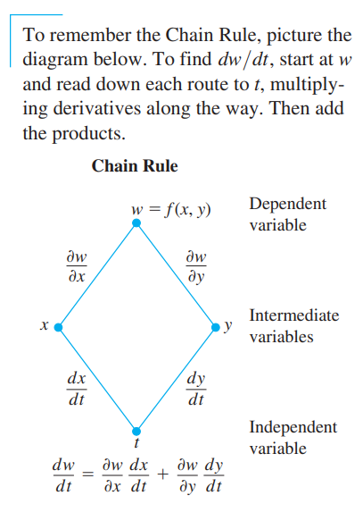
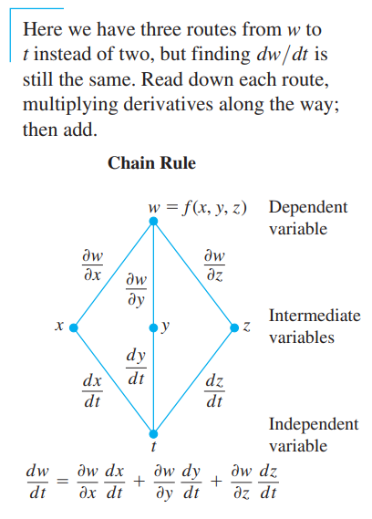
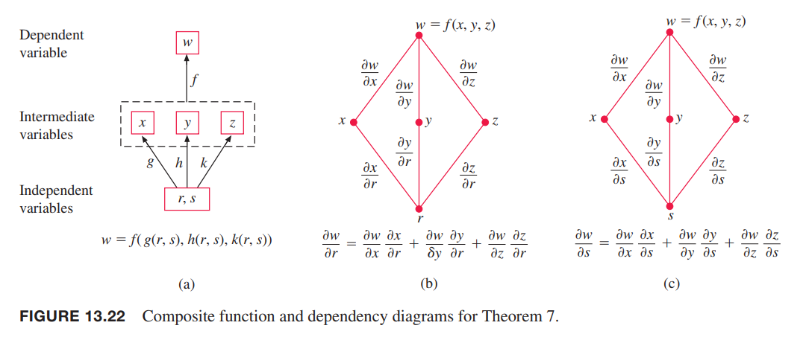
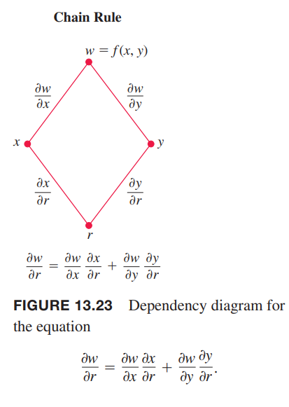
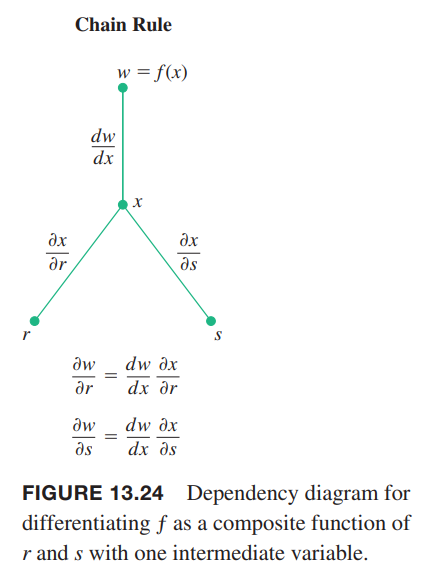

### 二元函数
**定理 5 一个自变量两个中间变量的函数的链式法则**
> 如果 $w=f(x,y)$ 可微，$x=x(t),y=y(t)$ 是 $t$ 的可微函数，那么复合函数 $w=f(x(t),y(t))$ 是 $t$ 的可微函数，并且
> $$\frac{dw}{dt}=f_x(x(t),y(t))x'(t)+f_y(x(t),y(t))y'(t)$$
> 或者写作
> $$\frac{dw}{dt}=\frac{\partial f}{\partial x}\frac{dx}{dt}+\frac{\partial f}{\partial y}\frac{dy}{dt}$$

证明：需要证明 $x,y$ 在 $t=t_0$ 可微，那么 $w$ 在 $t_0$ 处也可微，且
$$\frac{dw}{dt}(t_0)=\frac{\partial w}{\partial x}(P_0)\frac{dx}{dt}(t_0)+\frac{\partial w}{\partial y}(P_0)\frac{dy}{dt}(t_0)$$
其中 $P_0=(x(t_0),y(t_0))$。

令 $\Delta x,\Delta y, \Delta w$ 是 $t$ 从 $t_0$ 到 $t_0+\Delta t$ 的变化。由于 $f$ 可微，所以
$$\Delta w=\frac{\partial w}{\partial x}(P_0)\Delta x+\frac{\partial w}{\partial y}(P_0)\Delta y+\varepsilon_1\Delta x+\varepsilon_2\Delta y$$
随着 $\Delta x,\Delta y\to 0$，$\varepsilon_1,\varepsilon\to 0$。为了求 $dw/dt$，两边同除 $\Delta t$ 得到
$$\frac{\Delta w}{\Delta t}=\frac{\partial w}{\partial x}(P_0)\frac{\Delta x}{\Delta t}+\frac{\partial w}{\partial y}(P_0)\frac{\Delta y}{\Delta t}+\varepsilon_1\frac{\Delta x}{\Delta t}+\varepsilon_2\frac{\Delta y}{\Delta t}$$
当 $\Delta t\to 0$，有
$$\begin{aligned}
\frac{dw}{dt}(t_0)&=\lim_{\Delta t\to 0}\frac{\Delta w}{\Delta t}\\
&=\frac{\partial w}{\partial x}(P_0)\frac{dx}{dt}(t_0)+\frac{\partial w}{\partial y}(P_0)\frac{dy}{dt}(t_0)+0\cdot\frac{dx}{dt}(t_0)+0\cdot\frac{dy}{dt}\\
&=\frac{\partial w}{\partial x}(P_0)\frac{dx}{dt}(t_0)+\frac{\partial w}{\partial y}(P_0)\frac{dy}{dt}(t_0)
\end{aligned}$$

有时，我们用 $\partial w/\partial x$ 代替 $\partial f/\partial x$，那么定理 5 的形式如下
$$\frac{dw}{dt}=\frac{\partial w}{\partial x}\frac{dx}{dt}+\frac{\partial w}{\partial y}\frac{dy}{dt}$$
不过，上述方程左右两边的 $w$ 含义是不同的。左边是复合函数 $w=f(x(t),y(t))$，是变量 $t$ 的函数。右边表示的是 $w=f(x,y)$，是两个自变量 $x,y$ 的函数。$dw/dt,dx/dt,dy/dt$ 是在 $t_0$ 点处求导，偏微分 $\partial w/\partial x,\partial w/\partial y$ 是在点 $(x_0,y_0)$ 处求导，其中 $x_0=x(t_0),y_0=y(t_0)$。在没有歧义的情况下会交替使用两种记号，目的是根据上下文选择更容易理解的一种形式。

下面的依赖图帮助记忆链式法则。真实的自变量是 $t$，而 $x,y$ 是中间变量，$w$ 是因变量。

定理 5 可以用如下这种更精确的形式表示。
$$\frac{dw}{dt}(t_0)=\frac{\partial f}{\partial x}(x_0,y_0)\frac{dx}{dt}(t_0)+\frac{\partial f}{\partial y}(x_0,y_0)\frac{dy}{dt}(t_0)$$
或者是下面这种记号。
$$\frac{dw}{dt}\bigg|_{t_0}=\frac{\partial f}{\partial x}\bigg|_{(x_0,y_0)}\frac{dx}{dt}\bigg|_{t_0}+\frac{\partial f}{\partial y}\bigg|_{(x_0,y_0)}\frac{dy}{dt}\bigg|_{t_0}$$

例1 使用链式法则求
$$w=xy$$
关于 $t$ 的导数，其中 $x=\cos t,y=\sin t$。导数在 $t=\pi/2$ 处值是多少？

解：应用链式法则
$$\begin{aligned}
\frac{dw}{dt}&=\frac{\partial f}{\partial x}\frac{dx}{dt}+\frac{\partial f}{\partial y}\frac{dy}{dt}\\
&=(y)(-\sin t)+(x)(\cos t)\\
&=(\sin t)(-\sin t)+(\cos t)(\cos t)\\
&=-\sin^2 t+\cos^2 t\\
&=\cos 2t
\end{aligned}$$
这个例子比较简单，可以将 $x,y$ 替换得到 $w$ 函数
$$w=xy=\sin t\cos t=\frac{1}{2}\sin 2t$$
因此
$$\frac{dw}{dt}=\frac{1}{2}(2\cos 2t)=\cos 2t$$
给定 $t$，有
$$\frac{dw}{dt}\bigg|_{t=\pi/2}=\cos \pi=-1$$

### 三元函数
**定理 6 一个自变量三个中间变量的函数的链式法则**
> 如果 $w=f(x,y,z)$ 是可微函数，$x,y,z$ 是 $t$ 的可微函数，那么
> $$\frac{dw}{dt}=\frac{\partial w}{\partial x}\frac{dx}{dt}+\frac{\partial w}{\partial y}\frac{dy}{dt}+\frac{\partial w}{\partial z}\frac{dz}{dt}$$

证明过程和定理 5 一样，用三个中间变量替换之前的两个中间变量即可。依赖图也和之前类似，如下所示。

例2 求函数
$$w=xy+z,x=\cos t,y=\sin t,z=t$$
的导数 $dw/dt$ 和 $t=0$ 时的导数值。

解：应用链式法则公式
$$\begin{aligned}
\frac{dw}{dt}&=\frac{\partial w}{\partial x}\frac{dx}{dt}+\frac{\partial w}{\partial y}\frac{dy}{dt}+\frac{\partial w}{\partial z}\frac{dz}{dt}\\
&=(y)(-\sin t)+(x)(\cos t)+(1)(1)\\
&=(\sin t)(-\sin t)+(\cos t)(\cos t)+1\\
&=\cos 2t+1
\end{aligned}$$
那么
$$\frac{dw}{dt}\bigg|_{t=0}=\cos 0 +1=2$$
对于曲线变化的物理解释，我们可以想象一个物体的位置随时间 $t$ 而变化。如果 $w=T(x,y,z)$ 表示曲线 $C,x=x(t),y=y(t),z=z(t)$ 上任意点 $(x,y,z)$ 的温度，那么复合函数 $w=T(x(t),y(t),z(t))$ 表示沿曲线 $t$ 时的温度。导数 $dw/dt$ 是沿曲线运动时温度瞬时变化率，如定理 6 中的结果。

### 曲面上定义的函数
现在讨论地球表面 $(x,y,z)$ 处的温度 $w=f(x,y,z)$，我们可以把 $x,y,z$ 看作是经度和纬度 $r,s$ 的函数。如果 $x=g(r,s),y=h(r,s),z=k(r,s)$，那么可以将温度表示成 $r,s$ 的复合函数
$$w=f(g(r,s),h(r,s),k(r,s))$$

**定理 7 两个自变量三个中间变量的函数的链式法则**
> 假设有函数 $w=f(x,y,z),x=g(r,s),y=h(r,s),z=k(r,s)$。如果这四个函数都是可微的，那么 $w$ 对 $r,s$ 的偏微分是
> $$\frac{\partial w}{\partial r}=\frac{\partial w}{\partial x}\frac{\partial x}{\partial r}+\frac{\partial w}{\partial y}\frac{\partial y}{\partial r}+\frac{\partial w}{\partial z}\frac{\partial z}{\partial r}$$
> $$\frac{\partial w}{\partial s}=\frac{\partial w}{\partial x}\frac{\partial x}{\partial s}+\frac{\partial w}{\partial y}\frac{\partial y}{\partial s}+\frac{\partial w}{\partial z}\frac{\partial z}{\partial s}$$

上述第一个方程可以通过将 $s$ 视为常量，$r$ 看作 $t$，结合定理 6 可以得到。第二个方程类似。下图是两个方程的依赖图。

例3 如果
$$w=x+2y+z^2,x=\frac{r}{s},y=r^2+\ln s,z=2r$$
用 $r,s$ 表示 $\partial w/\partial r$ 和 $\partial w/\partial s$。

解：
$$\begin{aligned}
\frac{\partial w}{\partial r}&=\frac{\partial w}{\partial x}\frac{\partial x}{\partial r}+\frac{\partial w}{\partial y}\frac{\partial y}{\partial r}+\frac{\partial w}{\partial z}\frac{\partial z}{\partial r}\\
&=(1)(\frac{1}{s})+(2)(2r)+(2z)(2)\\
&=\frac{1}{s}+4r+8r\\
&=\frac{1}{s}+12r
\end{aligned}$$
$$\begin{aligned}
\frac{\partial w}{\partial s}&=\frac{\partial w}{\partial x}\frac{\partial x}{\partial s}+\frac{\partial w}{\partial y}\frac{\partial y}{\partial s}+\frac{\partial w}{\partial z}\frac{\partial z}{\partial s}\\
&=(1)(-\frac{r}{s^2})+(2)(\frac{1}{s})+(2z)(0)\\
&=\frac{2s-r}{s^2}
\end{aligned}$$

如果函数只有两个中间变量，那么定理 7 会简洁一点，少一项。

> 如果 $w=f(x,y),x=g(r,s),y=h(r,s)$，那么
> $$\frac{\partial w}{\partial r}=\frac{\partial w}{\partial x}\frac{\partial x}{\partial r}+\frac{\partial w}{\partial y}\frac{\partial y}{\partial r}$$
> $$\frac{\partial w}{\partial s}=\frac{\partial w}{\partial x}\frac{\partial x}{\partial s}+\frac{\partial w}{\partial y}\frac{\partial y}{\partial s}$$

下图是第一个方程的依赖图。第二个方程类似，只需要将 $r$ 换成 $s$ 即可。

例4 如果
$$w=x^2+y^2,x=r-s,y=r+s$$
用 $r,s$ 表示 $\partial w/\partial r$ 和 $\partial w/\partial s$。

解：
$$\begin{aligned}
\frac{\partial w}{\partial r}&=\frac{\partial w}{\partial x}\frac{\partial x}{\partial r}+\frac{\partial w}{\partial y}\frac{\partial y}{\partial r}\\
&=(2x)(1)+(2y)(1)\\
&=2r-2s+2r+2s\\
&=4r
\end{aligned}$$
$$\begin{aligned}
\frac{\partial w}{\partial s}&=\frac{\partial w}{\partial x}\frac{\partial x}{\partial s}+\frac{\partial w}{\partial y}\frac{\partial y}{\partial s}\\
&=(2x)(-1)+(2y)(1)\\
&=2s-2r+2r+2s\\
&=4s
\end{aligned}$$

如果 $f$ 只有一个中间变量 $x$，那么方程会进一步得到简化。

> 如果 $w=f(x),x=g(r,s)$，那么
> $$\frac{\partial w}{\partial r}=\frac{dw}{dx}\frac{\partial x}{\partial r}$$
> $$\frac{\partial w}{\partial s}=\frac{dw}{dx}\frac{\partial x}{\partial s}$$

这种情况下，我们使用普通一元微分 $dw/dx$。依赖图如下所示。

### 重新审视隐式函数
从两个变量的定理 5 开始，通过一些代数运算，可以得到下面的结论。

假设

1. 函数 $F(x,y)$ 可导。
2. 方程 $F(x,y)=0$ 隐式定义了 $y$ 是 $x$ 的可导函数。

由于 $w=F(x,y)=0$，所以 $dw/dx=0$。由链式法则得到
$$\begin{aligned}
0&\frac{dw}{dx}\\
&=F_x\frac{dx}{dx}+F_y\frac{dy}{dx}\\
&=F_x+F_y\frac{dy}{dx}
\end{aligned}$$
如果 $F_y=\partial w/\partial x\neq 0$，可以得到
$$\frac{dy}{dx}=-\frac{F_x}{F_y}$$

**定理 8 隐式微分公式**
> 假设 $F(x,y)$ 是可微的，且 $F(x,y)=0$ 定义了 $y$ 是 $x$ 的可导函数，在任意 $F_y\neq 0$ 的点处都有
> $$\frac{dy}{dx}=-\frac{F_x}{F_y}\tag{1}$$

例5 如果
$$y^2-x^2-\sin xy=0$$
使用定理 8 求 $dy/dx$。

解：令 $F(x,y)=y^2-x^2-\sin xy$，那么
$$\frac{dy}{dx}=-\frac{F_x}{F_y}=-\frac{-2x-y\cos xy}{2y-x\sin xy}=\frac{2x+y\cos xy}{2y-x\sin xy}$$
使用定理 8 计算比使用一元函数的隐式微分要方便。

上面的结论很容易推广到三个变量。假设方程 $F(x,y,z)=0$ 定义了变量 $z$ 的隐式函数 $z=f(x,y)$。那么对所有在 $f$ 定义域的 $(x,y)$，都有 $F(x,y,f(x,y))=0$。假定 $F,f$ 均为可微函数，可以用链式法则对 $x$ 求 $F(x,y,z)=0$ 的导数。
$$\begin{aligned}
0&=\frac{\partial F}{\partial x}\frac{\partial x}{\partial x}+\frac{\partial F}{\partial y}\frac{\partial y}{\partial x}+\frac{\partial F}{\partial z}\frac{\partial z}{\partial x}\\
&=F_x\cdot 1+F_y\cdot 0+F_z\cdot\frac{\partial z}{\partial x}
\end{aligned}$$
所以
$$F_x+F_z\frac{\partial z}{\partial x}=0$$
类似的，对 $y$ 求导可以得到
$$F_y+F_z\frac{\partial z}{\partial y}=0$$
当 $F_z\neq 0$，通过上面两个式子可以得到 $z=f(x,y)$ 的偏微分方程
$$\frac{\partial z}{\partial x}=-\frac{F_x}{F_z},\frac{\partial z}{\partial y}=-\frac{F_y}{F_z}\tag{2}$$
更高级的微积分会阐述一个重要定理：隐式函数定理（`Implicit Function Theorem`），是说满足什么条件 $(2)$ 成立。如果偏微分 $F_x,F_y,F_z$ 在包含 $(x_0,y_0,z_0)$ 的开放区间 $R$ 上连续，并且对于某些常量 $c$，有 $F(x_0,y_0,z_0)=c$ 且有 $F_z(x_0,y_0,z_0)\neq 0$，那么方程 $F(x,y,z)=c$ 定义了 $z$ 是自变量 $x,y$ 的隐式函数，且 $z$ 的偏微分如 $(2)$ 所述。

例6 如果
$$x^3+z^2+ye^{xz}+z\cos y=0$$
求 $\partial z/\partial x,\partial z/\partial y$ 在 $(0,0,0)$ 处的值。

解：令
$$F(x,y,z)=x^3+z^2+ye^{xz}+z\cos y$$
那么
$$\begin{aligned}
F_x&=3x^2+zye^{xz}\\
F_y&=e^{xz}-z\sin y\\
F_z&=2z+xye^{xz}+\cos y
\end{aligned}$$
由于 $F(0,0,0)=0,F_z(0,0,0)=1\neq 0$，并且所有的一阶偏微分都是连续函数，那么隐式函数定理说 $F(x,y,z)=0$ 定义了 $z$ 在 $(0,0,0)$ 附近是 $x,y$ 的隐式可微函数，那么
$$\frac{\partial z}{\partial x}=-\frac{F_x}{F_z}=-\frac{3x^2+zye^{xz}}{2z+xye^{xz}+\cos y}$$
$$\frac{\partial z}{\partial y}=-\frac{F_y}{F_z}=-\frac{e^{xz}-z\sin y}{2z+xye^{xz}+\cos y}$$
代入 $(0,0,0)$ 得到
$$\frac{\partial z}{\partial x}=-\frac{0}{1}=0$$
$$\frac{\partial z}{\partial y}=-\frac{1}{1}=-1$$

### 更多变量的函数
上面描述了很多链式法则的公式，但是它们都只是通用公式的特例罢了。当我们解决问题时，画出依赖图能够帮助理解，最上面是因变量，中间是中间变量，下面是选择被微分的自变量。从因变量开始向下选择一条路径到选择的自变量，将沿着路径下来的各个偏微分相乘，最后将不同路径的偏微分相加。

一般地，假设 $w=f(x,y,\cdots,v)$ 是中间变量 $x,y,\cdots v$ 的可微函数，$x,y,\cdots,v$ 是自变量 $p,q,\cdots,t$ 的可微函数。那么 $w$ 是 $p$ 到 $t$ 的可微函数，$w$ 对于变量 $p$ 的偏微分公式是
$$\frac{\partial w}{\partial p}=\frac{\partial w}{\partial x}\frac{\partial x}{\partial p}+\frac{\partial w}{\partial y}\frac{\partial y}{\partial p}+\cdots+\frac{\partial w}{\partial v}\frac{\partial v}{\partial p}$$
将 $p$ 替换为 $q,\cdots,r$ 中的一个，就是对其他自变量的偏微分公式。

一种记忆方式是下面两个矢量的点积，第一个是 $w$ 相对于中间变量的偏微分，第二个是中间变量对选择的自变量的偏微分。
$$\bigg(\frac{\partial w}{\partial x},\frac{\partial w}{\partial y},\cdots\frac{\partial w}{\partial v}\bigg),\bigg(\frac{\partial x}{\partial p},\frac{\partial y}{\partial p},\cdots,\frac{\partial v}{\partial p}\bigg)$$
