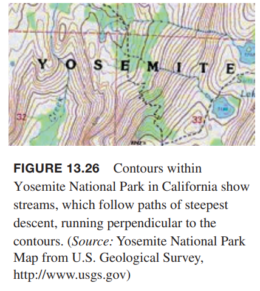
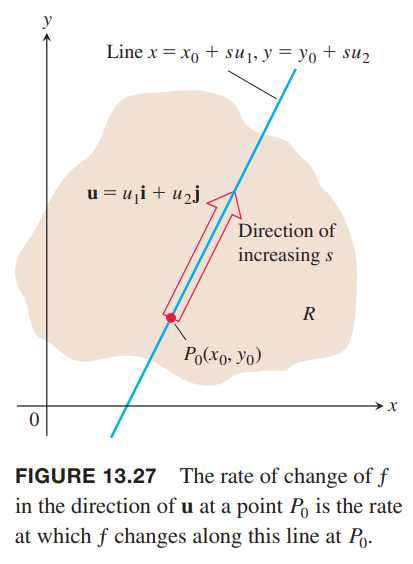
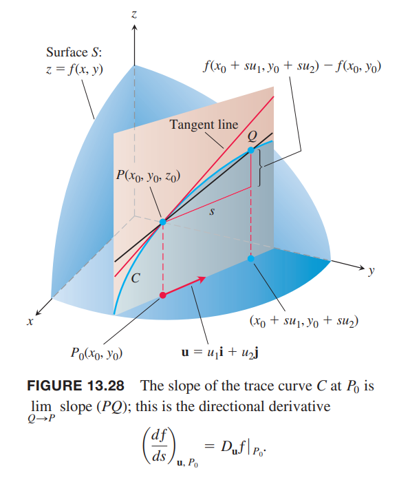
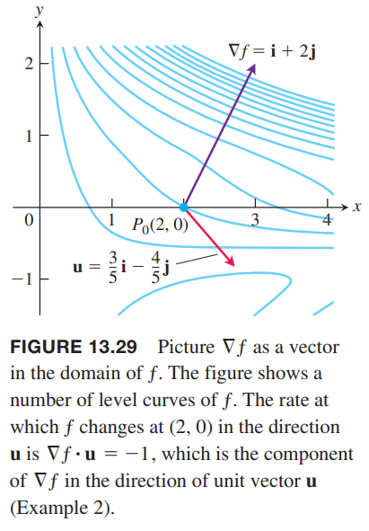
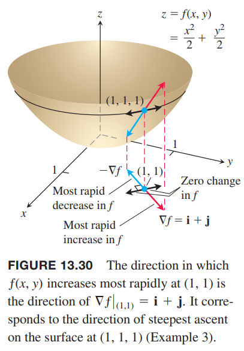
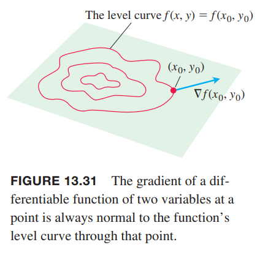
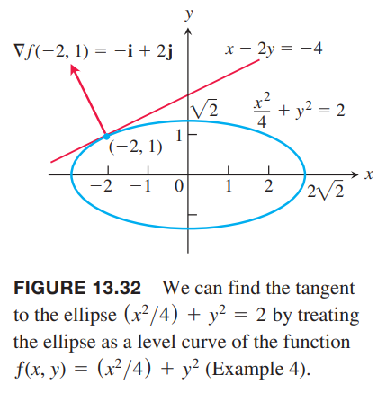

下图是约塞米蒂国家公园的等高线地图，仔细观察会发下河流方向与等高线垂直。河流沿着最陡峭下降的路径，水能够尽快流下去，也就是变化率最大的方向。这一节会解释为什么“下山”方向与等高线垂直。

### 平面上的方向导数
如果 $f(x,y)$ 可微，$f$ 沿着可微曲线 $x=g(t),y=h(t)$ 对 $t$ 的变化率是
$$\frac{df}{dt}=\frac{\partial f}{\partial x}\frac{dx}{dt}+\frac{\partial f}{\partial y}\frac{dy}{dt}$$
在任意点 $P_0(x_0,y_0)=P_0(g(t_0),h(t))$，上述方程描述了对应 $t$ 的增加 $f$ 的变化依赖于曲线运动的方向。如果曲线是直线，$t$ 是从 $P_0$ 沿着单位矢量 $\boldsymbol{u}$ 的弧长参数，$df/dt$ 是沿着 $\boldsymbol{u}$ 方向运动距离的变化率。如果 $\boldsymbol{u}$ 在变化，$f$ 表示从 $P_0$ 开始沿着不同方向距离的变化率。

假定函数 $f(x,y)$ 在 $xy$ 平面的矩形 $R$ 内有定义，点 $P_0(x_0,y_0)$ 在 $R$ 内，$\boldsymbol{u}=u_1\boldsymbol{i}+u_2\boldsymbol{j}$ 是一单位矢量，那么
$$x=x_0+su_1,y=y_0+su_2$$
是过点 $P_0$ 平行于 $\boldsymbol{u}$ 的参数化直线方程。如果 $s$ 是从 $P_0$ 开始沿着 $\boldsymbol{u}$ 的弧长，点 $P_0$ 处的微分 $df/ds$ 表示函数 $f$ 在 $P_0$ 处在 $\boldsymbol{u}$ 方向上的变化率。

**定义**
> 函数 $f$ 在 $P_0(x_0,y_0)$ 处沿单位矢量 $\boldsymbol{u}=u_1\boldsymbol{i}+u_2\boldsymbol{j}$ 的微分是
> $$\bigg(\frac{df}{ds}\bigg)_{\boldsymbol{u},P_0}=\lim_{s\to 0}\frac{f(x_0+su_1,y_0+su_2)-f(x_0,y_0)}{s}\tag{1}$$
> 前提是极限存在。

公式 $(1)$ 定义的方向导数（`directional derivative`）也可以表示为
$$D_{\boldsymbol{u}}f(P_0),D_{\boldsymbol{u}}f|_{P_0}$$
偏微分 $f_x(x_0,y_0),f_y(x_0,y_0)$ 是 $f$ 在 $P_0$ 处沿着 $\boldsymbol{i},\boldsymbol{j}$ 这两个方向上的方向导数。

例1 使用定义，求函数
$$f(x,y)=x^2+xy$$
在点 $P_0(1,2)$ 处沿着单位矢量 $\boldsymbol{u}=(1/\sqrt{2})\boldsymbol{i}+(1/\sqrt{2})\boldsymbol{j}$ 的方向导数。

解：
$$\begin{aligned}
\bigg(\frac{df}{ds}\bigg)_{\boldsymbol{u},P_0}&=\lim_{s\to 0}\frac{f(x_0+su_1,y_0+su_2)-f(x_0,y_0)}{s}\\
&=\lim_{s\to 0}\frac{f(1+s\frac{1}{\sqrt{2}},2+s\frac{1}{\sqrt{2}})-f(1,2)}{s}\\
&=\lim_{s\to 0}\frac{(1+\frac{s}{\sqrt{2}})^2+(1+\frac{s}{\sqrt{2}})(2+\frac{s}{\sqrt{2}})-(1+2)}{s}\\
&=\lim_{s\to 0}\frac{(1+\frac{2s}{\sqrt{2}}+\frac{s^2}{2})+(2+\frac{3s}{\sqrt{2}}+\frac{s^2}{2})-3}{s}\\
&=\lim_{s\to 0}\frac{\frac{5s}{\sqrt{2}}+s^2}{s}\\
&=\lim_{s\to 0}(\frac{5}{\sqrt{2}}+s)\\
&=\frac{5}{\sqrt{2}}
\end{aligned}$$

### 方向导数的解释
如果 $z=f(x,y)$ 表示空间中的曲面 $S$。如果 $z_0=f(x_0,y_0)$，那么点 $P(x_0,y_0,z_0)$ 位于 $S$ 上。通过点 $P$ 和 $P_0(x_0,y_0)$ 且平行于 $\boldsymbol{u}$ 的平面与 $S$ 相交得到曲线 $C$。

$f$ 在 $\boldsymbol{u}$ 方向的变化率是由 $\boldsymbol{u},\boldsymbol{k}$ 建立的右手坐标系统内曲线 $C$ 在点 $P$ 处的切线斜率。

如果 $\boldsymbol{u}=\boldsymbol{i}$，在 $P_0$ 处的方向导数就是在 $(x_0,y_0)$ 处偏微分 $\partial f/\partial x$。类似的，当 $\boldsymbol{u}=\boldsymbol{j}$，在 $P_0$ 处的方向导数就是在 $(x_0,y_0)$ 处偏微分 $\partial f/\partial y$。方向导数是这两个偏微分的泛化。现在的问题是任意方向 $\boldsymbol{u}$ 上的变化率，而不仅仅是 $\boldsymbol{i},\boldsymbol{j}$ 这两个方向。

方向导数的物理解释是说，如果 $T=f(x,y)$ 是在每个点 $(x,y)$ 的温度。那么 $f(x_0,y_0)$ 是在点 $(x_0,y_0)$ 的温度，且 $D_{\boldsymbol{u}}f|_{P_0}$ 是在该点处沿着方向 $\boldsymbol{u}$ 的温度变化率。

### 计算与梯度
下面要分析一种更快捷的计算 $f$ 方向导数的方法。这里从过点 $P_0(x_0,y_0)$ 参数方程
$$x=x_0+su_1,y=y_0+su_2\tag{2}$$
开始分析，其中 $s$ 沿着 $\boldsymbol{u}=u_1\boldsymbol{i}+u_2\boldsymbol{j}$ 的增长的长度参数。根据链式法则
$$\begin{aligned}
\bigg(\frac{df}{ds}\bigg)_{\boldsymbol{u},P_0}&=\frac{\partial f}{\partial x}\bigg|_{P_0}\frac{dx}{ds}+\frac{\partial f}{\partial y}\bigg|_{P_0}\frac{dy}{ds}\\
&=\frac{\partial f}{\partial x}\bigg|_{P_0}u_1+\frac{\partial f}{\partial y}\bigg|_{P_0}u_2\\
&=\bigg[\frac{\partial f}{\partial x}\bigg|_{P_0}\boldsymbol{i}+\frac{\partial f}{\partial y}\bigg|_{P_0}\boldsymbol{j}\bigg]\cdot\bigg[u_1\boldsymbol{i}+u_2\boldsymbol{j}\bigg]
\end{aligned}\tag{3}$$
上面最后的式子是说 $f$ 在点 $P_0$ 处沿着方向 $\boldsymbol{u}$ 的导数是矢量 $\boldsymbol{u}$ 与一个特殊矢量的点积。

**定义**
> $f(x,y)$ 的梯度矢量或梯度（`gradient vector`, `gradient`）是
> $$\nabla f=\frac{\partial f}{\partial x}\boldsymbol{i}+\frac{\partial f}{\partial y}\boldsymbol{j}$$
> 通过在 $P_0(x_0,y_0)$ 的偏微分可以得到梯度矢量的值，写作
> $$\nabla f|_{P_0},\nabla f(x_0,y_0)$$

**定理 9 方向导数是点积**
> 如果 $f(x,y)$ 在包含点 $P_0(x_0,y_0)$ 的开放区域可微，那么
> $$\bigg(\frac{df}{ds}\bigg)_{\boldsymbol{u},P_0}=\nabla f|_{P_0}\cdot\boldsymbol{u}\tag{4}$$
> 可以简写作
> $$D_{\boldsymbol{u}}f=\nabla f\cdot\boldsymbol{u}$$

例2 求函数
$$f(x,y)=xe^y+\cos(xy)$$
在点 $(2,0)$ 处沿着矢量 $\boldsymbol{v}=3\boldsymbol{i}-4\boldsymbol{j}$ 的方向导数。

解：首先计算单位矢量
$$\boldsymbol{u}=\frac{\boldsymbol{v}}{|\boldsymbol{v}|}=\frac{\boldsymbol{v}}{5}=\frac{3}{5}\boldsymbol{i}-\frac{4}{5}\boldsymbol{i}$$
$f$ 的偏微分在各处都是连续的，那么在 $(2,0)$ 处是
$$f_x(2,0)=(e^y-y\sin(xy))|_{(2,0)}=e^0-0=1$$
$$f_y(2,0)=(xe^y-x\sin(xy))|_{(2,0)}=2e^0-2\cdot 0=2$$
那么该点处的梯度是
$$\nabla f(2,0)=f_x(2,0)\boldsymbol{i}+f_y(2,0)\boldsymbol{j}=\boldsymbol{i}+2\boldsymbol{j}$$
因此
$$\begin{aligned}
D_{\boldsymbol{u}}f|_{(2,0)}&=\nabla f(2,0)\cdot\boldsymbol{u}\\
&=(\boldsymbol{i}+2\boldsymbol{j})\cdot(\frac{3}{5}\boldsymbol{i}-\frac{4}{5}\boldsymbol{j})\\
&=\frac{3}{5}-\frac{8}{5}\\
&=-1
\end{aligned}$$

从 $(4)$ 我们可以得到如下式子
$$D_{\boldsymbol{u}}f=\nabla f\cdot\boldsymbol{u}=|\nabla f||\boldsymbol{u}|\cos\theta=|\nabla f|\cos\theta$$
其中 $\theta$ 是矢量 $\boldsymbol{u}$ 与 $\nabla f$ 的夹角，进而可以得到以下性质。

**方向导数 $D_{\boldsymbol{u}}f=\nabla f\cdot\boldsymbol{u}=|\nabla f|\cos\theta$ 的性质**
> 1. 当 $\cos\theta=1$ 时 $f$ 增加最快，这就意味着 $\theta=0$，$\boldsymbol{u}$ 与 $\nabla f$ 方向相同。在定义域上的每一点，$f$ 增加最快的方向是点 $P$ 处梯度矢量 $\nabla f$ 的方向。这个方向的导数是
> $$D_{\boldsymbol{u}}f=|\nabla f|\cos(0)=|\nabla f|$$
> 2. 类似的，减少最快的方向是是 $-\nabla f$ 的方向。这个方向的导数是
> $$D_{\boldsymbol{u}}f=|\nabla f|\cos(\pi)=-|\nabla f|$$
> 3. 任意与梯度 $\nabla f\neq 0$ 的方向 $\boldsymbol{u}$ 是变化为零的方向，因为此时 $\theta=\frac{\pi}{2}$ 并且
> $$D_{\boldsymbol{u}}f=|\nabla f|\cos(\pi/2)=0$$

例3 求函数
$$f(x,y)=(x^2/2)+(y^2/2)$$
满足下面条件的方向

（a）点 $(1,1)$ 处增加最快的方向；

（b）点 $(1,1)$ 处减少最快的方向；

（c）点 $(1,1)$ 处变化为零的方向。

解：（a）根据上述性质，在点 $(1,1)$ 处增加快的方向就是 $\nabla f$ 的方向。梯度矢量是
$$\nabla f(1,1)=(x\boldsymbol{i}+y\boldsymbol{j})|_{1,1}=\boldsymbol{i}+\boldsymbol{j}$$
因此单位方向矢量是
$$\boldsymbol{u}=\frac{\boldsymbol{i}+\boldsymbol{j}}{|\boldsymbol{i}+\boldsymbol{j}|}=\frac{1}{\sqrt{2}}\boldsymbol{i}+\frac{1}{2}\boldsymbol{j}$$
（b）减少最快的方向是点 $(1,1)$ 处的 $-\nabla f$ 的方向，即
$$-\boldsymbol{u}=-\frac{1}{\sqrt{2}}\boldsymbol{i}-\frac{1}{\sqrt{2}}\boldsymbol{j}$$

（c）变化为零的方向是垂直于 $\nabla f$ 的方向，即
$$\boldsymbol{n}=-\frac{1}{\sqrt{2}}\boldsymbol{i}+\frac{1}{\sqrt{2}}\boldsymbol{j},-\boldsymbol{n}=\frac{1}{\sqrt{2}}\boldsymbol{i}-\frac{1}{\sqrt{2}}\boldsymbol{j}$$

### 梯度和等高线的切线
如果可微函数 $f(x,y)$ 沿着曲线 $\boldsymbol{r}=g(t)\boldsymbol{i}+h(t)\boldsymbol{j}$ 值为常量 $c$，那么 $f(g(t),h(t))=0$。两边同时对 $t$ 微分
$$\begin{aligned}
\frac{d}{dt}f(g(t),h(t))&=\frac{d}{dt}c\\
\frac{\partial f}{\partial x}\frac{dg}{dt}+\frac{\partial f}{\partial y}\frac{dh}{dt}&=0\\
\bigg(\frac{\partial f}{\partial x}\boldsymbol{i}+\frac{\partial f}{\partial y}\boldsymbol{j}\bigg)\cdot\bigg(\frac{dg}{dt}\boldsymbol{i}+\frac{dh}{dt}\boldsymbol{j}\bigg)&=0
\end{aligned}\tag{5}$$
公式 $(5)$ 是说 $\nabla f$ 与切向矢量 $d\boldsymbol{r}/dt$ 正交，所以也正交与曲线。如下图所示，这里 $\nabla f$ 是非零矢量（其也有是零矢量的可能性）。

上面的式子 $(5)$ 还验证了本小节开头的观察，溪流方向垂直于等高线方向，因为溪流会沿着最快的方向向山下流，根据性质 (2) 这个方向是梯度的反方向，那么就垂直于等高线。

这个性质可以帮助我们快速计算等高线的切线。它们与梯度垂直。通过 $P_0(x_0,y_0)$ 且与非零矢量 $\boldsymbol{N}=A\boldsymbol{i}+B\boldsymbol{j}$ 垂直的直线方程是
$$A(x-x_0)+B(y-y_0)=0$$
如果 $\boldsymbol{N}$ 是梯度 $\nabla f(x_0,y_0)=f_x(x_0,y_0)\boldsymbol{i}+f_y(x_0,y_0)\boldsymbol{j}$，且这个梯度矢量不是零矢量，那么切线方程是
$$f_x(x_0,y_0)(x-x_0)+f_y(x_0,y_0)(y-y_0)=0\tag{6}$$

例4 求椭圆
$$\frac{x^2}{4}+y^2=2$$
在点 $(-2,1)$ 处的切线方程。

解：椭圆是函数
$$f(x,y)=\frac{x^2}{4}+y^2$$
的等高线。在点 $(-2,1)$ 处的梯度是
$$\nabla f(-2,1)=(\frac{x}{2})|_{(-2,1)}=-\boldsymbol{i}+2\boldsymbol{j}$$
由于梯度是非零矢量，那么在 $(-2,1)$ 处与椭圆相切的直线方程是
$$\begin{aligned}
(-1)(x+2)+2(y-1)&=0\\
x-2y&=-4
\end{aligned}$$

如果我们知道了 $f,g$ 的梯度，那么它们的和、差、积、商的梯度也就很容易知道了。它们的性质类似于单变量微分的性质。

**梯度法则**
> $$\nabla(f+g)=\nabla f+\nabla g$$
> $$\nabla(f-g)=\nabla f-\nabla g$$
> $$\nabla(kf)=k\nabla f, \text{ any number } k$$
> $$\nabla(fg)=f\nabla g+g\nabla f$$
> $$\nabla\frac{f}{g}=\frac{g\nabla f-f\nabla g}{g^2}$$

这里证明乘法法则，其他证明类似，使用梯度的定义和微分法则。

$$\begin{aligned}
\nabla(fg)&=\frac{\partial(fg)}{\partial x}\boldsymbol{i}+\frac{\partial(fg)}{\partial y}\boldsymbol{j}+\frac{\partial(fg)}{\partial z}\boldsymbol{k}\\
&=(g\frac{\partial f}{\partial x}+f\frac{\partial g}{\partial x})\boldsymbol{i}+(g\frac{\partial f}{\partial y}+f\frac{\partial g}{\partial y})\boldsymbol{j}+(g\frac{\partial f}{\partial z}+f\frac{\partial g}{\partial z})\boldsymbol{k}\\
&=f(\frac{\partial g}{\partial x}\boldsymbol{i}+\frac{\partial g}{\partial y}\boldsymbol{j}+\frac{\partial g}{\partial z}\boldsymbol{k})+g(\frac{\partial f}{\partial x}\boldsymbol{i}+\frac{\partial f}{\partial y}\boldsymbol{j}+\frac{\partial f}{\partial z}\boldsymbol{k})\\
&=f\nabla g+g\nabla f
\end{aligned}$$

例5 由于上面证明了乘法法则，下面仅使用
$$f(x,y)=x-y,g(x,y)=3y$$
$$\nabla f=\boldsymbol{i}-\boldsymbol{j},\nabla g=3\boldsymbol{j}$$
验证减法法则。

$$\nabla(f-g)=\nabla(x-4y)=\boldsymbol{i}-4\boldsymbol{j}=\nabla f-\nabla g$$

### 三元函数
对可微函数 $f(x,y,z)$ 和单位矢量 $\boldsymbol{u}=u_1\boldsymbol{i}+u_2\boldsymbol{j}+u_3\boldsymbol{k}$，我们有
$$\nabla f=\frac{\partial f}{\partial x}\boldsymbol{i}+\frac{\partial f}{\partial y}\boldsymbol{j}+\frac{\partial f}{\partial z}\boldsymbol{k}$$
那么
$$D_{\boldsymbol{u}}f=\nabla f\cdot\boldsymbol{u}=\frac{\partial f}{\partial x}u_1+\frac{\partial f}{\partial y}u_2+\frac{\partial f}{\partial z}u_3$$
三元函数方向导数也能写作
$$D_{\boldsymbol{u}}f=\nabla f\cdot\boldsymbol{u}=|\nabla f||\boldsymbol{u}|\cos\theta=|\nabla f|\cos\theta$$
之前分析的属性也依旧成立。在任意给定点，$f$ 在 $\nabla f$ 方向增加的最快，在 $-\nabla f$ 方向减少最快，任意与 $\nabla f$ 正交的方向，导数为零。

例 6

（a）求函数 $f(x,y,z)=x^3-xy^2-z$ 在 $P_0(1,1,0)$ 点处 $\boldsymbol{v}=2\boldsymbol{i}-3\boldsymbol{j}+6\boldsymbol{k}$ 方向的导数。

（b）在 $P_0$ 处，什么方向 $f$ 变化最快？这个方向上的变化率是多少？

解：（a）首先计算 $\boldsymbol{v}$ 方向的单位矢量
$$|\boldsymbol{v}|=\sqrt{(2)^2+(-3)^2+(6)^2}=7$$
$$\boldsymbol{u}=\frac{2}{7}\boldsymbol{i}-\frac{3}{7}\boldsymbol{j}+\frac{6}{7}\boldsymbol{k}$$
在 $P_0$ 处的偏微分是
$$f_x=(3x^2-y^2)|_{(1,1,0)}=2$$
$$f_y=(-2xy)|_{(1,1,0)}=-2$$
$$f_z=-1|_{(1,1,0)}=-1$$
那么方向导数是
$$\begin{aligned}
D_{\boldsymbol{u}}f|_{(1,1,0)}&=\nabla f|_{(1,1,0)}\cdot\boldsymbol{u}\\
&=(2\boldsymbol{i}-2\boldsymbol{j}-\boldsymbol{k})\cdot(\frac{2}{7}\boldsymbol{i}-\frac{3}{7}\boldsymbol{j}+\frac{6}{7}\boldsymbol{k})\\
&=\frac{4+6-6}{7}\\
&=\frac{4}{7}
\end{aligned}$$
（b）函数在 $\nabla f=2\boldsymbol{i}-2\boldsymbol{j}-\boldsymbol{k}$ 方向增加最快，在 $-\nabla f$ 方向减少最快。其变化率是
$$|\nabla f|=\sqrt{(2)^2+(-2)^2+(1)^2}=3,-|\nabla f|=-3$$

### 路径链式法则
如果 $\boldsymbol{r}(t)=x(t)\boldsymbol{i}+y(t)\boldsymbol{j}+z(t)\boldsymbol{k}$ 是光滑曲线 $C$，$w=f(\boldsymbol{r}(t))$ 是沿着 $C$ 的标量函数，根据链式法则
$$\frac{dw}{dt}=\frac{\partial w}{\partial x}\frac{dx}{dt}+\frac{\partial w}{\partial y}\frac{dy}{dt}+\frac{\partial w}{\partial z}\frac{dz}{dt}$$
右边的偏导数是对曲线（中间变量） $\boldsymbol{r}(t)$ 求导，和中间变量对 $t$ 求导。如果写成矢量形式
$$\frac{d}{dt}f(\boldsymbol{r}(t))=\nabla f(\boldsymbol{r}(r))\cdot\boldsymbol{r}'(t)\tag{7}$$
上面的式子是说复合函数 $f(\boldsymbol{r}(t))$ 的导数是外层函数 $f$ 的导数（梯度）与内层函数 $\boldsymbol{r}$ 的导数的点积。
