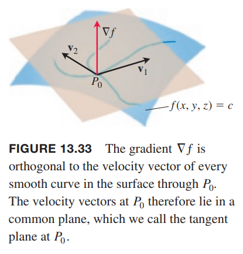
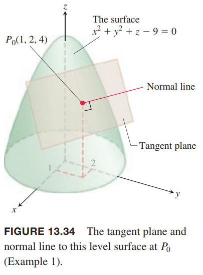
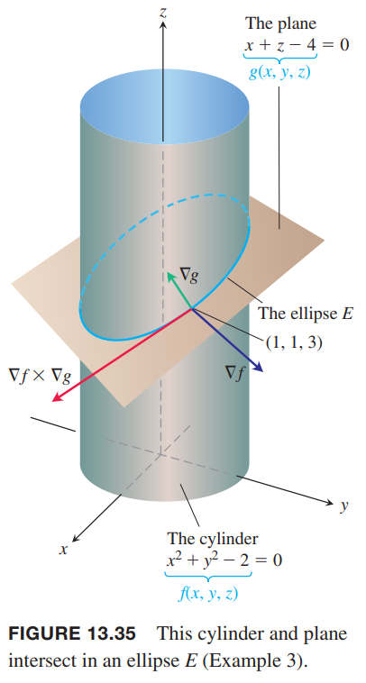
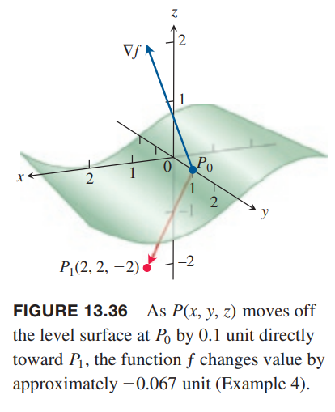
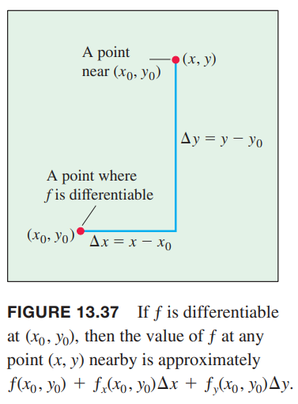
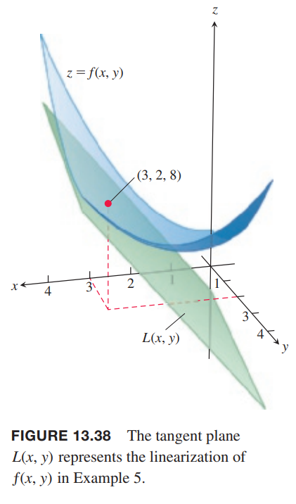
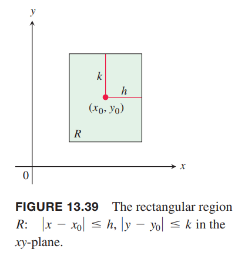
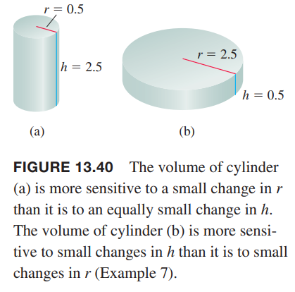

### 切平面与法线
如果 $\boldsymbol{r}(t)=x(t)\boldsymbol{i}+y(t)\boldsymbol{j}+z(t)\boldsymbol{k}$ 是可微函数 $f$ 的等高曲面 $f(x,y,z)=c$ 上的光滑曲线，上一节我们推导得到公式
$$\frac{d}{dt}f(\boldsymbol{r}(t))=\nabla f(\boldsymbol{r}(r))\cdot\boldsymbol{r}'(t)$$
沿着曲线 $\boldsymbol{r}$ 的 $f$ 是常量，所以方程左边的微分是零，因此梯度 $\nabla f$ 与曲线的速度矢量 $\boldsymbol{r}'$ 正交。

现在聚焦于过某点 $P_0$ 的曲线，所有 $P_0$ 处的速度矢量均垂直于 $\nabla f$，所以所有的曲线的切线都位于垂直于 $\nabla f$ 的平面。

**定义**
> 可微函数 $f$ 的等高平面 $f(x,y,z)$ 上点 $P_0$ 处的切平面（`tangent plane`）通过 $P_0$ 且正交与 $\nabla f|_{P_0}$，前提是该点处梯度不为零。
>
> $P_0$ 处的曲面的法线（`normal line`）过 $P_0$ 点且平行于 $\nabla f|_{P_0}$。

**点 $P_0$ 处 $f(x,y,z)=c$ 的切平面方程**
> $$f_x(P_0)(x-x_0)+f_y(P_0)(y-y_0)+f_z(P_0)(z-z_0)=0\tag{1}$$

**点 $P_0$ 处 $f(x,y,z)=c$ 的法线方程**
> $$x=x_0+f_x(P_0)t,y=y_0+f_y(P_0)t,z=z_0+f_z(P_0)t\tag{2}$$

例1 求等高线
$$f(x,y,z)=x^2+y^2+z-9=0$$
在点 $P_0(1,2,4)$ 处的切平面与法线。

解：曲面如下图所示。

首先计算梯度。
$$\nabla f(P_0)=(2x\boldsymbol{i}+2y\boldsymbol{j}+\boldsymbol{k})|_{(1,2,4)}=2\boldsymbol{i}+4\boldsymbol{j}+\boldsymbol{k}$$
那么切平面方程是
$$2(x-1)+4(y-2)+(z-4)=0$$
$$2x+4y+z=14$$
法线方程是
$$x=1+2t,y=2+4t,z=4+t$$

对于光滑曲面 $z=f(x,y)$，我们可以计算点 $P_0(x_0,y_0,z_0),z_0=f(x_0,y_0)$ 处的切平面。首先 $z=f(x,y)$ 可以改写为 $f(x,y)-z=0$，那么曲面 $z=f(x,y)$ 可以看作是函数 $F(x,y,z)=f(x,y)-z=0$ 的等高面。对 $F$ 求偏微分
$$\begin{aligned}
F_x&=\frac{\partial}{\partial x}(f(x,y)-z)=f_x-0&&=f_x\\
F_y&=\frac{\partial}{\partial y}(f(x,y)-z)=f_y-0&&=f_y\\
F_z&=\frac{\partial}{\partial z}(f(x,y)-z)=0-1&&=-1
\end{aligned}$$
等高面在 $P_0$ 的处的切平面方程
$$F_x(P_0)(x-x_0)+F_y(P_0)(y-y_0)+F_z(P_0)(z-z_0)=0$$
可以简写作
$$f_x(x_0,y_0)(x-x_0)+f_y(x_0,y_0)(y-y_0)-(z-z_0)=0\tag{3}$$
前提是 $P_0$ 处的梯度不为零。

例2 求曲面 $z=x\cos y-ye^x$ 在点 $(0,0,0)$ 处的切平面。

解：首先计算 $f(x,y)=x\cos y-ye^x$ 在点 $(0,0,0)$ 处的偏导数。
$$f_x(0,0,0)=(\cos y-ye^x)|_{(0,0)}=1-0=1$$
$$f_y(0,0,0)=(-x\sin y-e^x)|_{(0,0)}=0-1=-1$$
切平面是
$$(x-0)-(y-0)-(z-0)=0$$
即
$$x-y-z=0$$

例3 曲面
$$f(x,y,z)=x^2+y^2-2=2$$
和曲面
$$g(x,y,z)=x+z-4=0$$
相交椭圆 $E$。如下图所示。求 $E$ 在点 $P_0(1,1,3)$ 处的切线的参数方程。

解：在 $P_0$ 处的切线垂直于 $\nabla f,\nabla g$，因此平行于 $\boldsymbol{v}=\nabla f\times\nabla g$。因此
$$\begin{aligned}
\nabla f|_{(1,1,3)}&=(2x\boldsymbol{i}+2y\boldsymbol{j})|_{(1,1,3)}=2\boldsymbol{i}+2\boldsymbol{j}\\
\nabla g|_{(1,1,3)}&=(\boldsymbol{i}+\boldsymbol{k})|_{(1,1,3)}=\boldsymbol{i}+\boldsymbol{k}\\
\boldsymbol{v}&=\begin{vmatrix}
\boldsymbol{i}&\boldsymbol{j}&\boldsymbol{k}\\
2&2&0\\
1&0&1
\end{vmatrix}=2\boldsymbol{i}-2\boldsymbol{j}-2\boldsymbol{k}
\end{aligned}$$
那么切线的参数方程是
$$x=1+2t,y=1-2t,z=3-2t$$

### 估计指定方向的变化
如果从 $P_0$ 处移动很小的距离 $ds$，我们可以估计函数 $f$ 的变化。如果 $f$ 是单变量函数，那么
$$df=f'(P_0)ds$$
对于二元或多元函数，方向导数有类似作用，那么
$$df=(\nabla f(P_0)\cdot\boldsymbol{u})ds$$
其中 $\boldsymbol{u}$ 是从 $P_0$ 开始移动的方向。

**估计函数 $f$ 在 $\boldsymbol{u}$ 方向上的变化**
> 当从点 $P_0$ 沿着 $\boldsymbol{u}$ 方向移动很小的距离 $s$，$f$ 的变化是
> $$df=(\nabla f(P_0)\cdot\boldsymbol{u})ds$$

例4 估计函数
$$f(x,y,z)=y\sin x+2yz$$
从点 $P_0(0,1,0)$ 向点 $P_1(2,2,-2)$ 方向移动 0.1 各单位长度时值的变化。

解：从点 $P_0(0,1,0)$ 到点 $P_1(2,2,-2)$ 的方向矢量是
$$\boldsymbol{u}=\frac{\overrightarrow{P_0P_1}}{|\overrightarrow{P_0P_1}|}=\frac{\overrightarrow{P_0P_1}}{3}=\frac{2}{3}\boldsymbol{i}+\frac{1}{3}\boldsymbol{j}-\frac{2}{3}\boldsymbol{k}$$
点 $P_0$ 处的梯度是
$$\nabla f(0,1,0)=((y\cos x)\boldsymbol{i}+(\sin x+2z)\boldsymbol{j}+(2y)\boldsymbol{k})|_{(0,1,0)}=\boldsymbol{i}+2\boldsymbol{k}$$
那么
$$\nabla f(0,1,0)\cdot\boldsymbol{u}=\frac{2+0-4}{3}=-\frac{2}{3}$$
所以
$$df=(\nabla f(P_0)\cdot\boldsymbol{u})ds=-\frac{2}{3}\cdot 0.1=-0.0667$$

### 如何线性化二元函数
二元函数可以相当复杂，我们需要找到一种近似的方法，在应用给定的精度内很容易的给出解。这和单变量函数使用线性近似是类似的。

假定希望找到 $z=f(x,y)$ 在点 $(x_0,y_0)$ 附近的近似，已知 $f$ 可微和 $f,f_x,f_y$ 的值。如果从 $(x_0,y_0)$ 移动到附近一点 $(x,y)$，增量是 $\Delta x=x-x_0,\Delta y=y-y_0$，那么根据 13.3 的可微性定义有
$$f(x,y)-f(x_0,y_0)=f_x(x_0,y_0)\Delta x+f_y(x_0,y_0)\Delta y+\varepsilon_1\Delta x+\varepsilon_2\Delta y$$

随着 $\Delta x\Delta y\to 0$，$\varepsilon_1,\varepsilon_2\to 0$。如果 $\Delta x,\Delta y$ 很小，$\varepsilon_1\Delta x,\varepsilon_2\Delta y$ 更小，因此有如下近似
$$f(x,y)\approx f(x_0,y_0)+f_x(x_0,y_0)(x-x_0)+f_y(x_0,y_0)(y-y_0)$$
换句话说，只要 $\Delta x,\Delta y$ 足够小，$f$ 近似等于线性函数 $L$ 的值。

**定义**
> $f(x,y)$ 是可微函数，在点 $(x_0,y_0)$ 处的线性化（`linearization`）是函数
> $$L(x,y)=f(x_0,y_0)+f_x(x_0,y_0)(x-x_0)+f_y(x_0,y_0)(y-y_0)$$
> 近似
> $$f(x,y)\approx L(x,y)$$
> 是 $f(x,y)$ 在 $(x_0,y_0)$ 处的标准线性近似（`standard linear approximation`）。

从 $(3)$ 可以得到平面 $z=L(x,y)$ 是曲面 $z=f(x,y)$ 在点 $P_0(x_0,y_0)$ 的切平面。因此二元函数的线性化是切平面近似，这与单变量函数的线性近似是切线近似是一致的。

例5 求
$$f(x,y)=x^2-xy+\frac{1}{2}y^2+3$$
在点 $(3,2)$ 处的线性化。

解：先计算在 $(3,2)$ 处 $f,f_x,f_y$ 的值。
$$\begin{aligned}
f(3,2)&=\bigg(x^2-xy+\frac{1}{2}y^2+3\bigg)\bigg|_{(3,2)}=8\\
f_x(3,2)&=(2x-y)|_{(3,2)}=4\\
f_y(3,2)&=(-x+y)|_{(3,2)}=-1
\end{aligned}$$
所以
$$\begin{aligned}
L(x,y)&=f(x_0,y_0)+f_x(x_0,y_0)(x-x_0)+f_y(x_0,y_0)(y-y_0)\\
&=8+4(x-3)-(y-2)\\
&=4x-y-2
\end{aligned}$$

当我们使用线性函数 $L(x,y)$ 在 $(x_0,y_0)$ 近似可微函数 $f(x,y)$ 时，一个问题是近似有多精确。

在以 $(x_0,y_0)$ 为中心的矩形 $R$ 内，找到 $|f_{xx}|,|f_{yy}|,|f_{xy}|$ 的公共上界 $M$，那么 $R$ 上的误差 $E$ 能够用简单的式子表示（13.9 给出证明）。误差的定义是 $E(x,y)=f(x,y)-L(x,y)$。

**标准线性近似的误差**
> 在包含中心位于 $(x_0,y_0)$ 的矩形 $R$ 的开放集合上 $f$ 有连续的一阶、二阶偏微分，在 $R$ 上，$M$ 是 $|f_{xx}|,|f_{yy}|,|f_{xy}|$ 的任意上界，那么在 $R$ 上用线性近似
> $$L(x,y)=f(x_0,y_0)+f_x(x_0,y_0)(x-x_0)+f_y(x_0,y_0)(y-y_0)$$
> 替代 $f(x,y)$ 的误差 $E(x,y)$ 满足
> $$|E(x,y)|\leq\frac{1}{2}M(|x-x_0|+|y-y_0|)^2$$

对于给定 $M$ 而言，想要 $|E(x,y)|$ 小，就要使得 $|x-x_0|,|y-y_0|$ 小。

### 微分
对于单变量函数 $y=f(x)$，当 $x$ 从 $a$ 到 $a+\Delta x$，$f$ 的变化是
$$\Delta f=f(a+\Delta x)-f(a)$$
$f$ 的微分是
$$df=f'(a)\Delta x$$
类似的，假定可微函数 $f(x,y)$ 在点 $(x_0,y_0)$ 处偏微分存在，移动到附近一点 $(x_0+\Delta x,y_0+\Delta y)$，$f$ 的变化是
$$\Delta f=f(x_0+\Delta x,y_0+\Delta y)-f(x_0,y_0)$$
基于 $L(x,y)$ 的定义，使用记号 $x-x_0=\Delta x,y-y_0=\Delta y$，可以直接得到 $L$ 的变化
$$\Delta L=L(x_0+\Delta x,y_0+\Delta y)-L(x_0,y_0)=f_x(x_0,y_0)\Delta x+f_y(x_0,y_0)\Delta y$$
微分 $dx,dy$ 是独立变量，可以是任意值。不过通常 $dx=\Delta x=x-x_0,dy=\Delta y=y-y_0$，那么可以得到 $f$ 的微分定义。

**定义**
> 从 $(x_0,y_0)$ 到 $(x_0+dx,y_0+dy)$，$f$ 的线性化的变化
> $$df=f_x(x_0,y_0)dx+f_y(x_0,y_0)dy$$
> 称为 $f$ 的全微分（`total differential`）。

例6 圆柱体半径是 1cm，高 5cm，偏差分别是 $dr=+0.03,dh=-0.1$，估算体积的误差。

解：圆柱体体积是 $V=\pi r^2h$，那么
$$\Delta V\approx dV=V_r(r_0,h_0)dr+V_h(r_0,h_0)dh$$
代入偏导数
$$V_r=2\pi rh,V_h=\pi r^2$$
得到
$$\begin{aligned}
dV&=2\pi r_0h_0dr+\pi r^2dh\\
&=2\pi(1)(5)(0.03)+\pi(1)^2(-0.1)\\
&=0.2\pi\\
&\approx 0.63
\end{aligned}$$

例7 半径为 0.5m 高为 2.5m 的不锈钢圆柱体。对于半径和高度的微小变化，体积的变化有多敏感？

解：利用上一题的信息有
$$\begin{aligned}
dV&=V_r(0.5,2.5)dr+V_h(0.5,2.5)dh\\
&=(2\pi rh)_{(0.5,2.5)}dr+(\pi r^2)_{(0.5,2.5)}dh\\
&=2.5\pi dr+0.25\pi dh
\end{aligned}$$
$r$ 变化一个单元，体积变化 2.5 个单元。$h$ 变化一个单元，体积变化 0.25 个单元。相比 $h$，体积对 $r$ 的变化要敏感十倍。

相反，如果 $r=2.5,h=0.5$，那么
$$dV=(2\pi rh)_{(2.5,0.5)}dr+(\pi r^2)_{(2.5,0.5)}dh=2.5\pi dr+6.25\pi dh$$
此时，体积对 $h$ 的变化更敏感。

### 多元函数
上述的分析对于超过两个变量的函数也适用。

1. $f(x,y,z)$ 在 $P_0(x_0,y_0,z_0)$ 处的线性化是
$$L(x,y,z)=f(P_0)+f_x(P_0)(x-x_0)+f_y(P_0)(y-y_0)+f_z(P_0)(z-z_0)$$

2. 在包含以 $P_0$ 为中心的立方体 $R$ 的开区间上，$f$ 的二阶导连续，并且 $|f_{xx}|,|f_{yy}|,|f_{zz}|,|f_{xy}|,|f_{yz}|,|f_{zx}|$ 在 $R$ 上小于等于 $M$。适用 $L$ 近似 $f$ 的误差 $E(x,y,z)=f(x,y,z)-L(x,y,z)$ 满足不等式
$$|E|\leq\frac{1}{2}M(|x-x_0|+|y-y_0|+|z-z_0|)^2$$

3. $f$ 的二阶导数是连续的，$x,y,z$ 从 $x_0,y_0,z_0$ 开始有很小的变化 $dx,dy,dz$，那么全微分
$$df=f_x(P_0)dx+f_y(P_0)dy+f_z(P_0)dz$$
是 $f$ 变化的近似。

例8 求
$$f(x,y,z)=x^2-xy+3\sin z$$
在点 $(x_0,y_0,z_0)=(2,1,0)$ 的线性近似 $L(x,y,z)$。在区域
$$R:|x-2|\leq 0.01,|y-1|\leq 0.02,|z|\leq 0.01$$
上求误差上界。

解：首先计算
$$f(2,1,0)=2$$
$$f_x(2,1,0)=3$$
$$f_y(2,1,0)=-2$$
$$f_z(2,1,0)=3$$
那么
$$L(x,y,z)=2+(3)(x-2)+(-2)(y-1)+(3)(z-0)=3x-2y+3z-2$$
由于
$$f_{xx}=2,f_{yy}=0,f_{zz}=-3\sin z,f_{xy}=-1,f_{yz}=0,f_{zx}=0$$
并且
$$|-3\sin z|\leq 3\sin 0.01\approx 0.03$$
那么 $M=2$ 是这些二阶导的一个上界。因此误差满足不等式
$$|E|\leq\frac{1}{2}(2)(0.01+0.02+0.01)^2=0.0016$$
