二元连续函数在封闭有界的定义域上存在极值。如下图所示。这一节主要分析这些极值点的特性。

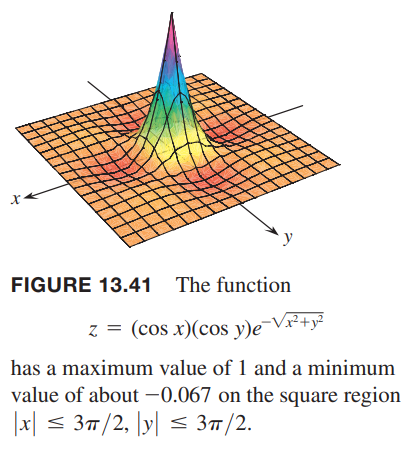

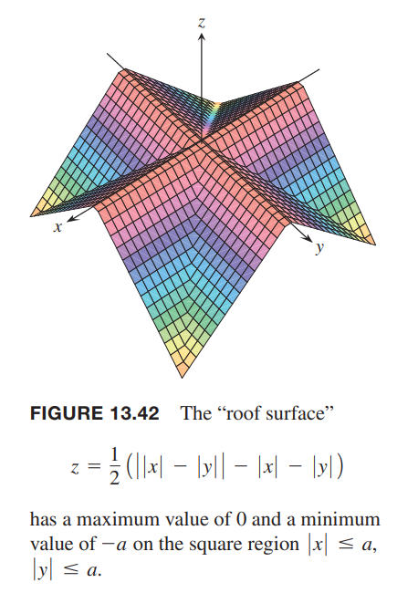

### 局部极值的导数测试
对于一元函数而言，极值出现在有水平切线的地方。这些点处可能是局部最大值、局部最小值或者是拐点。对于二元函数 $f(x,y)$ 而言，需要寻找 $z=f(x,y)$ 上有水平切面的点，这些点可能是局部最大值、局部最小值或鞍点。

**定义**
> 令 $f(x,y)$ 在包含 $(a,b)$ 的区域 $R$ 上有定义，那么
> 如果对在 $(a,b)$ 为中心的开放圈盘区域的定义域内的点 $(x,y)$ 都有 $f(a,b)\geq f(x,y)$，那么 $f(a,b)$ 是局部最大值（`local maximum`）。
> 如果对在 $(a,b)$ 为中心的开放圈盘区域的定义域内的点 $(x,y)$ 都有 $f(a,b)\leq f(x,y)$，那么 $f(a,b)$ 是局部最小值（`local minimum`）。

局部最小值对应谷底，局部最大值对应着峰顶。如下图所示。如果这些点的切面存在，那么是水平的。局部极值也称为相对极值（`relative extrema`）。

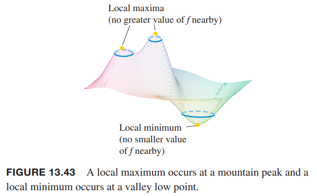

和一元函数求极值点类似，首先要进行一阶导测试。

**定理 10 局部极值的一阶偏微分测试**
> 如果 $f(x,y)$ 在定义域内的内部点 $(a,b)$ 处是最大值或最小值，并且带带你出的一阶偏微分存在，那么
> $$f_x(a,b)=0,f_y(a,b)=0$$

证明：如果 $f$ 在 $(a,b)$ 处有局部极值，那么函数 $g(x)=f(x,b)$ 在 $x=a$ 处有局部极值。如下图所示。因此 $g'(a)=0$，即 $g'(a)=f_x(a,b)=0$。类型的，令 $h(y)=f(a,y)$ 可以证明 $f_y(a,b)=0$。

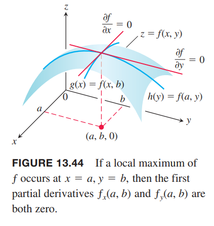

如果用 $f_x(a,b)=f_y(a,b)=$ 代入到点 $(a,b)$ 处的切平面方程
$$f_x(a,b)(x-a)+f_y(a,b)(y-b)-(z-f(a,b))=0$$
得到简化方程
$$z=f(a,b)$$
这是一个水平的切平面。

**定义**
> 函数 $f(x,y)$ 定义域内部 $f_x=f_y=0$ 的点和一阶偏微分其一或两者都不存在的点称为临界点（`critical point`）。

因此极值只可能在临界点和边界点。对于一元可微函数而言，不是所有临界点都是极值点，也可能是拐点。二元可微函数称为鞍点。

**定义**
> 如果对在 $(a,b)$ 为中心的开放圈盘区域的定义域内的点 $(x,y)$，有的是 $f(x,y)>f(a,b)$，有的是 $f(x,y)<f(a,b)$，那么曲面 $z=f(x,y)$ 上的点 $(a,b,f(a,b))$ 称为鞍点（`saddle point`）。

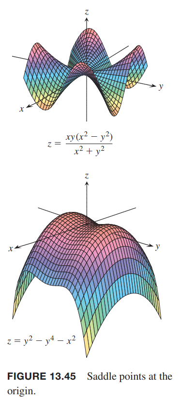

例1 求函数
$$f(x,y)=x^2+y^2-4y+9$$
的极值。

解：$f$ 在整个平面上都有定义，所以没有边界点。偏微分 $f_x=2x,f_y=2y-4$ 在整个定义域上都存在。那么极值点只可能在点
$$f_x=2x=0,f_y=2y_4=0$$
这个可能的点是 $(0,2)$，此时 $f$ 的值是 5。由于 $f(x,y)=x^2+(x-2)^2+5\geq 5$，因此临界点 $(0,2)$ 是局部最小。

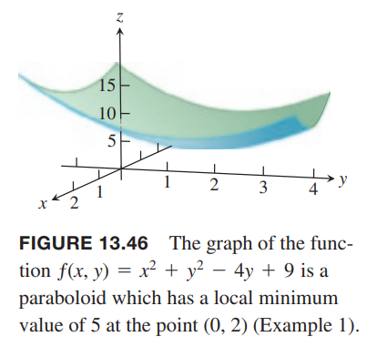

例2 求
$$f(x,y)=y^2-x^2$$
的局部极值。

解：$f$ 的定义域是整个平面，没有边界点，偏微分 $f_x=-2x,f_y=2y$ 整个定义域上都存在。因此，局部极值只能在点 $(0,0)$ 处。不过，沿着 $x$ 轴，$f(x,0)-x^2<0$，沿着 $y$ 轴，$f(0,y)=y^2>0$。因此，每一个包含 $(0,0)$ 的圆盘内，既包含比 $f(0,0)$ 大的点，也包含比 $f(0,0)$ 小的点。因此原点是鞍点而不是极值点。

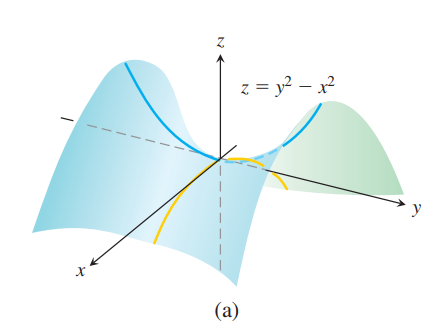

下面的图是 $f$ 的等高线，一组组双曲线，展示了函数在不同象限增加或减少的趋势。

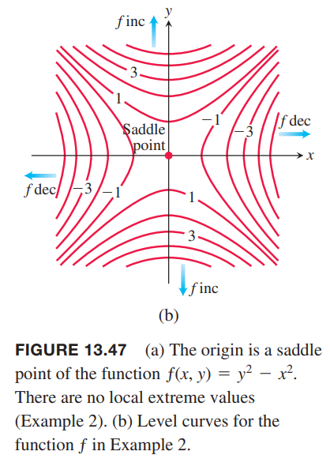

在 $R$ 的内部点 $(a,b)$ 处有 $f_x=f_y=0$ 也不保证 $f$ 有局部极值。如果 $f$ 一阶和二阶偏微分都在 $R$ 上连续，那么下面定理能够帮助我们判断是否是极值点。13.9 小节会给出证明。

**定理 11 局部极值的二阶偏微分测试**
> 如果 $f(x,y)$ 的一阶偏微分和二阶偏微分在以 $(a,b)$ 为圆心的圆上都连续，且 $f_x(a,b)=f_y(a,b)=0$，那么
>
> * 如果在 $(a,b)$ 处有 $f_{xx}<0,f_{xx}f_{yy}-f_{xy}^2>0$，那么 $f$ 在该点是局部极大值；
> * 如果在 $(a,b)$ 处有 $f_{xx}>0,f_{xx}f_{yy}-f_{xy}^2>0$，那么 $f$ 在该点是局部极小值；
> * 如果在 $(a,b)$ 处有 $f_{xx}f_{yy}-f_{xy}^2<0$，那么该点是鞍点；
> * 如果在 $(a,b)$ 处 $f_{xx}f_{yy}-f_{xy}^2=0$，那么需要使用其他方法判断。

$f_{xx}f_{yy}-f_{xy}^2$ 称为判别式（`discriminant`）或黑塞矩阵（`Hessian`）。下面是其行列式形式
$$f_{xx}f_{yy}-f_{xy}^2=\begin{vmatrix}
f_{xx}&f_{xy}\\
f_{yx}&f_{yy}
\end{vmatrix}$$

上面的定理是说如果判别式在 $(a,b)$ 处是正的，那么曲面向同一个方向弯曲：如果 $f_{xx}<0$，向下弯曲，局部极大值；如果 $f_{xx}>0$，向上弯曲，局部极小值。如果判别式是负数，那么曲面在有的方向上向上弯曲，有的方向上向下弯曲，那么该点是鞍点。

例3 求
$$f(x,y)=xy-x^2-y^2-2x-2y+4$$
的局部极值。

解：对于所有的 $x,y$，函数都有定义且可微，没有边界点。所以极值只能出现在 $f_x,f_y$ 同时为零的点。那么
$$f_x=y-2x-2=0,f_y=x-2y-2=0$$
即
$$x=y=-2$$
因此点 $(-2,-2)$ 是唯一的 $f$ 可能取得极值的点。根据二阶偏微分测试，我们计算二阶偏微分
$$f_{xx}=-2,f_{yy}=-2,f_{xy}=1$$
所以判别式
$$f_{xx}f_{yy}-f_{xy}^2=(-2)(-2)-1^2=3>0$$
结合
$$f_{xx}=-2<0$$
所以在 $(-2,-2)$ 处是极大值。该点的函数值是 $f(-2,-2)=8$。

例4 求
$$f(x,y)=3y^2-2y^3-3x^2+6xy$$
的局部极值。

解：$f$ 处处可导，那么极值只能在
$$f_x=-6x+6y=0,f_y=6y-6y^2+6x$$
由第一个式子得到 $y=x$，由第二个式子得到 $x=0,2$，所以有两个临界点 $(0,0),(2,2)$。

为了判断临界点是否是极值点，测试二阶偏微分。
$$f_{xx}=-6,f_{yy}=6-12y,f_{xy}=6$$
那么判别式是
$$f_{xx}f_{yy}-f_{xy}^2=-36+72y-36=72(y-1)$$
对于 $(0,0)$ 而言，判别式是负值，因此原点是鞍点。在 $(2,2)$ 处，判别式是正数，结合 $f_{xx}=-6$，所以是极大值，$f(2,2)=12-16-12+24=8$。如下图所示。

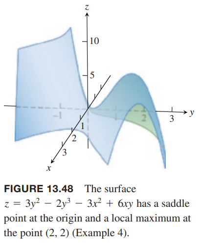

例5 求函数 $f(x,y)=10xye^{-(x^2+y^2)}$ 的临界点，使用二阶偏微分测试哪些点是鞍点、极大值点、极小值点。

解：首先，求一阶偏微分 $f_x,f_y$ 并令它们同时为零来找到临界点。
$$\begin{aligned}
f_x&=10ye^{-(x^2+y^2)}-20x^2ye^{-(x^2+y^2)}\\
&=10y(1-2x^2)e^{-(x^2+y^2)}\\
&=0\\
\Rightarrow&y=0, 1-2x^2=0\\
f_y&=10xe^{-(x^2+y^2)}-20xy^2e^{-(x^2+y^2)}\\
&=10x(1-2y^2)e^{-(x^2+y^2)}\\
&=0\\
\Rightarrow&x=0,1-2y^2=0
\end{aligned}$$
一阶偏微分在各处均连续，那么临界点是
$$(0,0),\bigg(\frac{1}{\sqrt{2}},\frac{1}{\sqrt{2}}\bigg),\bigg(-\frac{1}{\sqrt{2}},\frac{1}{\sqrt{2}}\bigg),\bigg(\frac{1}{\sqrt{2}},-\frac{1}{\sqrt{2}}\bigg),\bigg(-\frac{1}{\sqrt{2}},-\frac{1}{\sqrt{2}}\bigg)$$
然后求二阶偏微分来计算判别式的值。
$$\begin{aligned}
f_{xx}&=-20xy(1-2x^2)e^{-(x^2+y^2)}-40xye^{-(x^2+y^2)}\\
&=-20xy(3-2x^2)e^{-(x^2+y^2)}\\
f_{xy}&=f_{yx}=10(1-2x^2)e^{-(x^2+y^2)}-20y^2(1-2x^2)e^{-(x^2+y^2)}\\
&=10(1-2x^2)(1-2y^2)e^{-(x^2+y^2)}\\
f_{yy}&=-20xy(1-2y^2)e^{-(x^2+y^2)}-40xye^{-(x^2+y^2)}\\
&=-20xy(3-2y^2)e^{-(x^2+y^2)}
\end{aligned}$$
根据临界点的值，可以得到如下表格

| 临界点 | $f_{xy}$ | $f_{xy}$ | $f_{yy}$ | 判别式 $D$ |
|--|--|--|--|--|
| $(0,0)$ | $0$ | $10$ | $0$ | $-100$ |
| $\bigg(\frac{1}{\sqrt{2}},\frac{1}{\sqrt{2}}\bigg)$ | $-\frac{20}{e}$ | $0$ | $-\frac{20}{e}$ | $\frac{400}{e^2}$ |
| $\bigg(-\frac{1}{\sqrt{2}},\frac{1}{\sqrt{2}}\bigg)$ | $\frac{20}{e}$ | $0$ | $\frac{20}{e}$ | $\frac{400}{e^2}$ |
| $\bigg(\frac{1}{\sqrt{2}},-\frac{1}{\sqrt{2}}\bigg)$ | $\frac{20}{e}$ | $0$ | $\frac{20}{e}$ | $\frac{400}{e^2}$ |
| $\bigg(-\frac{1}{\sqrt{2}},-\frac{1}{\sqrt{2}}\bigg)$ | $-\frac{20}{e}$ | $0$ | $-\frac{20}{e}$ | $\frac{400}{e^2}$ |

$(0,0)$ 处 $D<0$，是鞍点。其他四个点 $D>0$，是极值点。对于点 $\bigg(\frac{1}{\sqrt{2}},\frac{1}{\sqrt{2}}\bigg),\bigg(-\frac{1}{\sqrt{2}},-\frac{1}{\sqrt{2}}\bigg)$，$f_{xx}<0$，所以是极大值点，点 $\bigg(-\frac{1}{\sqrt{2}},\frac{1}{\sqrt{2}}\bigg),\bigg(\frac{1}{\sqrt{2}},-\frac{1}{\sqrt{2}}\bigg)$ 处 $f_{xx}>0$，所以是极小值点。曲面图像如下图所示。

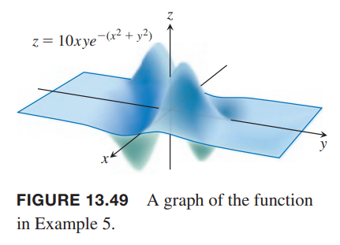

### 在封闭有界区域内的绝对最大值和最小值
下面是求解连续函数 $f(x,y)$ 在一个封闭且有界的区域 $R$ 上绝对最大值和最小值的三步。

1. 罗列 $R$ 的内部临界点，并求对应 $f$ 的值。
2. 罗列 $R$ 可能是最小值或最大值的边界点，并求对应 $f$ 的值。下个例子阐述这个过程。
3. 在上面上个列表中找到绝对最大值和最小值。

例6 求函数
$$f(x,y)=2+2x+4y-x^2-y^2$$
在由 $x=0,y=0,y=9-x$ 围城的三角形（第一象限）这个区域内的绝对最大值和最小值。

解：$f$ 可微，那么极值只可能在内部使得 $f_x=0,f_y=0$ 的点和边界点。如下图所示。

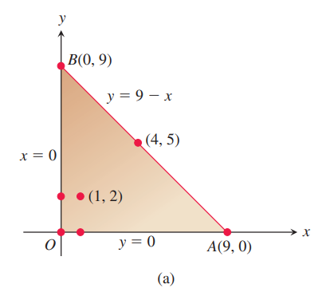

首先看内部点。有
$$f_x=2-2x=0,f_y=4-2y=0$$
因此点 $(1,2)$ 是临界点。此时
$$f(1,2)=7$$

边界点分成三个部分。

第一个部分是线段 $OA$，此时 $y=0$，那么函数是
$$f(x,y)=f(x,0)=2+2x-x^2$$
这是 $x$ 的函数，且定义域是闭区间 $0\leq x\leq 9$。所以极值点可能是边界点
$$x=0,f(2,0)=2$$
$$x=9,f(9,0)=-61$$
或者是内部点
$$f'(x,0)=2-2x=0$$
此时 $x=1$，那么
$$f(1,0)=3$$

第二部分是线段 $OB$，$x=0$，那么
$$f(x,y)=f(0,y)=2+4y-y^2$$
和第一部分类似，这是 $y$ 的函数，定义域是闭区间 $[0,9]$。边界点处
$$f(0,0)=2,f(0,9)=-43$$
和内部点
$$f'(0,y)=4-2y=0$$
此时 $y=2$，那么
$$f(0,2)=6$$

第三部分是线段 $AB$，将 $y=9-x$ 代入函数 $f(x,y)$ 得到
$$f(x,y)=2+2x+4(9-x)-x^2-(9-x)^2=-43+16x-2x^2$$
两个端点之前已经考察过了，这里仅需考虑内部点
$$f'(x,y)=16-4x$$
所以 $x=4$，那么 $y=5$，此时
$$f(4,5)=-11$$

综合上述各个点处 $f$ 的值，最终可以得到在 $(1,2)$ 处取得最大值 7，在 $(9,0)$ 处取得最小值 -61。如下图所示。

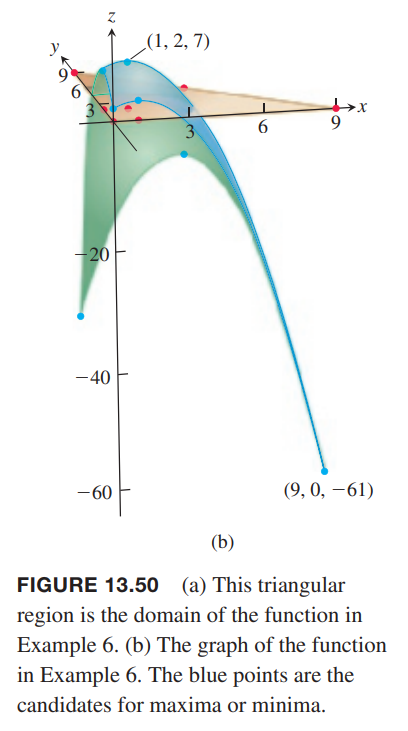

例7 快递公司要求包装盒的长度加上腰围（宽和高的截面的周长）不能超过 270 cm。求最大可接受的包装盒的体积。

解：令 $x,y,z$ 是盒子的长宽高，那么腰围是 $2y+2z$。这里需要最大化体积 $V=xyz$，前提是 $x+2y+2z\leq 270$。如下图所示。

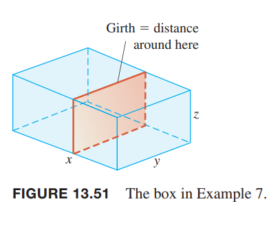

我们可以用两个变量来表示体积。
$$\begin{aligned}
V(y,z)&=(270-2y-2z)yz\\
&=270yz-2y^2z-2yz^2
\end{aligned}$$
令一阶偏微分为零
$$V_y(y,z)=270z-4yz-2z^2=(270-4y-2z)z=0$$
$$V_z(y,z)=270y-2y^2-4yz=(270-2y-4z)y=0$$
那么临界点是 $(0,0),(0,135),(135,0),(45,45)$。在点 $(0,0),(0,135),(135,0)$ 处，体积是零，不可能是最大值。在点 $(45,45)$ 处，应用二阶偏微分测试
$$V_{yy}=-4z,V_{yz}=270-4y-4z,V_{zz}=-4y$$
那么判别式是
$$V_{yy}V_{zz}-V_{yz}^2=16yz-4(135-2y-2z)^2$$
代入 $(45,45)$
$$V_{yy}V_{zz}-V_{yz}^2|_{(45,45)}=16(45)(45)-4(-45)^2>0$$
$$V_{yy}|{(45,45)}=-4(45)<0$$
所以此处有最大值。此时三维分别是 $x=270-2y-2z=90,y=45,z=45$，最大体积是 $V=(90)(45)(45)=182,250$。
