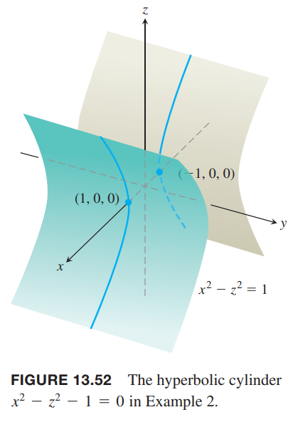
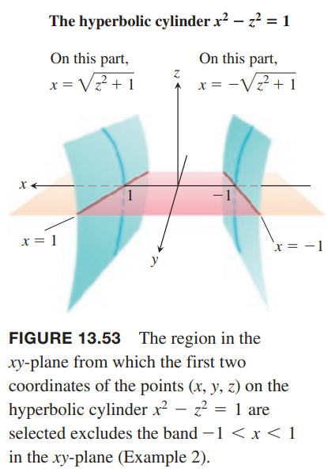
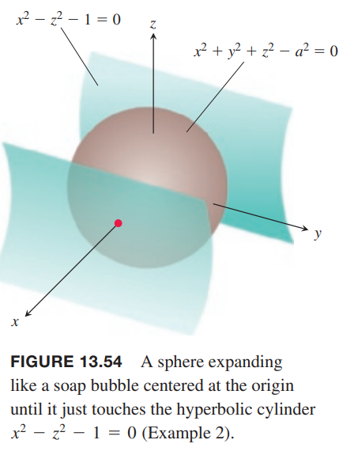
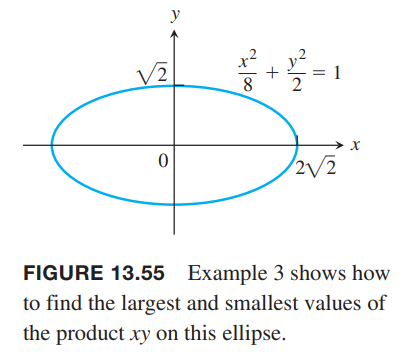
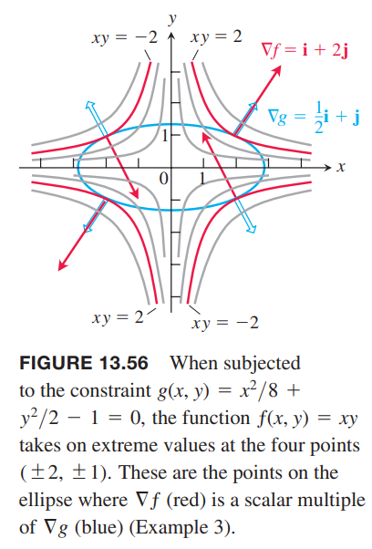
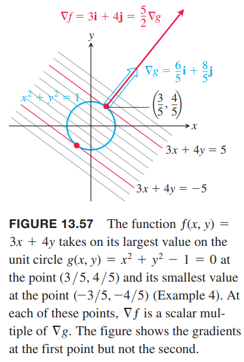
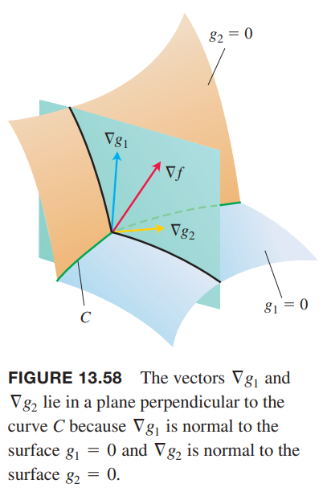
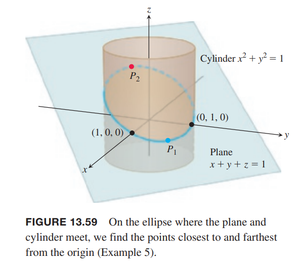

### 受约束的最大值和最小值
我们先看一个能够通过消除一个变量求解带约束条件的最小值问题。

例1 求点 $p(x,y,z)$ 在平面 $2x+y-z-5=0$ 上距离原点最近的点。

解：这个问题本质上就是求解带约束条件
$$2x+y-z=5$$
时
$$|\overrightarrow{OP}|=\sqrt{x^2+y^2+z^2}$$
的最小值。

由于 $|\overrightarrow{OP}|$ 有最小值，即函数
$$f(x,y,z)=x^2+y^2+z^2$$
的最小值，约束条件不变。如果将 $x,y$ 看作自变量那么 $z$ 可以写作
$$z=2x+y-5$$
那么问题就变成了求解
$$h(x,y)=f(x,y,2x+y-5)=x^2+y^2+(2x+y-5)^2$$
的最小值。那么根据上一小节的理论，最小值出现在满足条件
$$h_x=2x+2(2x+y-5)(2)=0,h_y=2y+2(2x+y-5)=0$$
的点。那么
$$10x+4y=20,4x+4y=10$$
即
$$x=\frac{5}{3},y=\frac{5}{6}$$
这里忽略使用二阶偏微分证明此时 $h$ 有最小值。那么 $z$ 坐标是
$$z=2\frac{5}{3}+\frac{5}{6}-5=-\frac{5}{6}$$
因此要求的点是
$$P(\frac{5}{3},\frac{5}{6},-\frac{5}{6})$$
最小距离是
$$\frac{5}{\sqrt{6}}$$

不过，使用替换法解决带约束的并不能总是成功，需要多次尝试。

例2 求双曲柱面
$$x^2-z^2-1=0$$
上距离原点最近的点。

解：柱面如下所示。

我们的目标是在约束
$$x^2-z^2-1=0$$
这个条件下求解函数
$$f(x,y,z)=x^2+y^2+z^2$$
的最小值。如果将 $x,y$ 看作自变量，那么
$$z^2=x^2-1$$
代入函数 $f(x,y,z)$ 得到
$$h(x,y)=x^2+y^2+(x^2-1)=2x^2+y^2-1$$
根据上一节的理论，最小值点是临界点
$$h_x=4x=0,h_y=2y=0$$
即点 $(0,0)$ 处有最小值。不过当 $x=0,y=0$ 时，点不在柱面上。

问题出在那里了呢？对 $h$ 进行一阶偏微分测试点的集合是 $xy$ 平面，同时我们期望这个最小值对应的点就是柱面的最小值出现的点，但是后者的定义域不是整个 $xy$ 平面，不包含 $x=-1,x=1$ 之间的部分。如下图所示。

如果将 $y,z$ 看作自变量就能避免这个问题，那么
$$x^2=z^2+1$$
代入 $f(x,y,z)$ 得到
$$k(y,z)=z^2+1+y^2+z^2=2z^2+y^2+1$$
现在要求 $k$ 的最小值。这里 $k$ 的定义域是 $yz$ 平面，与柱面定义域一致，没有上述问题。$k$ 最小值出现在
$$k_y=2y=0,k_z=4z=0$$
那么
$$x^2=z^2+1=1,x=\pm 1$$
也就是说，距离原点最近的点是 $(\pm 1,0,0)$，距离是 1。从
$$k(y,z)=1+y^2+2z^2\geq 1$$
也能印证这个结论。

解法 2。想象在原点处有一个以原点为圆心的小球，然后膨胀与柱面相切。在接触点，柱面与球面有相同的切平面和法线。如下图所示。

如果令
$$f(x,y,z)=x^2+y^2+z^2-a^2,g(x,y,z)=x^2-z^2-1$$
都为零得到的等高线表示球面和柱面，那么梯度 $\nabla f,\nabla g$ 平行。在任意接触点，能够找一个 $\lambda$（标量）使得
$$\nabla f=\lambda\nabla g$$
或者
$$2x\boldsymbol{i}+2y\boldsymbol{j}+2z\boldsymbol{k}=\lambda(2x\boldsymbol{i}-2z\boldsymbol{k})$$
那么有
$$2x=2\lambda x,2y=0,2z=-2\lambda z$$
由于 $x\neq 0$，那么为了满足 $2x=2\lambda x$
$$2=2\lambda,\lambda=1$$
代入 $2z=-2\lambda z$ 得到 $2z=-2z$，所以 $z=0$。那么我们要求的点是
$$(x,0,0)$$
这个点满足 $x^2-z^2=1$，所以
$$x^2=1,x=\pm 1$$
与之前结论一致。

### 拉格朗日乘子法
上面的例子使用了拉格朗日乘子法（`method of Lagrange multiplier`）。这个方法是说求解带约束条件 $g(x,y,z)=0$ 时函数 $f(x,y,z)$ 的极值点满足
$$\nabla f=\lambda\nabla g$$
其中 $\lambda$ 是标量，称为拉格朗日乘子（`Lagrange multiplier`）。

为了证明其正确性，我们先引入下面这个定理。

**定理 12 正交梯度定理（`The Orthogonal Gradient Theorem`）**
> 假定函数 $f(x,y,z)$ 在某个区域上可微，这个区域上有一光滑曲线
> $$\boldsymbol{r}(t)=x(t)\boldsymbol{i}+y(t)\boldsymbol{j}+z(t)\boldsymbol{k}$$
> 如果 $f$ 在曲线上的点 $P_0$ 处取得极值，那么 $\nabla f$ 在该点处与曲线正交。

证明：曲线上对应的 $f$ 的值由复合函数 $f(x(t),y(t),z(t))$ 给出，对于 $t$ 求导是
$$\frac{df}{dt}=\frac{\partial f}{\partial x}\frac{dx}{dt}+\frac{\partial f}{\partial y}\frac{dy}{dt}+\frac{\partial f}{\partial z}\frac{dz}{dt}=\nabla f\cdot\boldsymbol{r}'$$
在某点 $P_0$ 处 $f$ 取得极值，那么 $df/dt=0$，因此
$$\nabla f\cdot\boldsymbol{r}'=0$$

丢弃定理 12 中的 $z$ 项，得到如下结论。

**推论**
> 可导函数 $f(x,y)$ 在光滑曲线 $\boldsymbol{r}(t)=x(t)\boldsymbol{i}+y(t)\boldsymbol{j}$ 的某点处取得极值，那么在该点处有 $\nabla f\cdot\boldsymbol{r}'=0$。

定理 12 是拉格朗日乘子的关键。假定 $f(x,y,z),g(x,y,z)$ 是可微的，点 $P_0$ 是曲线 $g(x,y,z)=0$ 上的一点，在该点处 $f$ 取得极值。假定在该处 $\nabla g\neq 0$。$f$ 在 $P_0$ 处取得极值，那么 $\nabla f$ 正交与每一条通过 $P_0$ 的曲线的切线。因为 $\nabla g$ 正交与等高线 $g=0$，那么 $\nabla$ 也正交与每一条通过 $P_0$ 的曲线的切线。因此 $\nabla f$ 是 $\nabla g$ 与标量 $\lambda$ 的乘积。

**拉格朗日乘子法**
> 假定 $f(x,y,z),g(x,y,z)$ 可微，当 $g(x,y,z)=0$ 时 $\nabla g\neq 0$。为了求解 $f$ 在约束条件 $g(x,y,z)=0$ 的极值，可以通过解满足下面方程的 $x,y,z,\lambda$ 得到。
> $$\nabla f=\lambda\nabla g,g(x,y,z)=0\tag{1}$$
> 前提是极值存在。

例3 求函数
$$f(x,y)=xy$$
在椭圆
$$\frac{x^2}{8}+\frac{y^2}{2}=1$$
上的最大值和最小值。

解：约束条件是
$$g(x,y)=\frac{x^2}{8}+\frac{y^2}{2}-1$$
求 $f(x,y)$ 的极值。

那么求解满足下面方程的 $x,y,\lambda$
$$\nabla f=\lambda\nabla g,g(x,y)=0$$
梯度方程是
$$y\boldsymbol{i}+x\boldsymbol{j}=\frac{\lambda}{4}x\boldsymbol{i}+\lambda y\boldsymbol{j}$$
那么
$$y=\frac{\lambda}{4}x,x=\lambda y$$
所以
$$y=\frac{\lambda^2}{4}y$$
第一种情况，$y=0$，那么 $x=y=0$，但是该点不在椭圆上。

如果 $y\neq 0$，那么
$$\lambda^2=4,\lambda=\pm 2$$
此时 $x=\pm 2y$，代入约束条件得到
$$\frac{(\pm 2y)^2}{8}+\frac{y^2}{2}=1,4y^2+4y^2=8$$
因此
$$y=\pm 1$$
因此函数 $f(x,y)=xy$ 在四个点 $(\pm 2,1),(\pm 2,-1)$ 取得极值，最大值是 $xy=2$，最小值是 $xy=-2$。

解的几何解释：函数 $f(x,y)=xy$ 的等高线是双曲线 $xy=c$，如下图所示。

距离原点越远，$f$ 的绝对值越大。给定点 $(x,y)$ 在椭圆 $x^2+4y^2=8$ 上，这里要求 $f(x,y)$ 的极值。哪一个与椭圆相交的双曲线距离原点最远呢？与之相切的那条双曲线。在这些点处，任意正交与双曲线的矢量也正交与椭圆，因此 $\nabla f=y\boldsymbol{i}+x\boldsymbol{j}$ 是 $\nabla g=(x/4)\boldsymbol{i}+y\boldsymbol{j}$ 的 $\lambda=\pm 2$ 倍。比如在点 $(2,1)$ 处有
$$\nabla f=\boldsymbol{i}+2\boldsymbol{j},\nabla g=\frac{1}{2}\boldsymbol{i}+\boldsymbol{j}$$
即 $\nabla f=2\nabla g$。在点 $(-2,1)$ 处
$$\nabla f=\boldsymbol{i}-2\boldsymbol{j},\nabla g=-\frac{1}{2}\boldsymbol{i}+\boldsymbol{j}$$
即 $\nabla f=-2\nabla g$。

例4 求函数 $f(x,y)=3x+4y$ 在圆 $x^2+y^2=1$ 上的最大值与最小值。

解：由梯度方程 $\nabla f=\lambda\nabla g$ 得到
$$3\boldsymbol{i}+4\boldsymbol{j}=2x\lambda\boldsymbol{i}+2y\lambda\boldsymbol{j}$$
方程 $(1)$ 隐含了 $\lambda\neq 0$，因此
$$x=\frac{3}{2\lambda},y=\frac{2}{\lambda}$$
代入约束条件
$$x^2+y^2-1=0$$
得到
$$(\frac{3}{2\lambda})^2+(\frac{2}{\lambda})^2=1$$
因此
$$\frac{9}{4\lambda^2}+\frac{4}{\lambda^2}=1,25=4\lambda^2,\lambda=\pm\frac{5}{2}$$
因此
$$x=\pm\frac{3}{5},y=\pm\frac{4}{5}$$
因此 $f(x,y)$ 在点 $\pm(3/5,4/5)$ 处取得极值。
最大值是
$$3(\frac{3}{5})+4(\frac{4}{5})=5$$
最小值是
$$3(-\frac{3}{5})+4(-\frac{4}{5})=-5$$
解的几何意义：函数 $f(x,y)=3x+4y$ 的等高线是 $3x+4y=c$。如下图所示。

距离原点越远，函数 $f$ 越大。那么为了求极值，要找到与圆相切的点。在任意切点，正交与直线的矢量也正交与圆，因此 $\nabla f=3\boldsymbol{i}+4\boldsymbol{j}$ 是 $\nabla g=2x\boldsymbol{i}+2y\boldsymbol{j}$ 的 $\lambda=\pm 5/2$ 倍。比如在点 $(3/5,4/5)$ 处有
$$\nabla f=3\boldsymbol{i}+4\boldsymbol{j},\nabla g=\frac{6}{5}\boldsymbol{i}+\frac{8}{5}\boldsymbol{j}$$
即 $\nabla f=\frac{5}{2}\nabla g$。

### 两个约束条件的拉格朗日乘子
许多应用是要求函数 $f(x,y,z)$ 在两个约束条件下的极值。如果约束条件是
$$g_1(x,y,z)=0,g_2(x,y,z)=0$$
其中 $g_1,g_2$ 都是可微的，并且 $\nabla g_1$ 与 $\nabla g_2$ 不平行。为了求解带两个约束条件时函数 $f$ 的极值，我们引入两个拉格朗日乘子 $\lambda,\mu$。可以通过计算满足下面方程的 $x,y,z,\lambda,\mu$ 找到极值点 $P(x,y,z)$。
$$\nabla f=\lambda\nabla g_1+\mu\nabla g_2,g_1(x,y,z)=0,g_2(x,y,z)=0\tag{2}$$
方程 $(2)$ 的几何解释如下。曲面 $g_1=0,g_2=0$ 相交得到光滑曲线 $C$，如下图所示。

我们要在这条曲线上找到使得 $f$ 取得极值的点。根据定理 12，在这些点处 $\nabla f$ 正交与 $C$。由于 $C$ 上的点位于 $g_1=0,g_2=0$ 平面上，因此在这些点处 $\nabla g_1,\nabla g_2$ 也正交与 $C$。因此 $\nabla f$ 位于由 $\nabla g_1,\nabla g_2$ 确定的平面，即对某些 $\lambda,\mu$ 有 $\nabla f=\lambda\nabla g_1+\mu\nabla g_2$。由于这些点位于两个平面上，因此满足 $g_1(x,y,z)=0,g_2(x,y,z)=0$。

例5 平面 $x+y+z=1$ 与圆柱 $x^2+y^2=1$ 相交得到一个椭圆。如下图所示。求椭圆上距离原点最近和最远的点。

解：要求极值的函数是
$$f(x,y,z)=x^2+y^2+z^2$$
约束条件是
$$g_1(x,y,z)=x^2+y^2-1=0\tag{3}$$
$$g_2(x,y,z)=x+y+z-1=0\tag{4}$$
由梯度方程
$$\nabla f=\lambda\nabla g_1+\mu\nabla g_2$$
得到
$$2x\boldsymbol{i}+2y\boldsymbol{j}+2z\boldsymbol{k}=\lambda(2x\boldsymbol{i}+2y\boldsymbol{j})+\mu(\boldsymbol{i}+\boldsymbol{j}+\boldsymbol{k})$$
$$2x\boldsymbol{i}+2y\boldsymbol{j}+2z\boldsymbol{k}=(2\lambda x+\mu)\boldsymbol{i}+(2y\lambda+\mu)\boldsymbol{j}+\mu\boldsymbol{k}$$
因此
$$2x=2\lambda x+\mu,2y=2\lambda y+\mu,2z=\mu\tag{5}$$
由此可以得到
$$\begin{aligned}
2x=2\lambda x+2z\Rightarrow(1-\lambda)x=z\\
2y=2\lambda y+2z\Rightarrow(1-\lambda)y=z
\end{aligned}\tag{6}$$
从 $(6)$ 可以推理得到：要么 $\lambda=1,z=0$，要么 $\lambda\neq 1,x=y=z/(1-\lambda)$。

将 $z=0$ 代入 $(3),(4)$，得到两个点 $(1,0,0),(0,1,0)$。这两个点位于椭圆上，如上所示。

如果 $x=y$，代入 $(3),(4)$ 得到
$$\begin{aligned}
x^2+x^2&=1&&x+x+z=1\\
2x^2&=1&&z=1-2x\\
x&=\pm\frac{\sqrt{2}}{2}&&z=1\mp\sqrt{2}
\end{aligned}$$
相应的点是
$$P_1=(\frac{\sqrt{2}}{2},\frac{\sqrt{2}}{2},1-\sqrt{2}),P_2=(-\frac{\sqrt{2}}{2},-\frac{\sqrt{2}}{2},1+\sqrt{2})$$
尽管 $P_1,P_2$ 都是局部最大值所在的点，但是 $P_2$ 距离原点更远。

距离原点最近的点是 $(1,0,0),(0,1,0)$，距离是 1。
