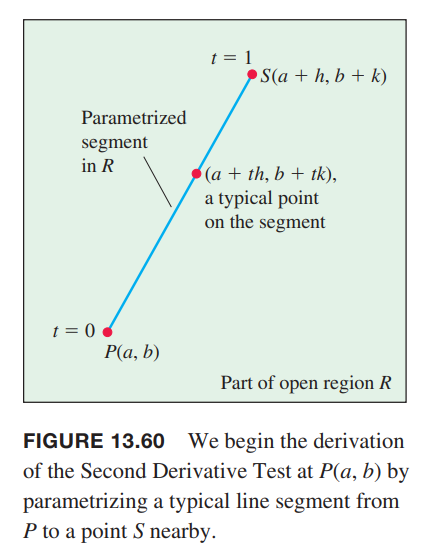

### 推导二阶偏微分测试
令 $f(x,y)$ 在包含点 $P(a,b)$ 的开放区间 $R$ 上有连续的一阶偏微分和二阶偏微分，在 $P$ 处有 $f_x=f_y=0$。如下图所示。令 $h,k$ 自增充分小得到点 $S(a+h,b+k)$，在 $R$ 内连接 $S,P$。

线段 $PS$ 的参数方程是
$$x=a+th,y=b+tk,0\geq t\geq 1$$
如果 $F(t)=f(a+th,b+tk)$，根据链式法则得到
$$F'(t)=f_x\frac{dx}{dt}+f_y\frac{dy}{dt}=hf_x+kf_y$$
由于偏微分连续，所以 $f_x,f_y$ 可导，那么 $F'$ 是 $t$ 的可导函数
$$\begin{aligned}
F''&=\frac{\partial F'}{\partial x}\frac{dx}{dt}+\frac{\partial F'}{\partial y}\frac{dy}{dt}\\
&=\frac{\partial}{\partial x}(hf_x+kf_y)h+\frac{\partial}{\partial y}(hf_x+kf_y)k\\
&=h^2f_{xx}+2hkf_{xy}+k^2f_{yy}
\end{aligned}$$
由于 $F,F'$ 在 $[0,1]$ 上连续，并且 $F'$ 在 $(0,1)$ 上可导，使用泰勒公式展开，其中令 $n=2,a=0$，得到
$$\begin{aligned}
F(1)&=F(0)+F'(0)(1-0)+F''(c)\frac{(1-0)^2}{2}\\
&=F(0)+F'(0)+\frac{1}{2}F''(c)
\end{aligned}\tag{1}$$
其中 $c$ 介于 0 到 1 之间。使用 $f$ 改写上述方程得到
$$f(a+h,b+k)=f(a,b)+hf_x(a,b)+kf_y(a,b)+\frac{1}{2}(h^2f_{xx}+2hkf_{xy}+k^2f_{yy})\bigg|_{(a+ch,b+ck)}\tag{2}$$
由于 $f_x(a,b)=f_y(a,b)=0$，所以上式可以简写为
$$f(a+h,b+k)-f(a,b)=\frac{1}{2}(h^2f_{xx}+2hkf_{xy}+k^2f_{yy})\bigg|_{(a+ch,b+ck)}\tag{3}$$
为了确定 $f$ 在 $(a,b)$ 上是否有极大值，这里需要分析 $f(a+h,b+k)-f(a,b)$ 的符号。根据 $(3)$，差值与
$$Q(c)=(h^2f_{xx}+2hkf_{xy}+k^2f_{yy})\bigg|_{(a+ch,b+ck)}$$
的符号相同。如果 $Q(0)\neq 0$，当 $h,k$ 充分小的时候，$Q(c)$ 的符号与 $Q(0)$ 相同。我们可以通过 $f_{xx}$ 和 $f_{xx}f_{yy}-f_{xy}^2$ 的符号判断
$$Q(0)=h^2f_{xx}(a,b)+2hkf_{xy}(a,b)+k^2f_{yy}(a,b)\tag{4}$$
的符号。公式 $(4)$ 两边同时乘以 $f_{xx}$ 并重写右边的项得到
$$f_{xx}Q(0)=(hf_{xx}+kf_{xy})^2+(f_{xx}f_{yy}-f_{xy}^2)k^2\tag{5}$$

1. 如果在 $(a,b)$ 处 $f_{xx}<0$，且 $f_{xx}f_{yy}-f_{xy}^2>0$，那么对任意充分小且非零的 $h,k$ 而言有 $Q(0)<0$，那么 $f$ 在 $(a,b)$ 处有最大值。
2. 如果在 $(a,b)$ 处 $f_{xx}>0$，且 $f_{xx}f_{yy}-f_{xy}^2>0$，那么对任意充分小且非零的 $h,k$ 而言有 $Q(0)>0$，那么 $f$ 在 $(a,b)$ 处有最小值。
3. 如果在 $(a,b)$ 处 $f_{xx}f_{yy}-f_{xy}^2<0$，那么对任意充分小且非零的 $h,k$ 而言，有的值使得 $Q(0)>0$，有的值使得 $Q(0)<0$。在平面 $z=f(x,y)$ 上任意接近 $P_0(a,b,f(a,b))$ 的点，有的点在 $P_0$ 之上，有的点在 $P_0$ 之下，所以 $f$ 在 $(a,b)$ 处是鞍点。
4. 如果在 $(a,b)$ 处 $f_{xx}f_{yy}-f_{xy}^2=0$，需要其他方式测试。因为 $Q(0)$ 可能是零，无法推导出 $Q(0)$ 的符号。

### 线性近似的误差公式
函数 $f(x,y)$ 与其线性近似 $L(x,y)$ 在 $(x_0,y_0)$ 的差值 $E(x,y)$ 满足不等式
$$|E(x,y)|\leq\frac{1}{2}M(|x-x_0|+|y-y_0|)^2$$
在包含中心位于 $(x_0,y_0)$ 的矩形 $R$ 的开放集合上 $f$ 有连续的一阶、二阶偏微分，在 $R$ 上，$M$ 是 $|f_{xx}|,|f_{yy}|,|f_{xy}|$ 的任意上界。
我们从方程 $(2)$ 开始推导，这里用 $x_0,y_0$ 替代 $a,b$，用 $x-x_0,y-y_0$ 替代 $h,k$，那么
$$\begin{aligned}
f(x,y)&=f(x_0,y_0)+f_x(x_0,y_0)(x-x_0)+f_y(x_0,y_0)(y-y_0)\\
&+\frac{1}{2}((x-x_0)^2f_{xx}+2(x-x_0)(y-y_0)f_{xy}+(y-y_0)^2f_{yy})\bigg|_{(x_0+c(x-x_0),y_0+c(y-y_0))}
\end{aligned}$$
右边前三项是线性近似，因此
$$|E|\leq\frac{1}{2}(|x-x_0|^2|f_{xx}|+2|x-x_0||y-y_0||f_{xy}|+|y-y_0|^2|f_{yy}|)$$
$M$ 是 $R$ 上 $|f_{xx}|,|f_{yy}|,|f_{xy}|$ 的上界，所以
$$\begin{aligned}
|E|&\leq\frac{1}{2}(|x-x_0|^2|M|+2|x-x_0||y-y_0||M|+|y-y_0|^2|M|)\\
&=\frac{1}{2}M(|x-x_0|+|y-y_0|)^2
\end{aligned}$$

### 二元函数的泰勒公式
前面公式中的 $F',F''$ 可以通过将下面的算子作用于 $f(x,y)$ 得到
$$\bigg(h\frac{\partial}{\partial x}+k\frac{\partial}{\partial y}\bigg),\bigg(h\frac{\partial}{\partial x}+k\frac{\partial}{\partial y}\bigg)^2=h^2\frac{\partial^2}{\partial x^2}+2hk\frac{\partial^2}{\partial x\partial y}+k^2\frac{\partial^2}{\partial y^2}$$
从这两项得到通项公式是
$$F^{(n)}(t)=\frac{d^n}{dt^2}F(t)=\bigg(h\frac{\partial}{\partial x}+k\frac{\partial}{\partial y}\bigg)^2f(x,y)\tag{6}$$
也就是说 $d^n/dt^n$ 作用于 $F(t)$ 的结果等于将下面的算子作用于 $f(x,y)$
$$\bigg(h\frac{\partial}{\partial x}+k\frac{\partial}{\partial y}\bigg)^n$$
如果函数 $f$ 一直到 $n+1$ 阶偏微分都在以 $(a,b)$ 为中心的矩形上连续，那么 $F(t)$ 泰勒公式展开式是
$$F(t)=F(0)+F'(0)t+\frac{F''(0)}{2!}t^2+\cdots+\frac{F^{(n)}(0)}{n!}t^n+\text{remainder}$$
代入 $t=1$ 得到
$$F(1)=F(0)+F'(0)+\frac{F''(0)}{2!}+\cdots+\frac{F^{(n)}(0)}{n!}+\text{remainder}$$
将右边级数的前 $n$ 阶偏微分替代为 $(6)$ 的形式，并且加上适当的余项，就得到了下面二元函数的泰勒公式。

**$f(x,y) 在 $(a,b)$ 处的泰勒公式**
> 假定 $f(x,y)$ 一直到 $n+1$ 阶偏微分都在以 $(a,b)$ 为中心的矩形上连续，那么在 $R$ 有
> $$\begin{aligned}
> f(a+h,b+k)&=f(a,b)\\
> &+(hf_x+kf_y)\bigg|_{(a,b)}\\
> &+\frac{1}{2!}(h^2f_{xx}+2hkf_{xy}+k^2f_{yy})\bigg|_{(a,b)}\\
> &+\frac{1}{3!}(h^3f_{xxx}+3h^2kf_{xxy}+3hk^2f_{xyy}+k^3f_{yyy})\bigg|_{(a,b)}\\
> &+\frac{1}{n!}\bigg(h\frac{\partial}{\partial x}+k\frac{\partial}{\partial y}\bigg)^nf\bigg|_{(a,b)}\\
> &+\cdots\\
> &+\frac{1}{(n+1)!}\bigg(h\frac{\partial}{\partial x}+k\frac{\partial}{\partial y}\bigg)^{n+1}f\bigg|_{(a+ch,b+ck)}
> \end{aligned}\tag{7}$$

前 $n$ 个偏微分在 $(a,b)$ 处求值，最后一项在 $(a+ch,b+ck)$ 处求值，该点是 $(a,b)$ 到 $(a+h,b+k)$ 这个线段上的某点。

如果 $(a,b)=(0,0)$，并且将 $h,k$ 视为自变量，使用 $x,y$ 表示，公式 $(7)$ 变成如下形式
$$\begin{aligned}
f(a+x,b+y)&=f(0,0)\\
&+(xf_x+yf_y)\\
&+\frac{1}{2!}(x^2f_{xx}+2xyf_{xy}+y^2f_{yy})\\
&+\frac{1}{3!}(x^3f_{xxx}+3x^2yf_{xxy}+3xy^2f_{xyy}+y^3f_{yyy})\\
&+\frac{1}{n!}\bigg(x\frac{\partial}{\partial x}+y\frac{\partial}{\partial y}\bigg)^nf\\
&+\cdots\\
&+\frac{1}{(n+1)!}\bigg(x\frac{\partial}{\partial x}+y\frac{\partial}{\partial y}\bigg)^{n+1}f\bigg|_{(cx,cy)}
\end{aligned}\tag{8}$$
前 $n$ 个偏微分在 $(0,0)$ 处求值，最后一项在原点到 $(x,y)$ 的线段上的某点 $(cx,cy)$ 处求值。

上面的泰勒公式提供了一种二元函数的多项式近似。前 $n$ 偏微分项给出了多项式，最后一项给出了误差。泰勒公式的前三项是函数的线性近似。通过添加更高阶的项可以提高近似的准确度。

例1 求函数 $f(x,y)=\sin x\sin y$ 在原点处的二次近似。如果 $|x|\leq 0.1,|y|\leq 0.1$，那么近似的精度是多少？

解：公式 $(8)$ 取 $n=2$ 得到
$$\begin{aligned}
f(x,y)&=f(0,0)\\
&+(xf_x+yf_y)\\
&+\frac{1}{2}(x^2f_{xx}+2xyf_{xy}+y^2f_{yy})\\
&+\frac{1}{6}(x^3f_{xxx}+3x^2yf_{xxy}+3xy^2f_{xyy}+y^3f_{yyy})\bigg|_{(cx,cy)}
\end{aligned}$$
下面计算偏微分
$$\begin{aligned}
f(0,0)&=\sin x\sin y\bigg|_{(0,0)}&=0\\
f_x(0,0)&=\cos x\sin y\bigg|_{(0,0)}&=0\\
f_y(0,0)&=\sin x\cos y\bigg|_{(0,0)}&=0\\
f_{xx}(0,0)&=-\sin x\sin y\bigg|_{(0,0)}&=0\\
f_{xy}(0,0)&=\cos x\cos y\bigg|_{(0,0)}&=1\\
f_{yy}(0,0)&=-\sin x\sin y\bigg|_{(0,0)}&=0
\end{aligned}$$
那么
$$f(x,y)=\sin x\sin y\approx 0+(0+0)+\frac{1}{2}(0+2xy+0)=xy$$
即
$$\sin x\sin y\approx xy$$
误差
$$E(x,y)=\frac{1}{6}(x^3f_{xxx}+3x^2yf_{xxy}+3xy^2f_{xyy}+y^3f_{yyy})\bigg|_{(cx,cy)}$$
三阶偏微分是正弦和余弦的积，所以绝对值不会超过 1。代入 $|x|\leq 0.1,|y|\leq 0.1$ 得到
$$|E(x,y)|\leq\frac{1}{6}((0.1)^3+3(0.1)^2(0.1)+3(0.1)(0.1)^2+(0.1)^3)=\frac{8}{6}(0.1)^3\leq 0.00134$$
这里最后一个不等式向上取整。
