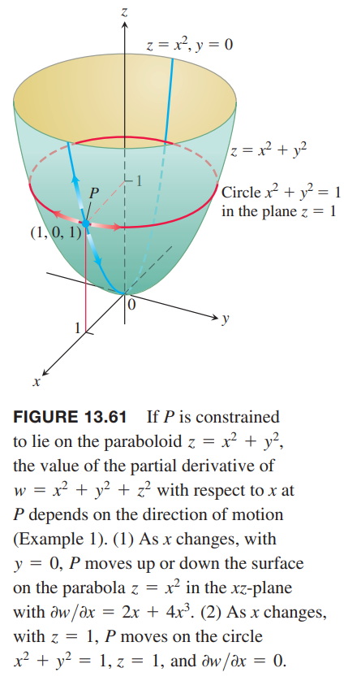

求函数 $w=f(x,y)$ 的偏微分，这里假定 $x,y$ 是自变量。然而在有些应用中不是这样的。比如气体的内能 $U$ 可以表示为 $U=f(P,V,T)$，其中 $P$ 是压强，$V$ 是体积，$T$ 是温度。如果分子间没有相互作用，$P,V,T$ 满足理想气体定理
$$PV=nRT$$
其中 $n,R$ 是常量，这三个变量不是独立的。

### 确定自变量与因变量
如果函数 $w=f(x,y,z)$ 的变量被函数 $z=x^2+y^2$ 约束，$f$ 的偏微分的值与几何意义取决于哪些变量视为自变量，哪些变量视为因变量。当 $w=x^2+y^2+z^2,z=x^2+y^2$ 时，求偏微分 $\partial w/\partial$ 这个例子可以说明选择会影响结果。

例1 如果 $w=x^2+y^2+z^2,z=x^2+y^2$ 时，求偏微分 $\partial w/\partial$。

解：四个未知数 $x,y,z,w$ 两个方程。那么其中两个是自变量，两个是因变量。题目要求 $\partial w/\partial x$，$w$ 是因变量，$x$ 是自变量。那么剩余两个变量有两种选择：$y$ 是自变量而 $z$ 是因变量；$z$ 是自变量而 $y$ 是因变量。

不过哪种情况，可以通过 $z=x^2+y^2$ 代入 $w$ 消除因变量，将 $w$ 表示为自变量的函数，然后求偏微分。

第一种情况，因变量是 $z$，那么直接将 $z=x^2+y^2$ 代入 $w$ 即可。因此
$$\begin{aligned}
w&=x^2+y^2+z^2\\
&=x^2+y^2+(x^2+y^2)^2\\
&=x^2+y^2+x^4+2x^2y^2+y^4
\end{aligned}$$
因此
$$\frac{\partial w}{\partial x}=2x+4x^3+4xy^2\tag{1}$$
对于第二种情况，$x,z$ 是自变量，将 $y^2=z-x^2$ 代入 $w$ 得到
$$w=x^2+y^2+z^2=x^2+(z-x^2)+z^2=z+z^2$$
因此
$$\frac{\partial w}{\partial x}=0\tag{2}$$
公式 $(1),(2)$ 的 $\partial w/\partial x$ 相当不同。我们不能通过关系 $z=x^2+y^2$ 将其中一个变换成另外一个。因此，$\partial w/\partial x$ 有两个值。

下面通过分析 $(1),(2)$ 的几何意义来解释为什么会不同。函数 $w=x^2+y^2+z^2$ 是点 $(x,y,z)$ 到原点的距离。条件 $z=x^2+y^2$ 是说点位于如下图所示的旋转抛物面上。只能在曲面上移动的点 $P(x,y,z)$ 处计算 $\partial w/\partial x$ 的意义是什么？当 $P$ 是 $(1,0,1)$ 时 $\partial w/\partial x$ 的值是多少？

如果 $x,y$ 是自变量，求 $\partial w/\partial x$ 时将 $y$ 看作固定值，上面的例子是 $y=0$。因此 $P$ 沿着 $xz$ 平面上的抛物线 $z=x^2$ 运动。当 $P$ 在该抛物线上运动，$w$，$P$ 到原点的距离发生变化。此时就是上面第一种解
$$\frac{\partial w}{\partial x}=2x+4x^3+4xy^2$$
在点 $P(1,0,1)$ 处，偏微分的值是
$$\frac{\partial w}{\partial x}=2+4+0=6$$
如果 $x,z$ 是自变量，求 $\partial w/\partial x$ 时将 $z$ 看作固定值，上面的例子是 $z=1$。因此 $P$ 沿着 $z=1$ 这个平面上的圆运动。当 $P$ 沿着圆运动时，距离原点的距离不变，那么距离的平方 $w$ 也不会发生变化。因此
$$\frac{\partial w}{\partial x}=0$$

### 当 $w=f(x,y,z)$ 受另一个方程约束时如何求偏微分 $\frac{\partial w}{\partial x}$
根据上面的例子，大约有三个步骤求解 $\frac{\partial w}{\partial x}$。

1. 决定哪些变量是自变量，哪些变量是因变量。这个决定可以基于物理、理论上下文信息。
2. 消除因变量用自变量表示 $w$。
3. 和之前一样求导即可。

第二步可能很难做到或者做不到，此时可以用隐式法求解。

例2 如果
$$w=x^2+y^2+z^2,z^3-xy+yz+y^3=1$$
求点 $(x,y,z)=(2,-1,1)$ 处 $\frac{\partial w}{\partial x}$ 的值，其中 $x,y$ 是自变量。

解：不能很方便消除 $z$ 完全使用自变量表示 $w$。将 $x,y$ 看作自变量，$w,z$ 看作因变量，对两个方程进行微分操作，得到
$$\frac{\partial w}{\partial x}=2x+2z\frac{\partial z}{\partial x}\tag{3}$$
$$3z^2\frac{\partial z}{\partial x}-y+y\frac{\partial z}{\partial x}=0\tag{4}$$
现在可以用 $x,y,z$ 表示 $\frac{\partial w}{\partial x}$ 了。从 $(4)$ 可以计算得到 $\frac{\partial z}{\partial x}$
$$\frac{\partial z}{\partial x}=\frac{y}{y+3z^2}$$
代入 $(3)$
$$\frac{\partial w}{\partial x}=2x+\frac{2yz}{y+3z^2}$$
在点 $(x,y,z)=(2,-1,1)$ 处的偏微分值是
$$\frac{\partial w}{\partial x}\bigg|_{(2,-1,1)}=2(2)+\frac{2(-1)(1)}{-1+3(1)^2}=3$$

### 记号
假定了自变量后，偏微分可以用如下记号表示
$$\bigg(\frac{\partial w}{\partial x}\bigg)_y$$
$$\bigg(\frac{\partial w}{\partial y}\bigg)_{x,t}$$
第一个式子中 $x,y$ 是自变量，第二个式子中 $y,x,t$ 是自变量。

例3 如果
$$w=x^2+y-z+\sin t,x+y=t$$
求
$$\bigg(\frac{\partial w}{\partial x}\bigg)_{y,z}$$
解：$x,y,z$ 是自变量，那么
$$\begin{aligned}
t&=x+y\\
w&=x^2+y-z+\sin (x+y)\\
\bigg(\frac{\partial w}{\partial x}\bigg)_{y,z}&=2x+0-0+\cos(x+y)\frac{\partial}{\partial x}(x+y)\\
&=2x+\cos(x+y)
\end{aligned}$$

### 箭头图
对于例 3 这类问题，给出箭头图能够帮助梳理变量之间的关系。如果
$$w=x^2+y-z+\sin t,x+y=t$$
当 $x,y,z$ 是自变量时，要求 $\frac{\partial w}{\partial x}$，那么箭头图如下所示
$$\begin{pmatrix}
x\\y\\z
\end{pmatrix}\rightarrow\begin{pmatrix}
x\\y\\z\\t
\end{pmatrix}\rightarrow w\tag{5}$$
最左边是自变量，中间部分是中间变量，最右边是因变量。

为了避免自变量和中间变量使用同样的变量名导致混淆，可以对中间变量进行重命名。令 $u=x,v=y,s=z$ 表示中间变量，那么箭头图如下所示
$$\begin{pmatrix}
x\\y\\z
\end{pmatrix}\rightarrow\begin{pmatrix}
u\\v\\s\\t
\end{pmatrix}\rightarrow w\tag{6}$$
那么
$$w=u^2+v-s+\sin t$$
其中
$$u=x,v=y,s=z,t=x+y$$
为了求 $\partial w/\partial x$，使用链式法则
$$\begin{aligned}
\frac{\partial w}{\partial x}&=\frac{\partial w}{\partial u}\frac{\partial u}{\partial x}+\frac{\partial w}{\partial v}\frac{\partial v}{\partial x}+\frac{\partial w}{\partial s}\frac{\partial s}{\partial x}+\frac{\partial w}{\partial t}\frac{\partial t}{\partial x}\\
&=(2u)(1)+(1)(0)+(-1)(0)+(\cos t)(1)\\
&=2u+\cos t\\
&=2x+\cos(x+y)
\end{aligned}$$
