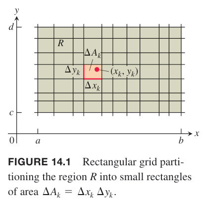
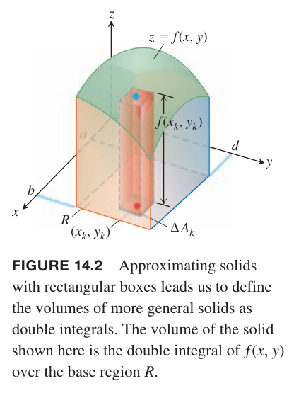
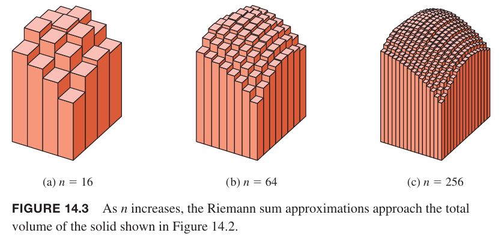
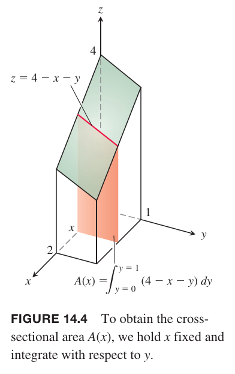
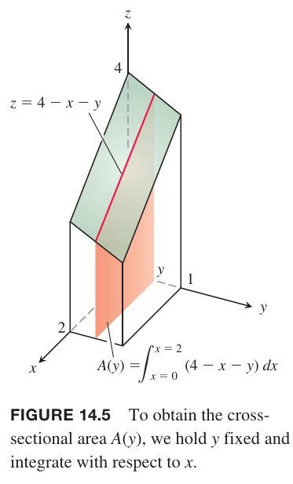
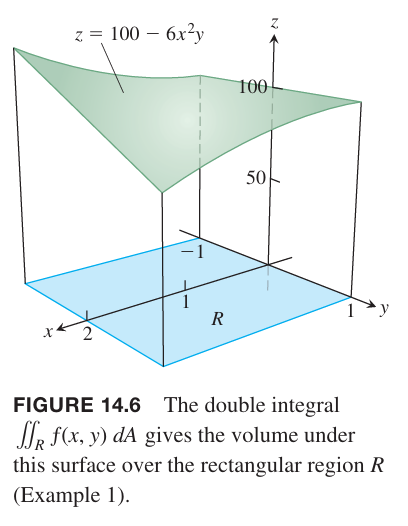
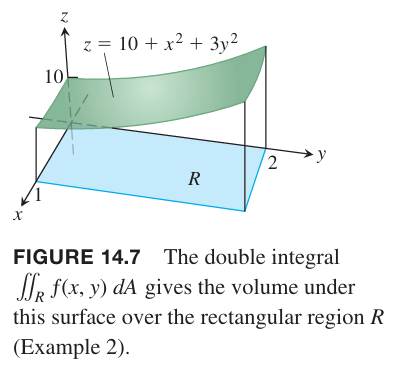

这一节会定义二元函数 $f(x,y)$ 在有界矩形 $R$ 上的二重积分。

### 二重积分
函数在矩形区域 $R$
$$R: a\leqx\leq b,c\leq y\leq d$$
上有定义。使用平行于 $x$ 轴和 $y$ 轴的网格线将 $R$ 分割成小矩形。如下图所示。

这些线将 $R$ 分割成 $n$ 个矩形，随着小矩形宽度和高度的减小，$n$ 在增大。这些矩形称为 $R$ 的分区（`partition`）。宽度 $\Delta x$ 和高度 $\Delta y$ 的矩形面积是 $\Delta A=\Delta x\Delta y$。如果给 $R$ 中的小矩形排序，对应的面积是 $\Delta A_1,\Delta A_2,\cdots,\Delta A_n$，其中 $\Delta A_k$ 是第 $k$ 个小矩形的面积。

为了求 $R$ 上的黎曼和，在第 $k$ 个小矩形内任选一点 $(x_k,y_k)$，用该点处的函数 $f$ 的值乘以对应面积 $\Delta A_k$，然后相加即可。
$$S_n=\sum_{k=1}^nf(x_k,y_k)\Delta A_k$$
取决于如何旋转 $(x_k,y_k)$，可以得到不同的 $S_n$。

我们关注当 $R$ 内小矩形的宽度和高度趋于零时这些黎曼和的值。分区 $P$ 的模，记作 $||P||$，表示任意小矩形的最大的宽度或者高度。如果 $||P||=0.1$，那么任意小矩形的宽度和高度都不超过 0.1。当 $P$ 的模趋于零时，$||P||\to 0$，有时黎曼和收敛，那么结果写作
$$\lim_{||P||\to 0}\sum_{k=1}^nf(x_k,y_k)\Delta A_k$$
当 $||P||\to 0$ 时，矩形变得很窄很短，数量 $n$ 会增加，所以极限也可以写作
$$\lim_{n\to n}\sum_{k=1}^nf(x_k,y_k)\Delta A_k$$
随着 $n\to\infty$，$||P||\to 0$，因此 $\Delta A_k\to 0$。

许多选择都会影响这个极限。网格线决定了 $R$ 上的分区，确定了小矩形集合。在小矩形内可以选择任一点 $(x_k,y_k)$ 来计算 $f$ 的值。这些选择共同决定了黎曼和。为了形成极限，我们重复这个过程，选择宽度和高度都趋于零、分区数趋于无穷大的分区。

当 $S_n$ 的极限存在，不管这个选择是怎样的，函数 $f$ 是可积的（`integrable`），极限值是 $f$ 在 $R$ 上的二重积分，记作
$$\iint_Rf(x,y)dA,\iint_Rf(x,y)dxdy$$
如果 $f(x,y)$ 在 $R$ 上是连续的，那么 $f$ 是可积的。许多不连续函数也是可积的，包括只有有限个间断点、曲线的函数。

### 二重积分表示体积
当 $f(x,y)$ 是 $xy$ 平面上的矩形 $R$ 上的正函数，那么 $xy$ 之上曲面 $z=f(x,y)$ 之下的三维立体区域的体积是 $f$ 在 $R$ 上的二重积分。如下图。

和式 $S_n=\sum_{k=1}f(x,y)\Delta A_k$ 中每一个 $f(x,y)\Delta A_k$ 是一个在 $\Delta A_k$ 之上的垂直的小立方体的体积。$S_n$ 是立体区域总体积的近似。那么体积的定义是
$$V=\lim_{n\to\infty}S_n=\iint_Rf(x,y)dA$$
其中当 $n\to\infty$ 时 $\Delta A_k\to 0$。

这个更一般的计算体积的方法得到的结果和第六章是一样的。下图展示了随着 $n$ 的增加，黎曼和近似变得更加精确。

### 二重积分的富比尼定理
我们现在计算 $xy$ 平面上的矩形 $R:0\leq x\leq 2,0\leq y\leq 1$ 之上平面 $z=4-x-y$ 之下的体积。这里使用 6.1 小节的切片法。如下图所示，垂直于 $x$ 轴切片。

体积是
$$\int_{x=0}^{x=2}A(x)dx\tag{1}$$
其中是在 $x$ 处截面的面积。对于每个 $x$，可以用积分
$$A(x)=\int_{y=0}^{y=1}(4-x-y)dy\tag{2}$$
来计算。当计算 $A(x)$ 时，$x$ 是固定值，对 $y$ 积分即可。结合公式 $(1),(2)$，体积是
$$\begin{aligned}
V&=\int_{x=0}^{x=2}A(x)dx\\
&=\int_{x=0}^{x=2}(\int_{y=0}^{y=1}(4-x-y)dy)dx\\
&=\int_{x=0}^{x=2}((4y-xy-\frac{y^2}{2})\bigg|_{y=0}^{y=1})dx\\
&=\int_{x=0}^{x=2}(\frac{7}{2}-x)dx\\
&=\frac{7}{2}x-\frac{x^2}{2}\bigg|_{x=0}^{x=2}\\
&=5
\end{aligned}$$
如果只是写出体积的公式，可以不计算出积分的值，那么可以写作
$$V=\int_0^2\int_0^1(4-x-y)dydx\tag{3}$$
右边的公式称为迭代积分（`iterated integral`, `repeated integral`），也就是说体积是先将 $x$ 作为固定值，从 $y=0$ 到 $y=1$ 对积分式 $4-x-y$ 求定积分，然后从 $x=0$ 到 $x=2$ 对结果求定积分。积分上下限 0 和 1 关联的是 $y$，所以 $dy$ 距离积分式更近。另一个积分上下限 0 和 2 关联的是 $x$，所以 $dx$ 放在外侧。

如果使用垂直于 $y$ 轴切片，如何计算体积呢？

相交平面的面积是 $y$ 的函数
$$A(y)=\int_{x=0}^{x=2}(4-x-y)dx=4x-\frac{x^2}{2}-xy\bigg|_{x=0}^{x=2}=6-y\tag{4}$$
那么体积是
$$V=\int_{y=0}^{y=1}A(y)dy=\int_{y=0}^{y=1}(6-y)dy=6y-\frac{y^2}{2}\bigg|_{y=0}^{y=1}=5$$
和之前的计算结果一致。

如果只用写出体积公式无需计算积分，那么体积是
$$V=\int_0^1\int_0^2(4-x-y)dxdy$$
上面的公式是说先从 $x=0$ 到 $x=2$ 对 $4-x-y$ 求定积分，将结果，即公式 $(4)$ 作为积分式，从 $y=0$ 到 $y=1$ 求定积分。用二重积分计算体积与两个迭代积分一致，
这符合预期。1907 年，圭多·富比尼（Guido Fubini）发表了论文，指出矩形上的二重积分可以通过任意顺序的迭代积分表示。

**定理 1 富比尼定理（第一形式）**
> 如果函数 $f(x,y)$ 在矩形区域 $R:a\leq x\leq b,c\leq y\leq d$ 上连续，那么
> $$\iint_Rf(x,y)dA=\int_c^d\int_a^bf(x,y)dxdy=\int_a^b\int_c^df(x,y)dydx$$

富比尼定理是说在矩形上的二重积分可以用迭代积分计算，那么可以多次对单变量应用微积分基本定理求解。这个定理还说明我们可以以任意次序进行积分。当我们用切片法计算体积的时候，可以用垂直于 $x$ 轴的平面进行切片，也可以用垂直于 $y$ 轴的平面切片。

例1 如果
$$f(x,y)=100-6x^2y,R:0\leq x\leq 2,-1\leq y\leq 1$$
计算
$$\iint_Rf(x,y)dA$$
解：下图展示了平面下的体积。

根据富比尼定理
$$\begin{aligned}
\iint_Rf(x,y)dA&=\int_{-1}^1\int_0^2(100-6x^2y)dxdy\\
&=\int_{-1}^1(100x-2x^3y)|_{x=0}^{x=2}dy\\
&=\int_{-1}^1(200-16y)dy\\
&=(200y-8y^2)|_{y=-1}^{y=1}\\
&=400
\end{aligned}$$
交换积分顺序得到同样的答案。
$$\begin{aligned}
\int_0^2\int_{-1}^2(100-6x^2y)dydx&=\int_0^1(100y-3x^2y^2)|_{y=-1}^{y=1}dx\\
&=\int_0^2200dx\\
&=400
\end{aligned}$$

例2 求椭圆抛物面 $z=10+x^2+3y^2$ 以下矩形 $R:0\leq x\leq 1,0\leq y\leq 2$ 以上的立方区域的体积。

解：曲面和立方体如下所示

体积是二重积分
$$\begin{aligned}
V&=\iint_R(10+x^2+3y^2)dA\\
&=\int_0^1\int_0^2(10+x^2+3y^2)dydx\\
&=\int_0^1(10y+x^2y+y^3)|_{y=0}^{y=2}dx\\
&=\int_0^1(20+2x^2+8)\\
&=(\frac{2}{3}x^3+28x)|_{x=0}^{x=1}\\
&=\frac{86}{3}
\end{aligned}$$
