### 有界非矩形区域上的二重积分

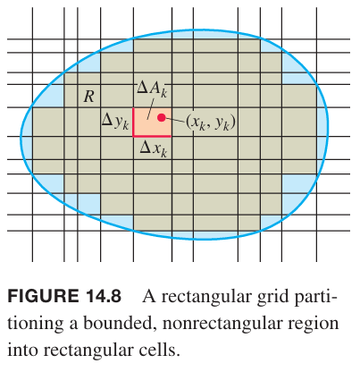

如上图所示，给定有界非矩形区域 $R$，为了定义 $f(x,y)$ 在 $R$ 上的二重积分，我们将其分割成若干个矩形。不过由于边界是曲线，这次分割出的矩形无法完全覆盖 $R$，有的小矩形的部分在 $R$ 的外面。$R$ 的分区是所有在 $R$ 的矩形组成，不包括部分在外面的矩形。当分区的模趋于零时，越来越多的矩形在 $R$ 内。

和之前一样，这些矩形面积的黎曼和是
$$S_n=\sum_{k=1}^{n}f(x_k,y_k)\Delta A_k$$
当 $||P||\to 0$，矩形的宽和高趋于零，面积 $\Delta A_k$ 也趋于零，矩形数量趋于无穷。如果 $f(x,y)$ 是连续函数，这些黎曼和收敛于极限值，这个值不依赖于分区的选择。这个极限值称为 $f(x,y)$ 在 $R$ 上的二重积分
$$\lim_{||P||\to 0}\sum_{k=1}^nf(x_k,y_k)\Delta A_k=\iint_Rf(x,y)dA$$
$R$ 的边界带来了一个新问题。当 $R$ 是曲线边界时，$n$ 个矩形没有完全覆盖 $R$。为了近似于 $R$，当分区的模趋于零时，要求部分在 $R$ 外的矩形之和能够被忽略。下面要遇到的问题都是满足这一条件的。边界是多边形、圆形、椭圆、分段的连续函数图像都没有问题。不过“分形”的边界不满足这一条件，但是很少有应用会出现这种边界。

### 体积
和之前一样，$f(x,y)$ 在 $R$ 上是连续函数，$\iint_Rf(x,y)dA$ 是 $R$ 之上 $z=f(x,y)$ 以下立体区域的体积。

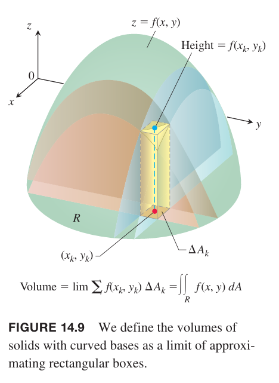

如果区域 $R$ 如下图所示，上下界分别是曲线 $y=g_2(x),y=g_1(x)$，且边界是 $x=a,x=b$，仍旧可以使用切片法计算体积。

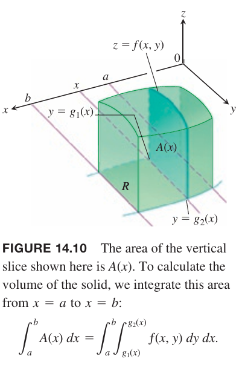

首先计算横切面的面积
$$A(x)=\int_{y=g_1(x)}^{y=g_2(x)}f(x,y)dy$$
从 $x=a$ 到 $x=b$ 对 $A(x)$ 积分得到体积。迭代积分如下
$$V=\int_a^bA(x)dx=\int_a^b\int_{g_1(x)}^{g_2(x)}f(x,y)dydx\tag{1}$$
类似的，如果 $R$ 如下图所示，边界是 $y=c,y=d$，上下界是曲线 $x=h_2(y),x=h_1(y)$，那么体积可以写作
$$V=\int_c^d\int_{h_1(y)}^{h_2(y)}f(x,y)dxdy\tag{2}$$

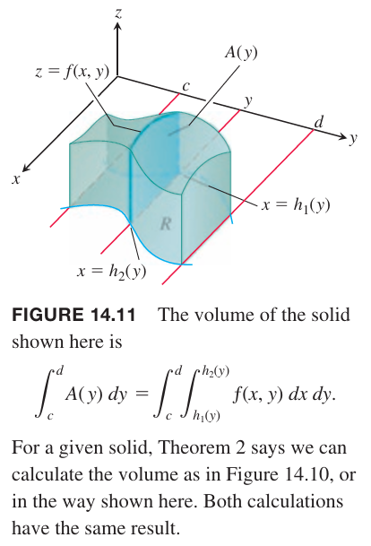

公式 $(1)$ 和 $(2)$ 的迭代积分表示体积，是 $f$ 在 $R$ 上的二重积分的定义。

**定理 2 富比尼定理**
> 令 $f(x,y)$ 是 $R$ 的连续函数。
> 1. 如果区域 $R$ 的定义是 $a\leq x\leq b,g_1(x)\leq y\leq g_2(x)$，且 $g_1,g_2$ 在 $[a,b]$ 上连续，那么
> $$\iint_Rf(x,y)dA=\int_a^b\int_{g_1(x)}^{g_2(x)}f(x,y)dydx$$
> 2. 如果区域 $R$ 的定义是 $c\leq y\leq d,h_1(y)\leq x\leq h_2(x)$，且 $h_1,h_2$ 在 $[c,d]$ 上连续，那么
> $$\iint_Rf(x,y)dA=\int_c^d\int_{h_1(y)}^{h_2(y)}f(x,y)dxdy$$

例1 金字塔底是在 $xy$ 平面上的三角形，三边分别是 $x$ 轴，$y=x$ 和 $x=1$，顶部平面公式是
$$z=f(x,y)=3-x-y$$
求金字塔体积。

解：如下所示，$x$ 介于 0 和 1 之间，$y$ 在 $y=0$ 到 $y=x$ 之间变化。因此
$$\begin{aligned}
V&=\int_0^1\int_0^x(3-x-y)dydx\\
&=\int_0^1(3y-xy-\frac{y^2}{2})|_{y=0}^{y=x}dx\\
&=\int_0^1(3x-\frac{3x^2}{2})dx\\
&=(\frac{3x^2}{2}-\frac{x^3}{2})|_{x=0}^{x=1}\\
&=1
\end{aligned}$$

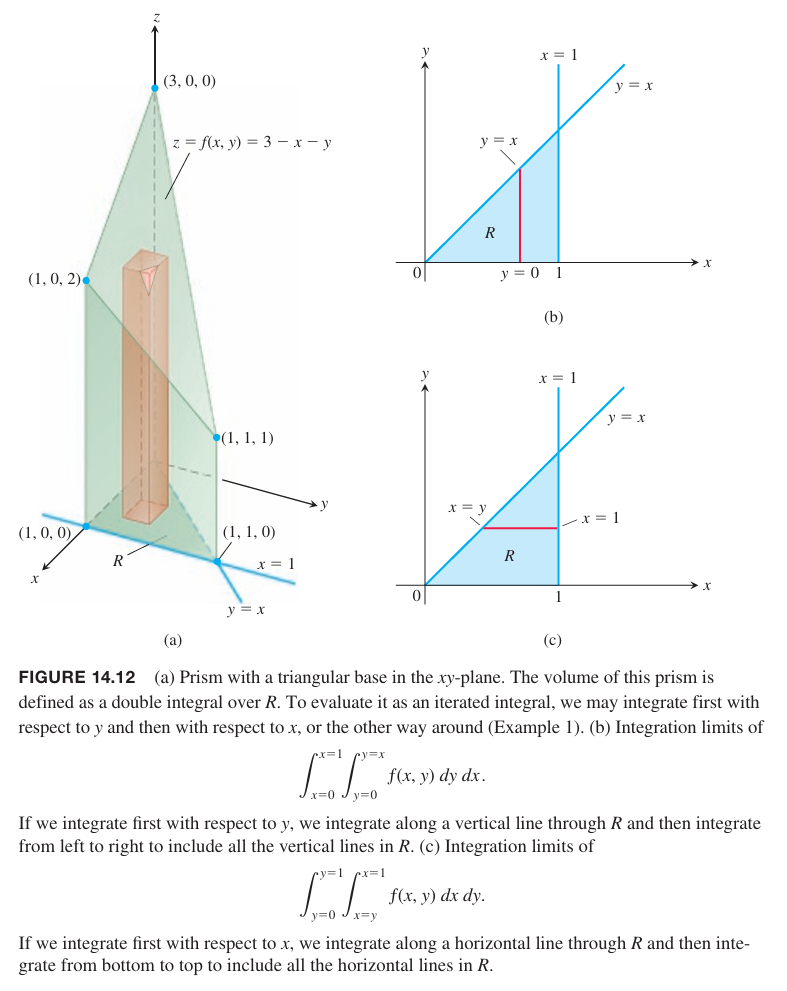

如上图（c）所示，二重积分是
$$\begin{aligned}
V&=\int_0^1\int_y^1(3-x-y)dxdy\\
&=\int_0^1(3x-\frac{x^2}{2}-xy)|_{x=y}^{x=1}dy\\
&=\int_0^1((3-\frac{1}{2}-y)-(3y-\frac{y^2}{2}-y^2))dy\\
&=\int_0^1(\frac{5}{2}-4y+\frac{3}{2}y^2)dy\\
&=(\frac{5}{2}y-2y^2+\frac{y^3}{2})|_{y=0}^{y=1}\\
&=1
\end{aligned}$$

富比尼定理确保我们可以以任意顺序计算二重积分，但有的时候某种顺序比另外一种要简单容易。

例2 当 $R$ 是 $x$ 轴，$y=x$ 和 $x=1$ 围成的三角形，计算
$$\iint_R\frac{\sin x}{x}dA$$
解：积分区域如下图所示。

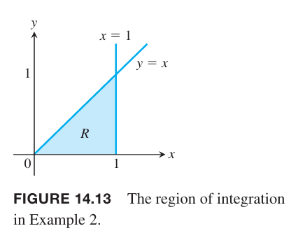

我们先对 $y$ 积分再对 $x$ 积分，那么有
$$\begin{aligned}
\int_0^1\int_0^x\frac{\sin x}{x}dydx&=\int_0^1(y\frac{\sin x}{x})|_0^xdx\\
&=\int_0^1\sin xdx\\
&=\cos x|_1^0\\
&=1-\cos 0
\end{aligned}$$
如果我们交换积分顺序，那么有
$$\int_0^1\int_x^1\frac{\sin x}{x}dxdy$$
我们会遇到求 $frac{\sin x}{x}$ 的积分这个难题，结果无法用初等函数表示。

没有一般方法来判断积分顺序。如果一种顺序无法计算，尝试另外一种顺序。如果两者都走不通，或许可以使用数值法求近似解。

### 积分的界限
下面阐述如何确定积分的界限。

**垂直划分** 当计算 $\iint_Rf(x,y)dA$ 时，我们可以先对 $y$ 积分再对 $x$ 积分。

1. 画图。首先画出 $R$ 的草图，如下图所示。

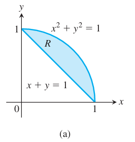

2. 确定 $y$ 的界限。使用垂直的直线 $L$ 穿过 $R$，确定 $y$ 的界限，通常是 $x$ 的函数。

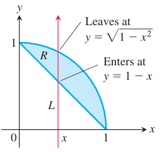

3. 确定 $x$ 的界限。确定 $x$ 的界限以包含所有穿过 $R$ 的垂直的直线。积分如下
$$\iint_Rf(x,y)dA=\int_{x=0}^{x=1}\int_{y=1-x}^{y=\sqrt{1-x^2}}f(x,y)dydx$$

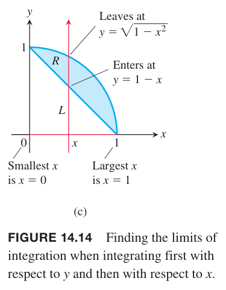

**水平划分** 和上述积分顺序恰好相反。上述积分可以写作
$$\iint_Rf(x,y)dA=\int_0^1\int_{1-y}^{\sqrt{1-y^2}}f(x,y)dxdy$$

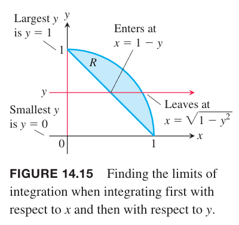

例3 画出下面积分中积分区域的草图，并写出交换积分顺序的等价二重积分。
$$\int_0^2\int_{x^2}^{2x}(4x+2)dydx$$
解：积分区域由不等式 $x^2\leq y\leq 2x,0\leq x\leq 2$ 确定。因此区域边界曲线是 $y=x^2,y=2x$ 和 $x=0,x=2$。

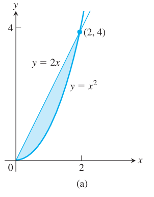

为了求交换积分顺序的界限，想象水平直线穿过区域，那么从 $x=y/2$ 进去从 $x=\sqrt{y}$ 出来。为了包含所有水平直线，$y$ 从 $y=0$ 到 $y=4$。

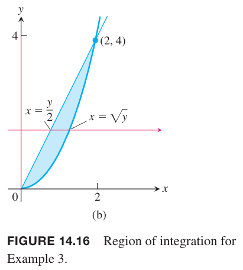

等价二重积分是
$$\int_0^4\int_{y/2}^{\sqrt{y}}(4x+2)dxdy$$

### 积分的属性
和一重积分类似，连续函数的二重积分也有一些代数性质帮助计算。

> 如果 $f(x,y),g(x,y)$ 是 $R$ 上的连续函数，那么以下属性成立。
> 
> 1. 
> $$\iint_Rcf(x,y)dA=c\iint_Rf(x,y)dA$$
> 其中 $c$ 是任意常量。
> 
> 2. 
> $$\iint_R(f(x,y)\pm g(x,y))dA=\iint_Rf(x,y)dA+\iint_Rg(x,y)dA$$
> 3.
>     如果在 $R$ 上有 $f(x,y)\geq 0$，那么
>     $$\iint_Rf(x,y)dA\geq 0$$
>     如果在 $R$ 上有 $f(x,y)\geq g(x,y)$，那么
>     $$\iint_Rf(x,y)dA\geq\iint_Rg(x,y)dA$$
>
> 4. 
>     如果 $R$ 可以分成两个不相交的区域 $R_1,R_2$，那么
>     $$\iint_Rf(x,y)dA=\iint_{R_1}f(x,y)dA+\iint_{R_2}f(x,y)dA$$

属性 4 成立的条件是要能够用有限条线段或者曲线将 $R$ 分成不相交的 $R_1,R_2$ 两个部分。下图是示例。

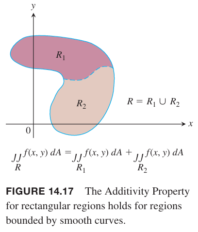

这些属性背后的思想是积分行为与求和类似。如果用 $cf(x,y)$ 替换函数 $f(x,y)$，那么 $f$ 的黎曼和
$$S_n=\sum_{k=1}^nf(x_k,y_k)\Delta A_k$$
被替换为
$$\sum_{k=1}^ncf(x_k,y_k)\Delta A_k=c\sum_{k=1}^nf(x_k,y_k)\Delta A_k=cS_n$$
当 $n\to\infty$ 时取极限，可以证明 $c\lim_{n\to\infty}S_n=c\iint_RfdA$ 和 $\lim_{n\to\infty}cS_n=c\iint_RcfdA$ 等价。乘以常量这个属性从求和转移到了二重积分。

对于其他属性，也是类似的，性质从黎曼和过渡到二重积分。这里讨论的背后的思想，实际的证明需要更仔细的分析黎曼和是如何收敛的。

例4 求 $R:y=2\sqrt{x},y=4x-2, y=0$ 之上曲面 $z=16-x^2-y^2$ 之下的楔形的体积。

解：楔形如下图所示。

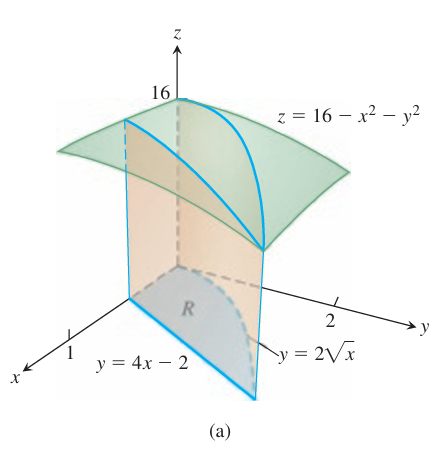

$R$ 如下图所示。

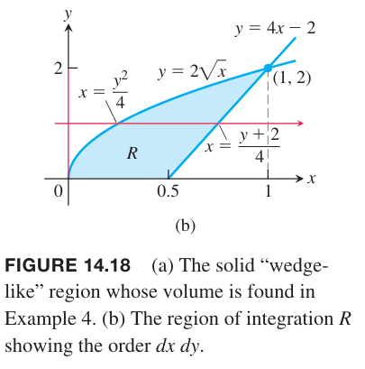

如果以 $dydx$ 的顺序积分，需要作两次二重积分，因为当 $0\leq x\leq 0.5$ 时，$y$ 从 $y=0$ 到 $y=2\sqrt{x}$，当 $0.5\leq x\leq 1$ 时，$y$ 从 $y=4x-2$ 到 $y=2\sqrt{2}$。所以这里选择 $dxdy$ 作为积分顺序。使用迭代积分计算体积
$$\begin{aligned}
\iint_R(16-x^2-y^2)dA&=\int_0^2\int_{y^2/4}^{(y+2)/4}(16-x^2-y^2)dxdy\\
&=\int_0^2(16x-\frac{x^3}{3}-xy^2)|_{x=y^2/4}^{x=(y+2)/4}dy\\
&=\int_0^2[(4(y+2)-\frac{(y+2)^3}{3}-y^2\frac{y+2}{4})-(4y^2-\frac{y^6}{3\cdot 64}-\frac{y^4}{4})]dy\\
&=(\frac{191y}{24}+\frac{63y^2}{32}-\frac{145y^3}{96}-\frac{49y^4}{768}+\frac{y^5}{20}+\frac{y^7}{1344})\bigg|_0^2\\
&=\frac{20903}{1680}
\end{aligned}$$

这一节的二重积分聚焦于表示在 $R$ 和 连续正函数 $z=f(x,y)$ 之间的体积。当 $f(x_k,y_k)$ 是负数时，$f(x_k,y_k)\Delta A_k$ 是体积的负值。所以对于在 $R$ 上的任意连续函数 $f$，任意黎曼和的极限表示的是带符号的体积而不是总体积。
