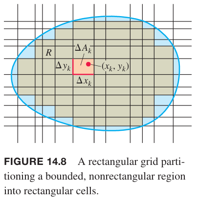
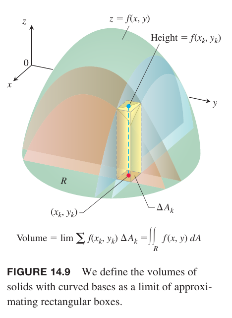

### 有界非矩形区域上的二重积分

如上图所示，给定有界非矩形区域 $R$，为了定义 $f(x,y)$ 在 $R$ 上的二重积分，我们将其分割成若干个矩形。不过由于边界是曲线，这次分割出的矩形无法完全覆盖 $R$，有的小矩形的部分在 $R$ 的外面。$R$ 的分区是所有在 $R$ 的矩形组成，不包括部分在外面的矩形。当分区的模趋于零时，越来越多的矩形在 $R$ 内。

和之前一样，这些矩形面积的黎曼和是
$$S_n=\sum_{k=1}^{n}f(x_k,y_k)\Delta A_k$$
当 $||P||\to 0$，矩形的宽和高趋于零，面积 $\Delta A_k$ 也趋于零，矩形数量趋于无穷。如果 $f(x,y)$ 是连续函数，这些黎曼和收敛于极限值，这个值不依赖于分区的选择。这个极限值称为 $f(x,y)$ 在 $R$ 上的二重积分
$$\lim_{||P||\to 0}\sum_{k=1}^nf(x_k,y_k)\Delta A_k=\iint_Rf(x,y)dA$$
$R$ 的边界带来了一个新问题。当 $R$ 是曲线边界时，$n$ 个矩形没有完全覆盖 $R$。为了近似于 $R$，当分区的模趋于零时，要求部分在 $R$ 外的矩形之和能够被忽略。下面要遇到的问题都是满足这一条件的。边界是多边形、圆形、椭圆、分段的连续函数图像都没有问题。不过“分形”的边界不满足这一条件，但是很少有应用会出现这种边界。

### 体积
和之前一样，$f(x,y)$ 在 $R$ 上是连续函数，$\iint_Rf(x,y)dA$ 是 $R$ 之上 $z=f(x,y)$ 以下立体区域的体积。

