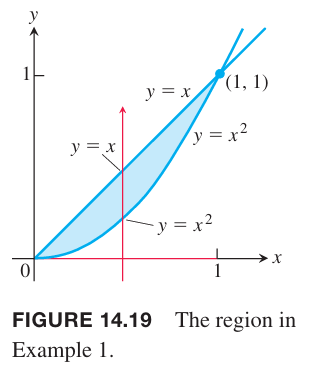
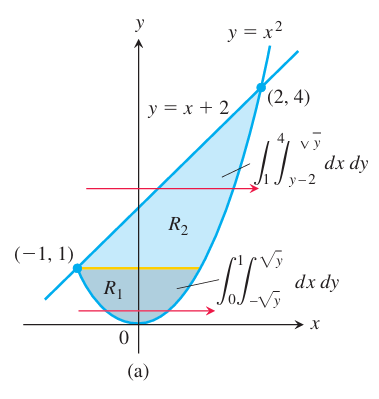
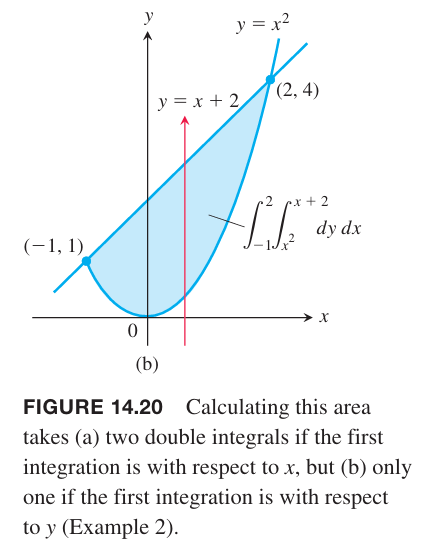
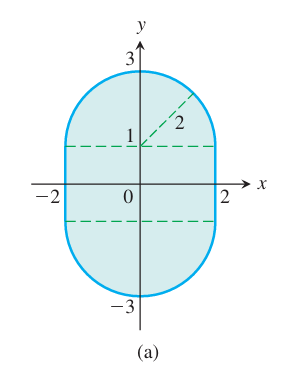
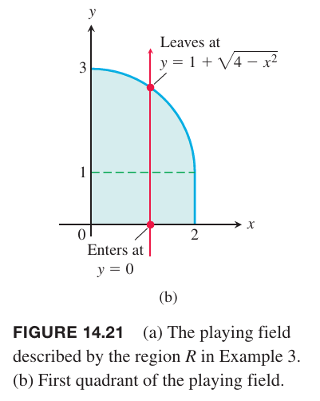

### 有界区域的面积
如果在 $R$ 上的二重积分上令 $f(x,y)=1$，那么黎曼和是
$$S_n=\sum_{k=1}^nf(x_k,y_k)\Delta A_k=\sum_{k=1}^n\Delta A_k\tag{1}$$
这个简化的和表示 $R$ 上的分区矩形的面积和，是 $R$ 的面积的近似。随着 $R$ 的分区的模趋于零，所有矩形的宽和高也趋于零，$R$ 的覆盖率也越来越高，那么可以将 $R$ 的面积定义为
$$\lim_{||P||\to 0}\sum_{k=1}^n\Delta A_k=\iint_RdA\tag{2}$$

**定义**
> 有界封闭区域 $R$ 的面积是
> $$A=\iint_RdA$$

例1 求由 $y=x,y=x^2$ 在第一象限围城的区域 $R$ 的面积。

解：如下图所示。

两条曲线的交点在 $(1,1)$ 处，面积是
$$\begin{aligned}
A&=\int_0^1\int_{x^2}^xdydx\\
&=\int_0^1y\bigg|_{x^2}^xdx\\
&=\int_0^1(x-x^2)dx\\
&=\frac{x^2}{2}-\frac{x^3}{2}\bigg|_0^1\\
&=\frac{1}{6}
\end{aligned}$$

例2 求由抛物线 $y=x^2$ 和直线 $y=x+2$ 围城的区域 $R$ 的面积。

解：如下图所示，我们可以将 $R$ 分成 $R_1,R_2$ 两个部分

$$A=\iint_{R_1}dA+\iint_{R_2}dA=\int_0^1\int_{-\sqrt{y}}^{\sqrt{y}}dxdy+\int_1^4\int_{y-2}^{\sqrt{y}}dxdy$$
也可以如下图所示交换积分顺序

$$A=\int_{-1}^2\int_{x^2}^{x+2}dydx$$
第二种方法只需要做一次二重积分，更简单。
$$\begin{aligned}
A&=\int_{-1}^2y\bigg|_{x^2}^{x+2}dx\\
&=\int_{-1}^2(x+2-x^2)dx\\
&=\frac{x^2}{2}+2x-\frac{x^3}{3}\bigg|_{-1}^2\\
&=\frac{9}{2}
\end{aligned}$$

例3 使用富比尼定理和几何法计算 $R:-2\leq x\leq 2,-1-\sqrt{4-x^2}\leq y\leq 1+\sqrt{4-x^2}$ 的面积。

解：$R$ 如下图所示。

根据对称性，面积是第一象限的区域面积的 4 倍。如下图所示。

根据富比尼定理有
$$\begin{aligned}
A&=\iint_RdA\\
&=4\int_0^2\int_0^{1+\sqrt{4-x^2}}dydx\\
&=4\int_0^2(1+\sqrt{4-x^2})dx\\
&=4\bigg(x+\frac{x}{2}\sqrt{4-x^2}+\frac{4}{2}\sin^{-1}\frac{x}{2}\bigg)\bigg|_0^2\\
&=4\bigg(2+0+2\frac{\pi}{2}-0\bigg)\\
&=8+4\pi
\end{aligned}$$

区域 $R$ 是由一个矩形和上下两个半径为 2 的半圆组成。矩形面积是 $4\times 2$，圆的面积是 $\pi 2^2$，因此总面积是
$$A=8+4\pi$$

### 平均值
对于定义在有界区域的二元可积函数，平均值是区域上的积分除以区域的面积。因此，可积函数 $f$ 在 $R$ 上的平均值定义是
$$\text{Average value}=\frac{1}{\text{aera of R}}\iint_RfdA=\frac{\iint_RfdA}{\iint_RdA}\tag{3}$$

例4 求 $f(x,y)=x\cos xy$ 在矩形 $R:0\leq x\leq \pi,0\leq y\leq 1$ 上的平均值。

解：$f$ 在 $R$ 上积分是
$$\begin{aligned}
\int_0^\pi\int_0^1x\cos xydydx&=\int_0^\pi \sin xy\bigg|_0^1dx\\
&=\int_0^\pi\sin x dx\\
&=-\cos x\bigg|_0^\pi\\
&=2
\end{aligned}$$
$R$ 的面积是 $\pi$，因此平均值是 $2/\pi$。
