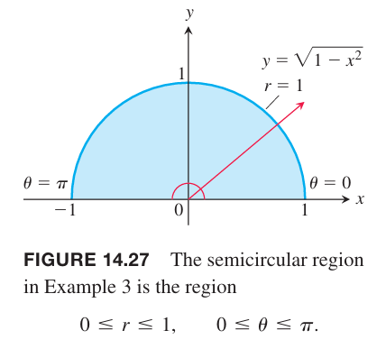

有时二重积分转化为极坐标后很容易计算。这一节主要分析如何进行这种转化和如何对用极坐标表示的函数进行积分。

### 极坐标积分
当定义 $f$ 在 $R$ 上的双重积分时，使用平行于 $x$ 轴和 $y$ 轴的直线将 $R$ 分割成小矩形。因为这些矩阵是 $x$ 是常量或 $y$ 是常量为边，是直角坐标系下最自然的形状。在极坐标系中，最自然的形状是“极矩形”，要么 $r$ 是常量要么 $\theta$ 是常量组成了边。为了避免混淆，极坐标的点用 $(r,\theta),r\geq 0$ 表示。

假定 $f(r,\theta)$ 是区域 $R$ 上的函数，$R$ 由 $\theta=\alpha,\theta=\beta,r=g_1(\theta),r=g_2(\theta)$ 围成，同时要求对 $\alpha,\beta$ 之间的任意 $\theta$ 都有 $0\leq g_1(\theta)\leq g_2(\theta)$。$R$ 在扇形区域 $Q$ 内，$Q$ 由 $0\leq r\leq a,\alpha\leq\theta\leq\beta,0\leq\beta-\alpha\leq 2\pi$ 定义。如下图所示。

用圆弧和射线分割 $Q$。一系列圆弧的圆心是原点，半径分别是 $\Delta r,2\Delta 2,\cdots,m\Delta r$，其中 $\Delta r=a/m$。射线是
$$\theta=\alpha,\theta=\alpha+\Delta\theta,\theta=\alpha+2\Delta \theta,\cdots,\theta=\alpha+m'\Delta=\beta$$
其中 $\Delta\theta=(\beta-\alpha)/m'$。圆弧和射线将 $Q$ 分割成了“极矩形”。

对极矩形编号，面积分别是 $\Delta A_1,\Delta A_2,\cdots,\Delta A_n$。令 $(r_k,\theta_k)$ 是面积为 $\Delta A_k$ 极矩形上的任意点。求和
$$S_n=\sum_{k=1}^nf(r_k,\theta_k)\Delta A_k$$
如果 $f$ 在 $R$ 上连续，当 $\Delta r,\Delta\theta$ 趋于零时，和也趋于其极限。这个极限是 $f$ 在 $R$ 上的二重积分。
$$\lim_{n\to\infty}S_n=\iint_Rf(r,\theta)dA$$
为了求极限，首先要用 $\Delta r,\Delta\theta$ 表示 $\Delta A_k$。为了方便，对于第 $k$ 个极矩形，$r_k$ 取内部圆弧和外部圆弧半径的平均值。也就是说，内部圆弧半径是 $r_k-(\Delta r/2)$，外部圆弧半径是 $r_k+(\Delta r/2)$。

圆的面积是 $\pi r^2$，所以弧度为 $\theta$ 的楔形面积是
$$A=\frac{1}{2}\theta r^2$$
值是圆的面积的 $\theta/2\pi$。
所以内部圆弧和外部圆弧确定的楔形面积是
$$\frac{1}{2}(r_k-\frac{\Delta r}{2})^2\Delta\theta$$
$$\frac{1}{2}(r_k+\frac{\Delta r}{2})^2\Delta\theta$$
因此
$$\begin{aligned}
\Delta A_k&=\frac{\Delta\theta}{2}\bigg[\bigg(r_r+\frac{\Delta r}{2}\bigg)^2-\bigg(r_r-\frac{\Delta r}{2}\bigg)^2\bigg]\\
&=\frac{\Delta\theta}{2}(2r_k\Delta r)\\
&=r_k\Delta r\Delta\theta
\end{aligned}$$
那么 $S_n$ 可以写作
$$S_n=\sum_{k=1}^nf(r_k,\theta_k)r_k\Delta r\Delta\theta$$
当 $n\to\infty$ 时，$\Delta r,\Delta\theta$ 趋于零，和收敛到二重积分
$$\lim_{n\to\infty}=\iint_Rf(r,\theta)rdrd\theta$$
富比尼定理告诉我们极限可以通过对 $r,\theta$ 单独积分计算，那么
$$\iint_Rf(r,\theta)dA=\int_{\theta=\alpha}^{\theta=\beta}\int_{r=g_1(\theta)}^{r=g_2(\theta)}f(r,\theta)rdrd\theta$$

### 积分范围
直角坐标系中介绍的求积分范围的方法在极坐标系中仍旧适用。为了求解 $\iint_Rf(r,\theta)dA$，首先对 $r$ 积分再对 $\theta$ 积分。

1. 画出草图。

2. 求 $r$ 的范围。一个射线穿过 $R$，进入和离开 $R$ 时 $r$ 的值是积分范围，通常依赖于 $L$ 和 $x$ 轴的夹角 $\theta$。

3. 求 $\theta$ 的范围。找到 $R$ 的边界的 $\theta$ 最大值和最小值，这就是 $\theta$ 的积分范围。

极坐标的迭代积分是
$$\iint_Rf(r,\theta)dA=\int_{\theta=\pi/4}^{\theta=\pi/2}\int_{r=\sqrt{2}\csc\theta}^{r=2}f(r,\theta)rdrd\theta$$

例1 求 $f(r,\theta)$ 在心形线 $r=1+\cos\theta$ 以内圆 $r=1$ 之外的区域 $R$ 上的积分范围。

解：首先给出草图。

接着求 $r$ 的积分范围。射线穿过 $R$，进入半径是 $r=1$，离开半径是 $r=1+\cos\theta$。

最后求 $\theta$ 的积分范围。射线与 $R$ 有交集的 $\theta$ 从 $\theta=-\pi/2$ 到 $\theta=\pi/2$。因此积分是
$$\int_{-\pi/2}^{\pi/2}\int_1^{1+\cos\theta}f(r,\theta)rdrd\theta$$

如果 $f(r,\theta)$ 值是常量 1，那么 $f$ 在 $R$ 上的积分是 $R$ 的面积。

**极坐标系下的面积**
> 极坐标系下的有界封闭区域 $R$ 的面积是
> $$A=\iint_Rrdrd\theta$$

例2 求由双纽线 $r^2=4\cos 2\theta$ 围城区域的面积。

解：积分范围如下图所示。

根据对称型，面积是第一象限部分面积的 4 倍，因此
$$\begin{aligned}
A&=4\int_0^{\pi/4}\int_0^{\sqrt{4\cos 2\theta}}rdrd\theta\\
&=4\int_0^{\pi/4}\bigg(\frac{r^2}{2}\bigg)\bigg|_{r=0}^{r=\sqrt{4\cos 2\theta}}d\theta\\
&=4\int_0^{\pi/4}2\cos 2\theta d\theta\\
&=4\sin 2\theta|_0^{\pi/4}\\
&=4
\end{aligned}$$

### 笛卡尔坐标系积分到极坐标系积分
将笛卡尔坐标系积分 $\iint_R f(x,y)dxdy$ 转成极坐标系积分分为两步。第一步是用 $x=r\cos\theta,y=r\sin\theta$ 代入被积函数，同时用 $rdrd\theta$ 替代 $dxdy$。第二步是把边界 $R$ 转化成极坐标积分范围。那么
$$\iint_Rf(x,y)dxdy=\iint_Gf(r\cos\theta,r\sin\theta)rdrd\theta$$
其中 $G$ 表示相同的积分范围，不过是使用极坐标表示。注意，$dxdy$ 替换为 $rdrd\theta$ 而不是 $drd\theta$。

例3 求
$$\iint_Re^{x^2+y^2}dydx$$
其中 $R$ 由 $x$ 轴和 $y=\sqrt{1-x^2}$ 围成的半圆。

解：在笛卡尔坐标系中，这个积分不是非初等积分，没有直接的方式对 $e^{x^2+y^2}$ 积分。不过这个积分和类似积分在数学领域很重要，比如统计学。使用极坐标就比较容易了。代入 $x=r\cos\theta,y=r\sin\theta$，并且用 $rdrd\theta$ 替代 $dydx$，那么
$$\begin{aligned}
\iint_Re^{x^2+y^2}dydx&=\int_0^\pi\int_0^1e^{r^2}rdrd\theta\\
&=\int_0^\pi\frac{1}{2}e^{r^2}\bigg|_0^1d\theta\\
&=\int_0^\pi\frac{1}{2}(e-1)d\theta\\
&=\frac{\pi}{2}(e-1)
\end{aligned}$$
$rdrd\theta$ 中的 $r$ 很关键，使得可以对 $e^{r^2}$ 进行积分，否则，也无法找到反导函数。

例4 求积分
$$\int_0^1\int_0^{\sqrt{1-x^2}}(x^2+y^2)dydx$$
解：被积分区域和上图类似，不过只包含第一象限，因此
$$\begin{aligned}
\int_0^1\int_0^{\sqrt{1-x^2}}(x^2+y^2)dydx&=\int_0^{\pi/2}\int_0^2(r^2)rdrd\theta\\
&=\int_0^{\pi/2}\frac{r^4}{4}\bigg|_0^1d\theta\\
&=\int_0^{\pi/2}\frac{1}{4}d\theta\\
&=\frac{\pi}{8}
\end{aligned}$$
极坐标转化相当有效，因为 $x^2+y^2$ 变成了 $r^2$，并且积分范围变成了常量。

例5 求 $xy$ 平面单位圆以上抛物面 $z=9-x^2-y^2$ 以下的柱形的体积。

解：积分范围 $R$ 是单位圆，$x^2+y^2=1$，极坐标表示为 $r=1,0\leq\theta\leq 2\pi$。如下图所示。

体积是二重积分
$$\begin{aligned}
\iint_R(9-x^2-y^2)dA&=\int_0^{2\pi}\int_0^1(9-r^2)rdrd\theta\\
&=\int_0^{2\pi}\int_0^1(9r-r^3)drd\theta\\
&=\int_0^{2\pi}\bigg[\frac{9}{2}r^2-\frac{1}{4}r^4\bigg]_0^1d\theta\\
&=\frac{17}{4}\int_0^{2\pi}d\theta\\
&=\frac{17\pi}{2}
\end{aligned}$$

例6 使用极坐标积分计算 $R$ 的面积，其中 $R$ 由 $x^2+y^2=4,y=1,y=\sqrt{3}x$ 围成。

解：$R$ 的草图如下所示。

直线 $y=\sqrt{3}x$ 的斜率是 $\sqrt{3}=\tan\theta$，因此 $\theta=\pi/3$。$y=1$ 与圆 $x^2+y^2=4$ 的交点是 $x^2+1=4$，即 $x=\sqrt{3}$。通过原点和点 $(\sqrt{3},1)$ 的直线斜率是 $1/\sqrt{3}=\tan\theta$，即 $\theta=\pi/6$。

因此 $\theta$ 的范围是 $\pi/6$ 到 $\pi/3$，$r$ 的范围是 $y=1$ 到 $x^2+y^2=4$。因为 $y=r\sin\theta$，所以下限 $r=1/\sin\theta=\csc\theta$。上线是圆 $r=2$。那么
$$\begin{aligned}
\iint_RdA&=\int_{\pi/6}^{\pi/3}\int_{\csc\theta}^2rdrd\theta\\
&=\int_{\pi/6}^{\pi/3}\frac{1}{2}r^2\bigg|_{\csc\theta}^2d\theta\\
&=\frac{1}{2}\int_{\pi/6}^{\pi/3}(4-\csc^2\theta)d\theta\\
&=\frac{1}{2}(4\theta-\cot\theta)\bigg|_{\pi/6}^{\pi/3}\\
&=\frac{1}{2}((\frac{4\pi}{3}+\frac{1}{\sqrt{3}})-(\frac{4\pi}{6}+\sqrt{3}))\\
&=\frac{\pi-\sqrt{3}}{3}
\end{aligned}$$
