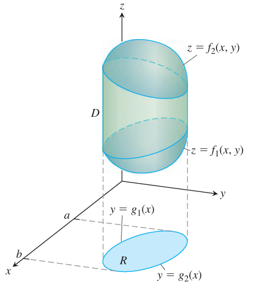

### 三重积分
如果 $F(x,y,z)$ 是定义在空间封闭有界区域 $D$ 上的函数，下面定义 $F$ 在 $D$ 上的积分。和之前类似，使用平行于坐标轴的平面将 $D$ 分割成若干个小的立方体。

对完全在 $D$ 内的立方体从 1 到 $n$ 编号，第 $k$ 个立方体三维是 $\Delta x_k,\Delta y_k,\Delta z_k$，体积是 $\Delta V_k=\Delta x_k\Delta y_k\Delta z_k$。选择立方体内一个点 $(x_k,y_k,z_k)$，那么
$$S_n=\sum_{k=1}^nF(x_k,y_k,z_k)\Delta V_k\tag{1}$$
随着 $D$ 的三维越来越小，即 $\Delta x_k,\Delta y_k,\Delta z_k$ 趋于零，分区的模 $||P||$，它是 $\Delta x_k,\Delta y_k,\Delta z_k$ 的最大值，也趋于零。不过如何分区，如何选择 $(x_k,y_k,z_k)$，和的极限都是同一个值，那么 $F$ 在 $D$ 上可积。和之前一样，当 $F$ 在 $D$ 上连续且 $D$ 由有限多的光滑曲面和有限多的光滑曲线连接组成，那么 $F$ 是可积的。随着 $||P||\to 0$，$n$ 趋于 $\infty$，和 $S_n$ 趋于某个极限值。这个极限是 $F$ 在 $D$ 上的三重积分，写作
$$\lim_{n\to\infty}S_n=\lim_{||P||\to 0}S_n=\iiint_DF(x,y,z)dV=\iiint_DF(x,y,z)dxdydz$$
其中 $D$ 是光滑的边界。

### 空间的体积
如果 $F$ 是常量函数 1，那么 $(1)$ 中的和简化为
$$S_n=\sum_{k=1}^nF(x_k,y_k,z_k)\Delta V_k=\sum_{k=1}^n\Delta V_k$$
随着 $\Delta x_k,\Delta y_k,\Delta z_k$ 趋于零，$\Delta V_k$ 越来越小，小立方体越来越多，$D$ 被填充的也更满。因此，$D$ 的体积定义为三重积分
$$\lim_{n\to\infty}\sum_{k=1}^n\Delta V_k=\iiint_DdV$$

**定义**
> 空间中封闭有界区域 $D$ 的体积是
> $$V=\iiint_DdV$$

### 积分顺序 $dzdydx$ 的积分范围
使用三维版本的富比尼定理，通过三次单变量积分计算三重积分的值。和二重积分类似，通过几何方法来找每个积分的积分范围。求
$$\iiint_DF(x,y,z)dV$$
的值，首先对 $z$ 积分，接着对 $y$ 积分，最后对 $x$ 积分。计算积分范围的步骤是

1. 画草图。给出区域 $D$ 和在 $xy$ 平面上的投影 $R$ 的草图。标记 $D$ 的上下界（曲面）和 $R$ 的上下界（曲线）。

2. $z$ 的范围。直线 $M$ 经过 $R$ 上一点 $(x,y)$，垂直于 $z$ 轴。随着 $z$ 的增加，$M$ 在 $z=f_1(x,y)$ 进去 $D$，在 $z=f_2(x,y)$ 离开 $D$。这就是 $z$ 的积分范围。

3. $y$ 的范围。直线 $L$ 平行于 $y$ 轴。随着 $y$ 的增加，$L$ 在 $y=g_1(x)$ 处进入 $R$，在 $y=g_2(x)$ 离开 $R$。这就是 $y$ 的积分范围。

4. $x$ 的范围。$x$ 范围会包含所有穿过 $R$ 的平行于 $y$ 轴直线。上图中 $x$ 的范围是 $x=a,x=b$。这就是 $x$ 的积分范围。

因此积分是
$$\int_{x=a}^{x=b}\int_{y=g_1(x)}^{y=g_2(x)}\int_{z=f_1(x,y)}^{z=f_2(x,y)}F(x,y,z)dzdydx$$
如果积分顺序不同，寻找积分范围的过程是类似的。

这个过程隐含着 $D$ 有上界和下界（曲面），$R$ 有上下界（曲线），不适用于复杂的有空洞的区域，不过有时这种情况可以分割成若干个更简单的区域求解。

例1 令 $S$ 是球心位于原点半径为 5 的球，$D$ 是在球面下在平面 $z=3$ 之上的区域。求函数 $F(x,y,z)$ 在区域 $D$ 上的积分范围。

解：区域由 $z=3,x^2+y^2+z^2=25$ 围成。

为了求解积分的范围，首先给出草图，如下图所示。

投影 $R$ 是 $xy$ 平面上圆心位于原点的圆。从 $D$ 上看，可以确定圆的半径是 4，如下图（a）所示。

如果在 $R$ 上选取一个点 $(x,y)$，画一条垂直于 $xy$ 平面的直线，首先进入 $D$ 的高度是 $z=3$，离开的高度是 $z=\sqrt{25-x^2-y^2}$。这就是 $z$ 的积分范围。

为了计算 $y$ 的范围，考虑 $R$ 上的直线 $L$，其通过点 $(x,y)$，平行于 $y$ 轴，如上图（b）所示。进入和离开 $R$ 的值分别是 $y=-\sqrt{16-x^2},y=\sqrt{16-x^2}$。这就是 $y$ 的积分范围。

最终，$L$ 从左往右扫过 $R$，$x$ 的值从 $x=-4$ 到 $x=4$。这就是 $x$ 的积分范围。

因此，$F$ 在 $D$ 上的三重积分是
$$\iiint_DF(x,y,z)dzdydx=\int_{-4}^4\int_{-\sqrt{16-x^2}}^{\sqrt{16-x^2}}\int_3^{\sqrt{25-x^2-y^2}}F(x,y,z)dzdydx$$
这个例子中，$D$ 有很好的对称性，简化了问题。如果没有对称性，方法是一样的，比如下面这个例子。

例2 求函数 $F(x,y,z)$ 在由点 $(0,0,0),(1,1,0),(0,1,0),(0,1,1)$ 四个点确定的四面体 $D$ 上的积分范围。使用积分顺序是 $dzdydx$。

解：区域 $D$ 和在 $xy$ 平面上的投影 $R$ 如下图所示。$D$ 的侧面平行于 $xz$ 平面，后面的面平行于 $yz$，顶面是面 $z=y-x$。

为了求 $z$ 的范围，在 $R$ 上找一点 $(x,y)$，考虑通过 $(x,y)$ 且垂直于 $xy$ 平面的直线 $M$。进入 $D$ 的高度是 $z=0$，离开 $D$ 的高度是 $y-x$。

下面分析 $y$ 的范围。现在考虑穿过 $R$ 的直线 $L$，其也通过点 $(x,y)$，平行于 $y$ 轴。这条线在上图中已经画出，为了清晰，如下图所示。进入和离开 $R$ 的值分别是 $y=x,y=1$。

最后，随着 $L$ 扫过整个 $R$，$x$ 从 $x=0$ 增加到 $x=1$。因此，$F$ 在 $D$ 上的积分是
$$\iiint_DF(x,y,z)dzdydx=\int_0^1\int_x^1\int_0^{y-x}F(x,y,z)dzdydx$$

下面的例子展示了将 $D$ 投影到其他平面时如何求解积分范围。

例3 接例 2，使用积分顺序 $dzdydx$ 对函数 $F(x,y,z)$ 在 $D$ 上求积分，计算四面体 $D$ 的体积。再使用 $dydzdx$ 求积分。

解：使用例 2 中得到的积分范围，四面体体积是
$$\begin{aligned}
V&=\int_0^1\int_x^1\int_0^{y-x}dzdydx\\
&=\int_0^1\int_x^1(y-x)dydx\\
&=\int_0^1\bigg[\frac{1}{2}y^2-xy\bigg]_x^1dx\\
&=\int_0^1\bigg(\frac{1}{2}-x+\frac{1}{2}x^2\bigg)dx\\
&=\bigg[\frac{1}{2}x-\frac{1}{2}x^2+\frac{1}{6}x^3\bigg]_0^1\\
&=\frac{1}{6}
\end{aligned}$$
下面使用积分顺序 $dydzdx$ 计算体积。求解积分范围的步骤大致是类似的。四面体 $D$ 和之前一样，投影 $R$ 位于 $xz$ 平面，如下图所示。

在 $R$ 上找一点 $(x,y)$，通过该点且平行于 $y$ 轴的直线 $M$ 进入和离开 $D$ 时的值分别是 $y=x+z,y=1$。这就是 $y$ 的积分范围。

在投影 $R$ 上，直线 $L$ 也通过点 $(x,y)$ 且平行于 $z$ 轴，进入 $R$ 时有 $z=0$，离开 $R$ 时有 $z=1-x$。

随着 $L$ 扫过 $R$，$x$ 的变化范围是 $x=0$ 到 $x=1$。因此体积是
$$\begin{aligned}
V&=\int_0^1\int_0^{1-x}\int_{x+z}^1dydzdx\\
&=\int_0^1\int_0^{1-x}(1-x-z)dzdx\\
&=\int_0^1\bigg[(1-x)z-\frac{1}{2}z^2\bigg]_0^{1-x}dx\\
&=\int_0^1\bigg((1-x)^2-\frac{1}{2}(1-x)^2\bigg)dx\\
&=\frac{1}{2}\int_0^1(1-x)^2dx\\
&=-\frac{1}{6}(1-x)^3\bigg|_0^1\\
&=\frac{1}{6}
\end{aligned}$$

例4 求由曲面 $z=x^2+3y^2$ 和 $z=8-x^2-y^2$ 围成的区域 $D$ 的体积。

解：下面是草图。

曲面的交线是 $x^2+3y^2=8-x^2-y^2$，即 $x^2+2y^2=4,z>0$，是一个椭圆。因此 $D$ 在 $xy$ 平面的投影 $R$ 就是椭圆 $x^2+2y^2=4$。$R$ 的上下界分别是 $y=\sqrt{(4-x^2)/2},y=-\sqrt{(4-x^2)/2}$。$D$ 的上下界分别是 $z=8-x^2-y^2,z=x^2+3y^2$。随着 $L$ 扫过 $R$，$x$ 的范围是 $x=-2$ 到 $x=2$。
$$\begin{aligned}
V&=\iiint_Ddzdydx\\
&=\int_{-2}^2\int_{-\sqrt{(4-x^2)/2}}^{\sqrt{(4-x^2)/2}}\int_{x^2+3y^2}^{8-x^2-y^2}dzdydx\\
&=\int_{-2}^2\int_{-\sqrt{(4-x^2)/2}}^{\sqrt{(4-x^2)/2}}(8-2x^2-4y^2)dydx\\
&=\int_{-2}^2\bigg[(8-2x^2)y-\frac{4}{3}y^3\bigg]_{-\sqrt{(4-x^2)/2}}^{\sqrt{(4-x^2)/2}}dx\\
&=\int_{-2}^22(8-2x^2)\sqrt{\frac{4-x^2}{2}}-\frac{8}{3}\bigg(\sqrt{\frac{4-x^2}{2}}\bigg)^{3/2}dx\\
&=\int_{-2}^28\bigg(\sqrt{\frac{4-x^2}{2}}\bigg)^{3/2}-\frac{8}{3}\bigg(\sqrt{\frac{4-x^2}{2}}\bigg)^{3/2}dx\\
&=\frac{4\sqrt{2}}{3}\int_{-2}^2(4-x^2)^{3/2}dx\\
&=8\pi\sqrt{2}&&x=\sin u
\end{aligned}$$

### 空间中函数的平均值
函数 $F$ 在空间区域 $D$ 上的平均值定义是
$$\text{average value}=\frac{1}{V_D}\iiint_DFdV\tag{2}$$
如果 $F=\sqrt{x^2+y^2+z^2}$，那么 $F$ 在 $D$ 上的平均值就是 $D$ 内的点到原点的平均距离。如果 $F(x,y,z)$ 是 $(x,y,z)$ 处的温度，那么 $F$ 在 $D$ 上的平均值是平均温度。

例5 求函数 $F(x,y,z)=xyz$ 在由 $x=2,y=2,z=2$ 和坐标平面围成的在第一象限的立方体 $D$ 上的平均值。

解：下面是草图。

$D$ 的体积是 8。$F$ 在立方体上的积分是
$$\begin{aligned}
\int_0^2\int_0^2\int_0^2xyzdxdydz&=\int_0^2\int_0^2\frac{x^2}{2}yz\bigg|_0^2dydz\\
&=\int_0^2\int_0^22yzdydz\\
&=\int_0^2y^2z\bigg|_0^2dz\\
&=\int_0^24zdz\\
&=2z^2\bigg|_0^2\\
&=8
\end{aligned}$$
所以平均值是 1。

### 三重积分的属性
三重积分的属性类似于二重积分的属性。

> 如果 $f(x,y),g(x,y)$ 是 $R$ 上的连续函数，那么有
> 
> 1. 
> $$\iiint_Dcf(x,y)dA=c\iiint_Df(x,y)dA$$
> 其中 $c$ 是任意常量。
> 
> 2. 
> $$\iiint_D(f(x,y)\pm g(x,y))dA=\iiint_Df(x,y)dA+\iint_Dg(x,y)dA$$
> 3.
>     如果在 $D$ 上有 $f(x,y)\geq 0$，那么
>     $$\iiint_Df(x,y)dA\geq 0$$
>     如果在 $D$ 上有 $f(x,y)\geq g(x,y)$，那么
>     $$\iiint_Df(x,y)dA\geq\iiint_Dg(x,y)dA$$
>
> 4. 
>     如果 $D$ 可以分成两个不相交的区域 $D_1,D_2$，那么
>     $$\iiint_Df(x,y)dA=\iiint_{D_1}f(x,y)dA+\iiint_{D_2}f(x,y)dA$$
