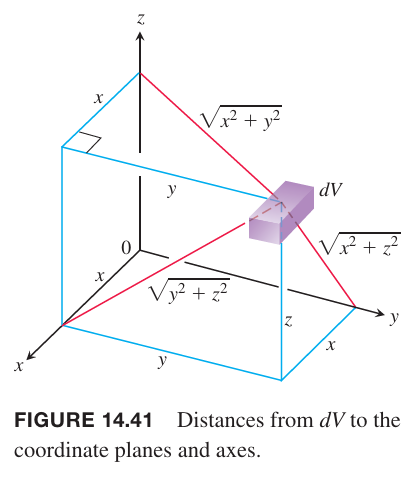

### 质量和一阶矩
如果 $\delta(x,y,z)$ 是在区域 $D$ 的物体的密度，那么 $\delta$ 在 $D$ 上的积分是物体的质量（`mass`）。将物体切为 $n$ 块，如下图所示。

物体质量是极限
$$M=\lim_{n\to\infty}\sum_{k=1}^n\Delta m_k=\lim_{n\to\infty}\sum_{k=1}^n\delta(x_k,y_k,z_k)\Delta V_k=\iiint_D\delta(x,y,z)dV$$

区域 $D$ 上的物体关于坐标平面的一阶矩（`first moment`）定义为 $D$ 上的点 $(x,y,z)$ 到坐标平面的距离乘以该点的密度的结果在 $D$ 上的积分。比如，关于 $yz$ 平面的一阶矩是积分
$$M_{yz}=\iiint_Dx\delta(x,y,z)dV$$
从一阶矩可以得到质心（`center of mass`）。比如，质心在 $x$ 轴的坐标是 $\bar{x}=M_{yz}/M$。

对于二维物体，比如薄的平板，仅需去掉 $z$ 轴即可得到一阶矩。所以关于 $y$ 的一阶矩是到坐标轴的距离乘以密度的结果在 $R$ 上的积分，即
$$M_y=\iint_Rx\delta(x,y)dA$$

下面是总结的相关公式：

三维：

质量
$$M=\iiint_D\delta dV$$
一阶矩
$$M_{yz}=\iiint_Dx\delta dV$$
$$M_{xz}=\iiint_Dy\delta dV$$
$$M_{xy}=\iiint_Dz\delta dV$$
质心
$$\bar{x}=\frac{M_{yz}}{M}$$
$$\bar{y}=\frac{M_{xz}}{M}$$
$$\bar{z}=\frac{M_{xy}}{M}$$

二维：

质量
$$M=\iint_R\delta dV$$
一阶矩
$$M_{y}=\iint_Rx\delta dA$$
$$M_{x}=\iint_Ry\delta dA$$
质心
$$\bar{x}=\frac{M_{y}}{M}$$
$$\bar{y}=\frac{M_{x}}{M}$$

例1 求 $z=0$ 平面上的圆 $R:x^2+y^2\leq 4$ 以上抛物面 $z=4-x^2-y^2$ 以下密度为固定值 $\delta$ 的物体的质心。

解：根据对称性，$\bar{x}=\bar{y}=0$。为了求解 $\bar{z}$，首先计算一阶矩
$$\begin{aligned}
M_{xy}&=\iint_R\int_{z=0}^{z=4-x^2-y^2}z\delta dzdydx\\
&=\iint_R\bigg[\frac{z^2}{2}\bigg]_{z=0}^{z=4-x^2-y^2}\delta dydx\\
&=\frac{\delta}{2}\iint_R(4-x^2-y^2)dydx\\
&=\frac{\delta}{2}\int_0^{2\pi}\int_0^2(4-r^2)rdrd\theta\\
&=\frac{\delta}{2}\int_0^{2\pi}\bigg[-\frac{1}{6}(4-r^2)^3\bigg]d\theta\\
&=\frac{16\delta}{3}\int_0^{2\pi}d\theta\\
&=\frac{32\pi\delta}{3}
\end{aligned}$$
类似的，可以得到质量
$$M=\iint_R\int_0^{4-x^2-y^2}\delta dzdydx=8\pi\delta$$
因此
$$\bar{z}=\frac{M_{xy}}{M}=\frac{4}{3}$$
那么质心是 $(0,0,4/3)$。

当物体的密度是常量，质心也称为形心（`centroid`）。为了求解形心，令 $\delta=1$，使用一阶矩除以质量得到 $\bar{x},\bar{y},\bar{z}$。这个过程也适用于二维物体。

例2 求第一象限由直线 $y=x$ 和抛物线 $y=x^2$ 围成的区域的形心。

解：画出草图以及标明积分范围。

令 $\delta=1$，使用前面的公式
$$\begin{aligned}
M&=\int_0^1\int_{x^2}^xdydx\\
&=\int_0^1\bigg[y\bigg]_{y=x^2}^{y=x}dx\\
&=\int_0^1(x-x^2)dx\\
&=\bigg[\frac{x^2}{2}-\frac{x^3}{3}\bigg]_0^1\\
&=\frac{1}{6}
\end{aligned}$$
$$\begin{aligned}
M_x&=\int_0^1\int_{x^2}^x ydydx\\
&=\int_0^1\bigg[\frac{y^2}{2}\bigg]_{y=x^2}^{y=x}dx\\
&=\int_0^1(\frac{x^2}{2}-\frac{x^4}{2})dx\\
&=\bigg[\frac{x^3}{6}-\frac{x^5}{10}\bigg]_0^1\\
&=\frac{1}{15}
\end{aligned}$$
$$\begin{aligned}
M_y&=\int_0^1\int_{x^2}^xxdydx\\
&=\int_0^1\bigg[xy\bigg]_{y=x^2}^{y=x}dx\\
&=\int_0^1(x^2-x^3)dx\\
&=\bigg[\frac{x^3}{3}-\frac{x^4}{4}\bigg]_0^1\\
&=\frac{1}{12}
\end{aligned}$$
因此
$$\bar{x}=\frac{M_y}{M}=\frac{1/12}{1/6}=\frac{1}{2},\bar{y}=\frac{M_x}{M}=\frac{1/15}{1/6}=\frac{2}{5}$$
那么形心是 $(1/2,2/5)$。

### 转动惯量
将杆切分成若干个小块，质量是 $\Delta m_k$，第 $k$ 块质心距离转动轴的距离是 $r_k$。如下图所示。

如果杆匀速转动，角速度是 $\omega=d\theta/dt$，那么该块质心的线速度是
$$v_k=\frac{d}{dt}(r_k\theta)=r_k\frac{d\theta}{dt}=r_k\omega$$
该块的动能近似是
$$\frac{1}{2}\Delta m_kv_k^2=\frac{1}{2}\Delta m_k(r_k\omega)^2=\frac{1}{2}\omega^2r_k^2\Delta m_k$$
那么杆的动能近似是
$$\sum \frac{1}{2}\omega^2r_k^2\Delta m_k$$
随着杆分割的越来越小的块，这些和趋于积分，该积分是杆的动能
$$\text{KE}=\int\frac{1}{2}\omega^2r^2dm=\frac{1}{2}\omega^2\int r^2dm\tag{1}$$
因子
$$I=\int r^2dm$$
是杆关于转动轴的转动惯量（`moment of inertia`）。那么公式 $(1)$ 可以写作
$$\text{KE}=\frac{1}{2}I\omega^2$$

杆的转动惯量和物体的惯性质量类似。将质量 $m$ 的物体加速到 $v$，需要能量 $(1/2)mv^2$，停下来也需要这么多能量。让转动惯量 $I$ 的杆以角速度 $\omega$ 转动，需要提供 $(1/2)I\omega^2$ 的动能，停下来也需要这么多能量。转动惯量类似于质量。使物体加速或者减速的难度取决于质量，转动杆的难度取决于转动惯量。转动惯量不仅仅依赖于质量还依赖于其分布。远离转动轴的质量对转动惯量的贡献更大。

如果 $r(x,y,z)$ 是 $D$ 内的点 $(x,y,z)$ 到转动轴 $L$ 的距离，那么质量 $\Delta m_k=\delta(x_k,y_k,z_k)\Delta V_k$ 关于 $L$ 的转动惯量近似等于 $\Delta I_k=r^2(x_k,y_k,z_k)\Delta m_K$。整个物体关于 $L$ 的转动惯量是
$$I_L=\lim_{n\to\infty}\sum_{k=1}^n\Delta I_k=\lim_{n\to\infty}\sum_{k=1}^nr^2(x_k,y_k,z_k)\delta(x_k,y_k,z_k)\Delta V_k=\iiint_Dr^2\delta dV$$
如果 $L$ 是 $x$ 轴，那么 $r^2=y^2+z^2$，那么
$$I_x=\iiint_D(y^2+z^2)\delta(x,y,z)dV$$
$$I_y=\iiint_D(x^2+z^2)\delta(x,y,z)dV$$
$$I_z=\iiint_D(x^2+y^2)\delta(x,y,z)dV$$

下面总结了转动惯量公式（由于涉及距离的平方，也成为二阶矩），也包含关于原点的极惯量（`polar moment`）。

三维：
$$I_x=\iiint(y^2+z^2)\delta dV$$
$$I_y=\iiint(x^2+z^2)\delta dV$$
$$I_z=\iiint(x^2+y^2)\delta dV$$
$$I_L=\iiint r^2(x,y,z)\delta dV$$

二维：
$$I_x=\iint y^2\delta dA$$
$$I_y=\iint x^2\delta dA$$
$$I_L=\iint r^2(x,y)\delta dA$$
$$I_O=\iint(x^2+y^2)\delta dA=I_x+I_y$$

例3 求下图中密度为常量 $\delta$ 的立方体的 $I_x,I_y,I_z$。

解：$I_x$ 是
$$I_x=\int_{-c/2}^{c/2}\int_{-b/2}^{b/2}\int_{-a/2}^{a/2}(y^2+z^2)\delta dxdydz$$
$(y^2+z^2)\delta$ 是 $x,y,z$ 的偶函数，那么根据对称性，$I_x$ 是只对第一象限积分的八倍，因此
$$\begin{aligned}
I_x&=8\int_0^{c/2}\int_0^{b/2}\int_0^{a/2}(y^2+z^2)\delta dxdydz\\
&=4a\delta\int_0^{c/2}\int_0^{b/2}(y^2+z^2) dydz\\
&=4a\delta\int_0^{c/2}\bigg[\frac{y^3}{3}+z^2y\bigg]_{y=0}^{y=b/2}dz\\
&=4a\delta\int_0^{c/2}\bigg[\frac{b^3}{24}+\frac{z^2b}{2}\bigg]dz\\
&=4a\delta\bigg[\frac{b^3c}{48}+\frac{c^3b}{48}\bigg]\\
&=\frac{abc\delta}{12}(b^2+c^2)\\
&=\frac{M}{12}(b^2+c^2)
\end{aligned}$$
类似的
$$I_y=\frac{M}{12}(a^2+c^2)$$
$$I_z=\frac{M}{12}(a^2+b^2)$$

例4 由 $x$ 轴、$x=1,y=2x$ 围成的第一象限的三角形，在 $(x,y)$ 处的密度是 $\delta(x,y)=6x+6y+6$。求其关于坐标轴和原点的转动惯量。

解：画出草图，并且充分详细能够确定积分范围。

关于 $x$ 轴的转动惯量是
$$\begin{aligned}
I_x&=\int_0^1\int_0^{2x}y^2\delta(x,y)dydx\\
&=\int_0^1\int_0^{2x}(6xy^2+6y^3+6y^2)dydx\\
&=\int_0^1\bigg[2xy^3+\frac{3}{2}y^4+2y^3\bigg]_{y=0}^{y=2x}dx\\
&=\int_0^1(40x^4+16x^3)dx\\
&=(8x^5+4x^4)_0^1\\
&=12
\end{aligned}$$
类似的，关于 $y$ 轴的转动惯量是
$$I_y=\int_0^1\int_0^{2x}x^2\delta(x,y)dydx=\frac{39}{5}$$
已经知道了 $I_x,I_y$，无需使用积分计算 $I_O$，可以用公式 $I_O=I_x+I_y$，那么
$$I_O=\frac{99}{5}$$
转动惯量在决定水平金属横梁的强度也扮演重要角色。横梁的硬度是常量乘以 $I$，后者是沿着衡量长径旋转的转动惯量。$I$ 越大，给定负载下横梁弯曲越少。这就是为什么使用 I 型横梁而不是截面是方的横梁。横梁顶部和底部的突起占有大部分质量，而这些距离转轴更远，因此 $I$ 更大。

### 概率
连续随机变量 $X$ 取值在 $a$ 到 $b$ 之间的概率是概率密度函数 $f$ 在这个区间的积分
$$P(a\leq X\leq b)=\int_a^bf(x)dx$$
对于两个连续随机变量也是类似的。随机变量 $(X,Y)$ 在某区域的概率由联合概率密度函数（`joint probability density function`）$f$ 确定。联合概率密度函数在 $R$ 上的积分就是这对随机变量取值位于区域内的概率。
$$P((X,Y)\in R)=\iint_Rf(x,y)dxdy$$
如果这个区域是一个矩形，表达式是
$$P(a\leq X\leq b, c\leq Y\leq d)=\int_a^b\int_c^df(x,y)dydx$$
联合概率密度函数由三个属性定义。第一个确保概率不会有负值，第二个是概率总和是一，第三个连接了函数和概率。

**定义**
> 联合概率密度函数 $f$ 满足下面三个属性
>
> 1. $f(x,y)\leq 0$
> 2. $\int_{-\infty}^{\infty}\int_{-\infty}^{\infty}f(x,y)dxdy=1$
> 3. $P((X,Y)\in R)=\iint_Rf(x,y)dxdy$

如果对任意 $(x,y)\in R$ 都有 $f(x,y)=1/A$，其中 $A$ 是有限区域，其他地方 $f(x,y)=0$，那么这对随机变量在 $R$ 上是均匀分布（`uniform distribution`）。

例5 一个随机数发生器，连续产生 $X,Y$ 两个随机变量。第一个数 $X$ 在 0 到 10 之间，第二个数 $Y$ 在 0 到 5 之间。随机数生成器是均匀分布。求变量 $(X,Y)$ 的联合概率密度函数 $f$，并且计算 $X$ 大于 $Y$ 的概率。

解：由于是均匀分布，联合概率密度函数 $f$ 在矩形 $0\leq x\leq 10,0\leq y\leq 5$ 上是常量。由于矩形面积是 50，所以函数是
$$f(x,y)=\begin{cases}
1/50, &0\leq x\leq 10,0\leq y\leq 5\\
0, &\text{otherwise}
\end{cases}$$
为了求 $X>Y$ 的概率，对联合概率密度函数在 $X>Y$ 的区域进行积分。这个区域的左边界是 $x=y$，有边界是 $x=10$，上下界是 $0\leq y\leq 5$。如下图所示。

概率是
$$P(X>Y)=\int_0^5\int_y^{10}\frac{1}{50}dxdy=\frac{3}{4}$$

例6 使用联合概率密度函数
$$f(x,y)=\begin{cases}
e^{-(x+y)},&0<x,0<y\\
0,&\text{otherwise}
\end{cases}$$
计算 $1<X<2,2<Y<3$ 的概率。

解：
$$\begin{aligned}
P(1<X<2,2<Y<3)&=\int_2^3\int_1^2e^{-(x+y)}dxdy\\
&=e^{-5}+e^{-3}-2e^{-4}\\
&\approx 0.01989
\end{aligned}$$

### 均值和期望值
一个随机变量的均值，或期望值是
$$\mu=\int_{-\infty}^\infty xf(x)dx$$
当 $X,Y$ 有联合概率密度函数 $f$，$X,Y$ 的期望值分别是
$$\mu_X=\int_{-\infty}^\infty\int_{-\infty}^\infty xf(x,y)dxdy$$
$$\mu_Y=\int_{-\infty}^\infty\int_{-\infty}^\infty yf(x,y)dxdy$$
$\mu_X,\mu_Y$ 有时也成为分布的一阶矩，因为和二维平面的一阶矩公式一样。

例7 其例 5 随机变量 $X,Y$ 的期望值 $\mu_X,\mu_Y$。

解：
$$\mu_X=\int_0^5\int_0^{10}x(1/50)dxdy=5$$
$$\mu_X=\int_0^5\int_0^{10}y(1/50)dxdy=2.5$$
