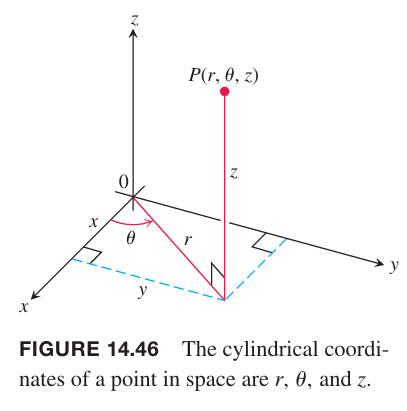
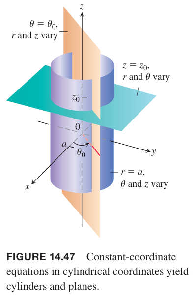
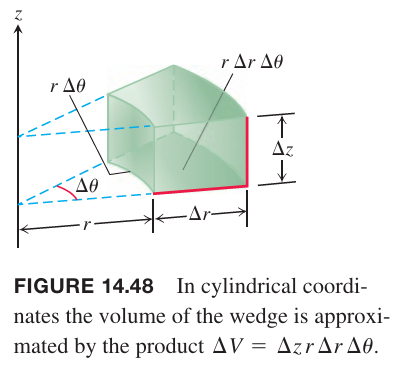
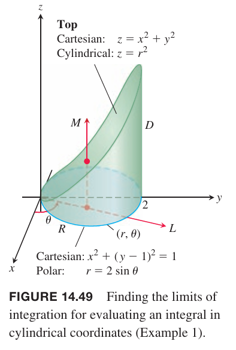
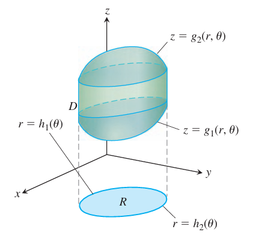
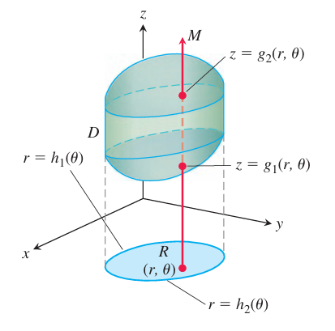
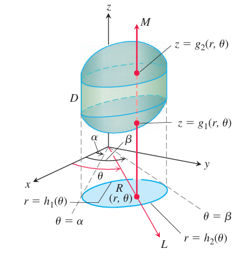
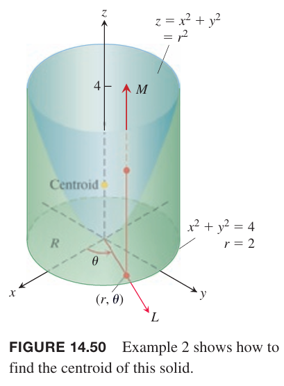

### 柱坐标系下的积分
通过结合 $xy$ 的极坐标系和 $z$ 轴可以得到空间中的柱坐标系。如下图所示，可以将空间中的一个点分配一个或多个坐标三元组 $(r,\theta,z)$，其中 $r\geq 0$。

**定义**
> 柱坐标系（`cylindrical coordinates`）用有序三元组 $(r,\theta,z)$ 表示空间中的一点 $P$，其中 $r\geq 0$。
>
> 1. $r$ 和 $\theta$ 是点 $P$ 投影到 $xy$ 平面的极坐标系的值。
> 2. $z$ 是直角坐标系的值。

**直角坐标系 $(x,y,z)$ 和柱坐标系 $(r,\theta,z)$ 关系**
> $$x=r\cos\theta,y=r\sin\theta,z=z$$
> $$r^2=x^2+y^2,\tan\theta=y/x$$

在柱坐标系中，$r=a$ 不是 $xy$ 平面的圆而是沿着 $z$ 轴的圆柱。$r=0$ 表示 $z$ 轴。$\theta=\theta_0$ 表示通过 $z$ 轴与 $x$ 夹角为 $\theta_0$ 的平面。和直角坐标系一样，$z=z_0$ 表示垂直于 $z$ 轴的平面。这些都是柱坐标系擅长表示的类型。

当我们在柱坐标系中对区域 $D$ 进行积分时，先将空间分割成 $n$ 个圆柱状的楔形，而不是立方体。对于第 $k$ 个圆柱状的楔形，$r,\theta,z$ 的变化分别是 $\Delta r_k,\Delta\theta_k,\Delta z_k$，所有楔形中最大的值称为分区的模。我们用这些楔形的黎曼和的极限表示三重积分。这样圆柱状的楔形体积 $\Delta V_k$ 是 $r\theta$ 平面的面积 $\Delta A_k$ 乘以高 $\Delta z$。

对第 $k$ 个楔形的中心点 $(r_k,\theta_k,z_k)$，面积 $\Delta A_k=r_k\Delta r_k\Delta\theta_k$，因此体积 $\Delta V=\Delta z_kr_k\Delta r_k\Delta\theta_k$，那么 $f$ 在 $D$ 上的黎曼和是
$$S_n=\sum_{k=1}^nf(r_k,\theta_k,z_k)\Delta z_kr_k\Delta r_k\Delta\theta_k$$
当分区的模区域零时，黎曼和的极限就是 $f$ 在 $D$ 上的三重积分。
$$\lim_{n\to\infty}S_n=\iiint_DfdV=\iiint_D f dzrdrd\theta$$
柱坐标系的三重积分也是用迭代积分来求值。从定义上看，对 $\theta$ 没有限制，但是对于大部分积分场景而言，$\theta$ 被限定在一个长度是 $2\pi$ 的区间内，即假定 $\alpha\leq\theta\leq\beta,0\leq\beta-\alpha\leq 2\pi$。

例1 区间 $D$ 的底是 $z=0$，外侧是圆柱 $x^2+(y-1)^2=1$，顶是 $z=x^2+y^2$，求函数 $f(r,\theta,z)$ 在柱坐标系下在 $D$ 上的积分范围。

解：将 $D$ 投影到 $xy$ 平面得到 $R$。$R$ 的边界是圆 $x^2+(y-1)^2=1$，其柱坐标系方程是
$$\begin{aligned}
x^2+(y-1)^2&=1\\
x^2+y^2-2y+1&=1\\
r^2-2r\sin\theta&=0\\
r&=2\sin\theta
\end{aligned}$$

首先求 $z$ 的范围。通过 $R$ 上一点 $(r,\theta)$ 平行于 $z$ 轴的直线 $M$，进入 $D$ 时 $z=0$，离开 $D$ 时 $z=x^2+y^2=r^2$。

接着求 $r$ 的范围。通过 $(r,\theta)$ 的射线 $L$ 进入 $R$ 时 $r=0$，离开时 $r=2\sin\theta$。

最后，求 $\theta$ 的范围。当 $L$ 扫过 $R$，其与 $x$ 轴的夹角从 $\theta=0$ 到 $\theta=\pi$。

因此积分是
$$\iiint_Df(r,\theta,z)dV=\int_0^{\pi}\int_0^{2\sin\theta}\int_0^{r^2}f(r,\theta,z)dzrdrd\theta$$

### 如何计算柱坐标系下的积分
为了计算柱坐标系下的积分
$$\iiint_Df(r,\theta,z)dV$$
首先对 $z$ 积分，然后对 $r$ 积分，最后对 $\theta$ 积分。

1. 草图。画出 $D$ 的草图以及在 $xy$ 平面的投影 $R$，标记曲面和曲线的边界。

2. 求 $z$ 的积分范围。画一条通过 $R$ 上一点 $(r,\theta)$ 且与 $z$ 轴平行的直线 $M$。随着 $z$ 的增加，$M$ 进入 $D$ 时 $z=g_1(r,\theta)$，离开时 $z=g_2(r,\theta)$。

3. 求 $r$ 的积分范围。画一条从原点出发通过 $(r,\theta)$ 的射线 $L$，进入 $R$ 时 $r=h_1(\theta)$，离开时 $r=h_2(\theta)$。

4. 求 $\theta$ 的积分范围。随着 $L$ 扫过 $R$，$L$ 与 $x$ 轴的夹角 $\theta$ 从 $\theta=\alpha$ 到 $\theta=\beta$ 变化。

$$\iiint_Df(r,\theta,z)dV=\int_{\theta=\alpha}^{\theta=\beta}\int_{h_1(\theta)}^{h_2(\theta)}\int_{g_1(r,\theta)}^{g_2(r,\theta)}f(r,\theta,z)dzrdrd\theta$$

例2 求底是 $xy$ 平面，顶是 $z=x^2+y^2$，由圆柱 $x^2+y^2=4$ 包围的形心。

解：画出草图，顶是抛物面 $z=r^2$，底是平面 $z=0$，$R$ 是 $0\leq r\leq 2$ 的圆。

由于整个图形关于 $z$ 轴对称，所以形心 $(\bar{x},\bar{y},\bar{z})$ 在对称轴上，因此 $\bar{x}=\bar{y}=0$。为了求 $\bar{z}$，需要计算 $M,M_{xy}$。

通过上图可知，$z$ 的积分上下界分别是 $z=0,z=r^2$，$r$ 的积分范围是 $0\leq r\leq 2$，$L$ 需要扫过整个圆，因此 $0\leq\theta\leq 2\pi$。因此
$$\begin{aligned}
M_{xy}&=\int_0^{2\pi}\int_0^2\int_0^{r^2}zdzrdrd\theta\\
&=\int_0^{2\pi}\int_0^2\frac{z^2}{2}\bigg|_0^{r^2}rdrd\theta\\
&=\int_0^{2\pi}\int_0^2\frac{r^5}{2}drd\theta\\
&=\int_0^{2\pi}\frac{r^6}{12}\bigg|_0^2d\theta\\
&=\int_0^{2\pi}\frac{16}{3}d\theta\\
&=\frac{32\pi}{3}
\end{aligned}$$
$$\begin{aligned}
M&=\int_0^{2\pi}\int_0^2\int_0^{r^2}dzrdrd\theta\\
&=\int_0^{2\pi}\int_0^2z\bigg|_0^{r^2}rdrd\theta\\
&=\int_0^{2\pi}\int_0^2r^3drd\theta\\
&=\int_0^{2\pi}\frac{r^4}{4}\bigg|_0^2d\theta\\
&=\int_0^{2\pi}4d\theta\\
&=8\pi
\end{aligned}$$
那么
$$\bar{z}=\frac{M_{xy}}{M}=\frac{32\pi}{3}\frac{1}{8\pi}=\frac{4}{3}$$
注意，这个形心在 $z$ 轴上，在物体之外。

### 球坐标系和积分
