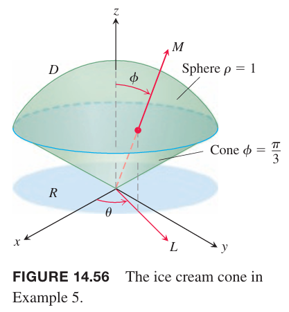

### 柱坐标系下的积分
通过结合 $xy$ 的极坐标系和 $z$ 轴可以得到空间中的柱坐标系。如下图所示，可以将空间中的一个点分配一个或多个坐标三元组 $(r,\theta,z)$，其中 $r\geq 0$。

**定义**
> 柱坐标系（`cylindrical coordinates`）用有序三元组 $(r,\theta,z)$ 表示空间中的一点 $P$，其中 $r\geq 0$。
>
> 1. $r$ 和 $\theta$ 是点 $P$ 投影到 $xy$ 平面的极坐标系的值。
> 2. $z$ 是直角坐标系的值。

**直角坐标系 $(x,y,z)$ 和柱坐标系 $(r,\theta,z)$ 关系**
> $$x=r\cos\theta,y=r\sin\theta,z=z$$
> $$r^2=x^2+y^2,\tan\theta=y/x$$

在柱坐标系中，$r=a$ 不是 $xy$ 平面的圆而是沿着 $z$ 轴的圆柱。$r=0$ 表示 $z$ 轴。$\theta=\theta_0$ 表示通过 $z$ 轴与 $x$ 夹角为 $\theta_0$ 的平面。和直角坐标系一样，$z=z_0$ 表示垂直于 $z$ 轴的平面。这些都是柱坐标系擅长表示的类型。

当我们在柱坐标系中对区域 $D$ 进行积分时，先将空间分割成 $n$ 个圆柱状的楔形，而不是立方体。对于第 $k$ 个圆柱状的楔形，$r,\theta,z$ 的变化分别是 $\Delta r_k,\Delta\theta_k,\Delta z_k$，所有楔形中最大的值称为分区的模。我们用这些楔形的黎曼和的极限表示三重积分。这样圆柱状的楔形体积 $\Delta V_k$ 是 $r\theta$ 平面的面积 $\Delta A_k$ 乘以高 $\Delta z$。

对第 $k$ 个楔形的中心点 $(r_k,\theta_k,z_k)$，面积 $\Delta A_k=r_k\Delta r_k\Delta\theta_k$，因此体积 $\Delta V=\Delta z_kr_k\Delta r_k\Delta\theta_k$，那么 $f$ 在 $D$ 上的黎曼和是
$$S_n=\sum_{k=1}^nf(r_k,\theta_k,z_k)\Delta z_kr_k\Delta r_k\Delta\theta_k$$
当分区的模区域零时，黎曼和的极限就是 $f$ 在 $D$ 上的三重积分。
$$\lim_{n\to\infty}S_n=\iiint_DfdV=\iiint_D f dzrdrd\theta$$
柱坐标系的三重积分也是用迭代积分来求值。从定义上看，对 $\theta$ 没有限制，但是对于大部分积分场景而言，$\theta$ 被限定在一个长度是 $2\pi$ 的区间内，即假定 $\alpha\leq\theta\leq\beta,0\leq\beta-\alpha\leq 2\pi$。

例1 区间 $D$ 的底是 $z=0$，外侧是圆柱 $x^2+(y-1)^2=1$，顶是 $z=x^2+y^2$，求函数 $f(r,\theta,z)$ 在柱坐标系下在 $D$ 上的积分范围。

解：将 $D$ 投影到 $xy$ 平面得到 $R$。$R$ 的边界是圆 $x^2+(y-1)^2=1$，其柱坐标系方程是
$$\begin{aligned}
x^2+(y-1)^2&=1\\
x^2+y^2-2y+1&=1\\
r^2-2r\sin\theta&=0\\
r&=2\sin\theta
\end{aligned}$$

首先求 $z$ 的范围。通过 $R$ 上一点 $(r,\theta)$ 平行于 $z$ 轴的直线 $M$，进入 $D$ 时 $z=0$，离开 $D$ 时 $z=x^2+y^2=r^2$。

接着求 $r$ 的范围。通过 $(r,\theta)$ 的射线 $L$ 进入 $R$ 时 $r=0$，离开时 $r=2\sin\theta$。

最后，求 $\theta$ 的范围。当 $L$ 扫过 $R$，其与 $x$ 轴的夹角从 $\theta=0$ 到 $\theta=\pi$。

因此积分是
$$\iiint_Df(r,\theta,z)dV=\int_0^{\pi}\int_0^{2\sin\theta}\int_0^{r^2}f(r,\theta,z)dzrdrd\theta$$

### 如何计算柱坐标系下的积分
为了计算柱坐标系下的积分
$$\iiint_Df(r,\theta,z)dV$$
首先对 $z$ 积分，然后对 $r$ 积分，最后对 $\theta$ 积分。

1. 草图。画出 $D$ 的草图以及在 $xy$ 平面的投影 $R$，标记曲面和曲线的边界。

2. 求 $z$ 的积分范围。画一条通过 $R$ 上一点 $(r,\theta)$ 且与 $z$ 轴平行的直线 $M$。随着 $z$ 的增加，$M$ 进入 $D$ 时 $z=g_1(r,\theta)$，离开时 $z=g_2(r,\theta)$。

3. 求 $r$ 的积分范围。画一条从原点出发通过 $(r,\theta)$ 的射线 $L$，进入 $R$ 时 $r=h_1(\theta)$，离开时 $r=h_2(\theta)$。

4. 求 $\theta$ 的积分范围。随着 $L$ 扫过 $R$，$L$ 与 $x$ 轴的夹角 $\theta$ 从 $\theta=\alpha$ 到 $\theta=\beta$ 变化。

$$\iiint_Df(r,\theta,z)dV=\int_{\theta=\alpha}^{\theta=\beta}\int_{h_1(\theta)}^{h_2(\theta)}\int_{g_1(r,\theta)}^{g_2(r,\theta)}f(r,\theta,z)dzrdrd\theta$$

例2 求底是 $xy$ 平面，顶是 $z=x^2+y^2$，由圆柱 $x^2+y^2=4$ 包围的形心。

解：画出草图，顶是抛物面 $z=r^2$，底是平面 $z=0$，$R$ 是 $0\leq r\leq 2$ 的圆。

由于整个图形关于 $z$ 轴对称，所以形心 $(\bar{x},\bar{y},\bar{z})$ 在对称轴上，因此 $\bar{x}=\bar{y}=0$。为了求 $\bar{z}$，需要计算 $M,M_{xy}$。

通过上图可知，$z$ 的积分上下界分别是 $z=0,z=r^2$，$r$ 的积分范围是 $0\leq r\leq 2$，$L$ 需要扫过整个圆，因此 $0\leq\theta\leq 2\pi$。因此
$$\begin{aligned}
M_{xy}&=\int_0^{2\pi}\int_0^2\int_0^{r^2}zdzrdrd\theta\\
&=\int_0^{2\pi}\int_0^2\frac{z^2}{2}\bigg|_0^{r^2}rdrd\theta\\
&=\int_0^{2\pi}\int_0^2\frac{r^5}{2}drd\theta\\
&=\int_0^{2\pi}\frac{r^6}{12}\bigg|_0^2d\theta\\
&=\int_0^{2\pi}\frac{16}{3}d\theta\\
&=\frac{32\pi}{3}
\end{aligned}$$
$$\begin{aligned}
M&=\int_0^{2\pi}\int_0^2\int_0^{r^2}dzrdrd\theta\\
&=\int_0^{2\pi}\int_0^2z\bigg|_0^{r^2}rdrd\theta\\
&=\int_0^{2\pi}\int_0^2r^3drd\theta\\
&=\int_0^{2\pi}\frac{r^4}{4}\bigg|_0^2d\theta\\
&=\int_0^{2\pi}4d\theta\\
&=8\pi
\end{aligned}$$
那么
$$\bar{z}=\frac{M_{xy}}{M}=\frac{32\pi}{3}\frac{1}{8\pi}=\frac{4}{3}$$
注意，这个形心在 $z$ 轴上，在物体之外。

### 球坐标系和积分
球坐标系的点用两个角度和一个长度表示。第一个坐标，$\rho=|\overrightarrow{OP}|$，是点距离原点的距离，不会是负值。第二个坐标，$\phi$，是 $\overrightarrow{OP}$ 与 $z$ 的正半轴的夹角，位于区间 $[0,\pi]$。第三个坐标是 $\theta$，与柱坐标系含义一致。

**定义**
> 球坐标系（`spherical coordinates`）使用有序三元组 $\rho,\phi,\theta$ 表示空间中的点 $P$，且有
>
> 1. $\rho$ 是点 $P$ 到原点的距离，$\rho\geq 0$。
> 2. $\phi$ 是 $\overrightarrow{OP}$ 与 $z$ 正半轴的夹角，$0\leq\phi\leq\pi$。
> 3. $\theta$ 来自柱坐标系的角。

$\rho=a$ 描述的是半径为 $a$ 球心位于原点的球。$\phi=\phi_0$ 描述的是顶点位于原点与 $z$ 夹角为 $\phi_0$ 的圆锥。$\phi=\pi/2$ 表示 $xy$ 平面。如果 $\phi_0$ 大于 $\pi/2$，圆锥 $\phi=\phi_0$ 朝下。$\theta=\theta_0$ 是包含 $z$ 的半个平面，角 $\theta_0$ 是与 $x$ 正半轴的夹角。

**球坐标系与笛卡尔坐标系和柱坐标系的关系**
> $$r=\rho\sin\phi,x=r\cos\theta=\rho\sin\phi\cos\phi,y=r\sin\theta=\rho\sin\phi\sin\phi$$
> $$z=\rho\cos\phi$$
> $$\rho=\sqrt{x^2+y^2+z^2}=\sqrt{r^2+z^2}$$

例3 求球 $x^2+y^2+(z-1)^2=1$ 在球坐标系下的方程。

解：使用上面的公式，代入 $x,y,z$ 有
$$\begin{aligned}
x^2+y^2+(z-1)^2&=1\\
\rho^2\sin^2\phi\cos^2\theta+\rho^2\sin^2\phi\sin^2\theta+(\rho\cos\phi-1)^2&=1\\
\rho^2\sin^2\phi(\cos^2\theta+\sin^2\theta)+\rho^2\cos^2\phi-2\rho\cos\phi+1&=1\\
\rho^2(\sin^2\phi+\cos^2\phi)&=2\rho\cos\phi\\
\rho^2&=2\rho\cos\phi\\
\rho&=2\cos\phi
\end{aligned}$$

角 $\phi$ 从 0 到 $\pi/2$。角 $\theta$ 没有出现在 $\rho$ 的表达式中，反映了关于 $z$ 的对称性。

例4 求圆锥 $z=\sqrt{x^2+y^2}$ 在球坐标系下的方程。

解：使用几何法。圆锥关于 $z$ 轴对称，与 $yz$ 平面的第一象限的交线是 $z=y$，因此圆锥与 $z$ 的正半轴的夹角是 $\pi/4$。因此 $\phi=\pi/4$。

使用代数法。使用 $\rho,\phi$ 的关系代入 $x,y,z$ 得到
$$\begin{aligned}
z&=\sqrt{x^2+y^2}\\
\rho\cos\phi&=\sqrt{\rho^2\sin^2\phi}\\
\rho\cos\phi&=\rho\sin\phi\\
\cos\phi&=\sin\phi\\
\phi&=\frac{\pi}{4}
\end{aligned}$$

当我们计算球坐标系下对区域 $D$ 的积分时，把这个区域分割成 $n$ 个部分。包含点 $(\rho_k,\phi_k,\theta_k)$ 的第 $k$ 个球状楔形的体积是由 $\rho,\phi,\theta$ 的变化 $\Delta\rho_k,\Delta\phi_k,\Delta\theta_k$ 决定的。这个楔形的一条边的长度是 $\rho_k\Delta\phi_k$，另一条边的长度是 $\rho_k\sin\phi_k\Delta\theta_k$，厚度是 $\Delta\rho_k$。当 $\Delta\rho_k,\Delta\phi_k,\Delta\theta_k$ 很小的时候，球状楔形近似是一个立方体，因此体积是 $\Delta V_k=\rho_k^2\sin\phi_k\Delta\rho_k,\Delta\phi_k,\Delta\theta_k$。

对 $f(\rho,\phi,\theta)$ 的黎曼和是
$$S_n=\sum_{k=1}^nf(\rho_k,\phi_k,\theta_k)\rho_k^2\sin\phi_k\Delta\rho_k,\Delta\phi_k,\Delta\theta_k$$
随着分区的模趋于零，球状楔形越来越小，当 $f$ 连续是黎曼和存在极限。
$$\lim_{n\to\infty}S_n=\iiint_Df(\rho,\phi,\theta)dV=\iiint_Df(\rho,\phi,\theta)\rho^2\sin\phi d\rho d\phi d\theta$$
为了求球坐标系下的积分，通常先对 $\rho$ 积分。我们会将积分局限在物体由平面关于 $z$ 旋转而来，因此 $\theta,\phi$ 积分范围是厂里。和柱坐标系一致，对 $\theta$ 的限制是 $\alpha\leq\theta,0\leq\beta-\alpha\leq 2\pi$。

### 如何计算球坐标系积分
为了求解积分
$$\iiint_Df(\rho,\phi,\theta)dV$$
通常先对 $\rho$ 积分，接着对 $\phi$ 积分，最后对 $\theta$ 积分。

1. 草图。画出 $D$ 及其在 $xy$ 平面 $R$ 的投影。标记 $D$ 和 $R$ 的边界。

2. 求 $\rho$ 的积分范围。画一条起点是原点的射线 $M$ 穿过 $D$，与 $z$ 正半轴夹角是 $\phi$。画出 $M$ 在 $xy$ 平面的投影 $L$。射线 $L$ 与 $x$ 的正半轴夹角是 $\theta$。随着 $\rho$ 的增加，$M$ 进入 $D$ 时 $\rho=g_1(\phi,\theta)$，离开时 $\rho=g_2(\phi,\theta)$。

3. 求 $\phi$ 的积分范围。对于任意给定 $\theta$，$M$ 与 $z$ 的夹角 $\phi$ 的变化范围是从 $\phi_{\min}$ 到 $\phi_{\max}$。
4. 求 $\theta$ 的积分范围。随着 $\theta$ 从 $\alpha$ 到 $\beta$，$L$ 扫过 $R$。

因此积分是
$$\iiint_Df(\rho,\phi,\theta)dV=\int_{\theta=\alpha}^{\theta=\beta}\int_{\phi=\phi_{\min}}^{\phi_{\max}}\int_{\rho=g_1(\phi,\theta)}^{\rho=g_2(\phi,\theta)}f(\rho,\phi,\theta)\rho^2\sin\phi d\rho d\phi d\theta$$

例5 求从球 $\rho\leq 1$ 到圆锥 $\phi=\pi/3$ 的类似冰淇淋圆锥 $D$ 的体积。

解：体积是在 $D$ 上的积分 $V=\iiint_D\rho^2\sin\phi d\rho d\phi d\theta$。

下面是 $D$ 及其在 $xy$ 平面上的投影 $R$ 的草图。

$\rho$ 的范围是从 0 到 1。圆锥 $\phi=\pi/3$ 给出了 $\phi$ 的最大值，因为 $\phi$ 的范围是 0 到 $\pi/3$。$\theta$ 的范围是从 0 到 $2\pi$。

因此积分是
$$\begin{aligned}
V&=\iiint_D\rho^2\sin\phi d\rho d\phi d\theta\\
&=\int_0^{2\pi}\int_0^{\pi/3}\int_0^1\rho^2\sin\phi d\rho d\phi d\theta\\
&=\int_0^{2\pi}\int_0^{\pi/3}\frac{\rho^3}{3}\bigg|_0^1\sin\phi d\phi d\theta\\
&=\int_0^{2\pi}\int_0^{\pi/3}\frac{1}{3}\sin\phi d\phi d\theta\\
&=\int_0^{2\pi}-\frac{1}{3}\cos\phi\bigg|_0^{\pi/3} d\theta\\
&=\int_0^{2\pi}\bigg(-\frac{1}{6}+\frac{1}{3}\bigg) d\theta\\
&=\frac{1}{6}(2\pi)
&=\frac{\pi}{3}
\end{aligned}$$

例6 求例 5 中关于 $z$ 轴的转动惯量。

解：对于直角坐标系，转动惯量是
$$I_z=\iiint_D(x^2+y^2)dV$$
在球坐标系中，$x^2+y^2=r^2=\rho^2\sin^2\phi$。因此
$$I_z=\iiint_D(\rho^2\sin^2\phi)\rho^2\sin\phi d\rho d\phi d\theta=\iiint_D\rho^4\sin^3\phi d\rho d\phi d\theta$$
代入例 5 中的积分范围有
$$\begin{aligned}
I_z&=\int_0^{2\pi}\int_0^{\pi/3}\int_0^1\rho^4\sin^3\phi d\rho d\phi d\theta\\
&=\int_0^{2\pi}\int_0^{\pi/3}\frac{\rho^5}{5}\bigg|_0^1\sin^3\phi d\phi d\theta\\
&=\frac{1}{5}\int_0^{2\pi}\int_0^{\pi/3}(1-\cos^2\phi)\sin\phi d\phi d\theta\\
&=\frac{1}{5}\int_0^{2\pi}\bigg[-\cos\phi+\frac{\cos^3\phi}{3}\bigg]_0^{\pi/3}d\theta\\
&=\frac{1}{5}\int_0^{2\pi}\bigg(-\frac{1}{2}+1+\frac{1}{24}-\frac{1}{3}\bigg)d\theta\\
&=\frac{1}{5}\int_0^{2\pi}\frac{5}{24}d\theta\\
&=\frac{1}{24}(2\pi)\\
&=\frac{\pi}{2}
\end{aligned}$$
