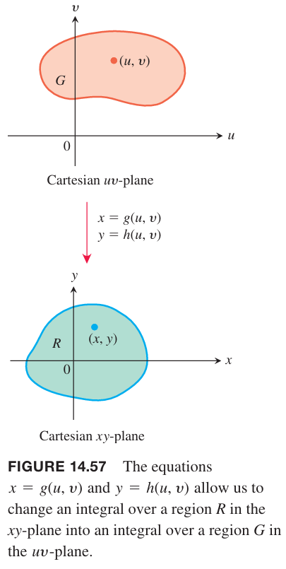
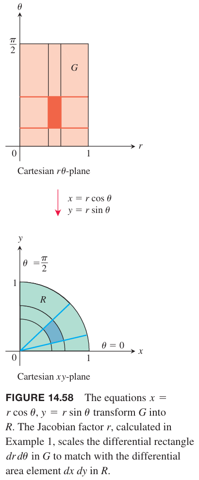
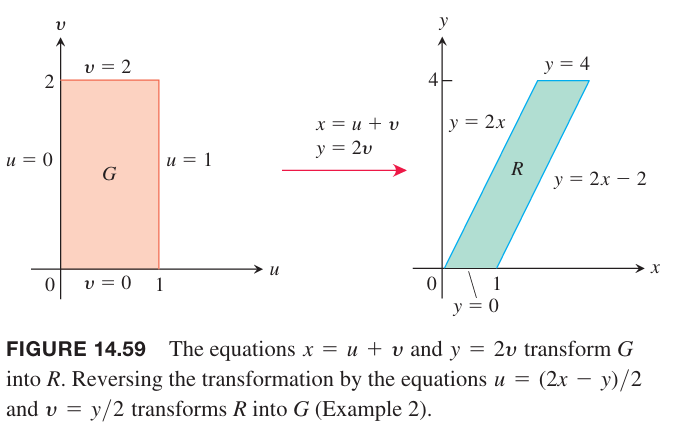
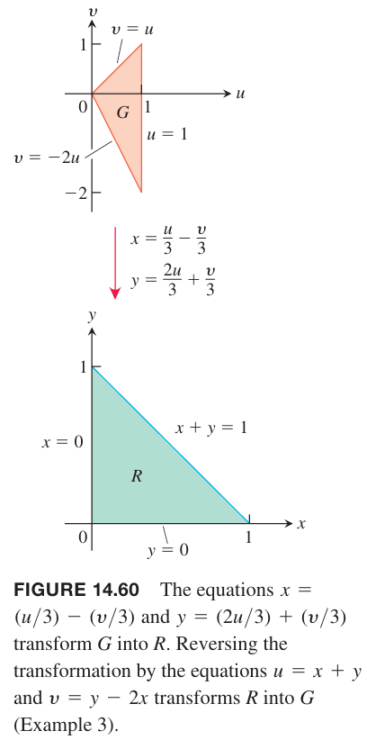
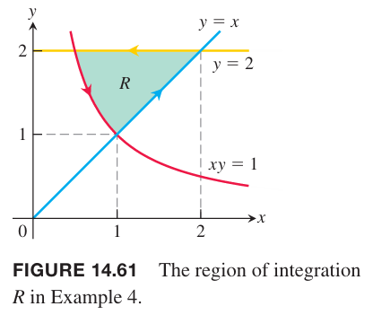
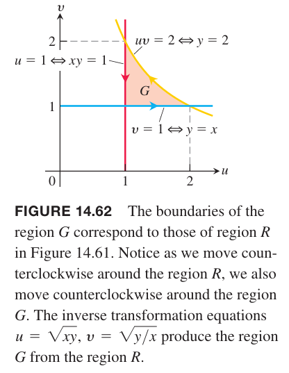
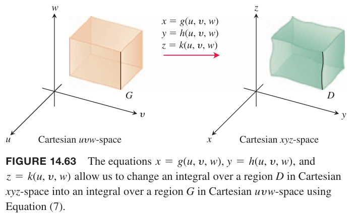
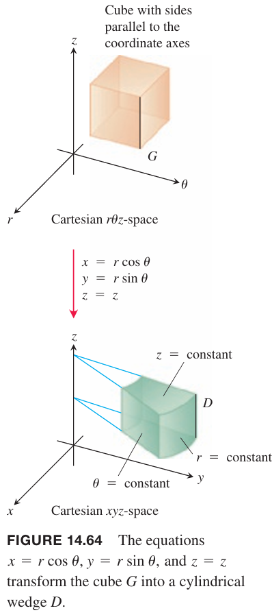
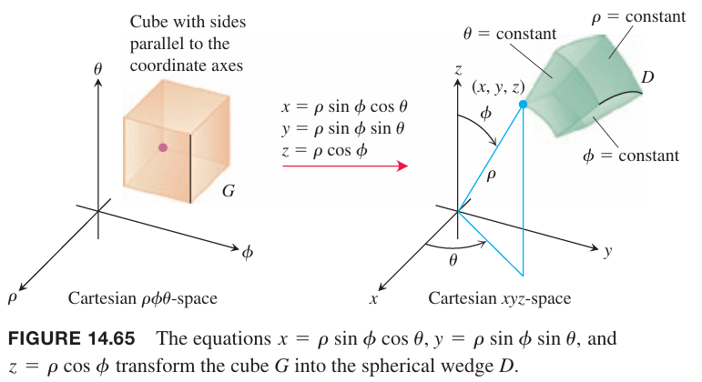
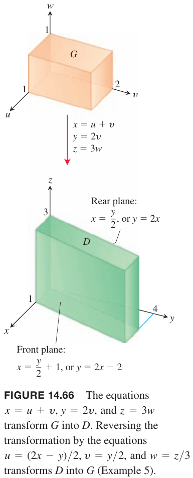

### 二重积分的替换
14.4 小节的极坐标替换是一般性的替换法的特例。

假定 $uv$ 平面的区域 $G$ 使用下面的方程变换成 $xy$ 平面的区域 $R$
$$x=g(u,v),y=h(u,v)$$

假设对于 $G$ 的内部点而言这是一个一对一的变换。我们称 $R$ 是变换下 $G$ 的镜像（`image`），$G$ 是 $R$ 的原像（`preimage`）。任意在 $R$ 上的函数 $f(x,y)$ 可以想象成 $G$ 上的函数 $f(g(u,v),h(u,v))$。$f(x,y)$ 在 $R$ 上的积分与原始的 $f(g(u,v),h(u,v))$ 在 $G$ 上的积分关系是怎样的呢？

首先回顾一下一元函数。第五章介绍了一元函数的替换法，将 $x$ 变换成 $u$，公式如下
$$\int_{g(a)}^{h(a)}f(x)dx=\int_a^bf(g(u))g'(u)du$$
为了得到二重积分 $\iint_Rf(x,y)dxdy$ 的替换法，需要一个类似于 $g'(u)$ 的乘子将 $G$ 上的 $dudv$ 变换成 $R$ 上的 $dxdy$。这里使用 $J$ 表示。就像 $g'$ 是 $u$ 的函数，$J$ 应该是 $u,v$ 的函数。$J$ 应该表示瞬时变化率，因此偏微分应该出现在表达式中。与变换函数 $x=g(u,v),y=h(u,v)$ 相关的偏微分有四个，它们都与 $H=J(u,v)$ 相关。最终的式子如下，用德国科学家卡尔•雅可比命名。

**定义**
> 坐标变换 $x=g(u,v),y=h(u,v)$ 的雅可比行列式（`Jacobian determinant`），雅可比式（`Jacobian`）定义是
> $$J(u,v)=\begin{vmatrix}
> \frac{\partial x}{\partial u}&\frac{\partial x}{\partial v}\\
> \frac{\partial y}{\partial u}&\frac{\partial y}{\partial v}
> \end{vmatrix}=\frac{\partial x}{\partial u}\frac{\partial y}{\partial v}-\frac{\partial y}{\partial u}\frac{\partial x}{\partial v}\tag{1}$$

雅可比式还可以表示为
$$J(u,v)=\frac{\partial(x,y)}{\partial(u,v)}$$
公式 $(1)$ 中 $J$ 的行为与一元变量中 $g'$ 是类似的。雅可比式描述的是点 $(u,v)$ 在区域中变换的程序。$|J|$ 描述的是将 $G$ 中 $dudv$ 的面积转换成 $R$ 中相应的 $dxdy$ 的面积。一般情况下，$|J|$ 依赖于 $G$ 中的点 $(u,v)$，即变换随着 $(u,v)$ 在 $G$ 内变化而变化。

下面回到最开始的问题，回答 $R$ 上 $f(x,y)$ 的积分 与 $G 上 $f(g(u,v),h(u,v))$ 的积分的关系。

**定理 3 二重积分的换元法**
> 假定 $f(x,y)$ 在 $R$ 上是连续的。令 $G$ 是 $R$ 的原像，变换函数是 $x=g(u,v),y=h(u,v)$，这是一个一对一映射。如果函数 $g,h$ 在 $G$ 内有连续一节偏微分，那么
> $$\iint_Rf(x,y)dxdy=\iint_Gf(g(u,v),h(u,v))\bigg|\frac{\partial(x,y)}{\partial(u,v)}\bigg|dudv\tag{2}$$

公式 $(2)$ 的推导属于高级微积分的范围，这里忽略。

例1 求极坐标变换 $x=r\cos\theta,y=r\sin\theta$ 的雅可比式，使用公式 $(2)$ 表示笛卡尔坐标系下的积分
$$\iint_Rf(x,y)dxdy$$
解：如下图所示。函数 $x=r\cos\theta,y=r\sin\theta$ 将 $G$ 中的区域 $0\leq r\leq 1,0\leq\theta\leq\pi/2$ 变换成了 $R$ 上 $x^2+y^2=1$ 在第一象限的区域。

雅可比式是
$$J(r,\theta)=\begin{vmatrix}
\frac{\partial x}{\partial r}&\frac{\partial x}{\partial\theta}\\
\frac{\partial y}{\partial r}&\frac{\partial y}{\partial\theta}
\end{vmatrix}=\begin{vmatrix}
\cos\theta&-r\sin\theta\\
\sin\theta&r\cos\theta
\end{vmatrix}=r(\cos^2\theta+\sin^2\theta)=r$$
在极坐标中，有 $r\geq 0$，因此 $|J(r,\theta)|=|r|=r$，那么根据公式 $(2)$ 有
$$\iint_Rf(x,y)dxdy=\iint_Gf(r\cos\theta,r\sin\theta)rdrd\theta\tag{3}$$
这与 14.4 小节推导结果一致。

下面的例子是一个矩形变形成了梯形。这种变换称为线性变换（`linear transformation`），并且雅可比式在 $G$ 上不变，是常量。

例2 通过变换
$$u=\frac{2x-y}{2},v=\frac{y}{2}\tag{4}$$
计算
$$\int_0^4\int_{x=y/2}^{x=(y/2)+1}\frac{2x-y}{2}dxdy$$
解：如下图右边所示，描述了 $xy$ 平面上 $R$ 的边界。

为了使用公式 $(2)$，需要找到 $uv$ 平面上 $G$ 的区域和雅可比式。首先利用 $(4)$ 来使用 $u,v$ 表示 $x,y$。
$$x=u+v,y=2v$$
下面的表格描述的是 $G$ 的边界。

| $R$ 的边界 | 相应的 $G$ 上 $uv$ 的边界 | 简化 $uv$ |
|--|--|--|
| $x=y/2$ | $u+v=2v/2=v$ | $u=0$ |
| $x=(y/2)+1$ | $u+v=2v/2+1=v+1$ | $u=1$ |
| $y=0$ | $2v=0$ | $v=0$ |
| $y=4$ | $2v=4$ | $v=2$ |

雅可比式是
$$J(u,v)=\begin{vmatrix}
\frac{\partial x}{\partial u}&\frac{\partial x}{\partial v}\\
\frac{\partial y}{\partial u}&\frac{\partial y}{\partial v}
\end{vmatrix}=\begin{vmatrix}
\frac{\partial}{\partial u}(u+v)&\frac{\partial}{\partial v}(u+v)\\
\frac{\partial}{\partial u}(2v)&\frac{\partial}{\partial v}(2v)
\end{vmatrix}=\begin{vmatrix}
1&1\\
0&2
\end{vmatrix}=2$$
那么
$$\begin{aligned}
\int_0^4\int_{x=y/2}^{x=(y/2)+1}\frac{2x-y}{2}dxdy&=\int_{v=0}^{v=2}\int_{u=0}^{u=1}u|J(u,v)|dudv\\
&\int_0^2\int_0^22ududv\\
&=\int_0^2 u^2\bigg|_0^2dv\\
&=\int_0^2dv\\
&=2
\end{aligned}$$

例3 求
$$\int_0^2\int_0^{1-x}\sqrt{x+y}(y-2x)^2dydx$$
解：如下图所示，给出了 $xy$ 平面上 $R$ 的边界。

从积分式可以尝试变换 $u=x+y,v=y-2x$，得到
$$x=\frac{u}{3}-\frac{v}{3},y=\frac{2u}{3}-\frac{v}{3}\tag{6}$$
从上面式子可以得到 $G$ 在 $uv$ 平面的边界。

| $R$ 的边界 | 相应的 $G$ 上 $uv$ 的边界 | 简化 $uv$ |
|--|--|--|
| $x+y=1$ | $(\frac{u}{3}-\frac{v}{3})+(\frac{2u}{3}+\frac{v}{3})=1$ | $u=1$ |
| $x=0$ | $\frac{u}{3}-\frac{v}{3}=0$ | $v=u$ |
| $y=0$ | $\frac{2u}{3}-\frac{v}{3}=0$ | $v=-2u$ |

雅可比式是
$$J(u,v)=\begin{vmatrix}
\frac{\partial x}{\partial u}&\frac{\partial x}{\partial v}\\
\frac{\partial y}{\partial u}&\frac{\partial y}{\partial v}
\end{vmatrix}=\begin{vmatrix}
\frac{1}{3}&-\frac{1}{3}\\
\frac{2}{3}&\frac{1}{3}
\end{vmatrix}=\frac{1}{3}$$
那么
$$\begin{aligned}
\int_0^2\int_0^{1-x}\sqrt{x+y}(y-2x)^2dydx&=\int_{u=0}^{u=1}\int_{v=-2u}^{v=u}u^{1/2}v^2|J(u,v)|dvdu\\
&=\int_0^1\int_{-2u}^uu^{1/2}v^2(\frac{1}{3})dvdu\\
&=\frac{1}{3}\int_0^1u^{1/2}\frac{1}{3}v^3\bigg|_{v=-2u}^{v=u}du\\
&=\frac{1}{9}\int_0^1u^{1/2}(u^3+8u^3)du\\
&=\int_0^1u^{7/2}du\\
&=\frac{2}{9}u^{9/2}\bigg|_0^1\\
&=\frac{2}{9}
\end{aligned}$$

下个例子简化积分式而得到的非线性变换。和极坐标转换一样，非线性变换将直线边界映射到曲线边界，或者相反。一般地，非线性变化比线性变换更复杂，完整的讨论在高等微积分中。

例4 求积分
$$\int_1^2\int_{1/y}^y\sqrt{\frac{y}{x}}e^{\sqrt{xy}}dxdy$$
解：根据积分式中的平方可以尝试替换 $u=\sqrt{xy},v=\sqrt{y/x}$。两个式子两边平方得到 $u^2=xy,v^2=y/x$，因此有 $u^2v^2=x^2,u^2/v^2=x^2$，那么
$$x=\frac{u}{v},y=uv$$
其中 $u>0,v>0$。雅可比式是
$$J(u,v)=\begin{vmatrix}
\frac{\partial x}{\partial u}&\frac{\partial x}{\partial v}\\
\frac{\partial y}{\partial u}&\frac{\partial y}{\partial v}
\end{vmatrix}=\begin{vmatrix}
\frac{1}{v}&\frac{-u}{v^2}\\
v&u
\end{vmatrix}=\frac{2u}{v}$$
此时不再是常量。

如果 $G$ 是 $uv$ 平面的区域，根据公式 $(2)$ 有
$$\iint_R\sqrt{\frac{y}{x}}e^{\sqrt{xy}}dxdy=\iint_Rve^u\frac{2u}{v}dudv=\iint_G2ue^ududv$$
这个积分比原始积分要容易，所以现在确定积分范围。

原始积分的区域 $R$ 在 $xy$ 平面上图形如下图所示。

$xy=1$ 可以得到 $u=1,1\leq v\leq 2$，$y=x$ 可以得到 $v=1,1\leq u\leq 2$，$y=2$ 可以得到 $y=2$ 可以得到 $uv=2,1\leq v\leq 2$。上述过程的边界是逆时针顺序，因此在 $G$ 中的顺序也是逆时针，如下图所示。

知道了 $G$ 在 $uv$ 平面的范围，因此可以得到积分
$$\int_1^2\int_{1/y}^y\sqrt{\frac{y}{x}}e^{\sqrt{xy}}dxdy=\int_1^2\int_1^{2/u}2ue^udvdu$$
因此
$$\begin{aligned}
\int_1^2\int_1^{2/u}2ue^udvdu&=2\int_1^2[vue^u]_{v=1}^{v=2/u}du\\
&=2\int_1^2(2e^u-ue^u)du\\
&=2\int_1^2(2-u)e^2du\\
&=2\bigg[(2-u)e^2+e^2\bigg]_1^2&&&\text{分部积分}\\
&=2(e^2-(e+e))\\
&=2e(e-2)
\end{aligned}$$

### 三重积分的替换
14.7 节中圆柱坐标系和球坐标系替换是三重积分替换的特例。

假设 $uvw$ 平面上的区域 $G$ 到 $xyz$ 平面上的区域 $D$ 的一对一变换是
$$x=g(u,v,w),y=h(u,v,w),z=k(u,v,w)$$

那么 $D$ 上的任意函数 $F(x,y,z)$ 可以看作是 $G$ 上的函数
$$F(g(u,v,w),h(u,v,w),k(u,v,w))=H(u,v,w)$$
如果 $g,h,k$ 有连续的一阶偏微分，那么 $F(x,y,z)$ 在 $D$ 上的积分与 $H(u,v,w)$ 在 $G$ 上的积分关系是
$$\iiint_DF(x,y,z)dxdydz=\iiint_GH(u,v,w)|J(u,v,w)|dudvdw\tag{7}$$
其中因子 $J(u,v,w)$ 是雅可比行列式
$$J(u,v,w)=\begin{vmatrix}
\frac{\partial x}{\partial u}&\frac{\partial x}{\partial v}&\frac{\partial x}{\partial w}\\
\frac{\partial y}{\partial u}&\frac{\partial y}{\partial v}&\frac{\partial y}{\partial w}\\
\frac{\partial z}{\partial u}&\frac{\partial z}{\partial v}&\frac{\partial z}{\partial w}
\end{vmatrix}=\frac{\partial(x,y,z)}{\partial(u,v,w)}$$
这个行列式表示从 $(u,v,w)$ 到 $(x,y,z)$ 变换时 $G$ 中某点附近的体积是如何变化的。和二重积分一样，公式 $(7)$ 的推导忽略。

对于柱坐标系，用 $r,\theta,z$ 替代这里的 $u,v,w$。从 $r\theta z$ 空间到 $xyz$ 空间的变换方程是
$$x=r\cos\theta,y=r\sin\theta,z=z$$

变换的雅可比式是
$$\begin{aligned}
J(r,\theta,z)&=\begin{vmatrix}
\frac{\partial x}{\partial r}&\frac{\partial x}{\partial \theta}&\frac{\partial x}{\partial z}\\
\frac{\partial y}{\partial r}&\frac{\partial y}{\partial \theta}&\frac{\partial y}{\partial z}\\
\frac{\partial z}{\partial r}&\frac{\partial z}{\partial \theta}&\frac{\partial z}{\partial z}
\end{vmatrix}\\
&=\begin{vmatrix}
\cos\theta&-r\sin\theta&0\\
\sin\theta&r\cos\theta&0\\
0&0&1
\end{vmatrix}\\
&=r\cos^2\theta+r\sin^2\theta\\
&=r
\end{aligned}$$
根据公式 $(7)$ 可以得到
$$\iiint_DF(x,y,z)dxdydz=\iiint_GH(r,\theta,z)|r|drd\theta dz$$
由于 $r\geq 0$，可以省略上面式子中的绝对值。

对于球坐标系，用 $\rho,\phi,\theta$ 替代这里的 $u,v,w$。从 $\rho\phi\theta$ 平面到 $xyz$ 平面的变换是
$$x=\rho\sin\phi\cos\theta,y=\rho\sin\phi\sin\theta,z=\rho\cos\phi$$

雅可比行列式是
$$\begin{aligned}
J(\rho,\phi,\theta)&=\begin{vmatrix}
\frac{\partial x}{\partial\rho}&\frac{\partial x}{\partial\phi}&\frac{\partial x}{\partial\theta}\\
\frac{\partial y}{\partial\rho}&\frac{\partial y}{\partial\phi}&\frac{\partial y}{\partial\theta}\\
\frac{\partial z}{\partial\rho}&\frac{\partial z}{\partial\phi}&\frac{\partial z}{\partial\theta}
\end{vmatrix}\\
&=\begin{vmatrix}
\sin\phi\cos\theta&\rho\cos\phi\cos\theta&-\rho\sin\phi\sin\theta\\
\sin\phi\sin\theta&\rho\cos\phi\sin\theta&\rho\sin\phi\cos\theta\\
\cos\phi&-\rho\sin\phi&0
\end{vmatrix}\\
&=\rho^2\cos\phi\begin{vmatrix}
\cos\phi\cos\theta&-\sin\phi\sin\theta\\
\cos\phi\sin\theta&\sin\phi\cos\theta
\end{vmatrix}+\rho\sin\phi\begin{vmatrix}
\sin\phi\cos\theta&-\rho\sin\phi\sin\theta\\
\sin\phi\sin\theta&\rho\sin\phi\cos\theta
\end{vmatrix}\\
&=\rho^2\cos\phi(\cos\phi\sin\phi\cos^2\theta+\cos\phi\sin\phi\sin^2\theta)+\rho\sin\phi(\rho\sin^2\phi\cos^2\theta+\rho\sin^2\phi\sin^2\theta)\\
&=\rho^2\cos^2\phi\sin\phi+\rho^2\sin^2\phi\sin\phi\\
&=\rho^2\sin\phi
\end{aligned}$$
因此
$$\iiint_DF(x,y,z)dxdydx=\iiint_GH(\rho,\phi,\theta)|\rho^2\sin\phi|d\rho d\phi d\theta$$
我们可以去掉绝对值符号，因为 $0\leq\phi\leq\pi$ 那么 $\sin\phi\geq 0$，这就和 14.7 小节结论一致。

下面是一个例子。尽管我们可以直接积分，但是这个例子中替换法相对简单，便于解释方法本身。

例5 应用变换
$$u=(2x-y)/2,v=y/2,w=z/3\tag{8}$$
求积分
$$\int_0^3\int_0^4\int_{x=y/2}^{x=(y/2)+1}\bigg(\frac{2x-y}{2}+\frac{z}{3}\bigg)dxdydz$$
解：下面是区域 $D$ 在 $xyz$平面上的示意图，包含其边界。

为了使用公式 $(7)$，需要找到 $uvw$ 平面上 $G$ 的边界和变换的雅可比式。首先从 $(8)$ 出发用 $u,v,w$ 表示 $x,y,z$，那么
$$x=u+v,y=2v,z=3w\tag{9}$$
通过替换表达式找到 $G$ 边界。

| $xyz$ 平面上 $D$ 的边界 | 相应的 $uvw$ 平面上 $G$ 的边界 | 简化 $uvw$ |
|--|--|--|
| $x=y/2$ | $u+v=2v/2=v$ | $u=0$ |
| $x=(y/2)+1$ | $u+v=(2v/2)+1=v+1$ | $u=1$ |
| $y=0$ | $2v=2$ | $v=0$ |
| $y=4$ | $2v=4$ | $v=2$ |
| $z=0$ | $3w=0$ | $w=0$ |
| $z=3$ | $3w=3$ | $w=1$ |

从式子 $(9)$ 可以得到雅可比式
$$\begin{aligned}
J(u,v,w)&=\begin{vmatrix}
\frac{\partial x}{\partial u}&\frac{\partial x}{\partial v}&\frac{\partial x}{\partial w}\\
\frac{\partial y}{\partial u}&\frac{\partial y}{\partial v}&\frac{\partial y}{\partial w}\\
\frac{\partial z}{\partial u}&\frac{\partial z}{\partial v}&\frac{\partial z}{\partial w}
\end{vmatrix}\\
&=\begin{vmatrix}
1&1&0\\
0&2&0\\
0&0&3
\end{vmatrix}\\
&=6
\end{aligned}$$
那么
$$\begin{aligned}
\int_0^3\int_0^4&\int_{x=y/2}^{x=(y/2)+1}\bigg(\frac{2x-y}{2}+\frac{z}{3}\bigg)dxdydz\\
&=\int_0^1\int_0^2\int_0^1(u+w)|J(u,v,w)|dudvdw\\
&=\int_0^1\int_0^2\int_0^16(u+w)dudvdw\\
&=6\int_0^1\int_0^2(\frac{u^2}{2}+wu)|_0^1dvdw\\
&=6\int_0^1\int_0^2(\frac{1}{2}+w)dvdw\\
&=6\int_0^1(\frac{v}{2}+wv)|_0^2dw\\
&=6\int_0^1(1+2w)dw\\
&=6(w+w^2)\bigg|_0^1\\
&=12
\end{aligned}$$

