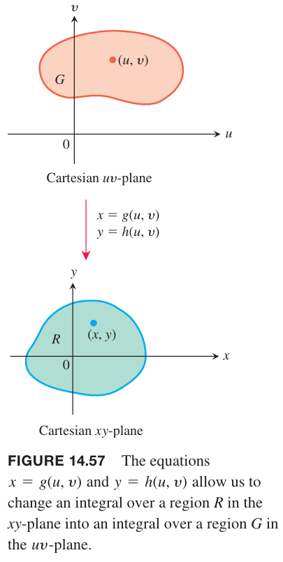

### 二重积分的替换
14.4 小节的极坐标替换是一般性的替换法的特例。

假定 $uv$ 平面的区域 $G$ 使用下面的方程变换成 $xy$ 平面的区域 $R$
$$x=g(u,v),y=h(u,v)$$

假设对于 $G$ 的内部点而言这是一个一对一的变换。我们称 $R$ 是变换下 $G$ 的镜像（`image`），$G$ 是 $R$ 的原像（`preimage`）。任意在 $R$ 上的函数 $f(x,y)$ 可以想象成 $G$ 上的函数 $f(g(u,v),h(u,v))$。$f(x,y)$ 在 $R$ 上的积分与原始的 $f(g(u,v),h(u,v))$ 在 $G$ 上的积分关系是怎样的呢？

首先回顾一下一元函数。第五章介绍了一元函数的替换法，将 $x$ 变换成 $u$，公式如下
$$\int_{g(a)}^{h(a)}f(x)dx=\int_a^bf(g(u))g'(u)du$$
为了得到二重积分 $\iint_Rf(x,y)dxdy$ 的替换法，需要一个类似于 $g'(u)$ 的乘子将 $G$ 上的 $dudv$ 变换成 $R$ 上的 $dxdy$。这里使用 $J$ 表示。就像 $g'$ 是 $u$ 的函数，$J$ 应该是 $u,v$ 的函数。$J$ 应该表示瞬时变化率，因此偏微分应该出现在表达式中。与变换函数 $x=g(u,v),y=h(u,v)$ 相关的偏微分有四个，它们都与 $H=J(u,v)$ 相关。最终的式子如下，用德国科学家卡尔•雅可比命名。

**定义**
> 坐标变换 $x=g(u,v),y=h(u,v)$ 的雅可比行列式（`Jacobian determinant`），雅可比式（`Jacobian`）定义是
> $$J(u,v)=\begin{vmatrix}
> \frac{\partial x}{\partial u}&\frac{\partial x}{\partial v}\\
> \frac{\partial y}{\partial u}&\frac{\partial y}{\partial v}\\
> \end{vmatrix}=\frac{\partial x}{\partial u}\frac{\partial y}{\partial v}-\frac{\partial y}{\partial u}\frac{\partial x}{\partial v}\tag{1}$$

雅可比式还可以表示为
$$J(u,v)=\frac{\partial(x,y)}{\partial(u,v)}$$
公式 $(1)$ 中

