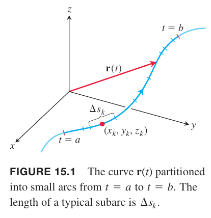
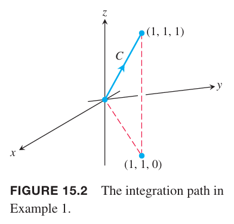
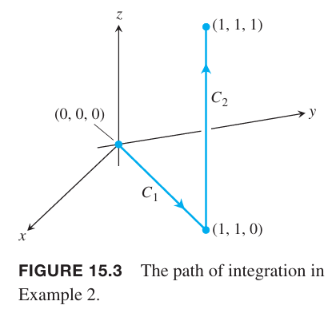
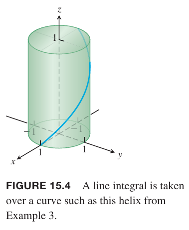
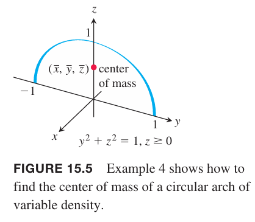
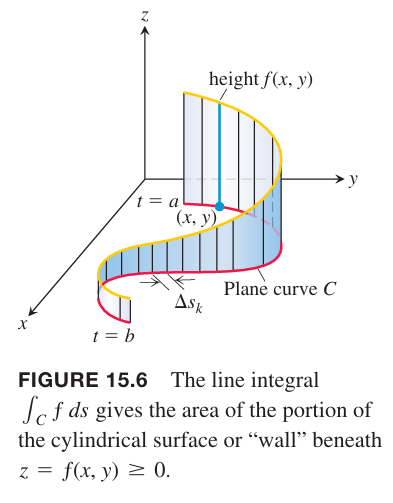

为了计算空间曲线上的质量或者沿着曲线的做功，需要沿着曲线 $C$ 积分，这种更一般的积分方法称为线积分（`line integral`）（更好的名字是路径积分（`path integral`））。下面的分析基于空间曲线，$xy$ 平面上的曲线是 $z$ 坐标为零的特例。

假定 $f(x,y,z)$ 是实函数，我们想沿着曲线 $C$ 积分，其参数方程是 $\boldsymbol{r}(t)=g(t)\boldsymbol{i}+h(t)\boldsymbol{j}+k(t)\boldsymbol{k},a\leq t\leq b$。$f$ 沿着曲线的值由函数 $f(x(t),y(t),z(t))$ 确定。从 $t=a$ 到 $t=b$ 对应的弧线上对 $f$ 积分。首先，我们将曲线分割成有限多的 $n$ 段，每段弧长是 $\Delta s_k$。每段弧上选择一点 $(x_k,y_k,z_k)$，那么和是
$$S_n=\sum_{k=1}^nf(x_k,y_k,z_k)\Delta s_k$$

依赖于分割 $C$ 的方法和在第 $k$ 段上选择的点 $(x_k,y_k,z_k)$，会得到不同的 $S_n$。如果 $f$ 连续且 $g,h,k$ 有连续的一阶导，当 $n$ 增加时，$\Delta s_k$ 趋于零，这些和趋于同一个极限。在下面的定义中，我们假定 $n\to\infty$ 时，分区的模趋于零，所以最长的一段弧长度趋于零。

**定义**
> 如果函数 $f$ 在由参数方程 $\boldsymbol{r}(t)=g(t)\boldsymbol{i}+h(t)\boldsymbol{j}+k(t)\boldsymbol{k},a\leq t\leq b$ 确定的曲线 $C$ 上有定义，那么 $f$ 在 $C$ 上的线积分是
> $$\int_Cf(x,y,z)ds=\lim_{n\to\infty}\sum_{k=1}^nf(x_k,y_k,z_k)\Delta s_k\tag{1}$$
> 前提是极限存在。

如果 $C$ 在 $a\leq t\leq b$ 上光滑，那么 $\boldsymbol{v}=d\boldsymbol{r}/dt$ 是连续的，且不为 $\boldsymbol{0}$，且函数 $f$ 在 $C$ 上连续，那么 $(1)$ 的极限存在。12.3 小节中使用微积分基本定理表示弧长如下
$$s(t)=\int_a^t|\boldsymbol{v}(\tau)|d\tau$$
代入 $(1)$ 可以得到 $ds=|\boldsymbol{v}(t)|dt$，那么 $f$ 在 $C$ 上的积分就是
$$\int_Cf(x,y,z)ds=\int_a^bf(g(t),h(t),k(t))|\boldsymbol{v}(t)|dt\tag{2}$$
上式的右边是一个对 $t$ 的普通积分。求左边线积分与光滑参数曲线无关。这里参数 $t$ 定义了路径的方向。从 $\boldsymbol{r}(a)$ 开始，沿着 $t$ 增加的方向移动。

**如何求线积分**
> 为了求连续函数 $f(x,y,z)$ 在曲线上 $C$ 的积分
>
> 1. 找 $C$ 的光滑参数方程
> $$\boldsymbol{r}(t)=g(t)\boldsymbol{i}+h(t)\boldsymbol{j}+k(t)\boldsymbol{k},a\leq t\leq b$$
> 2. 求积分
> $$\int_Cf(x,y,z)ds=\int_a^bf(g(t),h(t),k(t))|\boldsymbol{v}(t)|dt$$

如果 $f$ 是常量函数 1，那么 $f$ 在 $C$ 上的积分是 $C$ 的长度。

例1 求 $f(x,y,z)=x-3y^2+z$ 在连接原点和 $(1,1,1)$ 的曲线 $C$ 上的积分。

解：由于参数方程的选择与结果无关，因此选择最简单参数方程
$$\boldsymbol{r}(t)=t\boldsymbol{i}+t\boldsymbol{j}+t\boldsymbol{k},0\leq t\leq 1$$
各个分量的一阶导连续，并且 $|\boldsymbol{v}(t)|=|\boldsymbol{i}+\boldsymbol{j}+\boldsymbol{k}|=\sqrt{1+1+1}=\sqrt{3}\neq 0$，因此参数方程是光滑的。那么根据公式 $(2)$ 有
$$\begin{aligned}
\int_Cf(x,y,z)ds&=\int_0^1f(t,t,t)\sqrt{3}dt\\
&=\int_0^1(t-3t^2+t)\sqrt{3}dt\\
&=\sqrt{3}\int_0^1(2t-3t^2)dt\\
&=\sqrt{3}\bigg[t^2-t^3\bigg]_0^1\\
&=0
\end{aligned}$$

### 相加性
线积分有一个非常使用的属性，如果一个光滑曲线 $C$ 可以分成有限多段光滑曲线 $C_1,C_2,\cdots,C_n$，那么曲线 $C$ 上的函数积分是各个曲线上的积分之和：
$$\int_Cfds=\int_{C_1}fds+\int_{C_2}fds+\cdots+\int_{C_n}fds\tag{3}$$

例2 如下图所示，是另一个从原点到点 $(1,1,1)$ 的路径，由线段 $C_1,C_2$ 组成。求函数 $f(x,y,z)=x-3y^2+z$ 在 $C_1\cup C_2$ 上的积分。

解：和例 1 类似，我们选择最简单的路径并计算速度矢量。
$$\begin{aligned}
C_1:&\boldsymbol{r}(t)=t\boldsymbol{i}+t\boldsymbol{j},0\leq t\leq 1&&|\boldsymbol{v}|=\sqrt{1^2+1^2}=\sqrt{2}\\
C_2:&\boldsymbol{r}(t)=\boldsymbol{i}+\boldsymbol{j}+t\boldsymbol{k},0\leq t\leq 1&&|\boldsymbol{v}|=\sqrt{0^2+0^2+1^2}=1
\end{aligned}$$
那么
$$\begin{aligned}
\int_{C_1\cup C_2}f(x,y,z)ds&=\int_{C_1}f(x,y,z)ds+\int_{C_2}f(x,y,z)ds\\
&=\int_0^1f(t,t,0)\sqrt{2}dt+\int_0^1f(1,1,t)(1)dt\\
&=\int_0^1(t-3t^2)\sqrt{2}dt+\int_0^1(1-3+t)dt\\
&=\sqrt{2}\bigg[\frac{t^2}{2}-t^3\bigg]_0^1+\bigg[\frac{t^2}{2}-2t\bigg]_0^1\\
&=-\frac{\sqrt{2}}{2}-\frac{3}{2}
\end{aligned}$$

例 1 和例 2 有三件事需要处理。首先，一旦使用合适的曲线代入 $f$，积分变成了对 $t$ 的标准积分。其次，$f$ 在 $C_1\cup C_2$ 上的积分等于在各段上积分然后求和。最后，$f$ 在 $C$ 和 $C_1\cup C_2$ 上的积分不同。15.3 会研究第三个结论。

如果改变两点之间的路径，那么线积分的值可能会变。

例3 求函数 $f(x,y,z)=2xy+\sqrt{z}$ 在螺旋线 $\boldsymbol{r}(t)=\cos t\boldsymbol{i}+\sin t\boldsymbol{j}+t\boldsymbol{k},0\leq t\leq \pi$ 的线积分。

解：螺旋线如下所示。

$$\boldsymbol{v}(t)=\boldsymbol{r}'(t)=-\sin t\boldsymbol{i}+\cos t\boldsymbol{j}+\boldsymbol{k}$$
那么
$$|\boldsymbol{v}(t)|=\sqrt{2}$$
函数 $f$ 在点 $\boldsymbol{r}(t)$ 处是
$$f(\boldsymbol{r}(t))=f(\cos t,\sin t,t)=2\cos t\sin t+\sqrt{t}=\sin 2t+\sqrt{t}$$
那么
$$\begin{aligned}
\int_Cf(x,y,z)ds&=\int_0^{\pi}(\sin 2t+\sqrt{t})\sqrt{2}dt\\
&=\sqrt{2}\bigg[-\frac{1}{2}\cos 2t+\frac{2}{3}t^{3/2}\bigg]_0^{\pi}\\
&=\frac{2\sqrt{2}}{3}\pi^{3/2}
\end{aligned}$$

### 质量和力矩
可以将电线或线圈看作是空间中的曲线。连续密度函数 $\delta(x,y,z)$ 描述了单位长度的质量。曲线参数方程是 $\boldsymbol{r}(t)=x(t)\boldsymbol{i}+y(t)\boldsymbol{j}+z(t)\boldsymbol{k},a\leq t\leq b$，其中 $x,y,z$ 是 $t$ 的函数，密度函数是 $\delta(x(t),y(t),z(t))$，弧长微分是
$$ds=\sqrt{\bigg(\frac{dx}{dt}\bigg)^2+\bigg(\frac{dy}{dt}\bigg)^2+\bigg(\frac{dz}{dt}\bigg)^2}dt$$

因此质量、质心、转动惯量公式如下。

质量
$$M=\int_C\delta ds$$
关于坐标平面的一阶矩
$$M_{yz}=\int_Cx\delta ds,M_{xz}=\int_Cy\delta ds,M_{yz}=\int_Cz\delta ds$$
质心
$$\bar{x}=M_{yz}/M,\bar{y}=M_{xz}/M,\bar{z}=M_{xy}/M$$
关于坐标轴或其他直线的转动惯量
$$I_x=\int_C(y^2+z^2)\delta ds,I_y=\int_C(x^2+z^2)\delta ds,I_z=\int_C(x^2+y^2)\delta ds,I_L=\int_Cr^2\delta ds$$

这些公式（包括下一节给出的公式）也适用于二重积分和三重积分。注意，这里的 $dm$ 是 $\delta ds$ 而不是 $\delta V$。

例4 一个金属弧线，底部密度更大。形状是半圆 $y^2+z^2=1,z\geq 0$，如下图所示。如果密度函数是 $\delta(x,y,z)=2-z$，求质心。

解：因为半圆和密度分布关于 $z$ 轴对称，因此 $\bar{x}=\bar{y}=0$。为了求 $\bar{z}$，半圆的参数化方程如下
$$\boldsymbol{r}(t)=(\cos t)\boldsymbol{j}+(\sin t)\boldsymbol{k},0\leq t\leq \pi$$
因此
$$|\boldsymbol{v}(t)|=\sqrt{\bigg(\frac{dx}{dt}\bigg)^2+\bigg(\frac{dy}{dt}\bigg)^2+\bigg(\frac{dz}{dt}\bigg)^2}=1$$
代入上面的公式
$$\begin{aligned}
M&=\int_C\delta ds\\
&=\int_C(2-z)ds\\
&=\int_0^{\pi}(2-\sin t)dt\\
&=2\pi-2
\end{aligned}$$
$$\begin{aligned}
M_{xy}&=\int_C z\delta ds\\
&=\int_C z(2-z)ds\\
&=\int_0^\pi(2\sin t-\sin^2 t)dt\\
&=\frac{8-\pi}{2}
\end{aligned}$$
因此
$$\bar{z}=\frac{M_{xy}}{M}=\frac{8-\pi}{4\pi-4}$$

### 平面上的线积分
曲线在平面上的线积分有一种自然的几何解释。如果 $C$ 是 $xy$ 平面的曲线，参数方程是 $\boldsymbol{r}(t)=x(t)\boldsymbol{i}+y(t)\boldsymbol{j},a\leq t\leq b$。我们可以沿着 $C$ 移动平行于 $z$ 轴的直线。如下图所示。

如果 $z=f(x,y)$ 是连续非负函数，那么 $f$ 是一个柱面。在曲线上任意点 $(x,y)$，高度就是 $f(x,y)$，那么定义
$$\int_Cfds=\lim_{n\to\infty}\sum_{k=1}^nf(x_k,y_k)\Delta s_k$$
是上图中柱面的面积，其中随着 $n\to\infty$，有 $\Delta s_k\to 0$。
