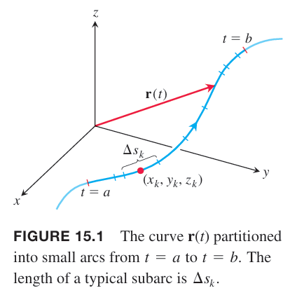
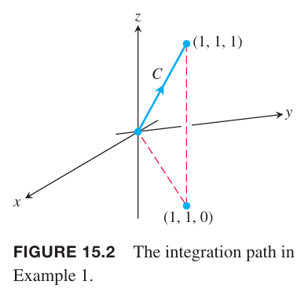

为了计算空间曲线上的质量或者沿着曲线的做功，需要沿着曲线 $C$ 积分，这种更一般的积分方法称为线积分（`line integral`）（更好的名字是路径积分（`path integral`））。下面的分析基于空间曲线，$xy$ 平面上的曲线是 $z$ 坐标为零的特例。

假定 $f(x,y,z)$ 是实函数，我们想沿着曲线 $C$ 积分，其参数方程是 $\boldsymbol{r}(t)=g(t)\boldsymbol{i}+h(t)\boldsymbol{j}+k(t)\boldsymbol{k},a\leq t\leq b$。$f$ 沿着曲线的值由函数 $f(x(t),y(t),z(t))$ 确定。从 $t=a$ 到 $t=b$ 对应的弧线上对 $f$ 积分。首先，我们将曲线分割成有限多的 $n$ 段，每段弧长是 $\Delta s_k$。每段弧上选择一点 $(x_k,y_k,z_k)$，那么和是
$$S_n=\sum_{k=1}^nf(x_k,y_k,z_k)\Delta s_k$$

依赖于分割 $C$ 的方法和在第 $k$ 段上选择的点 $(x_k,y_k,z_k)$，会得到不同的 $S_n$。如果 $f$ 连续且 $g,h,k$ 有连续的一阶导，当 $n$ 增加时，$\Delta s_k$ 趋于零，这些和趋于同一个极限。在下面的定义中，我们假定 $n\to\infty$ 时，分区的模趋于零，所以最长的一段弧长度趋于零。

**定义**
> 如果函数 $f$ 在由参数方程 $\boldsymbol{r}(t)=g(t)\boldsymbol{i}+h(t)\boldsymbol{j}+k(t)\boldsymbol{k},a\leq t\leq b$ 确定的曲线 $C$ 上有定义，那么 $f$ 在 $C$ 上的线积分是
> $$\int_Cf(x,y,z)ds=\lim_{n\to\infty}\sum_{k=1}^nf(x_k,y_k,z_k)\Delta s_k\tag{1}$$
> 前提是极限存在。

如果 $C$ 在 $a\leq t\leq b$ 上光滑，那么 $\boldsymbol{v}=d\boldsymbol{r}/dt$ 是连续的，且不为 $\boldsymbol{0}$，且函数 $f$ 在 $C$ 上连续，那么 $(1)$ 的极限存在。12.3 小节中使用微积分基本定理表示弧长如下
$$s(t)=\int_a^t|\boldsymbol{v}(\tau)|d\tau$$
代入 $(1)$ 可以得到 $ds=|\boldsymbol{v}(t)|dt$，那么 $f$ 在 $C$ 上的积分就是
$$\int_Cf(x,y,z)ds=\int_a^bf(g(t),h(t),k(t))|\boldsymbol{v}(t)|dt\tag{2}$$
上式的右边是一个对 $t$ 的普通积分。求左边线积分与光滑参数曲线无关。这里参数 $t$ 定义了路径的方向。从 $\boldsymbol{r}(a)$ 开始，沿着 $t$ 增加的方向移动。

**如何求线积分**
> 为了求连续函数 $f(x,y,z)$ 在曲线上 $C$ 的积分
>
> 1. 找 $C$ 的光滑参数方程
> $$\boldsymbol{r}(t)=g(t)\boldsymbol{i}+h(t)\boldsymbol{j}+k(t)\boldsymbol{k},a\leq t\leq b$$
> 2. 求积分
> $$\int_Cf(x,y,z)ds=\int_a^bf(g(t),h(t),k(t))|\boldsymbol{v}(t)|dt$$

如果 $f$ 是常量函数 1，那么 $f$ 在 $C$ 上的积分是 $C$ 的长度。

例1 求 $f(x,y,z)=x-3y^2+z$ 在连接原点和 $(1,1,1)$ 的曲线 $C$ 上的积分。

解：由于参数方程的选择与结果无关，因此选择最简单参数方程
$$\boldsymbol{r}(t)=t\boldsymbol{i}+t\boldsymbol{j}+t\boldsymbol{k},0\leq t\leq 1$$
各个分量的一阶导连续，并且 $|\boldsymbol{v}(t)|=|\boldsymbol{i}+\boldsymbol{j}+\boldsymbol{k}|=\sqrt{1+1+1}=\sqrt{3}\neq 0$，因此参数方程是光滑的。那么根据公式 $(2)$ 有
$$\begin{aligned}
\int_Cf(x,y,z)ds&=\int_0^1f(t,t,t)\sqrt{3}dt\\
&=\int_0^1(t-3t^2+t)\sqrt{3}dt\\
&=\sqrt{3}\int_0^1(2t-3t^2)dt\\
&=\sqrt{3}\bigg[t^2-t^3\bigg]_0^1\\
&=0
\end{aligned}$$
