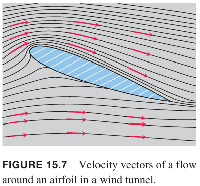
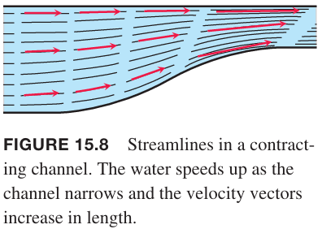
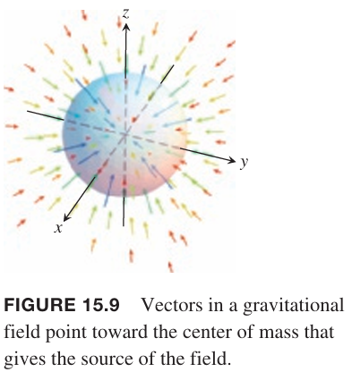
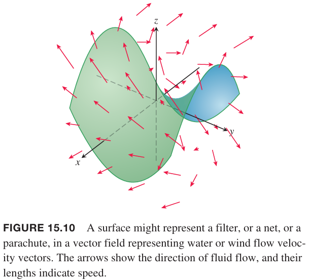
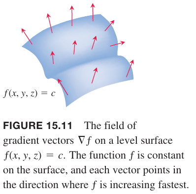
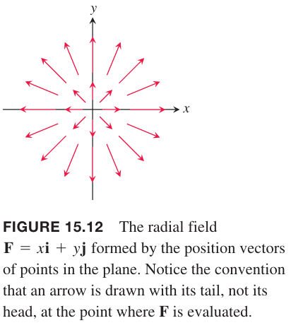
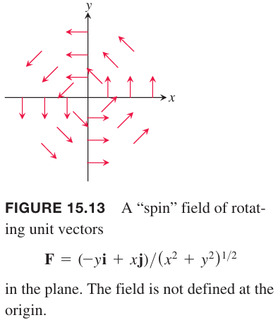
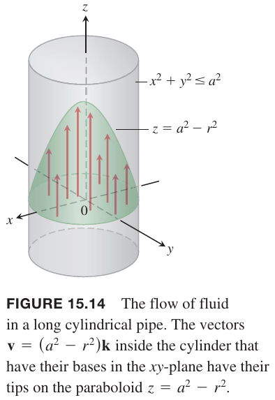
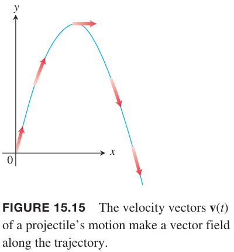
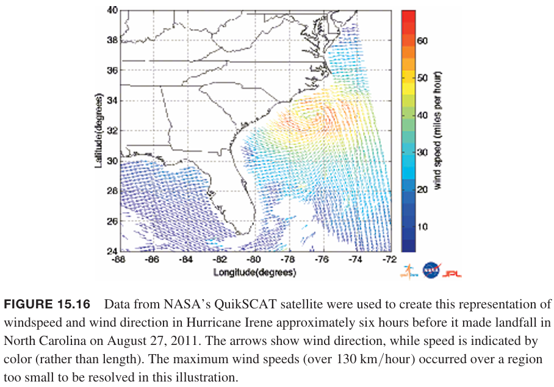

重力和库仑力有方向和大小，在域中每一点处可以用一个矢量表示，这就产生了一个矢量场（`vector field`）。

### 矢量场
假定平面或空间上的一个区域上都是移动的流体，比如空气或者水。流体由大量的粒子组成，在任意时刻，粒子速度是 $\boldsymbol{v}$。在同一时刻不同点处的速度变化可能非常大。我们可以认为速度矢量附着在每个点上，表示该点粒子的速度。这样流体的流动就是矢量场的例子。比如下面两个图，分别是机翼在风洞中的速度矢量场和水在变窄的管道中速度矢量形成的矢量场。

矢量场还可以是重力场（如下图所示）、磁场、电场，还有纯的数学上的场。

通常，矢量场是一个函数，对定义域内的每一点都分配了一个矢量。三维域中矢量场公式如下
$$\boldsymbol{F}(x,y,z)=M(x,y,z)\boldsymbol{i}+N(x,y,z)\boldsymbol{j}+P(x,y,z)\boldsymbol{k}$$
如果分量 $M,N,P$ 是连续的，那么矢量场是连续的。如果各个分量可微，那么矢量场可微。

二维矢量场公式如下
$$\boldsymbol{F}(x,y)=M(x,y)\boldsymbol{i}+N(x,y)\boldsymbol{j}$$
在 12 章中，切向矢量 $\boldsymbol{T}$ 和法向矢量 $\boldsymbol{N}$ 是沿着曲线的矢量场。沿着一个曲线 $\boldsymbol{r}(t)$ 的速度矢量可以表示为
$$\boldsymbol{v}(t)=f(t)\boldsymbol{i}+g(t)\boldsymbol{j}+h(t)\boldsymbol{k}$$
如果标量函数 $f(x,y,z)$ 表示等高线，其梯度矢量 $\nabla f$ 是一个三维的矢量场。这些场如下面若干个图所示。为了粗略画出一个场，我们选择定义域上一些代表性的点，然后画出该点处的矢量，起始位置是该点。

### 梯度场
可微标量函数的梯度场表示该点处函数变化最大的方向。矢量场的一个重要类型就是函数的梯度场。可微函数 $f(x,y,z)$ 的梯度场（`gradient field`）定义是梯度矢量形成的场
$$\nabla f=\frac{\partial f}{\partial x}\boldsymbol{i}+\frac{\partial f}{\partial y}\boldsymbol{j}+\frac{\partial f}{\partial z}\boldsymbol{k}$$
在点 $(x,y,z)$ 处，梯度场给出了一个矢量，方向是 $f$ 变化最大的方向，大小是这个方向上方向矢量的值。梯度场可以表示力场、速度场、热的流动等。在很多物理应用中，$f$ 表示势能，梯度场表示相应的力。在这些场景中，$f$ 通常是负数，也就是说力的方向上势能减少。

例1 
