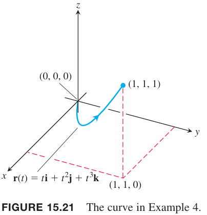

重力和库仑力有方向和大小，在域中每一点处可以用一个矢量表示，这就产生了一个矢量场（`vector field`）。

### 矢量场
假定平面或空间上的一个区域上都是移动的流体，比如空气或者水。流体由大量的粒子组成，在任意时刻，粒子速度是 $\boldsymbol{v}$。在同一时刻不同点处的速度变化可能非常大。我们可以认为速度矢量附着在每个点上，表示该点粒子的速度。这样流体的流动就是矢量场的例子。比如下面两个图，分别是机翼在风洞中的速度矢量场和水在变窄的管道中速度矢量形成的矢量场。

矢量场还可以是重力场（如下图所示）、磁场、电场，还有纯的数学上的场。

通常，矢量场是一个函数，对定义域内的每一点都分配了一个矢量。三维域中矢量场公式如下
$$\boldsymbol{F}(x,y,z)=M(x,y,z)\boldsymbol{i}+N(x,y,z)\boldsymbol{j}+P(x,y,z)\boldsymbol{k}$$
如果分量 $M,N,P$ 是连续的，那么矢量场是连续的。如果各个分量可微，那么矢量场可微。

二维矢量场公式如下
$$\boldsymbol{F}(x,y)=M(x,y)\boldsymbol{i}+N(x,y)\boldsymbol{j}$$
在 12 章中，切向矢量 $\boldsymbol{T}$ 和法向矢量 $\boldsymbol{N}$ 是沿着曲线的矢量场。沿着一个曲线 $\boldsymbol{r}(t)$ 的速度矢量可以表示为
$$\boldsymbol{v}(t)=f(t)\boldsymbol{i}+g(t)\boldsymbol{j}+h(t)\boldsymbol{k}$$
如果标量函数 $f(x,y,z)$ 表示等高线，其梯度矢量 $\nabla f$ 是一个三维的矢量场。这些场如下面若干个图所示。为了粗略画出一个场，我们选择定义域上一些代表性的点，然后画出该点处的矢量，起始位置是该点。

### 梯度场
可微标量函数的梯度场表示该点处函数变化最大的方向。矢量场的一个重要类型就是函数的梯度场。可微函数 $f(x,y,z)$ 的梯度场（`gradient field`）定义是梯度矢量形成的场
$$\nabla f=\frac{\partial f}{\partial x}\boldsymbol{i}+\frac{\partial f}{\partial y}\boldsymbol{j}+\frac{\partial f}{\partial z}\boldsymbol{k}$$
在点 $(x,y,z)$ 处，梯度场给出了一个矢量，方向是 $f$ 变化最大的方向，大小是这个方向上方向矢量的值。梯度场可以表示力场、速度场、热的流动等。在很多物理应用中，$f$ 表示势能，梯度场表示相应的力。在这些场景中，$f$ 通常是负数，也就是说力的方向上势能减少。

例1 假定一个物体被加热，点 $(x,y,z)$ 处的温度是
$$T=100-x^2-y^2-z^2$$
$\boldsymbol{F}(x,y,z)$ 是 $T$ 的梯度。求矢量场 $\boldsymbol{F}$。

解：梯度场 $\boldsymbol{F}$ 是
$$\boldsymbol{F}=\nabla\boldsymbol{T}=-2x\boldsymbol{i}-2y\boldsymbol{j}-2z\boldsymbol{k}$$
在区域上的任意点处，矢量场 $\boldsymbol{F}$ 给出了温度增加最快的方向。矢量朝向原点，该点处温度最高。矢量场如下图所示。

### 矢量场的线积分
15.1 小节定义了标量函数 $f(x,y,z)$ 在路径 $C$ 上的线积分。现在使用相同的思想计算矢量场 $\boldsymbol{F}$ 在路径 $C$ 上的线积分。这些线积分在研究流体、功、能量、电场、磁场等应用中很有用。

假设矢量场是 $\boldsymbol{F}=M(x,y,z)\boldsymbol{i}+N(x,y,z)\boldsymbol{j}+P(x,y,z)\boldsymbol{k}$ 有连续的分量，并且曲线 $C$ 是光滑的，参数方程是 $\boldsymbol{r}(t)=g(t)\boldsymbol{i}+h(t)\boldsymbol{j}+k(t)\boldsymbol{k},a\leq t\leq b$。如 15.1 小节的讨论，参数方程 $\boldsymbol{r}(t)$ 定义了曲线的方向，这里称为前进方向或正向（`forward direction`）。在 $C$ 上的每一点，切向矢量 $\boldsymbol{T}=d\boldsymbol{r}/ds=\boldsymbol{v}/|\boldsymbol{v}|$ 是指向前进方向的单位矢量。矢量场的线积分是 $\boldsymbol{F}$ 沿着 $C$ 的切向分量的线积分。切向分量是矢量的点积
$$\boldsymbol{F}\cdot\boldsymbol{T}=\boldsymbol{F}\cdot\frac{d\boldsymbol{r}}{ds}$$
那么如下定义。

**定义**
> 令 $\boldsymbol{F}$ 是有连续分量的矢量场，光滑曲线 $C$ 的参数方程是 $\boldsymbol{r}(t),a\leq t\leq b$。$\boldsymbol{F}$ 沿着 $C$ 的线积分是
> $$\int_C\boldsymbol{F}\cdot\boldsymbol{T}ds=\int_C(\boldsymbol{F}\cdot\frac{d\boldsymbol{r}}{ds})ds=\int_C\boldsymbol{F}\cdot d\boldsymbol{r}\tag{1}$$

计算矢量场的线积分方法和标量函数计算线积分的方法类似。

**求 $\boldsymbol{F}=M\boldsymbol{i}+N\boldsymbol{j}+P\boldsymbol{k}$ 沿 $C:\boldsymbol{r}(t)=g(t)\boldsymbol{i}+h(t)\boldsymbol{j}+k(t)\boldsymbol{k},a\leq t\leq b$ 的线积分**
> 1. 通过将 $\boldsymbol{r}$ 中的分量 $x=g(t),y=h(t),z=k(t)$ 代入 $\boldsymbol{F}$ 的分量 $M(x,y,z),N(x,y,z),P(x,y,z)$ 来使用参数化的 $C$ 来表示矢量场 $\boldsymbol{F}$。
> 2. 求矢量导数 $d\boldsymbol{r}/dt$。
> 3. 对参数 $t,a\leq t\leq b$ 求线积分得到
> $$\int_C\boldsymbol{F}\cdot d\boldsymbol{r}=\int_a^b\boldsymbol{F}(\boldsymbol{r}(t))\cdot\frac{d\boldsymbol{r}}{dt}dt\tag{2}$$

例2 求 $\int_C\boldsymbol{F}\cdot d\boldsymbol{r}$，其中 $\boldsymbol{F}(x,y,z)=z\boldsymbol{i}+xy\boldsymbol{j}-y^2\boldsymbol{k}$，$C$ 的参数方程是 $\boldsymbol{r}(t)=t^2\boldsymbol{i}+t\boldsymbol{j}+\sqrt{t}\boldsymbol{k},0\leq t\leq 1$。

解：使用 $t$ 表示 $\boldsymbol{F}$
$$\boldsymbol{F}(\boldsymbol{r}(t))=\sqrt{t}\boldsymbol{i}+t^3\boldsymbol{j}-t^2\boldsymbol{k}$$
对 $\boldsymbol{r}$ 求导
$$\frac{d\boldsymbol{r}}{dt}=2t\boldsymbol{i}+\boldsymbol{j}+\frac{1}{2\sqrt{t}}\boldsymbol{k}$$
那么
$$\begin{aligned}
\boldsymbol{F}\cdot d\boldsymbol{r}&=\int_0^1\boldsymbol{F}(\boldsymbol{r}(t))\cdot\frac{d\boldsymbol{r}}{dt}dt\\
&=\int_0^1\bigg(2t^{3/2}+t^3-\frac{1}{2}t^{3/2}\bigg)dt\\
&=\bigg[\frac{3}{2}\frac{2}{5}t^{5/2}+\frac{1}{4}t^4\bigg]_0^1\\
&=\frac{17}{20}
\end{aligned}$$

### 对 $dx,dy,dz$ 的线积分
当研究力或者流体的时候，单独考虑每个分量是很有用的。比如分析重力的影响，只需要考虑垂直方向的运动。此时，想要求的是某个方向上标量函数的线积分，比如 $\int_C Mdx$。这类积分与 15.1 定义的线积分 $\int_C Mds$ 不同，这里只考虑一个方向上的位移。为了求 标量函数 $M(x,y,z)$ 的线积分 $\int_C Mdx$，定义只有 $x$ 方向的矢量场 $\boldsymbol{F}=M(x,y,z)\boldsymbol{i}$，忽略其他方向。那么沿着 $C$ 的参数方程 $\boldsymbol{r}(t)=g(t)\boldsymbol{i}+h(t)\boldsymbol{j}+k(t)\boldsymbol{k},a\leq t\leq b$，我们有 $x=g(t),dx=g'(t)$
$$\begin{aligned}
\boldsymbol{F}\cdot d\boldsymbol{r}&=\boldsymbol{F}\cdot\frac{d\boldsymbol{r}}{dt}dt\\
&=M(x,y,z)\boldsymbol{i}\cdot(g'(t)\boldsymbol{i}+h'(t)\boldsymbol{j}+k'(t)\boldsymbol{k})dt\\
&=M(x,y,z)g'(t)dt\\
&=M(x,y,z)dx
\end{aligned}$$
因此 $\boldsymbol{F}$ 沿着 $C$ 的线积分是
$$\int_CM(x,y,z)dx=\int_C\boldsymbol{F}\cdot d\boldsymbol{r},\text{ where }\boldsymbol{F}=M(x,y,z)\boldsymbol{i}$$
同样的，通过只有 $y$ 方向的矢量场 $\boldsymbol{F}=N(x,y,z)\boldsymbol{j}$ 和只有 $z$ 方向的 $\boldsymbol{F}=P(x,y,z)\boldsymbol{k}$，可以得到线积分 $\int_CNdy$ 和 $\int_CPdz$。将这些式子表达成只有变量 $t$ 的形式的话，形式如下
$$\int_CM(x,y,z)dx=\int_a^bM(g(t),h(t),k(t))g'(t)dt\tag{3}$$
$$\int_CN(x,y,z)dy=\int_a^bN(g(t),h(t),k(t))h'(t)dt\tag{4}$$
$$\int_CP(x,y,z)dz=\int_a^bP(g(t),h(t),k(t))k'(t)dt\tag{5}$$
这些积分经常以组合的形式出现，因此可以缩写为
$$\int_CM(x,y,z)dx+\int_CN(x,y,z)dy+\int_CP(x,y,z)dz=\int_CMdx+Ndy+Pdz$$

例3 求线积分 $\int_C-ydx+zdy+2xdz$，其中 $C$ 是螺旋线 $\boldsymbol{r}(t)=(\cos t)\boldsymbol{i}+(\sin t)\boldsymbol{j}+t\boldsymbol{k},0\leq t\leq 2\pi$。

解：使用参数 $t$ 表示这些函数，那么 $x=\cos t,y=\sin t,z=t,dx=-\sin tdt,dy=\cos t,dz=dt$，那么
$$\begin{aligned}
\int_C-ydx+zdy+2xdz&=\int_0^{2\pi}[(-\sin t)(-\sin t)+(t)(\cos t)+(2\cos t)(1)]dt\\
&=\int_0^{2\pi}(2\cos t+t\cos t+\sin^2t)dt\\
&=\bigg[2\sin t+(t\sin t+\cos t)+(\frac{t}{2}-\frac{\sin 2t}{4})\bigg]_0^{2\pi}\\
&=\pi
\end{aligned}$$

### 力沿着空间曲线做的功
假定矢量场 $\boldsymbol{F}=M(x,y,z)\boldsymbol{i}+N(x,y,z)\boldsymbol{j}+P(x,y,z)\boldsymbol{k}$ 表示空间中的力，光滑曲线
$$\boldsymbol{r}(t)=g(t)\boldsymbol{i}+h(t)\boldsymbol{j}+k(t)\boldsymbol{k},a\leq t\leq b$$

推理过程与之前类似，如下图所示，分割，求和，取极限。

$\boldsymbol{F}$ 沿着 $C$ 的线积分就是力沿着曲线做的功
$$W=\int_C\boldsymbol{F}\cdot\boldsymbol{T}ds=\int_a^b\boldsymbol{F}(\boldsymbol{r}(t))\cdot\frac{d\boldsymbol{r}}{dt}dt\tag{6}$$

积分结果的符号取决于运动的方向。如果反转运动方向，比如下图中 $\boldsymbol{T}$ 的方向，那么 $\boldsymbol{F}\cdot\boldsymbol{T}$ 的符号发生了变化，所以积分结果符号也会变化。

下面的公式给出了几种公式 $(6)$ 的变形，根据场景选择最合适的表达方式。其中 $M,N,P$ 是中间变量 $x,y,z$ 的函数，它们又是自变量 $t$ 的函数，所以沿着曲线运动，$x=g(t),y=h(t),z=k(t),dx=g'(t)dt,dy=h'(t)dt,dz=k'(t)dt$。

$$\begin{aligned}
W&=\int_C\boldsymbol{F}\cdot\boldsymbol{T}ds\\
&=\int_C\boldsymbol{F}\cdot d\boldsymbol{r}\\
&=\int_a^b\boldsymbol{F}\cdot\frac{d\boldsymbol{r}}{dt}dt\\
&=\int_a^b(Mg'(t)+Nh'(t)+Pk'(t))dt\\
&=\int_C Mdx+Ndy+Pdz
\end{aligned}$$

例4 求力场 $\boldsymbol{F}=(y-x^2)\boldsymbol{i}+(z-y^2)\boldsymbol{j}+(x-z^2)\boldsymbol{k}$ 沿着曲线 $\boldsymbol{r}(t)=t\boldsymbol{i}+t^2\boldsymbol{j}+t^3\boldsymbol{k},0\leq t\leq 1$ 从 $(0,0)$ 到 $(1,1)$ 做的功。

解：使用 $t$ 表示 $\boldsymbol{F}$
$$\begin{aligned}
\boldsymbol{F}&=(y-x^2)\boldsymbol{i}+(z-y^2)\boldsymbol{j}+(x-z^2)\boldsymbol{k}\\
&=(t^2-t^2)\boldsymbol{i}+(t^3-t^4)\boldsymbol{j}+(t-t^6)\boldsymbol{k}
\end{aligned}$$
然后求 $d\boldsymbol{r}/dt$
$$\frac{d\boldsymbol{r}}{dt}=\frac{d}{dt}(t\boldsymbol{i}+t^2\boldsymbol{j}+t^3\boldsymbol{k})=\boldsymbol{i}+2t\boldsymbol{j}+3t^2\boldsymbol{k}$$
因此
$$\begin{aligned}
\boldsymbol{F}\cdot\frac{d\boldsymbol{r}}{dt}&=((t^3-t^4)\boldsymbol{j}+(t-t^6)\boldsymbol{k})\cdot(\boldsymbol{i}+2t\boldsymbol{j}+3t^2\boldsymbol{k})\\
&=(t^3-t^4)(2t)+(t-t^6)(3t^2)\\
&=2t^4-2t^5+3t^3-3t^8
\end{aligned}$$
那么
$$\begin{aligned}
W&=\int_a^b\boldsymbol{F}\cdot\frac{d\boldsymbol{r}}{dt}dt\\
&=\int_0^1(2t^4-2t^5+3t^3-3t^8)dt\\
&=\bigg[\frac{2}{5}t^5-\frac{1}{3}t^6+\frac{3}{4}t^4-\frac{1}{3}t^9\bigg]_0^1\\
&=\frac{29}{60}
\end{aligned}$$

例5 求力场 $\boldsymbol{F}=x\boldsymbol{i}+y\boldsymbol{j}+z\boldsymbol{k}$ 沿着曲线 $\boldsymbol{r}(t)=\cos(\pi t)\boldsymbol{i}+t^2\boldsymbol{j}+\sin(\pi t)\boldsymbol{k},0\leq t\leq 1$ 做的功。

解：使用 $t$ 表示 $\boldsymbol{F}$
$$\boldsymbol{F}(\boldsymbol{r}(t))=\cos(\pi t)\boldsymbol{i}+t^2\boldsymbol{j}+\sin(\pi t)\boldsymbol{k}$$
求 $d\boldsymbol{r}/dt$
$$\frac{d\boldsymbol{r}}{dt}=-\pi\sin(\pi t)\boldsymbol{i}+2t\boldsymbol{j}+\pi\cos(\pi t)\boldsymbol{k}$$
因此
$$\boldsymbol{F}(\boldsymbol{r}(t))\cdot\frac{d\boldsymbol{r}}{dt}=-\pi\sin(\pi t)\cos(\pi t)+2t^3+\pi\sin(\pi t)\cos(\pi t)=2t^3$$
那么
$$W=\int_a^b\boldsymbol{F}(\boldsymbol{r}(t))\cdot\frac{d\boldsymbol{r}}{dt}dt=\int_0^12t^3dt=\frac{t^4}{2}\bigg|_0^1=\frac{1}{2}$$

### 流量积分和环量
**定义**
> 如果 $\boldsymbol{r}(t)$ 是在连续速度场 $\boldsymbol{F}$ 的定义域内的光滑曲线 $C$ 的参数方程，沿着曲线从 $A=\boldsymbol{r}(a)$ 到 $B=\boldsymbol{r}(b)$ 的流量（`flow`）是
> $$F=\int_C\boldsymbol{F}\cdot\boldsymbol{T}ds$$
> 这个积分是流量积分（`flow integral`）。如果曲线开始和结束与同一点，即 $A=B$，那么流量称为环量（`circulation`）。

沿着曲线运动方向很重要。如果方向相反，那么 $\boldsymbol{T}$ 变成了 $-\boldsymbol{T}$，积分的符号也发生了变化。

例6 流体的速度场是 $\boldsymbol{F}=x\boldsymbol{i}+z\boldsymbol{j}+y\boldsymbol{k}$，求沿着螺旋线 $\boldsymbol{r}(t)=(\cos t)\boldsymbol{i}+(\sin t)\boldsymbol{j}+t\boldsymbol{k},0\leq t\leq \pi/2$ 的流量。

解：用 $t$ 表示 $\boldsymbol{F}$
$$\boldsymbol{F}=x\boldsymbol{i}+z\boldsymbol{j}+y\boldsymbol{k}=(\cos t)\boldsymbol{i}+t\boldsymbol{j}+(\sin t)\boldsymbol{k}$$
求 $d\boldsymbol{r}/dt$
$$\frac{d\boldsymbol{r}}{dt}=(-\sin t)\boldsymbol{i}+(\cos t)\boldsymbol{j}+\boldsymbol{k}$$
因此
$$\begin{aligned}
\boldsymbol{F}\cdot\frac{d\boldsymbol{r}}{dt}&=(\cos t)(-\sin t)+t(\cos t)+(\sin t)\\
&=-\cos t\sin t+t\cos t+sin t
\end{aligned}$$
那么
$$\begin{aligned}
F&=\int_a^b\boldsymbol{F}\cdot\frac{d\boldsymbol{r}}{dt}dt\\
&=\int_0^{\pi/2}(-\cos t\sin t+t\cos t+sin t)dt\\
&=\bigg[\frac{\cos^2 t}{2}+t\sin t\bigg]_0^{\pi/2}\\
&=(0+\frac{\pi}{2})-(\frac{1}{2})\\
&=\frac{\pi-1}{2}
\end{aligned}$$

例7 求场 $\boldsymbol{F}=(x-y)\boldsymbol{i}+x\boldsymbol{j}$ 绕着圆 $\boldsymbol{r}(t)=(\cos t)\boldsymbol{i}+(\sin t)\boldsymbol{j},0\leq t\leq 2\pi$ 的流量。

解：在圆上
$$\boldsymbol{F}=(x-y)\boldsymbol{i}+x\boldsymbol{j}=(\cos t-\sin t)\boldsymbol{i}+(\cos t)\boldsymbol{j}$$
并且
$$\frac{d\boldsymbol{r}}{dt}=(-\sin t)\boldsymbol{i}+(\cos t)\boldsymbol{j}$$
那么
$$\boldsymbol{F}\cdot\frac{d\boldsymbol{r}}{dt}=-\sin t\cos t+\sin^2 t+\cos^2 t=1-\sin t\cos t$$
因此环量是
$$\begin{aligned}
\int_0^{2\pi}\boldsymbol{F}\cdot\frac{d\boldsymbol{r}}{dt}dt&=\int_0^{2\pi}(1-\sin t\cos t)dt\\
&=\bigg[t-\frac{\sin^2 t}{2}\bigg]_0^{2\pi}\\
&=2\pi
\end{aligned}$$
如上图所示，速度场的流动是逆时针的，因此环量是正的。

### 通过平面简单封闭曲线的通量
如果 $xy$ 平面上的曲线自身不交叉，那么是简单（`simple`）曲线。如果曲线开始和结束是同一个点，那么是封闭曲线（`closed curve`）或环（`loop`）。

通过计算 $C$ 上 $\boldsymbol{F}\cdot\boldsymbol{n}$ 的线积分，即速度场在曲线向外的法线方向上的分量，可以得到流体进入或者离开 $xy$ 平面上简单光滑曲线 $C$ 的速率。我们仅使用 $\boldsymbol{F}$ 的法线分量，忽略切线分量，这是因为法线方向对通过 $C$ 有贡献。这个积分值是 $\boldsymbol{F}$ 通过 $C$ 的通量（`flux`）。`flus` 是 `flow` 的拉丁语，但是很多通量的计算不涉及运动。当 $\boldsymbol{F}$ 是电场或者磁场时，$\boldsymbol{F}\cdot\boldsymbol{n}$ 仍旧称为通量。

**定义**
> 如果 $C$ 是连续向量场 $\boldsymbol{F}=M(x,y)\boldsymbol{i}+N(x,y)\boldsymbol{j}$ 定义域上的光滑简单封闭曲线，并且 $\boldsymbol{n}$ 是 $C$ 上向外的法线方向，$\boldsymbol{F}$ 通过 $C$ 的通量是
> $$\int_C\boldsymbol{F}\cdot\boldsymbol{n}ds\tag{8}$$

注意环量与通量的区别。一个是切向方向，一个是方向方向。

为了计算 $(8)$，先从光滑参数曲线入手，$t$ 从 $a$ 到 $b$ 恰好遍历 $C$ 一次。
$$x=g(t),y=h(t),a\leq t\leq b$$
通过单位切向矢量 $\boldsymbol{T}$ 和 $\boldsymbol{k}$ 可以表示 $\boldsymbol{n}$。方向向外，那么是 $\boldsymbol{T}\times\boldsymbol{k}$ 还是 $\boldsymbol{k}\times\boldsymbol{T}$ 呢？这依赖于随着 $t$ 遍历 $C$ 的方向。如果是顺时针方向，那么 $\boldsymbol{k}\times\boldsymbol{T}$ 向外，如果是逆时针运动，$\boldsymbol{T}\times\boldsymbol{k}$ 指向外。

通常假设是逆时针运动，因此选择 $\boldsymbol{n}=\boldsymbol{T}\times\boldsymbol{k}$。尽管公式 $(8)$ 的积分不依赖与 $C$ 遍历的方向，但是推导计算的过程假设逆时针运动。因此
$$\begin{aligned}
\boldsymbol{n}&=\boldsymbol{T}\times\boldsymbol{k}\\
&=\bigg(\frac{dx}{ds}\boldsymbol{i}+\frac{dy}{ds}\boldsymbol{i}\bigg)\times\boldsymbol{k}\\
&=\begin{pmatrix}
\boldsymbol{i}&&\boldsymbol{j}&&\boldsymbol{k}\\
\frac{dx}{ds}&&\frac{dy}{ds}&&0\\
0&&0&&1
\end{pmatrix}\\
&=\frac{dy}{ds}\boldsymbol{i}-\frac{dx}{ds}\boldsymbol{j}
\end{aligned}$$
如果
$$\boldsymbol{F}=M(x,y)\boldsymbol{i}+N(x,y)\boldsymbol{j}$$
那么
$$\boldsymbol{F}\cdot\boldsymbol{n}=M(x,y)\frac{dy}{ds}-N(x,y)\frac{dx}{ds}$$
因此
$$\int_C\boldsymbol{F}\cdot\boldsymbol{n}ds=\int_C\bigg(M\frac{dy}{ds}-N\frac{dx}{ds}\bigg)ds=\oint_CMdy-Ndx$$
积分上的圈表示在封闭曲线 $C$ 上以逆时针运动进行积分。使用 $t$ 表示 $M,dy,N,dx$，然后从 $t=a$ 到 $t=b$ 积分。也就是说，计算通量无须显式知道 $\boldsymbol{n}$ 或 $ds$。

例8 求 $\boldsymbol{F}=(x-y)\boldsymbol{i}+x\boldsymbol{j}$ 通过单位圆 $x^2+y^2=1$ 的通量。如例 7 的图。

解：曲线的参数方程是
$$\boldsymbol{r}(t)=(\cos t)\boldsymbol{i}+(\sin t)\boldsymbol{j},0\leq t\leq 2\pi$$
恰好绕单位圆一周。那么
$$\begin{aligned}
M&=x-y=\cos t-\sin t\\
dy&=d(\sin t)=\cos tdt\\
N&=x=\cos t\\
dx&=d(\cos t)=-\sin tdt
\end{aligned}$$
因此
$$\begin{aligned}
\oint_CMdy-Ndx&=\int_0^{2\pi}(\cos^2 t-\sin t\cos t+\cos t\sin t)dt\\
&=\int_0^{2\pi}\cos^2 tdt\\
&=\int_0^{2\pi}\frac{1+\cos 2t}{2}dt\\
&=\bigg[\frac{t}{2}+\frac{\sin 2t}{4}\bigg]_0^{2\pi}\\
&=\pi
\end{aligned}$$
$\boldsymbol{F}$ 通过圆的通量是 $\pi$。因为结果是正的，所以通过圆的净流量是向外的。净流量向内的话通量是负值。
