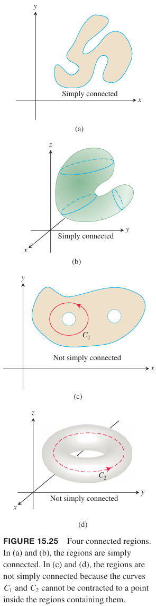
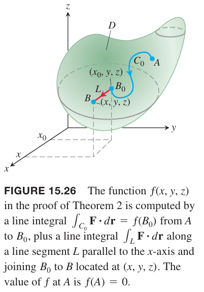
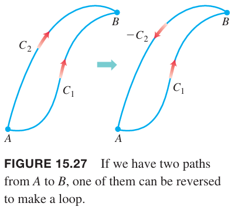
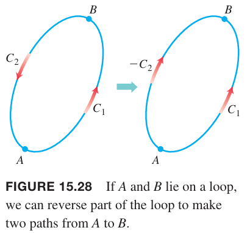

重力场（`gravitational field`）$\boldsymbol{G}$ 是一个矢量场，表示某个巨大物体对空间某点处产生的引力效应。重量 $m$ 的物体受到的力是 $\boldsymbol{F}=m\boldsymbol{G}$。电场（`electric field`）$\boldsymbol{E}$ 类似，电荷量为 $q$ 的电荷受到的力是 $\boldsymbol{F}=q\boldsymbol{E}$。在重力场或电场中移动物体或电荷所做的功只和起始位置与终止位置相关，与两点之间的路径无关。这一节主要研究路径无关的矢量场。

### 路径无关
如果 $A, B$ 是开放区域 $D$ 上的两个点，$\boldsymbol{F}$ 在从 $A$ 到 $B$ 的曲线 $C$ 上的积分通常依赖于曲线 $C$，正如 15.1 小节看到的。不过对于一些特殊的矢量场，从 $A$ 到 $B$ 的所有路径积分结果都一样。

**定义**
> 令 $\boldsymbol{F}$ 是开放区域 $D$ 上的矢量场，假定对于任意 $D$ 内两点 $A, B$，从 $A$ 到 $B$ 的曲线 $C$ 的线积分 $\int_C\boldsymbol{F}\cdot d\boldsymbol{r}$ 对所有路径都一样。那么积分 $\int_C\boldsymbol{F}\cdot d\boldsymbol{r}$ 是路径无关（`path independence`）的，且场 $\boldsymbol{F}$ 是保守（`conservative`）场。

保守这个词来自物理学，是指能够保持能量守恒的场。如果从 $A$ 到 $B$ 的曲线 $C$ 上的线积分是路径无关的，会使用 $\int_A^B$ 而不是 $\int_C$ 表示线积分。这提醒我们积分仅仅依赖于起始位置和终止位置，而与路径无关。

在指定的合理可微条件下，稍后会证明场 $\boldsymbol{F}$ 是保守场等价于场是某个标量函数的梯度场，即等价于 $\boldsymbol{F}=\nabla f$，$f$ 是某个标量函数。

**定义**
> 如果 $\boldsymbol{F}$ 是 $D$ 上的矢量场，$f$ 是 $D$ 上的标量函数，有 $\boldsymbol{F}=\nabla f$，那么 $f$ 称为 $\boldsymbol{F}$ 的势函数（`potential function`）。

重力势能的梯度函数是重力场，电势的梯度函数是电场。稍后会证明，如果我们能找到矢量场 $\boldsymbol{F}$ 的势函数 $f$，那么 $\boldsymbol{F}$ 沿从 $A$ 到 $B$ 的曲线的线积分可以使用下面的公式求解。
$$\int_A^B\boldsymbol{F}\cdot d\boldsymbol{r}=\int_A^B\nabla f\cdot d\boldsymbol{r}=f(B)-f(A)\tag{1}$$
如果将 $\nabla f$ 类比为 $f'$，那么上面公式就是微积分基本定理的矢量积分版本
$$\int_a^bf'(x)dx=f(b)-f(a)$$
保守场还有其他重要属性。比如 $\boldsymbol{F}$ 是 $D$ 上的保守场等价于 $\boldsymbol{F}$ 在 $D$ 上闭合路径的积分是零。有一些必须满足的条件才能是 $(1)$ 成立。

### 关于曲线、矢量场和定义域的假设
为了使得接下来的推理成立，必须要求曲线、矢量场和定义域满足确定的属性。除非特定说明，例题、习题中均满足这些假设。

曲线必须是分段光滑（`piecewise smooth`）的。曲线由有限段光滑曲线连接而成。对于这样的曲线，我们可以计算长度，在连接点之外求切向矢量。矢量场 $\boldsymbol{F}$ 的各个分量由连续一阶导。

定义域 $D$ 必须是连通的（`connected`）。对于开放区域，这意味着 $D$ 内任意两点可以用在 $D$ 内的光滑曲线连接。一些推理结果要求 $D$ 是简单连通（`simply connected`），这意味着 $D$ 内任意环可以缩小成一个点，整个过程不会离开 $D$。二维平面上一个移除了圆的区域就不是简单连通的，绕着这个圆的环就无法在 $D$ 内缩成一个点。三维空间内，移除一条直线形成的环也不是简单连通的。如下图所示。

连通性和简单连通性不同。简单连通要求不能有“环能包围的洞”。所有空间自身是连通的，也是简单连通的。

### 保守场的线积分
**定理 1 - 线积分的基本定理**
> 令 $C$ 是连接 $A, B$ 两点的光滑曲线，参数方程是 $\boldsymbol{r}(t)$。令 $f$ 是包含 $C$ 的定义域 $D$ 上的可微函数，连续梯度场 $\boldsymbol{F}=\nabla f$，那么
> $$\int_C\boldsymbol{F}\cdot d\boldsymbol{r}=f(B)-f(A)$$

例1 假定力场 $\boldsymbol{F}=\nabla f$ 是函数
$$f(x,y,z)=-\frac{1}{x^2+y^2+z^2}$$
的梯度场。求一个物体沿着连接 $(1,0,0), (0,0,2)$ 且不通过原点的光滑曲线 $C$ 所做的功。

解：根据定理 1 有
$$\int_C\boldsymbol{F}\cdot d\boldsymbol{r}=f(0,0,2)-f(1,0,0)=-\frac{1}{4}-(-1)=\frac{3}{4}$$

重力场和电场可以使用例 1 中的 $\boldsymbol{F}$ 来建模。在对重力建模时，函数 $f$ 表示重力势能，$f$ 的符号是负号，在原点处 $f$ 趋于 $-\infty$。这种选择使得重力 $\boldsymbol{F}$ 朝向原点，因此所有物体向下落而不是向上运动。

证明：假定在区域 $D$ 中两点 $A, B$ 之间的光滑曲线的参数方程是 $C:\boldsymbol{r}(t)=g(t)\boldsymbol{i}+h(t)\boldsymbol{j}+k(t)\boldsymbol{k},a\leq t\leq b$。13.5 小节给出了一个结论，标量函数 $f$ 沿着曲线 $C$ 的导数可以是点积 $\nabla f(\boldsymbol{r}(t))\cdot \boldsymbol{r}'(t)$，因此
$$\begin{aligned}
\int_C\boldsymbol{F}\cdot d\boldsymbol{r}&=\int_A^B\nabla f\cdot d\boldsymbol{r}\\
&=\int_{t=a}^{t=b}\nabla f(\boldsymbol{r}(t))\cdot \boldsymbol{r}'(t)dt\\
&=\int_a^b\frac{d}{dt}(f\boldsymbol{r}(t))dt\\
&=f(\boldsymbol{r}(b))-f(\boldsymbol{r}(a))\\
&=f(B)-f(A)
\end{aligned}$$

从定理 1 可知，如果我们知道了函数 $f$，计算梯度场 $\boldsymbol{F}=\nabla f$ 的线积分就非常直接了。很多重要应用都是梯度场。下面证明保守场是这种类型的场。

**定理 2 - 保守场是梯度场**
> 令 $\boldsymbol{F}=M\boldsymbol{i}+N\boldsymbol{j}+P\boldsymbol{k}$ 是矢量场，各个分量在空间开放连通区域 $D$ 上连续，那么 $\boldsymbol{F}$ 是保守场等价于 $\boldsymbol{F}$ 是可微函数 $f$ 的梯度场 $\boldsymbol{F}=\nabla f$。

定理 2 是说 $\boldsymbol{F}=\nabla f$ 等价于线积分 $\int_C\boldsymbol{F}\cdot d\boldsymbol{r}$ 与 $A$ 到 $B$ 的曲线 $C$ 无关，其中 $A, B, C$ 均在 $D$ 内。

证明：如果 $\boldsymbol{F}$ 是梯度场，那么 $\boldsymbol{F}=\nabla f$，其中 $f$ 是可微函数，定理 1 证明了 $\int_C\boldsymbol{F}\cdot d\boldsymbol{r}=f(B)-f(A)$，线积分的值不依赖于 $C$，只和 $A,B$ 相关。所以线积分是路径无关的，$\boldsymbol{F}$ 满足保守场的定义。

反过来，假定 $\boldsymbol{F}$ 是保守场。需要找到一个 $D$ 上的函数 $f$ 满足 $\nabla f=\boldsymbol{F}$。首先选取一点 $A$，并令 $f(A)=0$，再选择一点 $B$，令 $f(B)=\int_C\boldsymbol{F}\cdot d\boldsymbol{r}$，其中 $C$ 是 $D$ 内连接 $A,B$ 的光滑曲线。由于 $\boldsymbol{F}$ 是保守场，因此 $f(B)$ 不依赖于 $C$ 的选择。为了证明 $\nabla f=\boldsymbol{F}$，需要证明 $\partial{f}/\partial{x}=M,\partial{f}/\partial{y}=N,\partial{f}/\partial{z}=P$。

假定 $B$ 的坐标是 $(x,y,z)$。根据 $f$ 的定义，在附近一点 $B_0(x_0,y,z)$ 处 $f$ 的值是 $\int_{C_0}\boldsymbol{F}\cdot d\boldsymbol{r}$，其中 $C_0$ 是从 $A$ 到 $B_0$ 的任意路径。那么从 $A$ 到 $B$ 可以分成两段：$C=C_0\cup L$，其中 $L$ 是 $B_0$ 到 $B$ 的线段。当 $B_0$ 足够靠近 $B$ 时，线段 $L$ 位于 $D$ 内。

由于 $f(B)$ 的值是路径无关的，
$$f(x,y,z)=\int_{C_0}\boldsymbol{F}\cdot d\boldsymbol{r}+\int_L\boldsymbol{F}\cdot d\boldsymbol{r}$$
微分得到
$$\frac{\partial}{\partial x}f(x,y,z)=\frac{\partial}{\partial x}\bigg(\int_{C_0}\boldsymbol{F}\cdot d\boldsymbol{r}+\int_L\boldsymbol{F}\cdot d\boldsymbol{r}\bigg)$$
右边的第一项与 $x_0$ 相关与 $x$ 无关，因此
$$\frac{\partial}{\partial x}f(x,y,z)=\frac{\partial}{\partial x}\int_L\boldsymbol{F}\cdot d\boldsymbol{r}$$
$L$ 的参数化方程是 $\boldsymbol{r}(t)=t\boldsymbol{i}+y\boldsymbol{j}+z\boldsymbol{k},x_0\leq t\leq x$。那么
$$\frac{d\boldsymbol{r}}{dt}=\boldsymbol{i}$$
由于
$$\boldsymbol{F}=M\boldsymbol{i}+N\boldsymbol{j}+P\boldsymbol{k}$$
因此
$$\boldsymbol{F}\cdot d\boldsymbol{r}/dt=M$$
代入积分式子得到
$$\int_L\boldsymbol{F}\cdot d\boldsymbol{r}=\int_{x_0}^xM(t,y,z)dt$$
根据微积分基本定理得到
$$\frac{\partial}{\partial x}f(x,y,z)=\frac{\partial}{\partial x}\int_{x_0}^xM(t,y,z)dt=M(x,y,z)$$
类似的可以证明 $\partial{f}/\partial{y}=N,\partial{f}/\partial{z}=P$，那么就得到
$$\boldsymbol{F}=\nabla f$$

例2 求在保守场
$$\boldsymbol{F}=yz\boldsymbol{i}+xz\boldsymbol{j}+xy\boldsymbol{k}=\nabla f,f(x,y,z)=xyz$$
内，沿着任意曲线 $C$ 从 $A(-1,3,9)$ 到 $B(1,6,-4)$ 移动物体所做的功。

解：
$$\begin{aligned}
\int_C\boldsymbol{F}\cdot d\boldsymbol{r}&=\int_A^B\nabla f\cdot d\boldsymbol{r}\\
&=f(B)-f(A)\\
&=(1)(6)(-4)-(-1)(3)(9)\\
&=3
\end{aligned}$$

保守场内的线积分一个有用的性质是当积分路径是环时，积分为零。通常使用 $\oint_C$ 表示封闭路径的积分。

**定理 3 - 保守场的环属性**
> 下面两种陈述是等价的。
> 1. 对 $D$ 内任意闭合曲线 $C$ 有 $\oint_C\boldsymbol{F}\cdot d\boldsymbol{r}$。
> 2. $\boldsymbol{F}$ 是 $D$ 内的保守场。

证明：首先证明 1 到 2 是成立的。我们需要证明对任意 $D$ 内两点 $A,B$，线积分 $\boldsymbol{F}\cdot d\boldsymbol{r}$ 对任意两条不同曲线 $C_1,C_2$ 的值相同。如下图所示。我们反转 $C_2$ 得到 $C_1$，那么 $C_1,-C_2$ 形成了环。

根据假设
$$\int_{C_1}\boldsymbol{F}\cdot d\boldsymbol{r}-\int_{C_2}\boldsymbol{F}\cdot d\boldsymbol{r}=\int_{C_1}\boldsymbol{F}\cdot d\boldsymbol{r}+\int_{-C_2}\boldsymbol{F}\cdot d\boldsymbol{r}=\int_C\boldsymbol{F}\cdot d\boldsymbol{r}=0$$
因此沿着 $C_1,C_2$ 的积分值相同。

接着证明 2 到 1 是成立的。在封闭曲线 $C$ 上任取两点 $A,B$，将 $C$ 分成两段 $C_1,C_2$。

$$\oint_C\boldsymbol{F}\cdot d\boldsymbol{r}=\int_{C_1}\boldsymbol{F}\cdot d\boldsymbol{r}+\int_{C_2}\boldsymbol{F}\cdot d\boldsymbol{r}=\int_A^B\boldsymbol{F}\cdot d\boldsymbol{r}-\int_A^B\boldsymbol{F}\cdot d\boldsymbol{r}=0$$
最后一步推导用到了保守场的性质。

结合定理 2 和定理 3，可以得到 $\oint_C\boldsymbol{F}\cdot d\boldsymbol{r}=0$，$\boldsymbol{F}=\nabla$ 和 $\boldsymbol{F}$ 是保守场三者等价。

下面要解决两个问题：
1. 如果知道一个 $\boldsymbol{F}$ 是保守场？
2. 如果 $\boldsymbol{F}$ 是保守场，如何求满足 $\nabla f=\boldsymbol{F}$ 的势函数 $f$？

### 求保守场的势函数
**保守场的分量测试**
> 令 $\boldsymbol{F}=M(x,y,z)\boldsymbol{i}+N(x,y,z)\boldsymbol{j}+P(x,y,z)\boldsymbol{k}$ 是简单连通域上的场，各个分量有连续的一阶偏微分。那么 $\boldsymbol{F}$ 是保守场等价于
> $$\frac{\partial P}{\partial y}=\frac{\partial N}{\partial z},\frac{\partial M}{\partial z}=\frac{\partial P}{\partial x},\frac{\partial N}{\partial x}=\frac{\partial M}{\partial y}\tag{2}$$

这个测试是说在简单连通区域内，矢量
$$\bigg(\frac{\partial P}{\partial y}-\frac{\partial N}{\partial z}\bigg)\boldsymbol{i}+\bigg(\frac{\partial M}{\partial z}-\frac{\partial P}{\partial x}\bigg)\boldsymbol{j}+\bigg(\frac{\partial N}{\partial x}-\frac{\partial M}{\partial y}\bigg)\boldsymbol{k}=\boldsymbol{0}$$
等价于 $\boldsymbol{F}$ 保守场。这个矢量称为 $\boldsymbol{F}$ 的旋度（`curl`）。

证明：如果 $\boldsymbol{F}$ 是保守场，那么存在势函数 $f$ 满足
$$\boldsymbol{F}=M\boldsymbol{i}+N\boldsymbol{j}+P\boldsymbol{k}=\nabla f=\frac{\partial f}{\partial x}\boldsymbol{i}+\frac{\partial f}{\partial y}\boldsymbol{j}+\frac{\partial f}{\partial z}\boldsymbol{k}$$
因此
$$\begin{aligned}
\frac{\partial P}{\partial y}&=\frac{\partial}{\partial y}\frac{\partial f}{\partial z}\\
&=\frac{\partial^2 f}{\partial y\partial z}\\
&=\frac{\partial^2 f}{\partial z\partial y}\\
&=\frac{\partial}{\partial z}\frac{\partial f}{\partial y}\\
&=\frac{\partial N}{\partial z}
\end{aligned}$$
公式 $(2)$ 的其他两个式子类似可得。

公式 $(2)$ 推导得到 $\boldsymbol{F}$ 是保守场会在 15.7 小节讨论，是斯托克斯定理（`Stokes' Theorem`）的推论。

一旦我们知道 $\boldsymbol{F}$ 是保守场，下一个问题是如何找到满足
$$M\boldsymbol{i}+N\boldsymbol{j}+P\boldsymbol{k}=\frac{\partial f}{\partial x}\boldsymbol{i}+\frac{\partial f}{\partial y}\boldsymbol{j}+\frac{\partial f}{\partial z}\boldsymbol{k}$$
的势函数。

下面的例子会阐述通过积分下面三个方程求解。
$$\frac{\partial f}{\partial x}=M,\frac{\partial f}{\partial y}=N,\frac{\partial f}{\partial z}=P$$

例3 证明
$$\boldsymbol{F}=(e^x\cos y+yz)\boldsymbol{i}+(xz-e^x\sin y)\boldsymbol{j}+(xy+z)\boldsymbol{k}$$
是保守场，并求解势函数。

解：$\boldsymbol{F}$ 的定义域是整个空间，因此是开放且简单连通的。函数定义
$$M=e^x\cos y+yz,N=xz-e^x\sin y,P=xy+z$$
验证公式 $(2)$
$$\begin{aligned}
\frac{\partial P}{\partial y}&=x=\frac{\partial N}{\partial z}\\
\frac{\partial M}{\partial z}&=y=\frac{\partial P}{\partial x}\\
\frac{\partial N}{\partial x}&=z-e^x\sin y=\frac{\partial M}{\partial y}
\end{aligned}$$
偏导数是连续的，因此 $\boldsymbol{F}$ 是保守场。下面通过积分下面三个方程求解 $f$。
$$\frac{\partial f}{\partial x}=e^x\cos y+yz,\frac{\partial f}{\partial y}=xz-e^x\sin y,\frac{\partial f}{\partial z}=xy+z\tag{3}$$
首先对第一个式子积分得到
$$f(x,y,z)=e^x\cos y+xyz+g(y,z)$$
注意最后一项对于 $x$ 而言是常数项，但是可能依赖于 $y,z$。计算 $\partial f\partial y$ 并与 $(3)$ 中的 $\partial f\partial y$ 联立方程得到
$$-e^x\sin y+xz+\frac{\partial g}{\partial y}=xz-e^x\sin y$$
因此
$$\frac{\partial g}{\partial y}=0$$
因此 $g$ 只是 $z$ 的函数，因此
$$f(x,y,z)=e^x\cos y+xyz+h(z)$$
对 $z$ 求偏导数并与公式 $(3)$ 中的 $\partial f/\partial z$ 联立
$$xy+\frac{dh}{dz}=xy+z$$
因此
$$\frac{dh}{dz}=z,h=\frac{z^2}{2}+C$$
那么
$$f(x,y,z)=e^x\cos y+xyz+\frac{z^2}{2}+C$$

例4 证明
$$\boldsymbol{F}=(2x-3)\boldsymbol{i}-z\boldsymbol{j}+(\cos z)\boldsymbol{k}$$
不是保守场。

证明：应用公式 $(2)$
$$\frac{\partial P}{\partial y}=\frac{\partial}{\partial y}(\cos z)=0$$
$$\frac{\partial P}{\partial z}=\frac{\partial}{\partial z}(-z)=-1$$
两者不相等，无需继续验证可以得到 $\boldsymbol{F}$ 不是保守场。

例5 证明矢量场
$$\boldsymbol{F}=\frac{-y}{x^2+y^2}\boldsymbol{i}+\frac{x}{x^2+y^2}\boldsymbol{j}+0\boldsymbol{k}$$
满足分量测试，但是不是保守场。

证明：应用分量测试
$$\begin{aligned}
\frac{\partial P}{\partial y}&=0=\frac{\partial N}{\partial z}\\
\frac{\partial M}{\partial z}&=0=\frac{\partial P}{\partial x}\\
\frac{\partial N}{\partial x}&=\frac{y^2-x^2}{(x^2+y^2)^2}=\frac{\partial M}{\partial y}
\end{aligned}$$
因此场 $\boldsymbol{F}$ 满足分量测试的公式。不过分量测试要求 $\boldsymbol{F}$ 的定义域是简单连通的，这个条件不满足。因为 $x^2+y^2$ 不能为零，所以定义域是 $z$ 轴的补集。绕着 $z$ 轴的环无法在定义域内缩成一个点，比如 $xy$ 平面的单位圆。这个圆的参数方程是 $\boldsymbol{r}(t)=(\cos t)\boldsymbol{i}+(\sin t)\boldsymbol{j},0\leq t\leq 2\pi$。下面计算 $\oint_C\boldsymbol{F}\cdot \boldsymbol{r}$。

首先用 $t$ 表示 $\boldsymbol{F}$。
$$\boldsymbol{F}=\frac{-\sin t}{\cos^2 t+\sin^2 t}\boldsymbol{i}+\frac{\cos t}{\cos^2 t+\sin^2 t}\boldsymbol{j}=(-\sin t)\boldsymbol{i}+(\cos t)\boldsymbol{j}$$
然后对 $\boldsymbol{r}(t)$ 求导
$$\frac{d\boldsymbol{r}}{dt}=(-\sin t)\boldsymbol{i}+(\cos t)\boldsymbol{j}$$
因此
$$\oint_C\boldsymbol{F}\cdot d\boldsymbol{r}=\oint_C\boldsymbol{F}\cdot\frac{d\boldsymbol{r}}{dt}dt=\int_0^{2\pi}(\sin^2 t+\cos^2 t)dt=2\pi$$
由于 $\boldsymbol{F}$ 在环 $C$ 上的积分不是零，因此 $\boldsymbol{F}$ 不是保守场。

例 5 说明对于定义域不是简单连通的情况不适用。不过，如果修改定义域为一个实心球不包含 $z$ 轴的任何部分，比如定义域是位于 $(2,2,2)$ 半径为 $1$ 的球，这样就满足分量测试的条件了，因此 $\boldsymbol{F}$ 在 $D$ 内是保守场。正如必须小心谨慎地确定一个函数是否在其整个定义域内满足某个属性一样，我们也必须小心谨慎地确定矢量场在其定义域中可能具有或可能不具有的属性。

### 恰当微分形式
通常会将做功和环量积分表示为如下形式
$$\int_CMdx+Ndy+Pdz$$
如果 $Mdx+Ndy+Pdz$ 是函数 $f$ 的微分，$C$ 是连接 $A,B$ 两点的路径，线积分相对而言容易求解。
$$\begin{aligned}
\int_CMdx+Ndy+Pdz&=\int_C\frac{\partial f}{\partial x}dx+\frac{\partial f}{\partial y}dy+\frac{\partial f}{\partial z}dz\\
&=\int_A^B\nabla f\cdot d\boldsymbol{r}\\
&=f(B)-f(A)
\end{aligned}$$
因此有
$$\int_A^Bdf=f(B)-f(A)$$
这和单变量可微函数一样。

**定义**
> 任意表达式 $M(x,y,z)dx+N(x,y,z)dy+P(x,y,z)dz$ 是微分形式（`differential form`）。如果
> $$Mdx+Ndy+Pdz=\frac{\partial f}{\partial x}dx+\frac{\partial f}{\partial y}dy+\frac{\partial f}{\partial z}dz=df$$
> 那么微分形式在定义域 $D$ 内是恰当形式（`exact`），其中 $f$ 是某个定义域为 $D$ 的标量函数。

如果在定义域内有 $Mdx+Ndy+Pdz=df$，那么 $\boldsymbol{F}=M\boldsymbol{i}+N\boldsymbol{j}+P\boldsymbol{z}$ 是 $f$ 的梯度场。反过来，如果 $\boldsymbol{F}=\nabla f$，那么 $Mdx+Ndy+Pdz$ 是恰当的。测试是否是恰当的和测试 $\boldsymbol{F}$ 是保守场的方法相同。

**$Mdx+Ndy+Pdz$ 恰当性的分量测试**
> 微分形式 $Mdx+Ndy+Pdz$ 在开放简单连通定义域内是恰当的等价于
> $$\frac{\partial P}{\partial y}=\frac{\partial N}{\partial z},\frac{\partial M}{\partial z}=\frac{\partial P}{\partial x},\frac{\partial N}{\partial x}=\frac{\partial M}{\partial y}$$

例6 证明
$$ydx+xdy+4dz$$
是恰当形式，并求在 $(1,1,1)$ 到 $(2,3,-1)$ 的任意路径上的积分
$$\int_{(1,1,1)}^{(2,3,-1)}ydx+xdy+4dz$$
解：令
$$M=y,N=x,P=4$$
应用恰当性测试
$$\begin{aligned}
\frac{\partial P}{\partial y}&=0=\frac{\partial N}{\partial z}\\
\frac{\partial M}{\partial z}&=0=\frac{\partial P}{\partial x}\\
\frac{\partial N}{\partial x}&=1=\frac{\partial M}{\partial y}
\end{aligned}$$
因此 $ydx+xdy+4dz$ 是恰当形式，那么
$$ydx+xdy+4dz=df$$
那么积分是 $f(2,3,-1)-f(1,1,1)$。

函数 $f$ 满足
$$\frac{\partial f}{\partial x}=y,\frac{\partial f}{\partial y}=x\frac{\partial f}{\partial z}=4$$
首先对第一个式子积分得到
$$f(x,y,z)=xy+g(y,z)$$
利用第二个式子得到
$$\frac{\partial f}{\partial y}=x+\frac{\partial g}{\partial y}=x,\frac{\partial g}{\partial y}=0$$
因此 $g$ 仅和 $z$ 有关，那么
$$f(x,y,z)=xy+h(z)$$
利用第三个式子得到
$$\frac{\partial f}{\partial z}=0+\frac{dh}{dz}=4,h(z)=4z+C$$
因此
$$f(x,y,z)=xy+4z+C$$
那么从 $(1,1,1)$ 到 $(2,3,-1)$ 路径无关的线性积分等于
$$f(2,3,-1)-f(1,1,1)=2+C-(5+C)=-3$$
