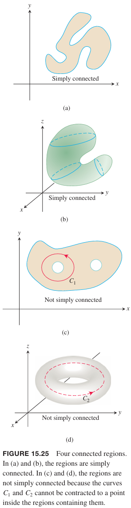

重力场（`gravitational field`）$\boldsymbol{G}$ 是一个矢量场，表示某个巨大物体对空间某点处产生的引力效应。重量 $m$ 的物体受到的力是 $\boldsymbol{F}=m\boldsymbol{G}$。电场（`electric field`）$\boldsymbol{E}$ 类似，电荷量为 $q$ 的电荷受到的力是 $\boldsymbol{F}=q\boldsymbol{E}$。在重力场或电场中移动物体或电荷所做的功只和起始位置与终止位置相关，与两点之间的路径无关。这一节主要研究路径无关的矢量场。

### 路径无关
如果 $A, B$ 是开放区域 $D$ 上的两个点，$\boldsymbol{F}$ 在从 $A$ 到 $B$ 的曲线 $C$ 上的积分通常依赖于曲线 $C$，正如 15.1 小节看到的。不过对于一些特殊的矢量场，从 $A$ 到 $B$ 的所有路径积分结果都一样。

**定义**
> 令 $\boldsymbol{F}$ 是开放区域 $D$ 上的矢量场，假定对于任意 $D$ 内两点 $A, B$，从 $A$ 到 $B$ 的曲线 $C$ 的线积分 $\int_C\boldsymbol{F}\cdot d\boldsymbol{r}$ 对所有路径都一样。那么积分 $\int_C\boldsymbol{F}\cdot d\boldsymbol{r}$ 是路径无关（`path independence`）的，且场 $\boldsymbol{F}$ 是保守（`conservative`）场。

保守这个词来自物理学，是指能够保持能量守恒的场。如果从 $A$ 到 $B$ 的曲线 $C$ 上的线积分是路径无关的，会使用 $\int_A^B$ 而不是 $\int_C$ 表示线积分。这提醒我们积分仅仅依赖于起始位置和终止位置，而与路径无关。

在指定的合理可微条件下，稍后会证明场 $\boldsymbol{F}$ 是保守场等价于场是某个标量函数的梯度场，即等价于 $\boldsymbol{F}=\nabla f$，$f$ 是某个标量函数。

**定义**
> 如果 $\boldsymbol{F}$ 是 $D$ 上的矢量场，$f$ 是 $D$ 上的标量函数，有 $\boldsymbol{F}=\nabla f$，那么 $f$ 称为 $\boldsymbol{F}$ 的势函数（`potential function`）。

重力势能的梯度函数是重力场，电势的梯度函数是电场。稍后会证明，如果我们能找到矢量场 $\boldsymbol{F}$ 的势函数 $f$，那么 $\boldsymbol{F}$ 沿从 $A$ 到 $B$ 的曲线的线积分可以使用下面的公式求解。
$$\int_A^B\boldsymbol{F}\cdot d\boldsymbol{r}=\int_A^B\nabla f\cdot d\boldsymbol{r}=f(B)-f(A)\tag{1}$$
如果将 $\nabla f$ 类比为 $f'$，那么上面公式就是微积分基本定理的矢量积分版本
$$\int_a^bf'(x)dx=f(b)-f(a)$$
保守场还有其他重要属性。比如 $\boldsymbol{F}$ 是 $D$ 上的保守场等价于 $\boldsymbol{F}$ 在 $D$ 上闭合路径的积分是零。有一些必须满足的条件才能是 $(1)$ 成立。

### 关于曲线、矢量场和定义域的假设
为了使得接下来的推理成立，必须要求曲线、矢量场和定义域满足确定的属性。除非特定说明，例题、习题中均满足这些假设。

曲线必须是分段光滑（`piecewise smooth`）的。曲线由有限段光滑曲线连接而成。对于这样的曲线，我们可以计算长度，在连接点之外求切向矢量。矢量场 $\boldsymbol{F}$ 的各个分量由连续一阶导。

定义域 $D$ 必须是连通的（`connected`）。对于开放区域，这意味着 $D$ 内任意两点可以用在 $D$ 内的光滑曲线连接。一些推理结果要求 $D$ 是简单连通（`simply connected`），这意味着 $D$ 内任意环可以缩小成一个点，整个过程不会离开 $D$。二维平面上一个移除了圆的区域就不是简单连通的，绕着这个圆的环就无法在 $D$ 内缩成一个点。三维空间内，移除一条直线形成的环也不是简单连通的。如下图所示。

连通性和简单连通性不同。简单连通要求不能有“环能包围的洞”。所有空间自身是连通的，也是简单连通的。

### 保守场的线积分
**定理 1 - 线积分的基本定理**
> 令 $C$ 是连接 $A, B$ 两点的光滑曲线，参数方程是 $\boldsymbol{r}(t)$。令 $f$ 是包含 $C$ 的定义域 $D$ 上的可微函数，连续梯度场 $\boldsymbol{F}=\nabla f$，那么
> $$\int_C\boldsymbol{F}\cdot d\boldsymbol{r}=f(B)-f(A)$$

例1 假定力场 $\boldsymbol{F}=\nabla f$ 是函数
$$f(x,y,z)=-\frac{1}{x^2+y^2+z^2}$$
的梯度场。求一个物体沿着连接 $(1,0,0), (0,0,2)$ 且不通过原点的光滑曲线 $C$ 所做的功。

解：根据定理 1 有
$$\int_C\boldsymbol{F}\cdot d\boldsymbol{r}=f(0,0,2)-f(1,0,0)=-\frac{1}{4}-(-1)=\frac{3}{4}$$

重力场和电场可以使用例 1 中的 $\boldsymbol{F}$ 来建模。在对重力建模时，函数 $f$ 表示重力势能，$f$ 的符号是负号，在原点处 $f$ 趋于 $-\infty$。这种选择使得重力 $\boldsymbol{F}$ 朝向原点，因此所有物体向下落而不是向上运动。

证明：
