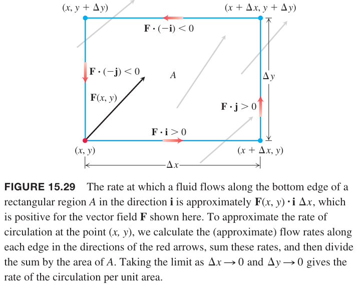
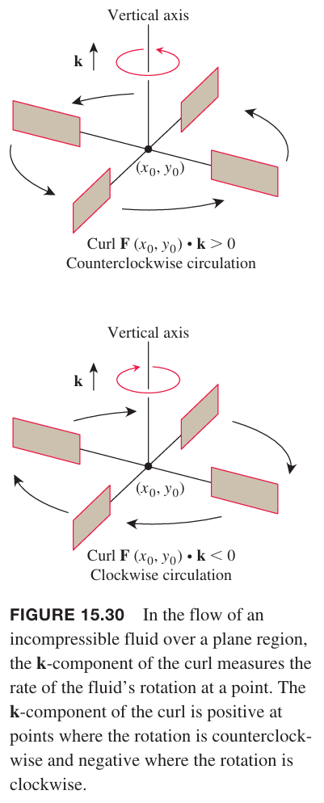
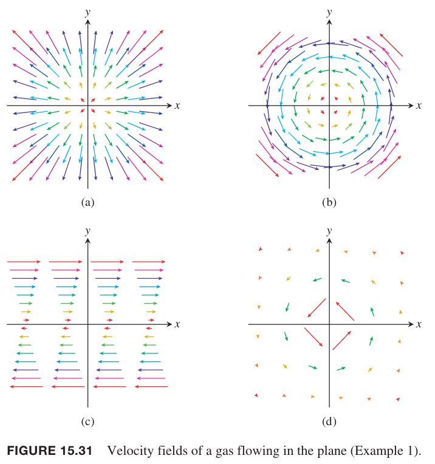
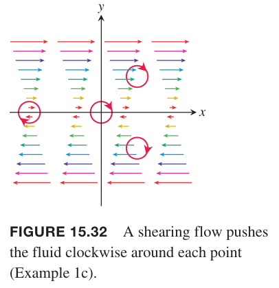
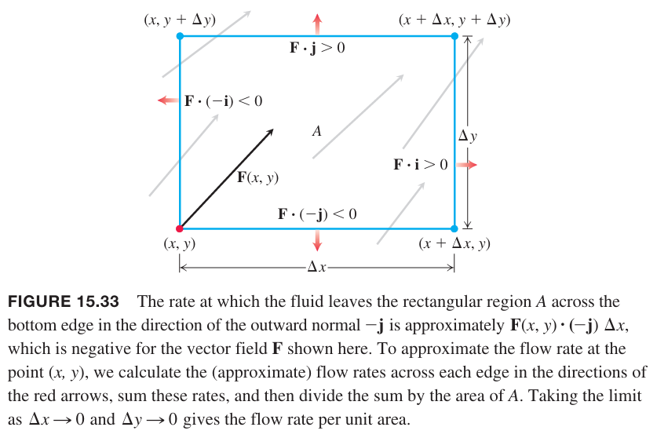
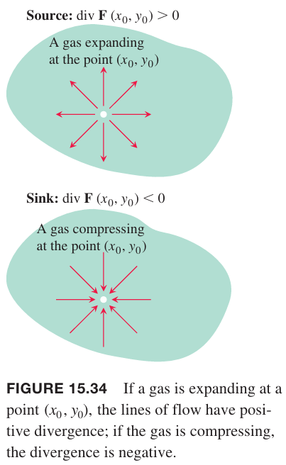
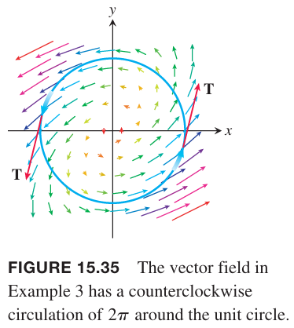
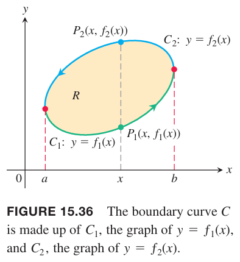
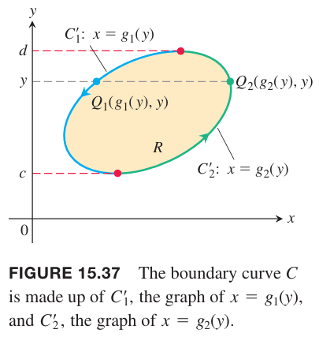
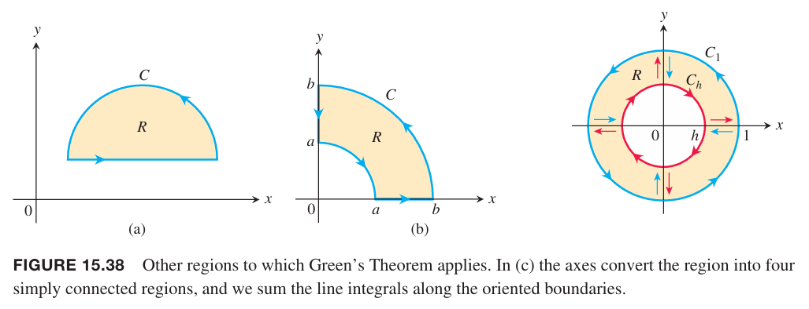

本节会推导出一种计算 $\boldsymbol{F}$ 不是保守场时在闭合曲线 $C$ 上功的方法。这个方法来自格林定理，它可以将线积分转化为在闭合曲线 $C$ 围成的区域上的二重积分。

这里用流体的速度场进行讨论，因为容易可视化。不过格林定理适用于任意矢量场。为格林定理还会引入两个概念：绕垂直于平面的轴的环量密度（`circulation density`）和散度（`divergence`）、通量密度（`flux density`）。

### 绕轴旋转：旋度的 $\boldsymbol{k}$ 分量
假定 $\boldsymbol{F}(x,y)=M(x,y)\boldsymbol{i}+N(x,y)\boldsymbol{j}$ 是平面上液体流动的矢量场，$M, N$ 的一阶偏微分在 $R$ 上每一点处都连续。零 $(x,y)$ 在 $R$ 上，$A$ 是位于 $R$ 内很小的矩阵，左下角的点是 $(x,y)$。矩阵平行于坐标轴的边长分别是 $\Delta x,\Delta y$。假定 $M,N$ 在矩阵 $A$ 符号不变。我们表达格林定理的第一个想法是量化在流体平面内绕垂直于平面的轴转动的桨绕着某点旋转的速率，这可以让我们了解流体绕着某点是如何旋转（循环）的。物理学家有时称这为矢量场 $\boldsymbol{F}$ 在某点处的环量密度。考虑矢量场
$$\boldsymbol{F}(x,y)=M(x,y)\boldsymbol{i}+N(x,y)\boldsymbol{j}$$
和矩形 $A$ 如下图所示。

$\boldsymbol{F}$ 沿着矩阵 $A$ 的循环速率是沿着各个边的流速之和。对于底边来说，流速近似等于
$$\boldsymbol{F}(x,y)\cdot \boldsymbol{i}\Delta x=M(x,y)\Delta x$$
这是矢量场 $\boldsymbol{F}$ 在 $\boldsymbol{i}$ 方向上的标量分量乘以线段长度。流速可正可负，这取决于 $\boldsymbol{F}$ 的分量。净循环速率是四边之和。除了底边之外，顶边
$$\boldsymbol{F}(x,y+\Delta y)\cdot(-\boldsymbol{i})\Delta x=-M(x,y+\Delta y)\Delta x$$
底边和顶边相加是
$$-(M(x,y+\Delta y)-M(x,y))\Delta x\approx -\frac{\partial M}{\partial y}\Delta y\Delta x$$
左边
$$\boldsymbol{F}(x,y)\cdot(-\boldsymbol{j})\Delta y=-N(x,y)\Delta y$$
右边
$$\boldsymbol{F}(x+\Delta x,y)\cdot\boldsymbol{j}\Delta y=N(x+\Delta x,y)\boldsymbol{y}$$
左边和右边之和是
$$(N(x+\Delta x,y)-N(x,y))\Delta y\approx\frac{\partial N}{\partial x}\Delta x\Delta y$$
四边之和是逆时针净循环速率
$$\bigg(\frac{\partial N}{\partial x}-\frac{\partial M}{\partial y}\bigg)\Delta x\Delta y$$
$\Delta x\Delta y$ 是矩形面积，因此环量密度近似是
$$\frac{\partial N}{\partial x}-\frac{\partial M}{\partial y}$$
令 $\Delta x, \Delta y$ 趋于零，那么这就是 $\boldsymbol{F}$ 在 $(x,y)$ 处环量密度的定义。

从上往下看，逆时针转动的环量密度是正值。环量密度的值是在 15.7 小节定义的更通用的环量定义的 $\boldsymbol{k}$ 分量，更通用的定义称为矢量场 $\boldsymbol{F}$ 的旋度。格林定理仅仅需要 $\boldsymbol{k}$ 分量。

**定义**
> 矢量场 $\boldsymbol{F}=M\boldsymbol{i}+N\boldsymbol{j}$ 在点 $(x,y)$ 处的环量密度是
> $$\frac{\partial N}{\partial x}-\frac{\partial M}{\partial y}\tag{1}$$
> 表达式称为旋度的 $\boldsymbol{k}$ 分量，用 $\text{curl }\boldsymbol{F}\cdot\boldsymbol{k}$ 表示。

如果水在 $xy$ 平面上流动，那么在 $(x_0,y_0)$ 处的 $\boldsymbol{k}$ 分量表示把一个轮桨放入水中（轴在 $(x_0,y_0)$ 且垂直于水面）运动的有多快。如下图所示。从上往下看，当 $(\text{curl } \boldsymbol{F})\cdot\boldsymbol{k}$ 是正的，逆时针转动，否则顺时针转动。

例1 球下面矢量场的环量密度并给出物理解释。

（a）均匀膨胀或压缩：$\boldsymbol{F}(x,y)=cx\boldsymbol{i}+cy\boldsymbol{j}$。
$$(\text{curl } \boldsymbol{F})\cdot\boldsymbol{k}=\frac{\partial}{\partial x}(cy)-\frac{\partial}{\partial y}(cx)=0$$
气体不会循环。

（b）匀速旋转：$\boldsymbol{F}(x,y)=-cy\boldsymbol{i}+cx\boldsymbol{j}$
$$(\text{curl } \boldsymbol{F})\cdot\boldsymbol{k}=\frac{\partial}{\partial x}(cx)-\frac{\partial}{\partial y}(cy)=2c$$
环量密度是常量，在每一点都旋转。如果 $c>0$，逆时针旋转，否则顺时针旋转。

（c）剪流：$\boldsymbol{F}(x,y)=y\boldsymbol{i}$。
$$(\text{curl } \boldsymbol{F})\cdot\boldsymbol{k}=-\frac{\partial}{\partial y}(y)=-1$$
环量密度是常量，且是负值。垂直于平面的桨顺时针旋转，每点处旋转速率一样。效果如下图。

（d）涡流效应：$\boldsymbol{F}(x,y)=\frac{-y}{x^2+y^2}\boldsymbol{i}+\frac{x}{x^2+y^2}\boldsymbol{j}$。
$$(\text{curl } \boldsymbol{F})\cdot\boldsymbol{k}=\frac{\partial}{\partial x}(\frac{x}{x^2+y^2})-\frac{\partial}{\partial y}(\frac{-y}{x^2+y^2})=0$$
原点以外其他点处环量密度是 0，不旋转。

格林定理的一个形式是说可以利用环量密度计算线积分。第二个形式告诉我们可以利用通量密度来计算通量。

### 散度
假定 $\boldsymbol{F}(x,y)=M(x,y)\boldsymbol{i}+N(x,y)\boldsymbol{j}$ 是平面上液体流动的矢量场，如下图所示。依旧假定在矩形 $A$ 内场的分量符号不变。下面研究流体跨过边界 $A$ 的速率。

流体离开底边的速率是
$$\boldsymbol{F}(x,y)\cdot(-\boldsymbol{j})\Delta x=-N(x,y)\Delta x$$
这是在 $(x,y)$ 处垂直向外的速度乘以线段的长度。其他三边计算类似。依赖于 $\boldsymbol{F}$ 分量的符号，流速可以是正的也可以是负的。净流速是流出矩形 $A$ 四边速率之和。

除了底边之外，顶边是
$$\boldsymbol{F}(x,y+\Delta y)\cdot\boldsymbol{j}=N(x,y+\Delta y)\Delta x$$
两者之和是
$$(N(x,y+\Delta y)-N(x,y))\Delta x\approx\frac{\partial N}{\partial y}\Delta y\Delta x$$
左边是
$$\boldsymbol{F}(x,y)\cdot(-\boldsymbol{i})\Delta y=-M(x,y)\Delta y$$
右边是
$$\boldsymbol{F}(x+\Delta x,y)\cdot\boldsymbol{i}\Delta y=M(x+\Delta x,y)\Delta y$$
两者之和是
$$(M(x+\Delta x,y)-M(x,y)\Delta y)\Delta y=\frac{\partial M}{\partial x}\Delta x\Delta y$$
因此四边之和的近似值是
$$\bigg(\frac{\partial M}{\partial x}+\frac{\partial N}{\partial y}\bigg)\Delta x\Delta y$$
$\Delta x\Delta y$ 是矩形面积，因此通量密度值是
$$\frac{\partial M}{\partial x}+\frac{\partial N}{\partial y}$$
当 $\Delta x,\Delta y$ 趋于零时，上述就是 $\boldsymbol{F}$ 在 $(x,y)$ 处通量密度的定义。数学术语是散度，符号是 $\text{div }\boldsymbol{F}$。

**定义**
> 矢量场 $\boldsymbol{F}=M\boldsymbol{i}+N\boldsymbol{j}$ 在点 $(x,y)$ 处的散度、通量密度定义是
> $$\text{div }\boldsymbol{F}=\frac{\partial M}{\partial x}+\frac{\partial N}{\partial y}$$

气体不像流体，是可以压缩的，速度场的散度描述的是每点处压缩或膨胀的程度。如果气体在 $(x_0,y_0)$ 处膨胀，气体要离开小的矩形，流体要散开，$\boldsymbol{F}$ 在该点处的散度是正的。如果是压缩，那么散度是负数。

例2 求例 1 中各个矢量场的散度。

解：

（a）
$$\text{div }\boldsymbol{F}=\frac{\partial}{\partial x}(cx)+\frac{\partial}{\partial y}(cy)=2c$$
如果 $c>0$ 气体匀速膨胀，如果 $c<0$ 气体匀速压缩。

（b）
$$\text{div }\boldsymbol{F}=\frac{\partial}{\partial x}(-cy)+\frac{\partial}{\partial y}(cx)=0$$
气体既不压缩也不膨胀。

（c）
$$\text{div }\boldsymbol{F}=\frac{\partial}{\partial x}(y)=0$$

（d）
$$\text{div }\boldsymbol{F}=\frac{\partial}{\partial x}(\frac{-y}{x^2+y^2})+\frac{\partial}{\partial y}(\frac{x}{x^2+y^2})=0$$

### 格林定理的两种形式
有两种方式遍历简单闭合曲线 $C$。逆时针遍历，称为正向，遍历时封闭区域始终在左边。顺时针遍历，称为逆向，遍历时封闭区域始终在右边。如果方向反过来，那么矢量场 $\boldsymbol{F}$ 在 $C$ 上的线积分符号也反转。我们使用符号
$$\oint_C\boldsymbol{F}(x,y)\cdot d\boldsymbol{r}$$
表示当逆时针遍历简单封闭曲线 $C$ 时的线积分。

第一种格式的格林定理是说矢量场在封闭曲线上的逆时针环量是矢量场的旋度的 $\boldsymbol{k}$ 分量在封闭区域上的二重积分。

**定理 4 - 格林定理（环量-旋度或切向形式）**
> 令 $C$ 是分段光滑、简单闭合曲线，围成的区域是 $R$。令 $\boldsymbol{F}=M\boldsymbol{i}+N\boldsymbol{j}$ 是矢量场，$M,N$ 在包含 $R$ 的开放区域上有连续的一阶偏微分。那么 $\boldsymbol{F}$ 在 $C$ 上的逆时针环量等于 $R$ 上 $(\text{curl }\boldsymbol{F})\cdot\boldsymbol{k}$ 的二重积分。
> $$\oint_C\boldsymbol{F}\cdot\boldsymbol{T}ds=\oint_CMdx+Ndy=\iint_R\bigg(\frac{\partial N}{\partial x}-\frac{\partial M}{\partial y}\bigg)dxdy\tag{3}$$

第二种格式的格林定理是说矢量场跨越简单封闭曲线向外的通量等于矢量场的散度在封闭区域上的二重积分。

**定理 5 - 格林定理（通量-散度或法向形式）**
> 令 $C$ 是分段光滑、简单闭合曲线，围成的区域是 $R$。令 $\boldsymbol{F}=M\boldsymbol{i}+N\boldsymbol{j}$ 是矢量场，$M,N$ 在包含 $R$ 的开放区域上有连续的一阶偏微分。那么 $\boldsymbol{F}$ 跨过 $C$ 向外的通量等于 $R$ 上 $\boldsymbol{F}$ 的散度的二重积分。
> $$\oint_C\boldsymbol{F}\cdot\boldsymbol{n}ds=\oint_CMdy-Ndx=\iint_R\bigg(\frac{\partial M}{\partial x}+\frac{\partial N}{\partial y}\bigg)dxdy\tag{4}$$

两种格林定理是等价的。将 $\boldsymbol{G}_1=-N\boldsymbol{i}+M\boldsymbol{j}$ 代入公式 $(3)$ 就能得到公式 $(4)$，将 $\boldsymbol{G}_2=N\boldsymbol{i}-M\boldsymbol{j}$ 代入公式 $(4)$ 就能得到公式 $(3)$。

两个格林公式可以看作是微积分基本定理的二维泛化形式。公式 $(3)$ 左边的线积分定义了 $\boldsymbol{F}$ 在 $C$ 上逆时针环量，环量也是其变化率（环流密度）在 $C$ 围成的 $R$ 上的二重积分，即公式 $(3)$ 的右边。类似的，公式 $(4)$ 左边的线积分定义了 $\boldsymbol{F}$ 在 $C$ 上向外的通量，通量也是其变化率（通量密度）在 $C$ 围成的 $R$ 上的二重积分，即公式 $(4)$ 的右边。

例3 验证格林公式的两种形式。矢量场是
$$\boldsymbol{F}(x,y)=(x-y)\boldsymbol{i}+x\boldsymbol{j}$$
区域 $R$ 由单位圆 $C$
$$\boldsymbol{r}(t)=\cos t\boldsymbol{i}+\sin t\boldsymbol{j}$$
围成。

解：根据题意
$$\begin{aligned}
M&=x-y&&=\cos t-\sin t\\
N&=x&&=\cos t\\
dx&=d(\cos t)&&=-\sin t\\
dy&=d(\sin t)&&=\cos t\\
\frac{\partial M}{\partial x}&=1\\
\frac{\partial M}{\partial y}&=-1\\
\frac{\partial N}{\partial x}&=1\\
\frac{\partial N}{\partial y}&=0\\
\end{aligned}$$
因此公式 $(3)$ 的左边是
$$\begin{aligned}
\oint_C\boldsymbol{F}\cdot d\boldsymbol{r}&=\oint_CMdx+Ndy\\
&=\int_0^{2\pi}(\cos t-\sin t)(-\sin t)dt+(\cos t)(\cos t)dt\\
&=\int_0^{2\pi}(-\cos t\sin t+1)dt\\
&=2\pi
\end{aligned}$$
公式 $(3)$ 的右边是
$$\begin{aligned}
\iint_R\bigg(\frac{\partial N}{\partial x}-\frac{\partial M}{\partial y}\bigg)dxdy&=\iint_R(1-(-1))dxdy\\
&=2\iint_Rdxdy\\
&=2\pi
\end{aligned}$$

下图展示了矢量场和环量。

下面验证公式 $(4)$ 的左右两边。
$$\begin{aligned}
\oint_CMdy-Ndx&=\int_0^{2\pi}(\cos t-\sin t)(\cos t)dt-(\cos t)(-\sin t)dt\\
&=\int_0^{2\pi}\cos^2 tdt\\
&=\pi
\end{aligned}$$
$$\begin{aligned}
\iint_R\bigg(\frac{\partial M}{\partial x}+\frac{\partial N}{\partial y}\bigg)dxdy&=\iint_R(1+0)dxdy\\
&=\iint_Rdxdy\\
&=\pi
\end{aligned}$$

### 使用格林定理求线积分
如果我们连接多条曲线得到一个封闭曲线 $C$，由于有许多不同的积分要求，因此计算在 $C$ 上的线积分需要很久。不过，如果 $C$ 围成的区域 $R$ 适用于格林定理，那么线积分变成了 $R$ 上的二重积分。

例4 求线积分
$$\oint_Cxydy-y^2dx$$
其中 $C$ 是由 $x,y$ 轴和 $x=1,y=1$ 组成的正方形。

解：下面用两种形式的格林定理来求解。

（1）应用公式 $(3)$，取 $M=-y^2,N=xy$，那么
$$\begin{aligned}
\oint_C-y^2dx+xydy&=\iint_R\bigg(\frac{\partial N}{\partial x}-\frac{\partial M}{\partial y}\bigg)dxdy\\
&=\iint_R(y-(-2y))dxdy\\
&=\int_0^1\int_0^13ydxdy\\
&=\int_0^13xy\bigg|_{x=0}^{x=1}dy\\
&=\int_0^13ydy\\
&=\frac{3y^2}{2}\bigg|_0^1\\
&=\frac{3}{2}
\end{aligned}$$
（2）应用公式 $(4)$，取 $M=xy,N=y^2$，那么
$$\begin{aligned}
\oint_Cxydy-y^2dx&=\iint_R\bigg(\frac{\partial M}{\partial x}+\frac{\partial N}{\partial y}\bigg)dxdy\\
&=\iint_R(y+2y)dxdy\\
&=\frac{3}{2}
\end{aligned}$$

### 特殊区域上格林定理的证明
令 $C$ 是 $xy$ 平面上简单光滑闭合曲线，与平行于坐标轴的直线最多有两个交点。令 $R$ 是 $C$ 围成的区域，假设 $M,N$ 及其一阶偏微分在包含 $C,R$ 的开放区间上连续。下面证明环量-旋度形式的格林定理
$$\oint_CMdx+Ndy=\iint_R\bigg(\frac{\partial N}{\partial x}-\frac{\partial M}{\partial y}\bigg)dxdy\tag{5}$$
如下图所示，$C$ 由两个有方向的曲线组成：
$$\begin{aligned}
C_1:y=f_1(x),a\leq x\leq b\\
C_2:y=f_2(x),b\geq x\geq a
\end{aligned}$$

对于 $a,b$ 间任意 $x$，$\frac{\partial M}{\partial y}$ 对 $y$ 积分，从 $y=f_1(x)$ 到 $y=f_2(x)$，那么有
$$\int_{f_1(x)}^{f_2(x)}\frac{\partial M}{\partial y}dy=M(x,y)\bigg|_{y=f_1(x)}^{y=f_2(x)}=M(x,f_2(x))-M(x,f_1(x))$$
然后在对 $x$ 积分有
$$\begin{aligned}
\int_a^b\int_{f_1(x)}^{f_2(x)}\frac{\partial M}{\partial y}dydx&=\int_a^b[M(x,f_2(x))-M(x,f_1(x))]dx\\
&=-\int_b^aM(x,f_2(x))dx-\int_a^bM(x,f_1(x))dx\\
&=-\int_{C_2}Mdx-\int_{C_1}Mdx\\
&=-\oint_CMdx
\end{aligned}$$
因此可以得到
$$\oint_CMdx=\iint_R-\frac{\partial M}{\partial y}dxdy\tag{6}$$
公式 $(6)$ 是想要证明的公式 $(5)$ 的一部分。下面推导另一部分，$\frac{\partial N}{\partial x}$ 先对 $x$ 积分再对 $y$ 积分，如下图所示。

这和之前类似。曲线 $C$ 分成两个部分
$$\begin{aligned}
C_1':x=g_1(y),d\geq y\geq c\\
C_2':x=g_2(y),c\leq y\leq d
\end{aligned}$$
二重积分的积分过程也和上面类似，因此可以得到
$$\oint_CNdy=\iint_R\frac{\partial N}{\partial x}dxdy\tag{7}$$
公式 $(6),(7)$ 相加就得到了要证明的公式 $(5)$。

格林公式对更一般的区域也成立。

注意，上面的（c）图并不是简单连通的。$C_1,C_h$ 上的方向使得区域 $R$ 始终在左手边，并且消除发生在方向相反的公共线段上。因此，格林定理对非简单连通图也成立。证明过程是将不重叠的各个部分对应的积分相加。消除发生在遍历了两次的弧上，两次遍历方向相反。

### 使用格林定理计算面积
区域 $R$ 的面积是
$$A_R=\frac{1}{2}\oint_Cxdy-ydx$$
证明：
$$\begin{aligned}
A_R&=\iint_Rdxdy\\
&=\iint_R\bigg(\frac{1}{2}+\frac{1}{2}\bigg)dydx\\
&=\oint_C\frac{1}{2}xdy-\frac{1}{2}ydx\\
&=\frac{1}{2}\oint_Cxdy-ydx
\end{aligned}$$
