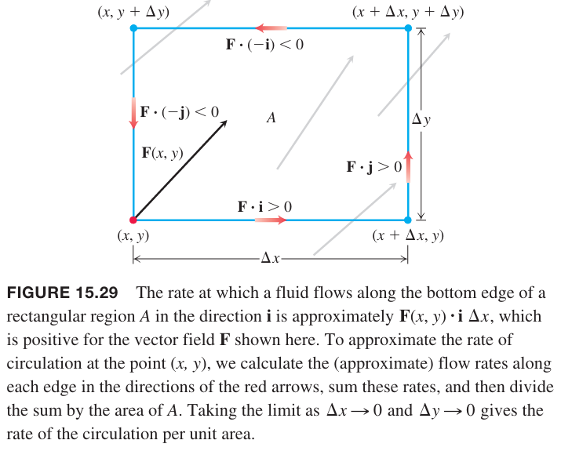
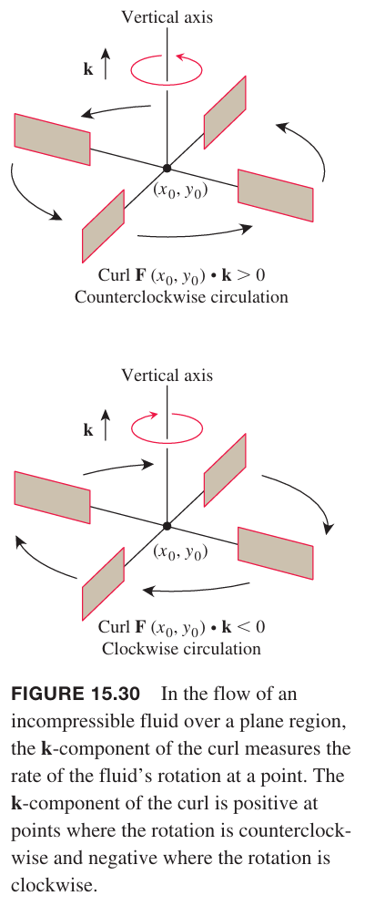

本节会推导出一种计算 $\boldsymbol{F}$ 不是保守场时在闭合曲线 $C$ 上功的方法。这个方法来自格林定理，它可以将线积分转化为在闭合曲线 $C$ 围成的区域上的二重积分。

这里用流体的速度场进行讨论，因为容易可视化。不过格林定理适用于任意矢量场。为格林定理还会引入两个概念：绕垂直于平面的轴的环量密度（`circulation density`）和散度（`divergence`）、通量密度（`flux density`）。

### 绕轴旋转：旋度的 $\boldsymbol{k}$ 分量
假定 $\boldsymbol{F}(x,y)=M(x,y)\boldsymbol{i}+N(x,y)\boldsymbol{j}$ 是平面上液体流动的矢量场，$M, N$ 的一阶偏微分在 $R$ 上每一点处都连续。零 $(x,y)$ 在 $R$ 上，$A$ 是位于 $R$ 内很小的矩阵，左下角的点是 $(x,y)$。矩阵平行于坐标轴的边长分别是 $\Delta x,\Delta y$。假定 $M,N$ 在矩阵 $A$ 符号不变。我们表达格林定理的第一个想法是量化在流体平面内绕垂直于平面的轴转动的桨绕着某点旋转的速率，这可以让我们了解流体绕着某点是如何旋转（循环）的。物理学家有时称这为矢量场 $\boldsymbol{F}$ 在某点处的环量密度。考虑矢量场
$$\boldsymbol{F}(x,y)=M(x,y)\boldsymbol{i}+N(x,y)\boldsymbol{j}$$
和矩形 $A$ 如下图所示。

$\boldsymbol{F}$ 沿着矩阵 $A$ 的循环速率是沿着各个边的流速之和。对于底边来说，流速近似等于
$$\boldsymbol{F}(x,y)\cdot \boldsymbol{i}\Delta x=M(x,y)\Delta x$$
这是矢量场 $\boldsymbol{F}$ 在 $\boldsymbol{i}$ 方向上的标量分量乘以线段长度。流速可正可负，这取决于 $\boldsymbol{F}$ 的分量。净循环速率是四边之和。除了底边之外，顶边
$$\boldsymbol{F}(x,y+\Delta y)\cdot(-\boldsymbol{i})\Delta x=-M(x,y+\Delta y)\Delta x$$
底边和顶边相加是
$$-(M(x,y+\Delta y)-M(x,y))\Delta x\approx -\frac{\partial M}{\partial y}\Delta y\Delta x$$
左边
$$\boldsymbol{F}(x,y)\cdot(-\boldsymbol{j})\Delta y=-N(x,y)\Delta y$$
右边
$$\boldsymbol{F}(x+\Delta x,y)\cdot\boldsymbol{j}\Delta y=N(x+\Delta x,y)\boldsymbol{y}$$
左边和右边之和是
$$(N(x+\Delta x,y)-N(x,y))\Delta y\approx\frac{\partial N}{\partial x}\Delta x\Delta y$$
四边之和是逆时针净循环速率
$$\bigg(\frac{\partial N}{\partial x}-\frac{\partial M}{\partial y}\bigg)\Delta x\Delta y$$
$\Delta x\Delta y$ 是矩形面积，因此环量密度近似是
$$\frac{\partial N}{\partial x}-\frac{\partial M}{\partial y}$$
令 $\Delta x, \Delta y$ 趋于零，那么这就是 $\boldsymbol{F}$ 在 $(x,y)$ 处环量密度的定义。

从上往下看，逆时针转动的环量密度是正值。环量密度的值是在 15.7 小节定义的更通用的环量定义的 $\boldsymbol{k}$ 分量，更通用的定义称为矢量场 $\boldsymbol{F}$ 的旋度。格林定理仅仅需要 $\boldsymbol{k}$ 分量。

**定义**
> 矢量场 $\boldsymbol{F}=M\boldsymbol{i}+N\boldsymbol{j}$ 在点 $(x,y)$ 处的环量密度是
> $$\frac{\partial N}{\partial x}-\frac{\partial M}{\partial y}\tag{1}$$
> 表达式称为旋度的 $\boldsymbol{k}$ 分量，用 $\text{curl }\boldsymbol{F}\cdot\boldsymbol{k}$ 表示。

如果水在 $xy$ 平面上流动，那么在 $(x_0,y_0)$ 处的 $\boldsymbol{k}$ 分量表示把一个轮桨放入水中（轴在 $(x_0,y_0)$ 且垂直于水面）运动的有多快。如下图所示。从上往下看，当 $\text{curl } \boldsymbol{F}\cdot\boldsymbol{k}$ 是正的，逆时针转动，否则顺时针转动。

