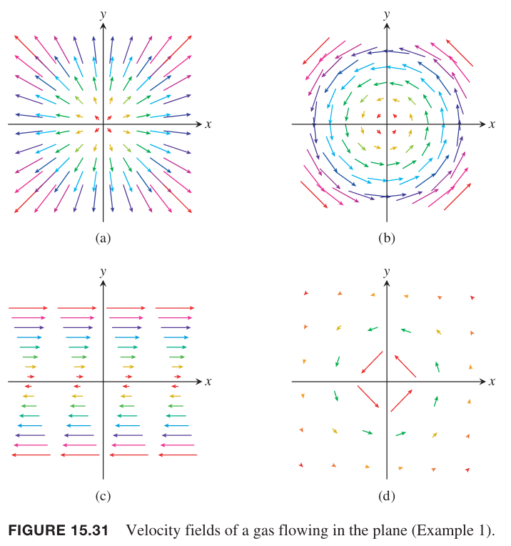
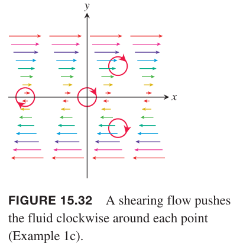
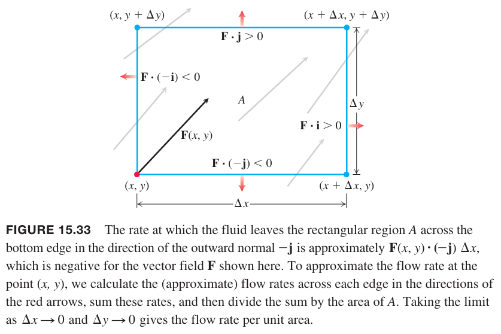
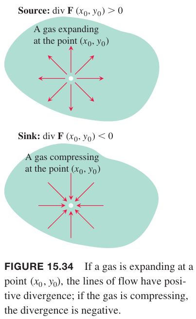

本节会推导出一种计算 $\boldsymbol{F}$ 不是保守场时在闭合曲线 $C$ 上功的方法。这个方法来自格林定理，它可以将线积分转化为在闭合曲线 $C$ 围成的区域上的二重积分。

这里用流体的速度场进行讨论，因为容易可视化。不过格林定理适用于任意矢量场。为格林定理还会引入两个概念：绕垂直于平面的轴的环量密度（`circulation density`）和散度（`divergence`）、通量密度（`flux density`）。

### 绕轴旋转：旋度的 $\boldsymbol{k}$ 分量
假定 $\boldsymbol{F}(x,y)=M(x,y)\boldsymbol{i}+N(x,y)\boldsymbol{j}$ 是平面上液体流动的矢量场，$M, N$ 的一阶偏微分在 $R$ 上每一点处都连续。零 $(x,y)$ 在 $R$ 上，$A$ 是位于 $R$ 内很小的矩阵，左下角的点是 $(x,y)$。矩阵平行于坐标轴的边长分别是 $\Delta x,\Delta y$。假定 $M,N$ 在矩阵 $A$ 符号不变。我们表达格林定理的第一个想法是量化在流体平面内绕垂直于平面的轴转动的桨绕着某点旋转的速率，这可以让我们了解流体绕着某点是如何旋转（循环）的。物理学家有时称这为矢量场 $\boldsymbol{F}$ 在某点处的环量密度。考虑矢量场
$$\boldsymbol{F}(x,y)=M(x,y)\boldsymbol{i}+N(x,y)\boldsymbol{j}$$
和矩形 $A$ 如下图所示。

$\boldsymbol{F}$ 沿着矩阵 $A$ 的循环速率是沿着各个边的流速之和。对于底边来说，流速近似等于
$$\boldsymbol{F}(x,y)\cdot \boldsymbol{i}\Delta x=M(x,y)\Delta x$$
这是矢量场 $\boldsymbol{F}$ 在 $\boldsymbol{i}$ 方向上的标量分量乘以线段长度。流速可正可负，这取决于 $\boldsymbol{F}$ 的分量。净循环速率是四边之和。除了底边之外，顶边
$$\boldsymbol{F}(x,y+\Delta y)\cdot(-\boldsymbol{i})\Delta x=-M(x,y+\Delta y)\Delta x$$
底边和顶边相加是
$$-(M(x,y+\Delta y)-M(x,y))\Delta x\approx -\frac{\partial M}{\partial y}\Delta y\Delta x$$
左边
$$\boldsymbol{F}(x,y)\cdot(-\boldsymbol{j})\Delta y=-N(x,y)\Delta y$$
右边
$$\boldsymbol{F}(x+\Delta x,y)\cdot\boldsymbol{j}\Delta y=N(x+\Delta x,y)\boldsymbol{y}$$
左边和右边之和是
$$(N(x+\Delta x,y)-N(x,y))\Delta y\approx\frac{\partial N}{\partial x}\Delta x\Delta y$$
四边之和是逆时针净循环速率
$$\bigg(\frac{\partial N}{\partial x}-\frac{\partial M}{\partial y}\bigg)\Delta x\Delta y$$
$\Delta x\Delta y$ 是矩形面积，因此环量密度近似是
$$\frac{\partial N}{\partial x}-\frac{\partial M}{\partial y}$$
令 $\Delta x, \Delta y$ 趋于零，那么这就是 $\boldsymbol{F}$ 在 $(x,y)$ 处环量密度的定义。

从上往下看，逆时针转动的环量密度是正值。环量密度的值是在 15.7 小节定义的更通用的环量定义的 $\boldsymbol{k}$ 分量，更通用的定义称为矢量场 $\boldsymbol{F}$ 的旋度。格林定理仅仅需要 $\boldsymbol{k}$ 分量。

**定义**
> 矢量场 $\boldsymbol{F}=M\boldsymbol{i}+N\boldsymbol{j}$ 在点 $(x,y)$ 处的环量密度是
> $$\frac{\partial N}{\partial x}-\frac{\partial M}{\partial y}\tag{1}$$
> 表达式称为旋度的 $\boldsymbol{k}$ 分量，用 $\text{curl }\boldsymbol{F}\cdot\boldsymbol{k}$ 表示。

如果水在 $xy$ 平面上流动，那么在 $(x_0,y_0)$ 处的 $\boldsymbol{k}$ 分量表示把一个轮桨放入水中（轴在 $(x_0,y_0)$ 且垂直于水面）运动的有多快。如下图所示。从上往下看，当 $(\text{curl } \boldsymbol{F})\cdot\boldsymbol{k}$ 是正的，逆时针转动，否则顺时针转动。

例1 球下面矢量场的环量密度并给出物理解释。

（a）均匀膨胀或压缩：$\boldsymbol{F}(x,y)=cx\boldsymbol{i}+cy\boldsymbol{j}$。
$$(\text{curl } \boldsymbol{F})\cdot\boldsymbol{k}=\frac{\partial}{\partial x}(cy)-\frac{\partial}{\partial y}(cx)=0$$
气体不会循环。

（b）匀速旋转：$\boldsymbol{F}(x,y)=-cy\boldsymbol{i}+cx\boldsymbol{j}$
$$(\text{curl } \boldsymbol{F})\cdot\boldsymbol{k}=\frac{\partial}{\partial x}(cx)-\frac{\partial}{\partial y}(cy)=2c$$
环量密度是常量，在每一点都旋转。如果 $c>0$，逆时针旋转，否则顺时针旋转。

（c）剪流：$\boldsymbol{F}(x,y)=y\boldsymbol{i}$。
$$(\text{curl } \boldsymbol{F})\cdot\boldsymbol{k}=-\frac{\partial}{\partial y}(y)=-1$$
环量密度是常量，且是负值。垂直于平面的桨顺时针旋转，每点处旋转速率一样。效果如下图。

（d）涡流效应：$\boldsymbol{F}(x,y)=\frac{-y}{x^2+y^2}\boldsymbol{i}+\frac{x}{x^2+y^2}\boldsymbol{j}$。
$$(\text{curl } \boldsymbol{F})\cdot\boldsymbol{k}=\frac{\partial}{\partial x}(\frac{x}{x^2+y^2})-\frac{\partial}{\partial y}(\frac{-y}{x^2+y^2})=0$$
原点以外其他点处环量密度是 0，不旋转。

格林定理的一个形式是说可以利用环量密度计算线积分。第二个形式告诉我们可以利用通量密度来计算通量。

### 散度
假定 $\boldsymbol{F}(x,y)=M(x,y)\boldsymbol{i}+N(x,y)\boldsymbol{j}$ 是平面上液体流动的矢量场，如下图所示。依旧假定在矩形 $A$ 内场的分量符号不变。下面研究流体跨过边界 $A$ 的速率。

流体离开底边的速率是
$$\boldsymbol{F}(x,y)\cdot(-\boldsymbol{j})\Delta x=-N(x,y)\Delta x$$
这是在 $(x,y)$ 处垂直向外的速度乘以线段的长度。其他三边计算类似。依赖于 $\boldsymbol{F}$ 分量的符号，流速可以是正的也可以是负的。净流速是流出矩形 $A$ 四边速率之和。

除了底边之外，顶边是
$$\boldsymbol{F}(x,y+\Delta y)\cdot\boldsymbol{j}=N(x,y+\Delta y)\Delta x$$
两者之和是
$$(N(x,y+\Delta y)-N(x,y))\Delta x\approx\frac{\partial N}{\partial y}\Delta y\Delta x$$
左边是
$$\boldsymbol{F}(x,y)\cdot(-\boldsymbol{i})\Delta y=-M(x,y)\Delta y$$
右边是
$$\boldsymbol{F}(x+\Delta x,y)\cdot\boldsymbol{i}\Delta y=M(x+\Delta x,y)\Delta y$$
两者之和是
$$(M(x+\Delta x,y)-M(x,y)\Delta y)\Delta y=\frac{\partial M}{\partial x}\Delta x\Delta y$$
因此四边之和的近似值是
$$\bigg(\frac{\partial M}{\partial x}+\frac{\partial N}{\partial y}\bigg)\Delta x\Delta y$$
$\Delta x\Delta y$ 是矩形面积，因此通量密度值是
$$\frac{\partial M}{\partial x}+\frac{\partial N}{\partial y}$$
当 $\Delta x,\Delta y$ 趋于零时，上述就是 $\boldsymbol{F}$ 在 $(x,y)$ 处通量密度的定义。数学术语是散度，符号是 $\text{div }\boldsymbol{F}$。

**定义**
> 矢量场 $\boldsymbol{F}=M\boldsymbol{i}+N\boldsymbol{j}$ 在点 $(x,y)$ 处的散度、通量密度定义是
> $$\text{div }\boldsymbol{F}=\frac{\partial M}{\partial x}+\frac{\partial N}{\partial y}$$

气体不像流体，是可以压缩的，速度场的散度描述的是每点处压缩或膨胀的程度。如果气体在 $(x_0,y_0)$ 处膨胀，气体要离开小的矩形，流体要散开，$\boldsymbol{F}$ 在该点处的散度是正的。如果是压缩，那么散度是负数。

例2 求例 1 中各个矢量场的散度。

解：

（a）
$$\text{div }\boldsymbol{F}=\frac{\partial}{\partial x}(cx)+\frac{\partial}{\partial y}(cy)=2c$$
如果 $c>0$ 气体匀速膨胀，如果 $c<0$ 气体匀速压缩。

（b）
$$\text{div }\boldsymbol{F}=\frac{\partial}{\partial x}(-cy)+\frac{\partial}{\partial y}(cx)=0$$
气体既不压缩也不膨胀。

（c）
$$\text{div }\boldsymbol{F}=\frac{\partial}{\partial x}(y)=0$$

（d）
$$\text{div }\boldsymbol{F}=\frac{\partial}{\partial x}(\frac{-y}{x^2+y^2})+\frac{\partial}{\partial y}(\frac{x}{x^2+y^2})=0$$

### 格林定理的两种形式
有两种方式遍历简单闭合曲线 $C$。逆时针遍历，称为正向，当遍历时封闭区域始终在左边。

