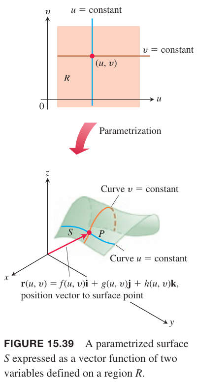
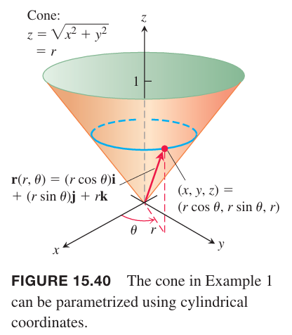
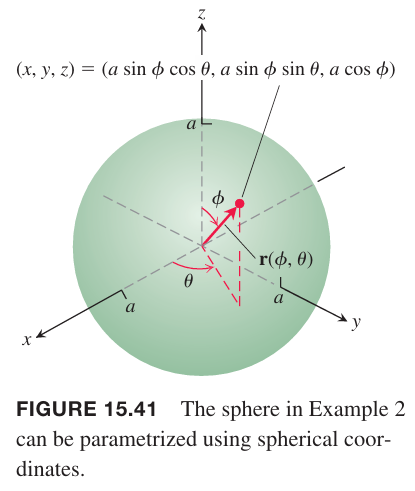
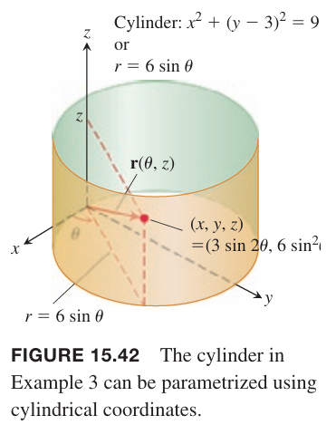

平面上的曲线有三种形式，显式形式，隐式形式，参数形式。
$$\begin{aligned}
&y=f(x)\\
&F(x,y)=0\\
&\boldsymbol{r}(t)=f(t)\boldsymbol{i}+g(t)\boldsymbol{j}
\end{aligned}$$
空间上的曲线有类似定义，显式形式，隐式形式
$$\begin{aligned}
&z=f(x,y)\\
&F(x,y,z)=0
\end{aligned}$$
对于曲面也有参数方程，给定曲面上的点的位置，参数方程是两个变量的矢量函数。这一小节会讨论这种形式并使用这种形式来求曲面的面积。

### 曲面的参数化
假定
$$\boldsymbol{r}(u,v)=f(u,v)\boldsymbol{i}+g(u,v)\boldsymbol{j}+h(u,v)\boldsymbol{k}\tag{1}$$
是定义在 $uv$ 平面上 $R$ 的连续矢量函数，在 $R$ 内是一对一函数。

我们称 $\boldsymbol{r}$ 的值域是由 $\boldsymbol{r}$ 定义的曲面 $S$。公式 $(1)$ 和定义域 $R$ 组成了曲面的参数化方程。$uv$ 是参数，$R$ 是参数定义域。为了简化讨论，$R$ 是由 $a\leq u\leq b,c\leq v\leq d$ 定义的据悉该。$\boldsymbol{r}$ 在 $R$ 内是一对一的确保 $S$ 自身不交叉。公式 $(1)$ 是下面三个参数方程的等价矢量形式。
$$x=f(u,v),y=g(u,v),z=h(u,v)$$

例1 求锥面
$$z=\sqrt{x^2+y^2},0\leq z\leq 1$$
的参数方程。

解：柱坐标系提供了一种参数化的方式。锥面上一点 $(x,y,z)$ 满足 $x=r\cos\theta,y=r\sin\theta,z=\sqrt{x^2+y^2}=r$，其中 $0\leq r\leq 1,0\leq\theta\leq 2\pi$。

取 $u=r,v=\theta$，那么参数方程是
$$\boldsymbol{r}(r,\theta)=(r\cos\theta)\boldsymbol{i}+(r\sin\theta)\boldsymbol{j}+r\boldsymbol{k},0\leq r\leq 1,0\leq\theta\leq 2\pi$$
在 $R$ 内是一对一函数，但在顶点 $r=0$ 处不是。

例2 求球
$$x^2+y^2+z^2=a^2$$
的参数化方程。

解：利用球坐标系。球上一点 $(x,y,z)$ 满足 $x=a\sin\phi\cos\theta,y=a\sin\phi\sin\theta,z=a\cos\phi,0\leq\phi\leq\pi,0\leq\theta\leq 2\pi$。

取 $u=\phi,v=\theta$，参数方程是
$$\boldsymbol{r}(\phi,\theta)=(a\sin\phi\cos\theta)\boldsymbol{i}+(a\sin\phi\cos\theta)\boldsymbol{j}+(a\cos\phi)\boldsymbol{k}$$
在极点处 $\phi=0,\phi=\pi$ 不是一对一的，其他 $R$ 内都是一对一的。

例3 球圆柱
$$x^2+(y-3)^2=9,0\leq z\leq 5$$
的参数化方程。

解：柱坐标系中，$(x,y,z)$ 满足 $x=r\cos\theta,y=r\sin\theta,z=z$。

$xy$ 平面内等价于极坐标系，因此
$$\begin{aligned}
x^2+(y^2-6y+9)&=9\\
r^2-6r\sin\theta&=0\\
r&=6\sin\theta,0\leq\theta\pi
\end{aligned}$$
因此柱坐标系上的点满足
$$\begin{aligned}
x&=r\cos\theta=6\sin\theta\cos\theta=3\sin 2\theta\\
y&=r\sin\theta=6\sin^2\theta\\
z&=z
\end{aligned}$$
取 $u=\theta,v=z$ 得到一对一的参数方程
$$\boldsymbol{r}(\theta,z)=(3\sin 2\theta)\boldsymbol{i}+(6\sin^2\theta)\boldsymbol{j}+z\boldsymbol{k},0\leq\theta\leq\pi,0\leq z\leq 5$$

### 曲面面积
我们的目标是计算参数方程如下的曲面 $S$ 的面积。
$$\boldsymbol{r}(u,v)=f(u,v)\boldsymbol{i}+g(u,v)\boldsymbol{j}+h(u,v)\boldsymbol{k},a\leq u\leq b,c\leq v\leq d$$
这里我们要求 $S$ 是光滑的。光滑的定义涉及 $\boldsymbol{r}$ 相对 $u,v$ 的一阶偏微分：
$$\begin{aligned}
\boldsymbol{r}_u&=\frac{\partial \boldsymbol{r}}{\partial u}=\frac{\partial f}{\partial u}\boldsymbol{i}+\frac{\partial g}{\partial u}\boldsymbol{j}+\frac{\partial h}{\partial u}\boldsymbol{k}\\
\boldsymbol{r}_v&=\frac{\partial \boldsymbol{r}}{\partial v}=\frac{\partial f}{\partial v}\boldsymbol{i}+\frac{\partial g}{\partial v}\boldsymbol{j}+\frac{\partial h}{\partial v}\boldsymbol{k}
\end{aligned}$$

**定义**
> 如果 $\boldsymbol{r}_u,\boldsymbol{r}_v$ 是连续的，且 $\boldsymbol{r}_u\times\boldsymbol{r}_v$ 在参数定义域内始终不是零矢量，那么参数曲面
> $$\boldsymbol{r}(u,v)=f(u,v)\boldsymbol{i}+g(u,v)\boldsymbol{j}+h(u,v)\boldsymbol{k}$$
> 是光滑的。

$\boldsymbol{r}_u\times\boldsymbol{r}_v$ 始终不是零矢量意味着矢量 $\boldsymbol{r}_u,\boldsymbol{r}_v$ 不是零矢量且不会沿着同一个方向，因此总是可以确定一个与曲面相切的平面。在定义域的边界处可以放宽这个要求，不影响面积计算。

