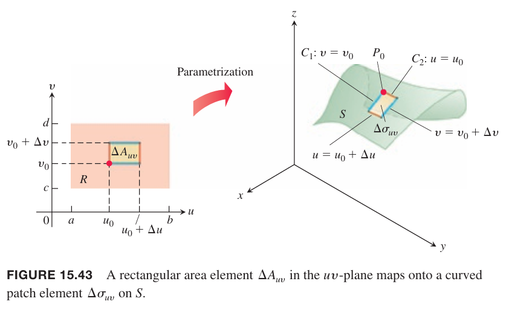

平面上的曲线有三种形式，显式形式，隐式形式，参数形式。
$$\begin{aligned}
&y=f(x)\\
&F(x,y)=0\\
&\boldsymbol{r}(t)=f(t)\boldsymbol{i}+g(t)\boldsymbol{j}
\end{aligned}$$
空间上的曲线有类似定义，显式形式，隐式形式
$$\begin{aligned}
&z=f(x,y)\\
&F(x,y,z)=0
\end{aligned}$$
对于曲面也有参数方程，给定曲面上的点的位置，参数方程是两个变量的矢量函数。这一小节会讨论这种形式并使用这种形式来求曲面的面积。

### 曲面的参数化
假定
$$\boldsymbol{r}(u,v)=f(u,v)\boldsymbol{i}+g(u,v)\boldsymbol{j}+h(u,v)\boldsymbol{k}\tag{1}$$
是定义在 $uv$ 平面上 $R$ 的连续矢量函数，在 $R$ 内是一对一函数。

我们称 $\boldsymbol{r}$ 的值域是由 $\boldsymbol{r}$ 定义的曲面 $S$。公式 $(1)$ 和定义域 $R$ 组成了曲面的参数化方程。$uv$ 是参数，$R$ 是参数定义域。为了简化讨论，$R$ 是由 $a\leq u\leq b,c\leq v\leq d$ 定义的据悉该。$\boldsymbol{r}$ 在 $R$ 内是一对一的确保 $S$ 自身不交叉。公式 $(1)$ 是下面三个参数方程的等价矢量形式。
$$x=f(u,v),y=g(u,v),z=h(u,v)$$

例1 求锥面
$$z=\sqrt{x^2+y^2},0\leq z\leq 1$$
的参数方程。

解：柱坐标系提供了一种参数化的方式。锥面上一点 $(x,y,z)$ 满足 $x=r\cos\theta,y=r\sin\theta,z=\sqrt{x^2+y^2}=r$，其中 $0\leq r\leq 1,0\leq\theta\leq 2\pi$。

取 $u=r,v=\theta$，那么参数方程是
$$\boldsymbol{r}(r,\theta)=(r\cos\theta)\boldsymbol{i}+(r\sin\theta)\boldsymbol{j}+r\boldsymbol{k},0\leq r\leq 1,0\leq\theta\leq 2\pi$$
在 $R$ 内是一对一函数，但在顶点 $r=0$ 处不是。

例2 求球
$$x^2+y^2+z^2=a^2$$
的参数化方程。

解：利用球坐标系。球上一点 $(x,y,z)$ 满足 $x=a\sin\phi\cos\theta,y=a\sin\phi\sin\theta,z=a\cos\phi,0\leq\phi\leq\pi,0\leq\theta\leq 2\pi$。

取 $u=\phi,v=\theta$，参数方程是
$$\boldsymbol{r}(\phi,\theta)=(a\sin\phi\cos\theta)\boldsymbol{i}+(a\sin\phi\cos\theta)\boldsymbol{j}+(a\cos\phi)\boldsymbol{k}$$
在极点处 $\phi=0,\phi=\pi$ 不是一对一的，其他 $R$ 内都是一对一的。

例3 球圆柱
$$x^2+(y-3)^2=9,0\leq z\leq 5$$
的参数化方程。

解：柱坐标系中，$(x,y,z)$ 满足 $x=r\cos\theta,y=r\sin\theta,z=z$。

$xy$ 平面内等价于极坐标系，因此
$$\begin{aligned}
x^2+(y^2-6y+9)&=9\\
r^2-6r\sin\theta&=0\\
r&=6\sin\theta,0\leq\theta\pi
\end{aligned}$$
因此柱坐标系上的点满足
$$\begin{aligned}
x&=r\cos\theta=6\sin\theta\cos\theta=3\sin 2\theta\\
y&=r\sin\theta=6\sin^2\theta\\
z&=z
\end{aligned}$$
取 $u=\theta,v=z$ 得到一对一的参数方程
$$\boldsymbol{r}(\theta,z)=(3\sin 2\theta)\boldsymbol{i}+(6\sin^2\theta)\boldsymbol{j}+z\boldsymbol{k},0\leq\theta\leq\pi,0\leq z\leq 5$$

### 曲面面积
我们的目标是计算参数方程如下的曲面 $S$ 的面积。
$$\boldsymbol{r}(u,v)=f(u,v)\boldsymbol{i}+g(u,v)\boldsymbol{j}+h(u,v)\boldsymbol{k},a\leq u\leq b,c\leq v\leq d$$
这里我们要求 $S$ 是光滑的。光滑的定义涉及 $\boldsymbol{r}$ 相对 $u,v$ 的一阶偏微分：
$$\begin{aligned}
\boldsymbol{r}_u&=\frac{\partial \boldsymbol{r}}{\partial u}=\frac{\partial f}{\partial u}\boldsymbol{i}+\frac{\partial g}{\partial u}\boldsymbol{j}+\frac{\partial h}{\partial u}\boldsymbol{k}\\
\boldsymbol{r}_v&=\frac{\partial \boldsymbol{r}}{\partial v}=\frac{\partial f}{\partial v}\boldsymbol{i}+\frac{\partial g}{\partial v}\boldsymbol{j}+\frac{\partial h}{\partial v}\boldsymbol{k}
\end{aligned}$$

**定义**
> 如果 $\boldsymbol{r}_u,\boldsymbol{r}_v$ 是连续的，且 $\boldsymbol{r}_u\times\boldsymbol{r}_v$ 在参数定义域内始终不是零矢量，那么参数曲面
> $$\boldsymbol{r}(u,v)=f(u,v)\boldsymbol{i}+g(u,v)\boldsymbol{j}+h(u,v)\boldsymbol{k}$$
> 是光滑的。

$\boldsymbol{r}_u\times\boldsymbol{r}_v$ 始终不是零矢量意味着矢量 $\boldsymbol{r}_u,\boldsymbol{r}_v$ 不是零矢量且不会沿着同一个方向，因此总是可以确定一个与曲面相切的平面。在定义域的边界处可以放宽这个要求，不影响面积计算。

现在考虑 $R$ 上一个很小的矩形，四边分别是 $u=u_0,u=u_0+\Delta u,v=v_0,v=v_0+\Delta v$。

$\Delta A_{uv}$ 的边映射到 $S$ 上的曲线，曲线围成的区域是 $\Delta\sigma_{uv}$。边 $v=v_0$ 映射到 $C_1$，$u=u_0$ 映射到 $C_2$，公共点 $(u_0,v_0)$ 映射为 $P_0$ 点。

下图是放大的 $\Delta\sigma_{uv}$。偏微分矢量 $\boldsymbol{r}_u(u_0,v_0)$ 在 $P_0$ 点与 $C_1$ 相切，$\boldsymbol{r}_v(u_0,v_0)$ 在 $P_0$ 点与 $C_2$ 相切。叉积 $\boldsymbol{r}_u\times\boldsymbol{r}_v$ 在 $P_0$ 点处与曲面正交。这里就用到了 $S$ 光滑这一条件，确保 $\boldsymbol{r}_u\times\boldsymbol{r}_v\neq\boldsymbol{0}$。

用与 $\Delta\sigma_{uv}$ 平行的切面来近似曲面，平行的平面由矢量 $\Delta u\boldsymbol{r}_u$ 与 $\Delta v\boldsymbol{r}_v$ 确定。

平行的矩形面积是
$$|\Delta u\boldsymbol{r}_u\times\Delta v\boldsymbol{r}_v|=|\boldsymbol{r}_u\times\boldsymbol{r}_v|\Delta u\Delta v\tag{2}$$
区域 $R$ 上的分区 $\Delta A_{uv}$ 引出了曲面 $S$ 上的分区 $\Delta\sigma_{uv}$。用 $(2)$ 的近似并对各个分区求和得到
$$\sum_n|\boldsymbol{r}_u\times\boldsymbol{r}_v|\Delta u\Delta v\tag{3}$$
随着 $\Delta u,\Delta v$ 独立趋于零，$n$ 趋于 $\infty$，并且 $\boldsymbol{r}_u,\boldsymbol{r}_v$ 的连续性确保 $(3)$ 趋于二重积分 $\int_c^d\int_a^b|\boldsymbol{r}_u\times\boldsymbol{r}_v|dudv$。

**定义**
> 曲面
> $$\boldsymbol{r}(u,v)=f(u,v)\boldsymbol{i}+g(u,v)\boldsymbol{j}+h(u,v)\boldsymbol{k},a\leq u\leq b,c\leq v\leq d$$
> 的面积是
> $$A=\iint_R|\boldsymbol{r}_u\times\boldsymbol{r}_v|dA=\int_c^d\int_a^b|\boldsymbol{r}_u\times\boldsymbol{r}_v|dudv\tag{4}$$

通过 $d\sigma=|\boldsymbol{r}_u\times\boldsymbol{r}_v|dudv$ 可以简化上面的式子。这里的 $d\sigma$ 类似于 12.3 小节的 $ds$。

**参数化曲面的面积微分**
> $$d\sigma=|\boldsymbol{r}_u\times\boldsymbol{r}_v|dudv,\iint_Sd\sigma\tag{5}$$

例4 求例 1 中圆锥曲面的面积。

解：例 1 中我们得到了参数方程
$$\boldsymbol{r}(r,\theta)=(r\cos\theta)\boldsymbol{i}+(r\sin\theta)\boldsymbol{j}+r\boldsymbol{k},0\leq r\leq 1,0\leq\theta\leq 2\pi$$
首先计算叉积
$$\begin{aligned}
\boldsymbol{r}_r\times\boldsymbol{r}_{\theta}&=\begin{vmatrix}
\boldsymbol{i}&&\boldsymbol{j}&&\boldsymbol{k}\\
\cos\theta&&\sin\theta&&1\\
-r\sin\theta&&r\cos\theta&&0
\end{vmatrix}\\
&=-(r\cos\theta)\boldsymbol{i}-(r\sin\theta)\boldsymbol{j}+(r\cos^2\theta+r\sin^2\theta)\boldsymbol{k}
\end{aligned}$$
因此
$$|\boldsymbol{r}_u\times\boldsymbol{r}_v|=\sqrt{r^2\cos^2\theta+r^2\sin^2\theta+r^2}=\sqrt{2}r$$
因此面积是
$$\begin{aligned}
A&=\int_0^{2\pi}|\boldsymbol{r}_u\times\boldsymbol{r}_v|drd\theta\\
&=\int_0^{2\pi}\int_0^1\sqrt{2}rdrd\theta\\
&=\int_0^{2\pi}\frac{\sqrt{2}}{2}d\theta\\
&=\pi\sqrt{2}
\end{aligned}$$

例5 求半径为 $a$ 的球面表面积。

解：使用例 2 中的参数方程
$$\boldsymbol{r}(\phi,\theta)=(a\sin\phi\cos\theta)\boldsymbol{i}+(a\sin\phi\sin\theta)\boldsymbol{j}+(a\cos\phi)\boldsymbol{k},0\leq\phi\pi,0\leq\theta\leq 2\pi$$
叉积
$$\begin{aligned}
\boldsymbol{r}_{\phi}\times\boldsymbol{r}_{\theta}&=\begin{vmatrix}
\boldsymbol{i}&&\boldsymbol{j}&&\boldsymbol{k}\\
a\cos\phi\cos\theta&&a\cos\phi\sin\theta&&-a\sin\phi\\
-a\sin\phi\sin\theta&&a\sin\phi\cos\theta&&0
\end{vmatrix}\\
&=(a^2\sin^2\phi\cos\theta)\boldsymbol{i}+(a^2\sin^2\phi\sin\theta)\boldsymbol{j}+(a^2\sin\phi\cos\phi)
\end{aligned}$$
那么
$$\begin{aligned}
|\boldsymbol{r}_{\phi}\times\boldsymbol{r}_{\theta}|&=\sqrt{a^4\sin^4\phi\cos^2\theta+a^4\sin^4\phi\sin^2\cos^2\theta+a^4\sin^2\phi\cos^2\theta}\\
&=\sqrt{a^4\sin^4\phi+a^4\sin^2\phi+\cos^2\phi}\\
&=\sqrt{a^4\sin^2\phi}\\
&=a^2\sin\phi
\end{aligned}$$
上面最后一步需要用 $\sin\phi\geq 0,0\leq\phi\leq\pi$。因此面积
$$\begin{aligned}
A&=\int_0^{2\pi}\int_0^\pi a^2\sin\phi d\phi d\theta\\
&=\int_0^{2\pi}-a^2\cos\phi\bigg|_0^{\pi}d\theta\\
&=\int_0^{2\pi}2a^2d\theta\\
&=4a^2\pi
\end{aligned}$$
结果就是众所周知的圆的表面积公式。

例6 令 $S$ 是由曲线 $x=\cos z,y=0,-\pi/2\leq z\leq\pi/2$ 绕着 $z$ 轴旋转得到的橄榄球的曲面。求 $S$ 的参数方程并求其面积。

解：这里使用柱坐标系。点 $(x,0,z)$ 绕着 $z$ 轴旋转得到一个半径为 $r=\cos z$ 的圆。令 $u=z,v=\theta$，$(x,y,z)$ 是 $S$ 上任意一点，那么 $x=r\cos\theta=\cos u\cos v,y=r\sin\theta=\cos u\sin v,z=u$，那么参数方程是
$$\boldsymbol{r}(u,v)=\cos u\cos v\boldsymbol{i}+\cos u\sin v\boldsymbol{j}+u\boldsymbol{k},-\frac{\pi}{2}\leq u\leq\frac{\pi}{2},0\leq v\leq 2\pi$$
叉积
$$\begin{aligned}
\boldsymbol{r}_u\times\boldsymbol{r}_v&=\begin{vmatrix}
\boldsymbol{i}&&\boldsymbol{j}&&\boldsymbol{k}\\
-\sin u\cos v&&\sin u\sin v&&1\\
-\cos u\sin v&&\cos u\cos v&&0
\end{vmatrix}\\
&=-\cos u\cos v\boldsymbol{i}-\cos u\sin v\boldsymbol{j}+(\sin u\cos u\cos^2 v+\sin u\cos u\sin^2 v)\boldsymbol{k}\\
&=-\cos u\cos v\boldsymbol{i}-\cos u\sin v\boldsymbol{j}+(\sin u\cos u)\boldsymbol{k}
\end{aligned}$$
那么
$$\begin{aligned}
|\boldsymbol{r}_u\times\boldsymbol{r}_v|&=\sqrt{\cos^2 u(\cos^2 v+\sin^2 v)+\sin^2 u\cos^2 u}\\
&=\sqrt{\cos^2u(1+\sin^2u)}\\
&=\cos u\sqrt{1+\sin^2u}
\end{aligned}$$
最后一步用到了 $\cos u\geq 0,-\frac{\pi}{2}\leq u\leq\frac{\pi}{2}$。

因此
$$A=\int_0^{2\pi}\int_{-\pi/2}^{\pi/2}\cos u\sqrt{1+\sin^2 u}dudv$$
令 $w=\sin u$，那么 $dw=\cos udu,-1\leq w\leq 1$。$S$ 上下对称，因此积分 $w$ 范围可以 0 到 1，然后结果乘以 2。因此
$$\begin{aligned}
A&=2\int_0^{2\pi}\int_0^1\sqrt{1+w^2}dwdv\\
&=2\int_0^{2\pi}\bigg[\frac{w}{2}\sqrt{1+w^2}+\frac{1}{2}\ln(w+\sqrt{1+w^2})\bigg]_0^1dv\\
&=2\int_0^{2\pi}\bigg[\frac{1}{2}\sqrt{2}+\frac{1}{2}\ln(1+\sqrt{2})\bigg]_0^1dv\\
&=2\pi[\sqrt{2}+\ln(1+\sqrt{2})]
\end{aligned}$$

### 隐式曲面
曲面经常用函数的水平集表示。
$$F(x,y,z)=c$$
其中 $c$ 是常量。这样的曲面没有显式参数，称为隐式定义曲面（`implicitly defined surface`）。电场和重力场的等势面往往就是隐式曲面。有时很难找到显式的 $f,g,h$ 将曲面表示为 $\boldsymbol{r}(u,v)=f(u,v)\boldsymbol{i}+g(u,v)\boldsymbol{j}+h(u,v)\boldsymbol{k}$ 这种形式。

上图是隐式曲面 $S$ 及其影子 $R$。$S$ 的定义是 $F(x,y,z)=c$，$\boldsymbol{p}$ 是垂直于 $R$ 的单位矢量。假定曲面是光滑的，即 $F$ 是可微函数，且 $\nabla F$ 在 $S$ 上连续且不为零，并且 $\nabla F\cdot\boldsymbol{p}\neq 0$，即曲面不折回。

假定法向矢量 $\boldsymbol{p}$ 是单位矢量 $\boldsymbol{k}$，因此上图 $R$ 位于 $xy$ 平面。根据假设有 $\nabla F\cdot\boldsymbol{p}=\nabla F\cdot\boldsymbol{k}=F_z\neq 0$。13.4 小节隐式函数定理是说 $S$ 是可微函数 $z=h(x,y)$ 的图像，虽然我们不知道 $h(x,y)$ 的具体形式。令参数 $u=x,v=y$ 可以得到
$$\boldsymbol{r}(u,v)=u\boldsymbol{i}+v\boldsymbol{j}+h(u,v)\boldsymbol{k}\tag{6}$$
这就是 $S$ 的参数公式。下面使用 $(4)$ 求 $S$ 的面积。

计算 $\boldsymbol{r}$ 的偏微分
$$\boldsymbol{r}_u=\boldsymbol{i}+\frac{\partial h}{\partial u}\boldsymbol{k},\boldsymbol{r}_v=\boldsymbol{j}+\frac{\partial h}{\partial v}\boldsymbol{k}$$
根据 13.4 小节公式 $(2)$，对隐式函数 $F(x,y,z)=c,x=u,y=v,z=h(u,v)$ 使用链式法则，可以得到偏微分
$$\frac{\partial h}{\partial u}=-\frac{F_x}{F_z},\frac{\partial h}{\partial v}=-\frac{F_y}{F_z}$$
那么
$$\boldsymbol{r}_u=\boldsymbol{i}-\frac{F_x}{F_z}\boldsymbol{k},\boldsymbol{r}_v=\boldsymbol{j}-\frac{F_y}{F_z}\boldsymbol{k}$$
那么叉积是
$$\begin{aligned}
\boldsymbol{r}_u\times\boldsymbol{r}_v&=\frac{F_x}{F_z}\boldsymbol{i}+\frac{F_y}{F_z}\boldsymbol{j}+\boldsymbol{k}\\
&=\frac{1}{F_z}(F_x\boldsymbol{i}+F_y\boldsymbol{j}+F_z\boldsymbol{k})\\
&=\frac{\nabla F}{F_z}\\
&=\frac{\nabla F}{\nabla F\cdot\boldsymbol{k}}\\
&=\frac{\nabla F}{\nabla F\cdot\boldsymbol{p}}
\end{aligned}$$
因此曲面面积微分是
$$d\sigma=|\boldsymbol{r}_u\times\boldsymbol{r}_v|dudv=\frac{|\nabla F|}{|\nabla F\cdot\boldsymbol{p}|}dxdy$$
类似的，当 $F_y\neq 0$ 时，使用垂直于 $xz$ 平面的单位矢量 $\boldsymbol{p}=\boldsymbol{j}$ 代入上式；当 $F_x\neq 0$，使用垂直于 $yz$ 平面的单位矢量 $\boldsymbol{p}=\boldsymbol{i}$ 代入上式。

**隐式曲面的面积公式**
> 在封闭有界区域 $R$ 上的曲面 $F(x,y,z)=c$ 的面积是
> $$A=\iint_R\frac{|\nabla F|}{|\nabla F\cdot\boldsymbol{P}|}dA\tag{7}$$
> 其中 $\boldsymbol{p}$ 是 $\boldsymbol{i},\boldsymbol{j},\boldsymbol{k}$ 之一，是 $R$ 的法向单位矢量，且 $\nabla\cdot\boldsymbol{p}\neq 0$。

公式 $(7)$ 成立的条件是在 $R$ 上都有 $\nabla F\cdot\boldsymbol{p}\neq 0$ 且 $\nabla F$ 是连续的。

例7 求抛物面 $x^2+y^2-z=0$ 被平面 $z=4$ 截取的下半部分曲面面接。

解：示意图如上所示。曲面 $S$ 是 $F(x,y,z)=x^2+y^2-z$ 的一部分，$R$ 在 $xy$ 平面，满足 $x^2+y^2\leq 4$。取与 $R$ 正交的单位矢量 $\boldsymbol{p}=\boldsymbol{k}$。

在曲面上任意一点 $(x,y,z)$，有
$$\begin{aligned}
F(x,y,z)&=x^2+y^2-z\\
\nabla F&=2x\boldsymbol{i}+2y\boldsymbol{j}-\boldsymbol{k}\\
|\nabla F|&=\sqrt{4x^2+4y^2+1}\\
|\nabla F\cdot\boldsymbol{p}|&=|\nabla F\cdot\boldsymbol{k}|=|-1|=1
\end{aligned}$$
在区域 $R$ 上有 $dA=dxdy$。因此
$$\begin{aligned}
A&=\iint_R\frac{|\nabla F|}{|\nabla F\cdot\boldsymbol{p}|}dA\\
&=\iint_{x^2+y^2\leq 4}\sqrt{4x^2+4y^2+1}dxdy\\
&=\int_0^{2\pi}\int_0^2\sqrt{4r^2+1}rdrd\theta\\
&=\int_0^{2\pi}\bigg[\frac{}{12}(4r^2+1)^{3/2}\bigg]_0^2d\theta\\
&=\int_0^{2\pi}\frac{1}{12}(17^{3/2}-1)d\theta\\
&=\frac{\pi}{6}(17\sqrt{17}-1)
\end{aligned}$$

例 7 给出了一种求 $xy$ 平面上区域 $R$ 上曲面 $z=f(x,y)$ 的方式。求曲面微分有两种方式，如下面例子所示。

例8 使用两种方法推导 $xy$ 平面上区域 $R$ 上曲面 $z=f(x,y)$ 的曲面面积微分 $d\sigma$：（a）使用公式 $(5)$ 参数化方法；（b）使用公式 $(7)$ 隐式函数。

解：（a）令 $x=u,y=v,z=f(x,y)$ 得到参数化曲面
$$\boldsymbol{r}(u,v)=u\boldsymbol{i}+v\boldsymbol{j}+f(u,v)\boldsymbol{k}$$
偏微分
$$\boldsymbol{r}_u=\boldsymbol{i}+f_u\boldsymbol{k},\boldsymbol{r}_v=\boldsymbol{j}+f_v\boldsymbol{k}$$
那么叉积是
$$\boldsymbol{r}_u\times\boldsymbol{r}_v=-f_u\boldsymbol{i}-f_v\boldsymbol{j}+\boldsymbol{k}$$
因此
$$d\sigma=\sqrt{f_x^2+f_y^2+1}dxdy$$
（b）隐式函数是 $F(x,y,z)=f(x,y)-z$。取垂直于 $R$ 的单位矢量 $\boldsymbol{p}=\boldsymbol{k}$。又 $\nabla F=f_x\boldsymbol{i}+f_y\boldsymbol{j}-\boldsymbol{k}$，因此 $|\nabla F\cdot\boldsymbol{p}|=|-1|=1$，$|\nabla F|=\sqrt{f_x^2+f_y^2+1}$，所以
$$\frac{|\nabla F|}{|\nabla F\cdot\boldsymbol{p}|}=|\nabla F|$$
曲面面积微分就是
$$d\sigma=\sqrt{f_x^2+f_y^2+1}dxdy$$

**$z=f(x,y)$ 曲面面积公式**
> $xy$ 平面上区域 $R$ 上曲面 $z=f(x,y)$ 的面积公式是
> $$A=\iint_R\sqrt{f_x^2+f_y^2+1}dxdy\tag{8}$$
