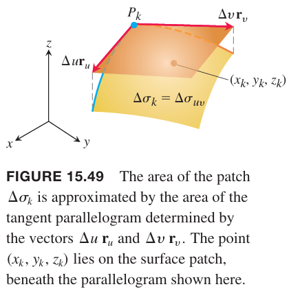
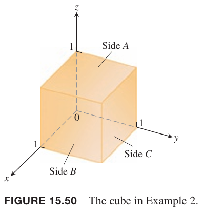
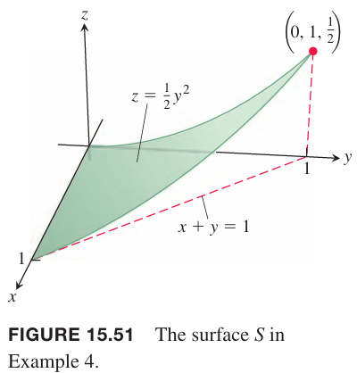
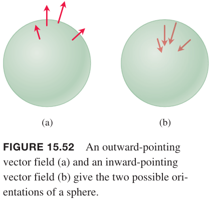
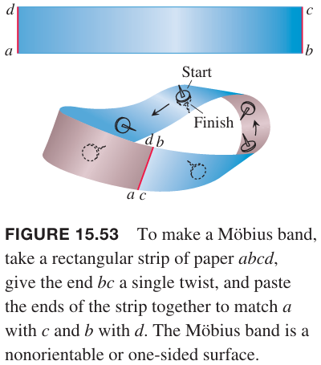
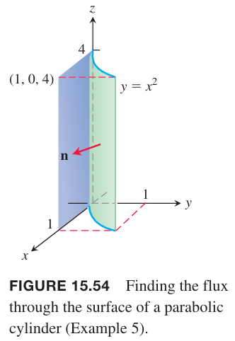
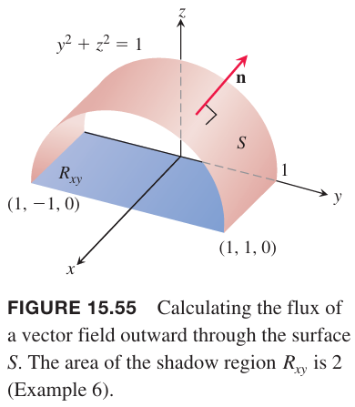
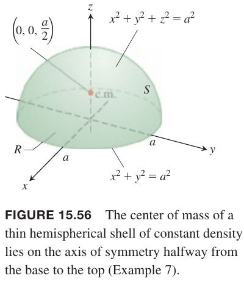
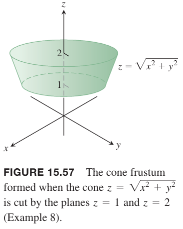

为了计算曲面的质量、液体穿过膜的流量、曲面表面的总电荷量，需要对一个函数在某个曲面上积分。这样的曲面积分（`surface integrals`）是线积分概念的二维拓展。和线积分一样，曲面积分也有两种形式。第一种形式是对标量函数在曲面上积分，比如对密度函数积分得到曲面的质量。第二种形式是对矢量场的积分，比如液体通过侵入液体中的曲面的净流量。

### 曲面积分
假定函数 $G(x,y,z)$ 是曲面 $S$ 上各点的质量密度（`mass density`），那么下面的积分计算的是 $S$ 的总质量。

首先假定曲面 $S$ 由在 $uv$ 平面上区域 $R$ 上的参数方程定义。
$$\boldsymbol{r}(u,v)=f(u,v)\boldsymbol{i}+g(u,v)\boldsymbol{j}+h(u,v)\boldsymbol{k},(u,v)\in R$$
和之前一样，取很小的一块，那么
$$\Delta\sigma_{uv}\approx|\boldsymbol{r}_u\times\boldsymbol{r}_v|dudv$$

和之前一样，对这些小块求和
$$\sum_{k=1}^nG(x_k,y_k,z_k)\Delta\sigma_k$$
对 $k$ 块选择 $(x_k,y_k,z_k)$ 决定了黎曼和。当分块足够多时，这些区域趋于零，$\Delta u\to 0,\Delta v\to 0$，如果和的极限存在的话，这个极限是曲面 $S$ 上 $G$ 的曲面积分。
$$\iint_SG(x,y,z)d\sigma=\lim_{n\to\infty}\sum_{k=1}^nG(x_k,y_k,z_k)\Delta\sigma_k\tag{1}$$
如果 $S$ 是分段光滑曲面，$G$ 在 $S$ 上连续，那么可以证明 $(1)$ 的极限一定存在。

和 15.5 一样，对 $S$ 不同表示有不同的积分公式。

**标量函数的曲面积分公式**
> 1. 光滑曲面 $S$ 由参数方程 $\boldsymbol{r}(u,v)=f(u,v)\boldsymbol{i}+g(u,v)\boldsymbol{j}+h(u,v)\boldsymbol{k},(u,v)\in R$，且 $G(x,y,z)$ 是 $S$ 上的连续函数，那么 $S$ 上 $G$ 的曲面积分是 $R$ 上的二重积分。
> $$\iint_SG(x,y,z)d\sigma=\iint_RG(f(u,v),g(u,v),h(u,v))|\boldsymbol{r}_u\times\boldsymbol{r}_v|dudv\tag{2}$$
> 2. 光滑曲面 $S$ 由隐式函数 $F(x,y,z)=c$ 定义，$F$ 是连续可微函数，$S$ 位于封闭有界区域 $R$ 上，$R$ 在 $S$ 下的坐标平面上，此时连续 $G$ 在 $S$ 上的曲面积分也可以写作 $R$ 上的二重积分。其中 $\boldsymbol{p}$ 是 $R$ 的法向单位矢量，且 $\nabla F\cdot\boldsymbol{p}\neq 0$。
> $$\iint_SG(x,y,z)d\sigma=\iint_RG(x,y,z)\frac{|\nabla F|}{|\nabla F\cdot\boldsymbol{p}|}dA\tag{3}$$
> 3. 曲面 $S$ 是显式函数 $z=f(x,y)$ 的图像，其中 $f$ 是 $xy$ 平面上区域 $R$ 上的连续可微函数，连续函数 $G$ 在 $S$ 的曲面积分是 $R$ 上的二重积分。
> $$\iint_SG(x,y,z)d\sigma=\iint_RG(x,y,f(x,y))\sqrt{f_x^2+f_y^2+1}dxdy\tag{4}$$

公式 $(1)$ 在不同的应用中有不同的含义。如果 $G$ 是常量 1，那么积分是 $S$ 的面积。如果 $G$ 是质量密度，那么积分是 $S$ 的质量。如果 $G$ 表示电荷密度，那么积分是 $S$ 上总的电荷量。

例1 求 $G(x,y,z)=x^2$ 在圆锥 $z=\sqrt{x^2+y^2},0\leq z\leq 1$ 上的积分。

解：利用上一节 15.5 例 4 的结论，有
$$|\boldsymbol{r}_r\times\boldsymbol{r}_\theta|=\sqrt{2}r$$
利用公式 $(2)$ 有
$$\begin{aligned}
\iint_Sx^2d\sigma&=\int_0^{2\pi}\int_0^1(r^2\cos^2\theta)(\sqrt{2}r)drd\theta\\
&=\sqrt{2}\int_0^{2\pi}\int_0^1r^3\cos^2\theta drd\theta\\
&=\frac{\sqrt{2}}{4}\int_0^{2\pi}\cos^2\theta d\theta\\
&=\frac{\sqrt{2}}{4}\bigg[\frac{\theta}{2}+\frac{1}{4}\sin 2\theta\bigg]_0^{2\pi}\\
&=\frac{\pi\sqrt{2}}{4}
\end{aligned}$$

曲面积分和二重积分类似，两个函数和的积分等于积分的和。定义域具备可加性，那么下面等式成立。
$$\iint_SGd\sigma=\iint_{S_1}Gd\sigma+\iint_{S_2}Gd\sigma+\cdots+\iint_{S_n}Gd\sigma$$
当 $S$ 由光滑曲线将有限多个光滑曲面组合而成，各个部分没有重叠，那么 $S$ 上的积分等于在各个部分上的积分之和。

例2 求函数 $G(x,y,z)=xyz$ 在由坐标平面和 $x=1,y=1,z=1$ 组成的第一象限内立方体上的积分。

解：立方体有六个面，不过坐标平面上函数 $G=xyz=0$，因此仅需要考虑其他三个面。
$$\iint xyzd\sigma=\iint_Axyzd\sigma+\iint_Bxyzd\sigma+\iint_Cxyzd\sigma$$
面 $A$ 曲面函数是 $f(x,y,z)=z=1$，在正方形区域 $R_{xy}:0\leq x\leq 1,0\leq y\leq 1$ 之上。那么可以选择 $\boldsymbol{p}=\boldsymbol{k}$，那么
$$\nabla f=\boldsymbol{k},|\nabla f|=1,|\nabla f\cdot\boldsymbol{p}|=1$$
因此
$$d\sigma=\frac{|\nabla f|}{|\nabla f\cdot\boldsymbol{p}|}dA=dxdy$$
那么
$$\iint_Axyzd\sigma=\iint_{R_{xy}}xydxdy=\int_0^1\int_0^1xydxdy=\frac{1}{4}$$
根据对称性，面 $B$ 和面 $C$ 上的积分也是 $1/4$。因此
$$\iint xyzd\sigma=\frac{3}{4}$$

例3 求函数 $G(x,y,z)=\sqrt{1-x^2+y^2}$ 在橄榄球表面 $S$ 上的积分，其中 $S$ 是由曲线 $x=\cos z,y=0,-\pi/2\leq z\leq \pi/2$ 绕着 $z$ 轴旋转得到的。

解：15.5 小节例 6 给出了参数方程
$$x=\cos u\cos v,y=\cos u\sin v,z=u,-\frac{\pi}{2}\leq u\leq\frac{\pi}{2},0\leq v\leq 2\pi$$
将其代入函数 $G$ 得到
$$\sqrt{1-x^2-y^2}=\sqrt{1-\cos^2 u}=|\sin u|$$
例 6 还给出了曲面微分
$$d\sigma=\cos u\sqrt{1+\sin^2 u}dudv$$
那么
$$\begin{aligned}
\iint_S\sqrt{1-x^2-y^2}d\sigma&=\int_0^{2\pi}\int_{-\pi/2}^{\pi/2}|\sin u|\cos u\sqrt{1+\sin^2 u}dudv\\
&=2\int_0^{2\pi}\int_{0}^{\pi/2}|\sin u|\cos u\sqrt{1+\sin^2 u}dudv\\
&=\int_0^{2\pi}\int_1^2\sqrt{w}dwdv&&w=1+\sin^2 u\\
&=2\pi\cdot\frac{2}{3}w^{3/2}\bigg|_1^2\\
&=\frac{4\pi}{3}(2\sqrt{2}-1)
\end{aligned}$$

例4 求 $xy$ 平面上的三角区域 $R:x\geq 0,y\geq 0,x+y\leq 1$ 上的柱体 $z=y^2/2$ 上的积分 $\iint_S\sqrt{x(1+2z)}d\sigma$。

解：函数 $G$ 是
$$G(x,y,z)=\sqrt{x(1+2z)}=\sqrt{x}\sqrt{1+y^2}$$
已知 $z=f(x,y)=y^2/2$，那么使用公式 $(4)$ 求曲面积分。
$$d\sigma=\sqrt{f_x^2+f_y^2+1}dxdy=\sqrt{y^1+1}dxdy$$
那么
$$\begin{aligned}
\iint_SG(x,y,z)d\sigma&=\iint_R(\sqrt{x}\sqrt{1+y^2})(\sqrt{1+y^2})dxdy\\
&=\int_0^1\int_0^{1-x}\sqrt{x}(1+y^2)dydx\\
&=\int_0^1\sqrt{x}[(1-x)+\frac{1}{3}(1-x)^3]dx\\
&=\int_0^1\frac{4}{3}x^{1/2}-2x^{3/2}+x^{5/2}-\frac{1}{3}x^{7/2}dx\\
&=\frac{8}{9}x^{3/2}-\frac{4}{5}x^{5/2}+\frac{2}{7}x^{7/2}-\frac{2}{27}x^{9/2}\bigg|_0^1\\
&=\frac{284}{945}
\end{aligned}$$

### 曲面的方向
参数方程 $\boldsymbol{r}(t)$ 表示的曲线 $C$ 天然有方向—— $t$ 增加时的方向。沿着 $C$ 的单位切向矢量 $\boldsymbol{T}$ 指向前进的方向。但是曲线本身可能有两个方向，一个是 $\boldsymbol{T}$ 的方向，一个是 $-\boldsymbol{T}$ 的方向。

为了指定空间中曲面 $S$ 的方向，类似的使用曲面的法线方向的矢量 $\boldsymbol{n}$ 来确定方向。参数方程 $\boldsymbol{r}(u,v)$ 确定的曲面的法向矢量是 $\boldsymbol{r}_u\times\boldsymbol{r}_v$，这就是曲面的方向。另一个可选的方向恰恰相反，是 $-\boldsymbol{r}_u\times\boldsymbol{r}_v$ 所指的方向。本质上讲方向是选择曲面两侧之一的方式罢了。不是所有曲面都有方向，但是如果有，一定是两个，方向相对。

下面的球体有两个方向，一个指向圆心向内，一个相反向外。我们可以选择任意一个作为球面的方向。

如果我们可以在光滑的曲面 $S$ 上选择一个单位法向矢量 $\boldsymbol{n}$ 的连续矢量场，那么称 $S$ 是有方向的。空间区域内有界的曲面是有方向的，因为我们可以选择这样的一个向外的矢量 $\boldsymbol{n}$。

一旦选择，单位矢量 $\boldsymbol{n}$ 是曲面的正向。并不是所有曲面都有方向，比如下面的莫比乌斯环就没有方向。无论如何构造连续单位法向矢量场，从一点开始，沿着曲面连续地移动矢量，回到原点处时，方向相反。

### 矢量场的积分
**定义**
> 令 $\boldsymbol{F}$ 是三维空间内的矢量场，各个分量在一个光滑曲面 $S$ 上是连续的，这个曲面 $S$ 可以选择一个单位法向矢量 $\boldsymbol{n}$ 作为它的方向。那么 $\boldsymbol{F}$ 在 $S$ 上的曲面积分是
> $$\iint_S\boldsymbol{F}\cdot\boldsymbol{n}d\sigma\tag{5}$$
> 这个积分也称作矢量场 $\boldsymbol{F}$ 穿过 $S$ 的通量。

如果 $\boldsymbol{F}$ 是三维流体的速度场，那么 $\boldsymbol{F}$ 穿过 $S$ 的通量表示的是在 $S$ 上定义的方向 $\boldsymbol{n}$ 上每单位时间穿过 $S$ 的流体，即净速率。

### 计算参数化曲面的曲面积分
例5 求 $\boldsymbol{F}=yz\boldsymbol{i}+x\boldsymbol{j}-z^2\boldsymbol{k}$ 通过抛物柱面 $y=x^2,0\leq x\leq 1,0\leq z\leq 4$ 的通量，方向 $\boldsymbol{n}$ 如下图所示。

解：平面上的点满足 $x=x,y=x^2,z=z$，因此可以得到参数方程 $\boldsymbol{r}(x,z)=x\boldsymbol{i}+x^2\boldsymbol{j}+z\boldsymbol{k},0\leq 1\leq 1,0\leq z\leq 4$。叉积是
$$\boldsymbol{r}_x\times\boldsymbol{r}_z=\begin{vmatrix}
\boldsymbol{i}&&\boldsymbol{j}&&\boldsymbol{k}\\
1&&2x&&0\\
0&&0&&1
\end{vmatrix}=2x\boldsymbol{i}-\boldsymbol{j}$$
方向单位矢量朝外
$$\boldsymbol{n}=\frac{\boldsymbol{r}_x\times\boldsymbol{r}_z}{|\boldsymbol{r}_x\times\boldsymbol{r}_z|}=\frac{2x\boldsymbol{i}-\boldsymbol{j}}{\sqrt{4x^2+1}}$$
在平面上有 $y=x^2$，因此矢量场是
$$\boldsymbol{F}=yz\boldsymbol{i}+x\boldsymbol{j}-z^2\boldsymbol{k^2}=x^2z\boldsymbol{i}+x\boldsymbol{j}-z^2\boldsymbol{k}$$
因此
$$\boldsymbol{F}\cdot\boldsymbol{n}=\frac{2x^3z-x}{\sqrt{4x^2+1}}$$
那么 $\boldsymbol{F}$ 向外的通量是
$$\begin{aligned}
\iint_S\boldsymbol{F}\cdot\boldsymbol{n}&=\int_0^4\int_0^1\frac{2x^3z-x}{\sqrt{4x^2+1}}|\boldsymbol{r}_x\times\boldsymbol{r}_z|dxdz\\
&=\int_0^4\int_0^1\frac{2x^3z-x}{\sqrt{4x^2+1}}\sqrt{4x^2+1}dxdz\\
&=\int_0^4\int_0^1(2x^3z-x)dxdz\\
&=\int_0^4\bigg[\frac{1}{2}x^4z-\frac{1}{2}x^2\bigg]_{x=0}^{x=1}dz\\
&=\frac{1}{2}\int_0^4(z-1)dz\\
&=\frac{1}{2}\frac{1}{2}(z-1)^2\bigg|_0^4\\
&=\frac{1}{4}(9-1)\\
&=2
\end{aligned}$$

对于 $\boldsymbol{F}$ 穿过参数曲面 $\boldsymbol{r}(u,v)$ 的通量有简单的公式。因为
$$d\sigma=|\boldsymbol{r}_u\times\boldsymbol{r}_v|dudv$$
方向是
$$\boldsymbol{n}=\frac{\boldsymbol{r}_u\times\boldsymbol{r}_v}{|\boldsymbol{r}_u\times\boldsymbol{r}_v|}$$
那么
$$\iint_S\boldsymbol{F}\cdot\boldsymbol{n}d\sigma=\iint_S\boldsymbol{F}\cdot\frac{\boldsymbol{r}_u\times\boldsymbol{r}_v}{|\boldsymbol{r}_u\times\boldsymbol{r}_v|}|\boldsymbol{r}_u\times\boldsymbol{r}_v|dudv=\iint_S\boldsymbol{F}\cdot(\boldsymbol{r}_u\times\boldsymbol{r}_v)dudv$$

因此上个例子中，当计算得到 $\boldsymbol{r}_u\times\boldsymbol{r}_v$ 之后，可以直接进行计算
$$\boldsymbol{F}\cdot(\boldsymbol{r}_u\times\boldsymbol{r}_v)=2x^3-z$$
然后进行积分即可。

### 等高曲面的曲面积分
如果 $S$ 是由等高曲面 $g(x,y,z)=c$ 表示，$\boldsymbol{n}$ 是下面两个之一。
$$\boldsymbol{n}=\pm\frac{\nabla g}{|\nabla g|}\tag{6}$$
相应的通量是
$$\begin{aligned}
\iint_S\boldsymbol{F}\cdot\boldsymbol{n}d\sigma&=\iint_R(\boldsymbol{F}\cdot\frac{\pm\nabla g}{|\nabla g|})\frac{|\nabla g|}{|\nabla g\cdot\boldsymbol{p}|}dA\\
&=\iint_R\boldsymbol{F}\cdot\frac{\pm\nabla g}{|\nabla g\cdot\boldsymbol{p}|}dA
\end{aligned}\tag{7}$$

例6 求 $\boldsymbol{F}=yz\boldsymbol{j}+z^2\boldsymbol{k}$ 向外通过 $S$ 的通量，其中 $S$ 是平面 $x=0,x=1$ 截柱体 $y^2+z^2=1,z\geq 0$。

解：令 $g(x,y,z)=y^2+z^2$，那么
$$\boldsymbol{n}=\frac{\nabla g}{|\nabla g|}=\frac{2y\boldsymbol{j}+2z\boldsymbol{k}}{|\sqrt{4y^2+4z^2}|}=y\boldsymbol{j}+z\boldsymbol{k}$$
根据题意，$\boldsymbol{p}=\boldsymbol{k}$，因此
$$d\sigma=\frac{|\nabla g|}{|\nabla g\cdot\boldsymbol{k}|}dA=\frac{2}{2z}dA=\frac{1}{z}dA$$
被积式子是
$$\begin{aligned}
\boldsymbol{F}\cdot\boldsymbol{n}&=(yz\boldsymbol{j}+z^2\boldsymbol{k})\cdot(y\boldsymbol{j}+z\boldsymbol{k})\\
&=y^2z+z^2z\\
&=z
\end{aligned}$$
因此通量是
$$\iint_S\boldsymbol{F}\cdot\boldsymbol{n}d\sigma=\iint_Rz\frac{1}{z}dA=\iint_RdA=2$$

### 力矩和质量
下面是薄壳上质量和力矩的公式。推导类似 6.6 节。这些公式和 15.1 的线积分公式类似。

质量
$$M=\iint_S\delta d\sigma$$
关于坐标平面的一阶力矩
$$M_{yz}=\iint_Sx\delta d\sigma,M_{xz}=\iint_Sy\delta d\sigma,M_{xy}=\iint_Sz\delta d\sigma$$
质心
$$\bar{x}=\frac{M_{yz}}{M},\bar{y}=\frac{M_{xz}}{M},\bar{z}=\frac{M_{xy}}{M}$$
关于坐标轴的转动惯量
$$\begin{aligned}
I_x&=\iint_S(y^2+z^2)\delta d\sigma\\
I_y&=\iint_S(x^2+z^2)\delta d\sigma\\
I_z&=\iint_S(x^2+y^2)\delta d\sigma\\
I_L&=\iint_Sr^2\delta d\sigma
\end{aligned}$$
其中 $\delta$ 是质量密度分布函数 $\delta(x,y,z)$。

例7 求半径为 $a$、质量密度为常量 $\delta$ 的半球壳的质心。

解：半球的公式是
$$f(x,y,z)=x^2+y^2+z^2=a^2,z\geq 0$$

根据对称性有 $\bar{x}=\bar{y}=0$，下面只需要找到 $\bar{z}$。

半球壳的质量是
$$M=\iint_S\delta d\sigma=\delta\iint_Sd\sigma=2\pi a^2\delta$$
下面计算 $M_{xy}$。取 $\boldsymbol{p}=\boldsymbol{k}$，有
$$\begin{aligned}
|\nabla f|&=|2x\boldsymbol{i}+2y\boldsymbol{j}+2z\boldsymbol{k}|=2\sqrt{x^2+y^2+z^2}=2a\\
|\nabla f\cdot\boldsymbol{p}|&=|\nabla f\cdot\boldsymbol{k}|=2z\\
d\sigma&=\frac{|\nabla f|}{|\nabla f\cdot\boldsymbol{k}|}dA=\frac{a}{z}dA
\end{aligned}$$
那么
$$\begin{aligned}
M_{xy}&=\iint_Sz\delta d\sigma\\
&=\delta\iint_Rz\frac{a}{z}dA\\
&=\delta a\iint_RdA\\
&=\delta\pi a^3
\end{aligned}$$
因此
$$\bar{z}=\frac{M_{xy}}{M}=\frac{\delta\pi a^3}{2\delta\pi a^2}=\frac{a}{2}$$

例8 求质量密度是 $\delta=1/z^2$、被 $z=1,z=2$ 平面截取的圆锥面 $z=\sqrt{x^2+y^2}$ 的质心。

解：根据对称性有 $\bar{x}=\bar{y}=0$，仅需求 $\bar{z}=M_{xy}/M$。根据例 4 的信息
$$\boldsymbol{r}(r,\theta)=(r\cos\theta)\boldsymbol{i}+(r\sin\theta)\boldsymbol{j}+r\boldsymbol{k},1\leq r\leq 2,0\leq\theta\leq 2\pi$$
$$|\boldsymbol{r}_r\times\boldsymbol{r}_{\theta}|=\sqrt{2}r$$
因此
$$\begin{aligned}
M&=\iint_S\delta d\sigma\\
&=\int_0^{2\pi}\int_1^2\frac{1}{r^2}\sqrt{2}rdrd\theta\\
&=2\sqrt{2}\pi\int_1^2\frac{1}{r}dt\\
&=2\sqrt{2}\pi \ln r\bigg|_1^2\\
&=2\sqrt{2}\pi\ln 2
\end{aligned}$$
$$\begin{aligned}
M_{xy}&=\iint_S\delta zd\sigma\\
&=\int_0^{2\pi}\int_1^2\frac{1}{r^2}r\sqrt{2}rdrd\theta\\
&=2\sqrt{2}\pi\int_1^2dr\\
&=2\sqrt{2}\pi
\end{aligned}$$
那么
$$\bar{z}=\frac{M_{xy}}{M}=\frac{2\sqrt{2}\pi}{2\sqrt{2}\pi\ln 2}=\frac{1}{\ln 2}$$
