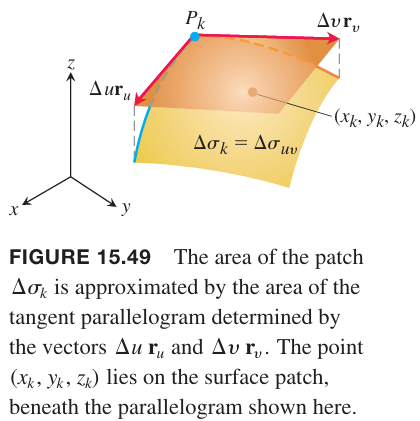
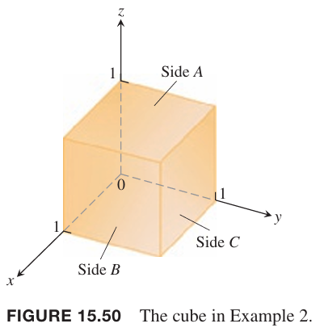

为了计算曲面的质量、液体穿过膜的流量、曲面表面的总电荷量，需要对一个函数在某个曲面上积分。这样的曲面积分（`surface integrals`）是线积分概念的二维拓展。和线积分一样，曲面积分也有两种形式。第一种形式是对标量函数在曲面上积分，比如对密度函数积分得到曲面的质量。第二种形式是对矢量场的积分，比如液体通过侵入液体中的曲面的净流量。

### 曲面积分
假定函数 $G(x,y,z)$ 是曲面 $S$ 上各点的质量密度（`mass density`），那么下面的积分计算的是 $S$ 的总质量。

首先假定曲面 $S$ 由在 $uv$ 平面上区域 $R$ 上的参数方程定义。
$$\boldsymbol{r}(u,v)=f(u,v)\boldsymbol{i}+g(u,v)\boldsymbol{j}+h(u,v)\boldsymbol{k},(u,v)\in R$$
和之前一样，取很小的一块，那么
$$\Delta\sigma_{uv}\approx|\boldsymbol{r}_u\times\boldsymbol{r}_v|dudv$$

和之前一样，对这些小块求和
$$\sum_{k=1}^nG(x_k,y_k,z_k)\Delta\sigma_k$$
对 $k$ 块选择 $(x_k,y_k,z_k)$ 决定了黎曼和。当分块足够多时，这些区域趋于零，$\Delta u\to 0,\Delta v\to 0$，如果和的极限存在的话，这个极限是曲面 $S$ 上 $G$ 的曲面积分。
$$\iint_SG(x,y,z)d\sigma=\lim_{n\to\infty}\sum_{k=1}^nG(x_k,y_k,z_k)\Delta\sigma_k\tag{1}$$
如果 $S$ 是分段光滑曲面，$G$ 在 $S$ 上连续，那么可以证明 $(1)$ 的极限一定存在。

和 15.5 一样，对 $S$ 不同表示有不同的积分公式。

**标量函数的曲面积分公式**
> 1. 光滑曲面 $S$ 由参数方程 $\boldsymbol{r}(u,v)=f(u,v)\boldsymbol{i}+g(u,v)\boldsymbol{j}+h(u,v)\boldsymbol{k},(u,v)\in R$，且 $G(x,y,z)$ 是 $S$ 上的连续函数，那么 $S$ 上 $G$ 的曲面积分是 $R$ 上的二重积分。
> $$\iint_SG(x,y,z)d\sigma=\iint_RG(f(u,v),g(u,v),h(u,v))|\boldsymbol{r}_u\times\boldsymbol{r}_v|dudv\tag{2}$$
> 2. 光滑曲面 $S$ 由隐式函数 $F(x,y,z)=c$ 定义，$F$ 是连续可微函数，$S$ 位于封闭有界区域 $R$ 上，$R$ 在 $S$ 下的坐标平面上，此时连续 $G$ 在 $S$ 上的曲面积分也可以写作 $R$ 上的二重积分。其中 $\boldsymbol{p}$ 是 $R$ 的法向单位矢量，且 $\nabla F\cdot\boldsymbol{p}\neq 0$。
> $$\iint_SG(x,y,z)d\sigma=\iint_RG(x,y,z)\frac{|\nabla F|}{|\nabla F\cdot\boldsymbol{p}|}dA\tag{3}$$
> 3. 曲面 $S$ 是显式函数 $z=f(x,y)$ 的图像，其中 $f$ 是 $xy$ 平面上区域 $R$ 上的连续可微函数，连续函数 $G$ 在 $S$ 的曲面积分是 $R$ 上的二重积分。
> $$\iint_SG(x,y,z)d\sigma=\iint_RG(x,y,f(x,y))\sqrt{f_x^2+f_y^2+1}\tag{4}$$

公式 $(1)$ 在不同的应用中有不同的含义。如果 $G$ 是常量 1，那么积分是 $S$ 的面积。如果 $G$ 是质量密度，那么积分是 $S$ 的质量。如果 $G$ 表示电荷密度，那么积分是 $S$ 上总的电荷量。

例1 求 $G(x,y,z)=x^2$ 在圆锥 $z=\sqrt{x^2+y^2},0\leq z\leq 1$ 上的积分。

解：利用上一节 15.5 例 4 的结论，有
$$|\boldsymbol{r}_r\times\boldsymbol{r}_\theta|=\sqrt{2}r$$
利用公式 $(2)$ 有
$$\begin{aligned}
\iint_Sx^2d\sigma&=\int_0^{2\pi}\int_0^1(r^2\cos^2\theta)(\sqrt{2}r)drd\theta\\
&=\sqrt{2}\int_0^{2\pi}\int_0^1r^3\cos^2\theta drd\theta\\
&=\frac{\sqrt{2}}{4}\int_0^{2\pi}\cos^2\theta d\theta\\
&=\frac{\sqrt{2}}{4}\bigg[\frac{\theta}{2}+\frac{1}{4}\sin 2\theta\bigg]_0^{2\pi}\\
&=\frac{\pi\sqrt{2}}{4}
\end{aligned}$$

曲面积分和二重积分类似，两个函数和的积分等于积分的和。定义域具备可加性，那么下面等式成立。
$$\iint_SGd\sigma=\iint_{S_1}Gd\sigma+\iint_{S_2}Gd\sigma+\cdots+\iint_{S_n}Gd\sigma$$
当 $S$ 由光滑曲线将有限多个光滑曲面组合而成，各个部分没有重叠，那么 $S$ 上的积分等于在各个部分上的积分之和。

例2 求函数 $G(x,y,z)=xyz$ 在由坐标平面和 $x=1,y=1,z=1$ 组成的第一象限内立方体上的积分。

解：立方体有六个面，不过坐标平面上函数 $G=xyz=0$，因此仅需要考虑其他三个面。
$$\iint xyzd\sigma=\iint_Axyzd\sigma+\iint_Bxyzd\sigma+\iint_Cxyzd\sigma$$
面 $A$ 曲面函数是 $f(x,y,z)=z=1$，在正方形区域 $R_{xy}:0\leq x\leq 1,0\leq y\leq 1$ 之上。那么可以选择 $\boldsymbol{p}=\boldsymbol{k}$，那么
$$\nabla f=\boldsymbol{k},|\nabla f|=1,|\nabla f\cdot\boldsymbol{p}|=1$$
因此
$$d\sigma=\frac{|\nabla f|}{|\nabla f\cdot\boldsymbol{p}|}dA=dxdy$$
那么
$$\iint_Axyzd\sigma=\iint_{R_{xy}}xydxdy=\int_0^1\int_0^1xydxdy=\frac{1}{4}$$
根据对称性，面 $B$ 和面 $C$ 上的积分也是 $1/4$。因此
$$\iint xyzd\sigma=\frac{3}{4}$$

例3 
