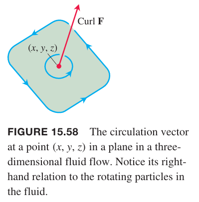
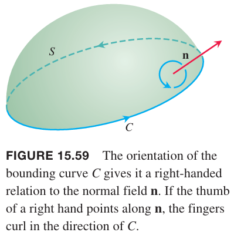
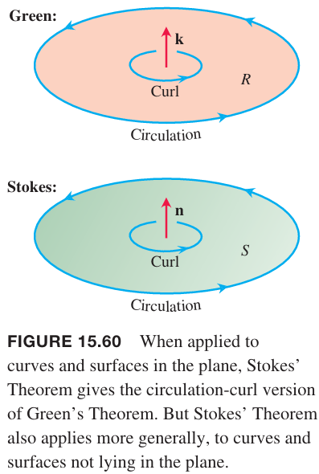
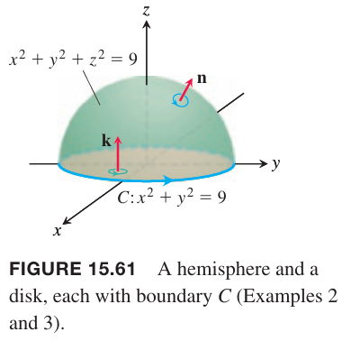

格林定理是说二维矢量场 $\boldsymbol{F}=M\boldsymbol{i}+N\boldsymbol{j}$ 绕着平面内的闭合曲线逆时针的环量等于标量函数 $(\partial N/\partial x-\partial M/\partial y)$ 在闭合曲线围成的区域内的二重积分。这个标量函数是旋度矢量场的 $\boldsymbol{k}$ 分量，描述的是 $\boldsymbol{F}$ 在每点处绕着平行于 $\boldsymbol{k}$ 的轴旋转的速率。对于三维空间的矢量场，每点处的旋转是绕着平行于该点旋转矢量的轴。当一个闭合曲线 $C$ 是有向曲面的边界，那么 $\boldsymbol{F}$ 绕着 $C$ 的环量等于旋度矢量场的曲面积分。这就将格林定理从平面上的区域扩展至有光滑曲线边界的一般曲面。

### 旋度矢量场
假定 $\boldsymbol{F}$ 是表示液体流动的速度矢量场。在 $(x,y,z)$ 附近的粒子绕着通过 $(x,y,z)$ 且平行于某个特定矢量的轴旋转。这个矢量指向的方向满足右手螺旋法则。矢量的大小表示旋转的速率。

这个矢量是旋度矢量（`curl vector`），对于矢量场 $\boldsymbol{F}=M\boldsymbol{i}+N\boldsymbol{j}+P\boldsymbol{k}$ 的定义是
$$\text{curl }\boldsymbol{F}=\bigg(\frac{\partial P}{\partial y}-\frac{\partial N}{\partial z}\bigg)\boldsymbol{i}+\bigg(\frac{\partial M}{\partial z}-\frac{\partial P}{\partial x}\bigg)\boldsymbol{j}+\bigg(\frac{\partial N}{\partial x}-\frac{\partial M}{\partial y}\bigg)\boldsymbol{k}\tag{1}$$
这是斯托克斯定理的推论，该定理是格林定理的三维版本。

当 $\boldsymbol{F}=M\boldsymbol{i}+N\boldsymbol{j}$ 时，$\text{curl }\boldsymbol{F}\cdot\boldsymbol{k}=\bigg(\frac{\partial N}{\partial x}-\frac{\partial M}{\partial y}\bigg)$ 与 15.4 小节定义一致。公式 $(1)$ 经常使用符号
$$\nabla=\boldsymbol{i}\frac{\partial}{\partial x}+\boldsymbol{j}\frac{\partial}{\partial y}+\boldsymbol{k}\frac{\partial}{\partial z}\tag{2}$$
表示。那么 $\boldsymbol{F}$ 的旋度可以表示为
$$\nabla\times\boldsymbol{F}=\begin{vmatrix}
\boldsymbol{i}&&\boldsymbol{j}&&\boldsymbol{k}\\
\frac{\partial}{\partial x}&&\frac{\partial}{\partial y}&&\frac{\partial}{\partial z}\\
M&&N&&P
\end{vmatrix}$$
即
$$\text{curl }\boldsymbol{F}=\nabla\times\boldsymbol{F}\tag{3}$$

例1 求 $\boldsymbol{F}=(x^2-z)\boldsymbol{i}+xe^z\boldsymbol{j}+xy\boldsymbol{k}$ 的旋度。

解：使用公式 $(3)$ 有
$$\begin{aligned}
\text{curl }\boldsymbol{F}&=\nabla\times\boldsymbol{F}\\
&=\begin{vmatrix}
\boldsymbol{i}&&\boldsymbol{j}&&\boldsymbol{k}\\
\frac{\partial}{\partial x}&&\frac{\partial}{\partial y}&&\frac{\partial}{\partial z}\\
(x^2-z)&&(xe^z)&&xy
\end{vmatrix}\\
&=(x-xe^z)\boldsymbol{i}-(y+1)\boldsymbol{j}+(e^z-0)\boldsymbol{k}\\
&=x(1-e^z)\boldsymbol{i}-(y+1)\boldsymbol{j}+e^z\boldsymbol{k}\\
\end{aligned}$$
当 $\nabla$ 用于标量函数 $f(x,y,z)$ 时，结果是 $f$ 的梯度
$$\nabla f=\frac{\partial f}{\partial x}\boldsymbol{i}+\frac{\partial f}{\partial y}\boldsymbol{j}+\frac{\partial f}{\partial z}\boldsymbol{j}$$

### 斯托克斯定理
斯托克斯定理将格林定理泛化到了三维。格林定理将矢量场沿着 $xy$ 平面上的简单闭合曲线 $C$ 逆时针环量与在由 $C$ 封闭形成的区域 $R$ 上的二重积分联系了起来。斯托克斯定理将矢量场沿着有向曲面 $S$ 的边界 $C$ 逆时针环量与 $S$ 上的曲面积分联系了起来。这里要求曲面是分段光滑的，这意味着它是由有限个光滑曲面通过光滑曲线连接起来的。

**定理 6 斯托克斯定理**
> 令 $S$ 是分段光滑有向曲面，边界是分段光滑曲线 $C$。令 $\boldsymbol{F}=M\boldsymbol{i}+N\boldsymbol{j}$ 是矢量场，其各个分量在包含 $S$ 的开放区间上有连续的偏微分。那么 $\boldsymbol{F}$ 沿着 $C$ 的以曲面法向单位矢量 $\boldsymbol{n}$ 为逆时针环量等于旋度矢量 $\nabla\times\boldsymbol{F}$ 在 $S$ 上的积分
> $$\oint_C\boldsymbol{F}\cdot d\boldsymbol{r}=\iint_S(\nabla\times\boldsymbol{F})\cdot\boldsymbol{n}d\sigma\tag{4}$$

如果两个不同的有向曲面 $S_1,S_2$ 有相同的边界 $C$，那么
$$\iint_{S_1}(\nabla\times\boldsymbol{F})\cdot\boldsymbol{n}_1d\sigma=\iint_{S_2}(\nabla\times\boldsymbol{F})\cdot\boldsymbol{n}_2d\sigma$$
因此旋度积分与曲面无关，只依赖于沿着边界 $C$ 的环量。曲面无关与保守场上的路径无关类似，路径无关的积分只依赖与路径起始位置和终止位置。旋度场 $\nabla\times\boldsymbol{F}$ 类似于标量函数的梯度场 $\nabla f$。

如果 $C$ 在 $xy$ 平面，有向逆时针，$R$ 是 $C$ 围成的区域，那么 $d\sigma=dxdy$
$$(\nabla\times\boldsymbol{F})\cdot\boldsymbol{n}d\sigma=(\nabla\times\boldsymbol{F})\cdot\boldsymbol{k}d\sigma=\bigg(\frac{\partial N}{\partial x}-\frac{\partial M}{\partial y}\bigg)$$
斯托克斯定理就退化成了格林定理
$$\oint_C\boldsymbol{F}\cdot d\boldsymbol{r}=\iint_R\bigg(\frac{\partial N}{\partial x}-\frac{\partial M}{\partial y}\bigg)dxdy$$
相反，将上述步骤反向可以得到
$$\oint_C\boldsymbol{F}\cdot d\boldsymbol{r}=\iint_R(\nabla\times\boldsymbol{F})\cdot\boldsymbol{k}dA\tag{4}$$

例1 曲面是半球 $S:x^2+y^2+z^2=9,z\geq 0$，边界是圆 $C:x^2+y^2=9,z=0$，矢量 $\boldsymbol{F}=y\boldsymbol{i}-x\boldsymbol{j}$，验证公式 $(4)$。

解：曲线 $C$ 的参数方程是
$$\boldsymbol{r}(\theta)=(3\cos\theta)\boldsymbol{i}+(3\sin\theta)\boldsymbol{j},0\leq\theta\leq 2\pi$$
那么
$$\begin{aligned}
d\boldsymbol{r}&=(-3\sin\theta d\theta)\boldsymbol{i}+(3\cos\theta d\theta)\boldsymbol{j}\\
\boldsymbol{F}&=(3\sin\theta)\boldsymbol{i}-(3\cos\theta)\boldsymbol{j}\\
\boldsymbol{F}\cdot d\boldsymbol{r}&=-9\sin^2\theta d\theta-9\cos^2\theta d\theta=-9 d\theta\\
\oint_C\boldsymbol{F}\cdot d\boldsymbol{r}&=\int_0^{2\pi}-9d\theta=-18\pi
\end{aligned}$$
$\boldsymbol{F}$ 的旋度是
$$\nabla\times\boldsymbol{F}=\bigg(\frac{\partial P}{\partial y}-\frac{\partial N}{\partial z}\bigg)\boldsymbol{i}+\bigg(\frac{\partial M}{\partial z}-\frac{\partial P}{\partial x}\bigg)\boldsymbol{j}+\bigg(\frac{\partial N}{\partial x}-\frac{\partial M}{\partial y}\bigg)\boldsymbol{k}=-2\boldsymbol{k}$$
单位法向矢量 $\boldsymbol{n}$ 是
$$\boldsymbol{n}=\frac{x\boldsymbol{i}+y\boldsymbol{j}+z\boldsymbol{k}}{\sqrt{x^2+y^2+z^2}}=\frac{x\boldsymbol{i}+y\boldsymbol{j}+z\boldsymbol{k}}{3}$$
由 15.6 的例 7 可以得到
$$d\sigma=\frac{3}{z}dA$$
因此
$$(\nabla\times\boldsymbol{F})\cdot\boldsymbol{n}d\sigma=-\frac{2z}{3}\frac{3}{z}dA=-2dA$$
那么
$$\iint_S(\nabla\times\boldsymbol{F})\cdot\boldsymbol{n}d\sigma=\iint_{x^2+y^2\leq 9}-2dA=-18\pi$$
